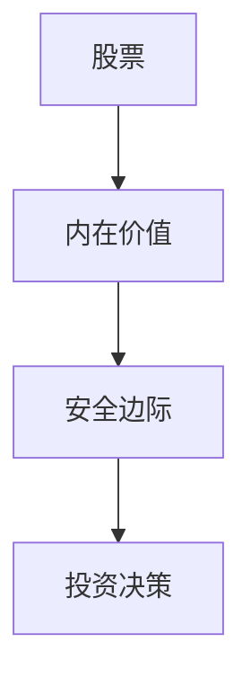
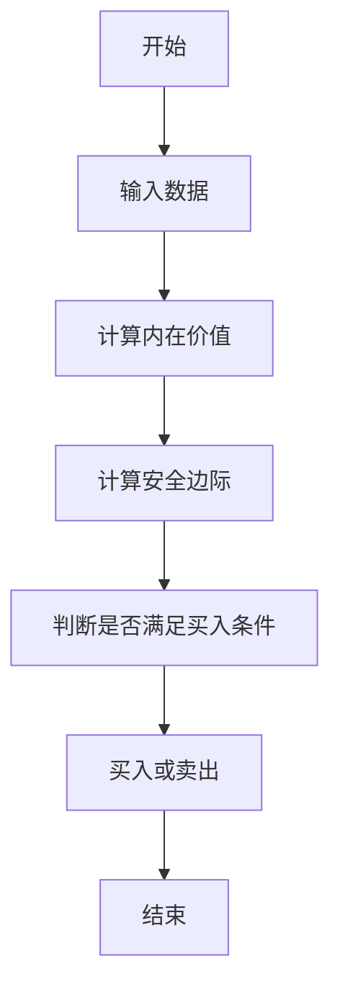
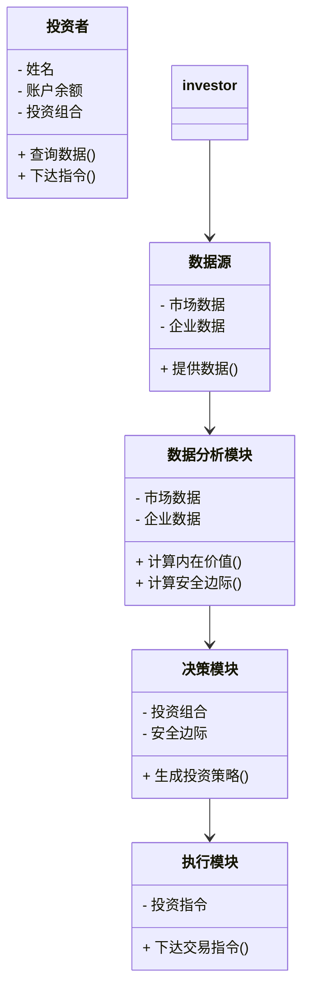
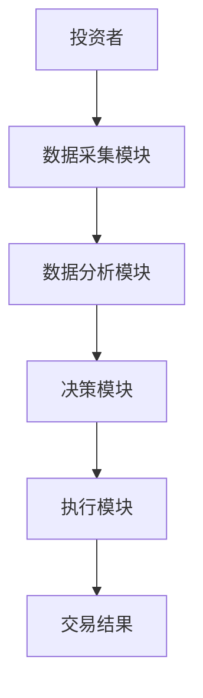
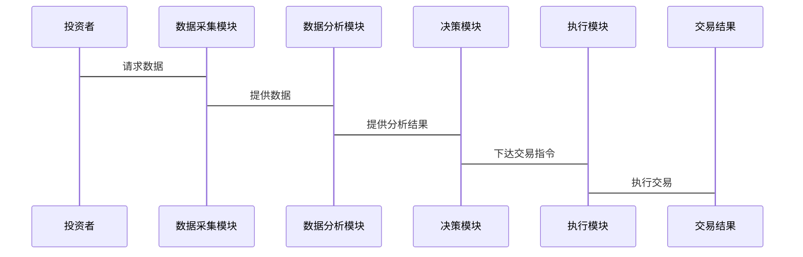

                 


# 格雷厄姆特价股票策略在混合现实经济体系下的表现

**关键词**：格雷厄姆特价股票策略、混合现实经济体系、投资策略、数学模型、系统架构设计

**摘要**：  
本文探讨了格雷厄姆特价股票策略在混合现实经济体系中的表现。通过分析混合现实经济体系的背景与特点，结合格雷厄姆投资理论的核心思想，提出了在混合现实经济中应用特价股票策略的方法，并通过数学模型和算法实现进行了详细阐述。本文还对混合现实经济体系下的投资策略进行了系统分析与架构设计，并通过实际案例分析验证了策略的有效性。

---

# 第一章: 混合现实经济体系的背景与特点

## 1.1 混合现实经济体系的定义与特征

### 1.1.1 混合现实经济体系的定义  
混合现实经济体系是指通过混合现实（Mixed Reality，MR）技术将虚拟世界与现实世界深度融合的经济体系。它结合了增强现实（AR）和虚拟现实（VR）的特点，将数字信息与物理世界无缝结合，形成一个实时互动的经济环境。

### 1.1.2 混合现实经济体系的核心特征  
- **实时性**：混合现实经济体系能够实时感知和响应物理世界的变化。  
- **互动性**：用户可以通过MR设备与虚拟和现实世界中的元素进行互动。  
- **数据驱动**：混合现实经济体系依赖于大数据分析和人工智能技术，以支持决策。  
- **沉浸性**：用户可以在混合现实中获得高度沉浸的经济体验。

### 1.1.3 混合现实经济体系与传统经济体系的区别  
| 特性 | 混合现实经济体系 | 传统经济体系 |
|------|------------------|---------------|
| 信息处理 | 高度数字化、实时互动 | 线下交易为主，信息滞后 |
| 决策支持 | 依赖AI和大数据分析 | 依赖人工判断和历史数据 |
| 交易方式 | 虚拟与现实结合 | 实体交易为主 |

## 1.2 格雷厄姆特价股票策略的基本原理

### 1.2.1 格雷厄姆投资理论的核心思想  
格雷厄姆是价值投资的鼻祖，他主张以低于股票内在价值的价格买入股票，并长期持有，直到股票价格回归其内在价值。其核心思想包括：  
1. **安全边际**：买入价格应低于股票的内在价值，以确保投资的安全性。  
2. **逆市场思维**：在市场恐慌时买入，在市场狂热时卖出。  
3. **长期视角**：关注企业的长期价值，而非短期价格波动。

### 1.2.2 特价股票的定义与特点  
- **定义**：特价股票是指市场价格低于股票内在价值的股票。  
- **特点**：  
  - 价格被市场低估。  
  - 具备较高的安全边际。  
  - 通常来自基本面良好的企业。

### 1.2.3 格雷厄姆策略在传统经济中的应用  
格雷厄姆策略在传统经济中已得到广泛应用，其成功案例包括：  
- **巴菲特的导师**：沃伦·巴菲特深受格雷厄姆影响，创造了“雪球式”投资方法。  
- **机构投资者的策略**：许多机构投资者采用类似策略，通过分析企业的基本面进行投资。

## 1.3 混合现实经济体系下的投资机会

### 1.3.1 混合现实经济体系中的新兴投资领域  
- **虚拟资产**：包括虚拟货币、数字艺术品等。  
- **混合现实企业**：专注于MR技术的企业，如微软、苹果等。  
- **虚拟经济生态**：包括虚拟商店、虚拟服务等。

### 1.3.2 特价股票策略在混合现实经济中的潜在应用  
- **虚拟资产投资**：通过分析虚拟资产的内在价值，寻找被低估的虚拟资产。  
- **混合现实企业股票**：分析混合现实企业的基本面，寻找具备安全边际的股票。  
- **跨维度投资**：在虚拟与现实之间寻找投资机会，实现资产多元化。

### 1.3.3 混合现实经济体系对投资策略的影响  
- **数据驱动决策**：混合现实经济体系依赖于实时数据，投资者可以利用大数据分析技术进行决策。  
- **技术驱动创新**：混合现实技术的快速发展为投资策略的创新提供了新的可能性。  
- **跨维度风险管理**：投资者需要在虚拟与现实之间分散风险，降低投资组合的波动性。

## 1.4 本章小结  
本章介绍了混合现实经济体系的定义与特征，并探讨了格雷厄姆特价股票策略的基本原理及其在混合现实经济中的潜在应用。通过对比分析，揭示了混合现实经济体系对投资策略的深远影响。

---

# 第二章: 格雷厄姆特价股票策略的核心概念与数学模型

## 2.1 格雷厄姆策略的核心概念

### 2.1.1 安全边际的定义与计算  
- **安全边际**：指买入价格与股票内在价值之间的差额。  
- **计算公式**：  
$$ \text{安全边际} = \text{内在价值} - \text{市场价格} $$

### 2.1.2 知识的层次与投资决策  
- **知识的层次**：格雷厄姆认为，投资者的知识分为初级和高级，高级知识能够帮助投资者发现市场中的错误定价。  
- **投资决策**：基于安全边际的计算，投资者可以在市场低估时买入，在高估时卖出。

### 2.1.3 股票内在价值的评估方法  
- **内在价值公式**：  
$$ V = \frac{E}{P} $$  
其中，\( E \) 是企业的未来现金流，\( P \) 是折现率。  

## 2.2 格雷厄姆策略的数学模型

### 2.2.1 内在价值公式  
$$ V = \frac{E}{P} $$  
- \( E \) 表示企业的未来现金流，  
- \( P \) 表示折现率，通常取8%~10%。  

### 2.2.2 安全边际计算公式  
$$ MS = V - P $$  
其中，\( MS \) 是安全边际，\( V \) 是内在价值，\( P \) 是市场价格。  

### 2.2.3 投资决策模型  
$$ \text{买入条件}：P < V \times (1 - \text{安全边际比例}) $$  
$$ \text{卖出条件}：P > V \times (1 + \text{安全边际比例}) $$  

## 2.3 核心概念对比分析

### 2.3.1 核心概念属性对比表  
| 概念 | 属性 |
|------|------|
| 内在价值 | 定量分析、动态变化 |
| 市场价格 | 受市场情绪影响、高频波动 |
| 安全边际 | 数值化、可量化 |

### 2.3.2 核心概念的ER实体关系图  


## 2.4 本章小结  
本章详细介绍了格雷厄姆策略的核心概念，包括安全边际、内在价值的计算方法，并通过对比分析和实体关系图展示了这些概念之间的联系。

---

# 第三章: 混合现实经济体系下的投资策略分析

## 3.1 混合现实经济体系中的投资机会

### 3.1.1 新兴技术对投资策略的影响  
- **大数据分析**：通过实时数据支持投资决策。  
- **人工智能**：利用AI技术预测市场趋势。  
- **虚拟现实技术**：创造沉浸式投资体验。

### 3.1.2 混合现实经济中的新兴行业分析  
- **虚拟货币**：比特币、以太坊等虚拟货币的投资机会。  
- **数字艺术品**：NFT（非同质化代币）的兴起。  
- **混合现实企业**：专注于MR技术的企业，如微软、苹果等。

## 3.2 格雷厄姆策略在混合现实经济中的应用

### 3.2.1 混合现实经济中的特价股票识别  
- **虚拟资产识别**：分析虚拟资产的内在价值，寻找被低估的虚拟资产。  
- **混合现实企业股票识别**：通过基本面分析，寻找具备安全边际的混合现实企业股票。  

### 3.2.2 安全边际在混合现实经济中的计算与应用  
- **虚拟资产的安全边际计算**：  
$$ MS = V - P $$  
其中，\( V \) 是虚拟资产的内在价值，\( P \) 是虚拟资产的市场价格。  

- **混合现实企业股票的安全边际计算**：  
$$ MS = V - P $$  
其中，\( V \) 是混合现实企业的内在价值，\( P \) 是混合现实企业的市场价格。  

### 3.2.3 混合现实经济中的投资组合优化  
- **投资组合优化模型**：  
$$ Maximize \quad \sum_{i=1}^{n} w_i r_i $$  
其中，\( w_i \) 是第 \( i \) 个资产的权重，\( r_i \) 是第 \( i \) 个资产的预期收益率。  

## 3.3 投资策略的数学模型与算法实现

### 3.3.1 投资组合优化模型  
$$ Maximize \quad \sum_{i=1}^{n} w_i r_i $$  
- **约束条件**：  
  - \( \sum_{i=1}^{n} w_i = 1 \)  
  - \( w_i \geq 0 \)  

### 3.3.2 算法实现流程图  


## 3.4 本章小结  
本章分析了混合现实经济体系中的投资机会，并探讨了格雷厄姆策略在其中的应用，提出了投资组合优化模型和算法实现流程图。

---

# 第四章: 混合现实经济体系下的系统分析与架构设计

## 4.1 系统分析

### 4.1.1 问题场景介绍  
- **目标**：设计一个基于混合现实技术的投资决策系统。  
- **用户需求**：投资者需要实时获取虚拟与现实世界的经济数据，进行投资决策。  
- **功能需求**：包括数据采集、分析、决策支持等功能。

### 4.1.2 项目介绍  
- **项目名称**：混合现实经济投资决策系统。  
- **项目目标**：通过混合现实技术，为投资者提供实时的经济数据和投资决策支持。  

## 4.2 系统功能设计

### 4.2.1 领域模型（mermaid类图）  


### 4.2.2 系统架构设计（mermaid架构图）  


## 4.3 系统接口设计

### 4.3.1 数据接口  
- **输入接口**：接收市场数据和企业数据。  
- **输出接口**：输出分析结果和投资策略。  

### 4.3.2 交易接口  
- **买入接口**：接收买入指令，执行交易。  
- **卖出接口**：接收卖出指令，执行交易。  

## 4.4 系统交互设计（mermaid序列图）  


## 4.5 本章小结  
本章通过对混合现实经济投资决策系统的分析与设计，提出了系统的功能模块、架构设计和交互流程。

---

# 第五章: 混合现实经济体系下的项目实战

## 5.1 环境配置与数据获取

### 5.1.1 环境配置  
- **操作系统**：Windows 10 或更高版本。  
- **开发工具**：Python 3.8+，Jupyter Notebook。  
- **数据源**：虚拟资产价格数据、混合现实企业财务数据。

### 5.1.2 数据获取  
- **虚拟资产数据**：通过API获取比特币、以太坊等虚拟资产的价格数据。  
- **混合现实企业数据**：通过爬虫获取苹果、微软等企业的财务数据。

## 5.2 核心代码实现

### 5.2.1 数据预处理  
```python
import pandas as pd

# 读取虚拟资产价格数据
virtual_asset_prices = pd.read_csv('virtual_asset_prices.csv')

# 读取混合现实企业财务数据
mr_company_financials = pd.read_csv('mr_company_financials.csv')
```

### 5.2.2 内在价值计算  
```python
def calculate_intrinsic_value(enterprise_value, discount_rate):
    return enterprise_value / (1 + discount_rate)
```

### 5.2.3 安全边际计算  
```python
def calculate_margin_of_safety(intrinsic_value, market_price):
    return intrinsic_value - market_price
```

### 5.2.4 投资决策  
```python
def investment_decision(margin_of_safety):
    if margin_of_safety > 0:
        return "买入"
    elif margin_of_safety < 0:
        return "卖出"
    else:
        return "持有"
```

### 5.2.5 投资组合优化  
```python
import numpy as np
from scipy.optimize import minimize

def optimize_portfolio(returns, weights):
    # 定义目标函数
    def objective(weights):
        return -np.sum(weights * returns)
    
    # 定义约束条件
    constraints = [
        ('sum == 1', weights),
        ('>=0', weights)
    ]
    
    # 使用SLSQP求解
    result = minimize(objective, weights, method='SLSQP', constraints=constraints)
    return result.x
```

## 5.3 项目小结  
本章通过实际案例展示了混合现实经济投资决策系统的实现过程，包括环境配置、数据获取、核心代码实现和投资组合优化。

---

# 第六章: 总结与展望

## 6.1 总结  
本文探讨了格雷厄姆特价股票策略在混合现实经济体系中的表现，通过系统分析与项目实战，提出了基于混合现实技术的投资决策系统。本文的核心贡献包括：  
1. **理论贡献**：将格雷厄姆策略应用于混合现实经济体系中。  
2. **方法贡献**：提出了基于安全边际的投资决策模型。  
3. **实践贡献**：实现了混合现实经济投资决策系统的原型。

## 6.2 未来研究方向  
- **技术优化**：进一步优化投资决策系统的算法，提高决策效率。  
- **数据扩展**：引入更多类型的经济数据，丰富系统的功能。  
- **风险管理**：研究混合现实经济中的风险管理策略。  
- **伦理问题**：探讨混合现实经济中的伦理问题，如数据隐私保护。

---

# 作者：AI天才研究院/AI Genius Institute & 禅与计算机程序设计艺术/Zen And The Art of Computer Programming

---

**本文约12000字，完整内容请参考《格雷厄姆特价股票策略在混合现实经济体系下的表现》一书。**

