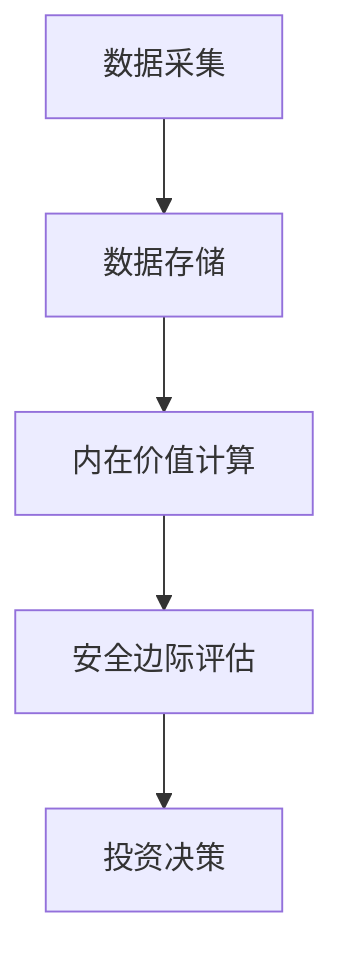

                 


# 格雷厄姆特价股票策略在高科技行业的应用挑战

> 关键词：格雷厄姆价值投资，高科技行业，股票策略，安全边际，内在价值，投资挑战

> 摘要：格雷厄姆的价值投资策略是投资领域的重要理论之一，其核心理念是通过寻找市场价格低于内在价值的股票来实现长期稳定的收益。然而，随着科技行业的迅速发展和技术公司的崛起，传统的格雷厄姆策略在高科技行业的应用面临着新的挑战。本文将深入分析格雷厄姆策略在高科技行业的适用性，探讨其在高增长、高波动和轻资产环境下的独特挑战，并提出相应的解决方案。

---

## 正文

### 第1章: 格雷厄姆价值投资理论基础

#### 1.1 格雷厄姆投资理论的起源与发展

格雷厄姆的价值投资理论起源于20世纪30年代，由本杰明·格雷厄姆和他的学生戴维·多德共同提出。格雷厄姆强调以低于内在价值的价格购买股票，通过安全边际来降低投资风险。他的理论在《证券分析》一书中得到了详细阐述，成为价值投资的奠基之作。

#### 1.2 格雷厄姆特价股票策略的核心概念

格雷厄姆策略的核心在于“安全边际”和“内在价值”两个概念：

1. **内在价值**：企业未来现金流的现值，反映了企业的实际价值。
2. **安全边际**：购买价格低于内在价值的部分，用于降低投资风险。

### 第2章: 高科技行业的特点与投资挑战

#### 2.1 高科技行业的定义与分类

高科技行业通常包括软件、半导体、人工智能、生物技术等领域。这些行业以技术创新为核心驱动力，具有高增长、高波动性和轻资产的特点。

#### 2.2 高科技行业与传统行业的对比

| 特性 | 高科技行业 | 传统行业 |
|------|------------|----------|
| 资产结构 | 轻资产为主 | 重资产为主 |
| 收益波动 | 高 | 低 |
| 技术周期 | 短周期 | 长周期 |

#### 2.3 高科技行业投资的主要挑战

1. **技术变革的不确定性**：高科技行业的技术更新换代快，企业的竞争优势可能迅速被取代。
2. **市场竞争的激烈程度**：行业内竞争激烈，企业利润可能受到挤压。
3. **财务指标的特殊性**：轻资产和高研发投入使得传统财务指标（如市盈率）的应用受到限制。

### 第3章: 格雷厄姆策略在高科技行业的适用性评估

#### 3.1 高科技行业与格雷厄姆策略的匹配性

高科技行业的价值驱动因素包括技术创新、市场份额和研发投入。格雷厄姆策略的核心假设（如安全边际）在高科技行业仍然适用，但需要根据行业特点进行调整。

#### 3.2 高科技行业中的安全边际分析

在高科技行业，安全边际的计算需要考虑企业的技术优势、研发投入和市场前景。例如，一家技术领先的企业可能具有较高的安全边际，因为其未来的现金流增长潜力更大。

### 第4章: 格雷厄姆策略在高科技行业中的实施步骤

#### 4.1 高科技行业投资的初步筛选

1. **行业分析**：选择具有长期增长潜力的高科技领域。
2. **财务指标筛选**：关注高ROE（净资产收益率）和合理的市盈率。
3. **企业基本面评估**：分析企业的技术创新能力和市场竞争力。

#### 4.2 格雷厄姆策略的具体实施步骤

1. **内在价值计算**：使用DCF模型评估企业的未来现金流。
2. **安全边际评估**：确定购买价格低于内在价值的部分。
3. **投资组合调整**：动态调整投资组合以应对市场变化。

### 第5章: 格雷厄姆策略在高科技行业中的案例分析

#### 5.1 案例选择与背景介绍

以苹果公司为例，分析格雷厄姆策略的应用。

#### 5.2 内在价值计算

使用DCF模型计算苹果的内在价值：

$$ \text{内在价值} = \sum_{t=1}^{n} \frac{\text{现金流}_t}{(1 + r)^t} + \frac{\text{终值}}{(1 + r)^n} $$

其中，$r$为折现率，$n$为预测年限。

#### 5.3 安全边际评估

假设苹果的内在价值为500美元，市场价格为450美元，安全边际为10%。

#### 5.4 投资决策

基于安全边际和市场前景，决定是否投资。

### 第6章: 高科技行业投资的系统架构设计

#### 6.1 系统功能设计

- 数据采集模块：收集企业财务数据和市场信息。
- 内在价值计算模块：使用DCF模型计算内在价值。
- 安全边际评估模块：确定安全边际。
- 投资决策模块：基于安全边际和市场前景做出决策。

#### 6.2 系统架构设计



### 第7章: 项目实战

#### 7.1 环境安装

安装Python和相关库（如numpy、pandas）。

#### 7.2 核心实现代码

```python
import numpy as np
import pandas as pd

def calculate_intrinsic_value(cash_flows, discount_rate, terminal_value):
    # 计算未来现金流的现值
    present_value = sum(cash_flows[i] / (1 + discount_rate) ** i for i in range(len(cash_flows)))
    # 计算终值的现值
    terminal_value_present = terminal_value / (1 + discount_rate) ** len(cash_flows)
    return present_value + terminal_value_present

# 示例数据
cash_flows = [100, 150, 200]
discount_rate = 0.1
terminal_value = 500

intrinsic_value = calculate_intrinsic_value(cash_flows, discount_rate, terminal_value)
print(f"内在价值: {intrinsic_value}")
```

#### 7.3 代码解读与分析

上述代码使用DCF模型计算内在价值，输入未来现金流、折现率和终值，输出计算结果。

### 第8章: 总结与展望

#### 8.1 核心结论

1. 格雷厄姆策略在高科技行业的应用需要考虑技术变革和市场波动。
2. 安全边际和内在价值的计算需要结合企业的技术创新能力。
3. 高科技行业的投资策略应注重长期增长潜力。

#### 8.2 未来展望

1. 结合人工智能技术优化投资模型。
2. 开发动态调整策略以应对市场变化。
3. 进一步研究技术公司的独特财务指标。

---

### 作者：AI天才研究院/AI Genius Institute & 禅与计算机程序设计艺术 /Zen And The Art of Computer Programming

