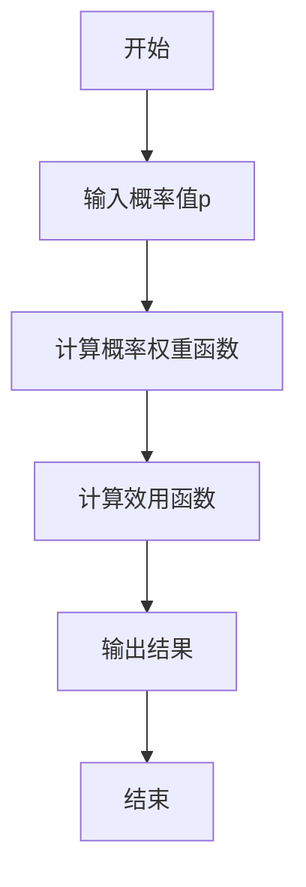
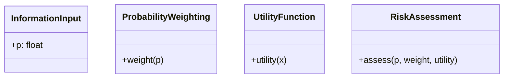
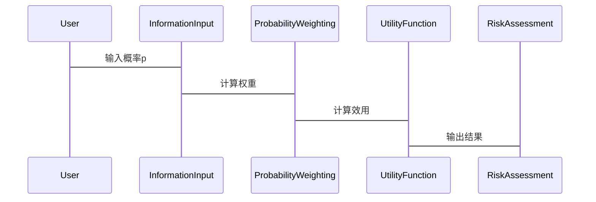

                 


# 框架效应：信息呈现方式如何影响风险感知

> 关键词：框架效应，信息呈现，风险感知，认知偏差，决策理论

> 摘要：框架效应是指信息的呈现方式对个体决策和认知的影响，尤其是在风险评估和感知方面。本文将详细探讨框架效应的定义、核心概念、数学模型、系统架构以及实际应用案例，分析信息呈现方式如何影响人们对风险的感知和决策过程。

---

## 目录大纲

1. 框架效应的背景与核心概念
   1.1 框架效应的定义与理论基础
   1.2 框架效应的核心概念与联系
   1.3 框架效应的属性与特征

2. 框架效应的数学模型与算法原理
   2.1 概率与决策理论模型
   2.2 框架效应的数学表达式
   2.3 框架效应的算法实现

3. 框架效应的系统分析与架构设计
   3.1 系统功能设计与领域模型
   3.2 系统架构设计与交互流程
   3.3 系统接口设计与实现

4. 框架效应的项目实战与案例分析
   4.1 项目背景与需求分析
   4.2 核心代码实现与功能解读
   4.3 案例分析与效果评估

5. 框架效应的最佳实践与未来展望
   5.1 实际应用中的注意事项
   5.2 未来研究方向与技术趋势
   5.3 总结与小结

---

## 1. 框架效应的背景与核心概念

### 1.1 框架效应的定义与理论基础

#### 1.1.1 什么是框架效应
- 框架效应是指信息的呈现方式对个体决策和认知的影响，尤其在涉及风险和不确定性时，不同的信息呈现方式会导致个体感知到不同的风险水平。

#### 1.1.2 框架效应的研究背景
- 信息呈现方式是影响决策过程的重要因素，尤其是在涉及风险和概率的情况下，不同的表述方式会显著改变个体的判断和选择。

#### 1.1.3 框架效应的核心问题描述
- 当以不同的方式呈现同一信息时，个体的风险感知会发生变化，从而影响其决策行为。

### 1.2 框架效应的核心概念与联系

#### 1.2.1 框架效应的原理
- 框架效应的核心在于信息呈现方式如何影响个体对风险的感知，进而影响其决策过程。

#### 1.2.2 框架效应与风险感知的关系
- 框架效应通过改变信息的呈现方式，影响个体对风险的感知和评估，从而改变其决策行为。

#### 1.2.3 框架效应与其他认知偏差的对比
- 框架效应与概率效应、损失规避等认知偏差有相似之处，但也存在差异。

### 1.3 框架效应的属性与特征

#### 1.3.1 信息呈现方式
- 框架效应的核心在于信息的呈现方式，包括正向框架和负向框架。

#### 1.3.2 风险感知度
- 框架效应通过改变信息的呈现方式，影响个体对风险的感知度。

#### 1.3.3 认知偏差
- 框架效应与其他认知偏差密切相关，如损失厌恶和概率偏差。

---

## 2. 框架效应的数学模型与算法原理

### 2.1 概率与决策理论模型

#### 2.1.1 概率与决策理论基础
- 概率理论是框架效应分析的基础，涉及概率权重函数和效用函数。

#### 2.1.2 概率权重函数
- 概率权重函数描述了个体在不同概率下对风险的感知。

#### 2.1.3 效用函数
- 效用函数描述了个体在不同结果下的效用值。

### 2.2 框架效应的数学表达式

#### 2.2.1 概率权重函数
$$ w(p) = p^\alpha (1-p)^\beta $$

#### 2.2.2 效用函数
$$ U(x) = \beta \ln x $$

### 2.3 框架效应的算法实现

#### 2.3.1 算法流程图


#### 2.3.2 Python代码实现
```python
def probability_weight(p, alpha=0.5, beta=0.5):
    return (p ** alpha) * (1 - p) ** beta

def utility_function(x, beta=0.5):
    return beta * math.log(x)
```

---

## 3. 框架效应的系统分析与架构设计

### 3.1 系统功能设计与领域模型

#### 3.1.1 系统功能设计
- 系统功能包括信息输入、框架转换、风险评估和结果输出。

#### 3.1.2 领域模型类图


### 3.2 系统架构设计与交互流程

#### 3.2.1 系统架构图


#### 3.2.2 系统交互流程
- 用户输入信息，系统进行概率权重和效用函数计算，输出风险评估结果。

### 3.3 系统接口设计与实现

#### 3.3.1 系统接口设计
- 接口包括概率权重函数接口和效用函数接口。

#### 3.3.2 系统交互流程


---

## 4. 框架效应的项目实战与案例分析

### 4.1 项目背景与需求分析

#### 4.1.1 项目背景
- 开发一个基于框架效应的风险评估工具，用于分析不同信息呈现方式对风险感知的影响。

#### 4.1.2 项目需求
- 实现概率权重函数和效用函数，评估不同框架下的风险感知。

### 4.2 核心代码实现与功能解读

#### 4.2.1 核心代码实现
```python
def probability_weight(p, alpha=0.5, beta=0.5):
    return (p ** alpha) * (1 - p) ** beta

def utility_function(x, beta=0.5):
    return beta * math.log(x)
```

#### 4.2.2 功能解读
- 概率权重函数用于计算不同概率下的权重，效用函数用于计算效用值。

### 4.3 案例分析与效果评估

#### 4.3.1 案例分析
- 输入概率p=0.8，计算概率权重和效用值，分析不同框架下的风险感知。

#### 4.3.2 效果评估
- 通过实验对比不同框架下的风险感知变化，验证框架效应的影响。

---

## 5. 框架效应的最佳实践与未来展望

### 5.1 实际应用中的注意事项

#### 5.1.1 信息呈现方式的选择
- 在实际应用中，应根据目标受众的特点选择合适的信息呈现方式。

#### 5.1.2 框架效应的局限性
- 框架效应的有效性可能受到个体差异和文化背景的影响。

### 5.2 未来研究方向与技术趋势

#### 5.2.1 结合机器学习
- 研究框架效应与机器学习的结合，提升风险评估的准确性。

#### 5.2.2 大数据应用
- 利用大数据技术分析大规模数据中的框架效应影响。

### 5.3 总结与小结

- 框架效应是一个重要的认知偏差，理解其原理和应用有助于优化信息呈现方式，提升风险评估的准确性。

---

## 作者：AI天才研究院/AI Genius Institute & 禅与计算机程序设计艺术 /Zen And The Art of Computer Programming

