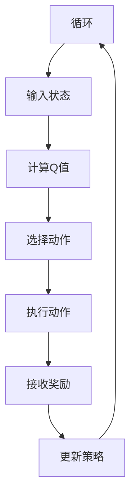
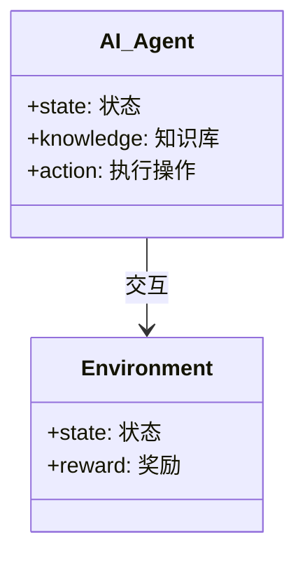
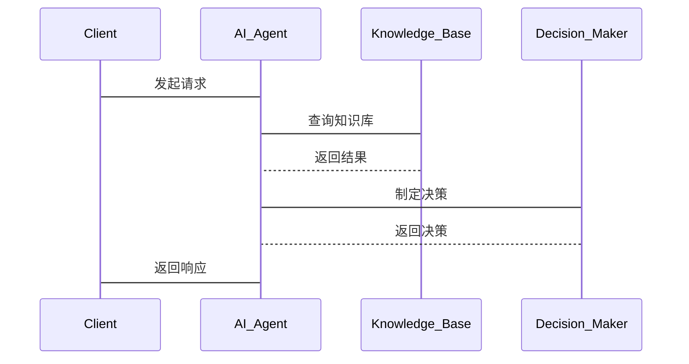

                 


# 《案例解析：成功落地的企业级AI Agent项目》

## 关键词：
企业级AI Agent、技术实现、项目实战、系统架构、算法原理

## 摘要：
本文通过解析一个成功落地的企业级AI Agent项目，详细阐述了AI Agent的核心概念、算法原理、系统架构、项目实现和最佳实践。从背景介绍到技术细节，再到实际应用，全面解析了企业级AI Agent项目的落地过程。

---

## 目录

### 第1章：企业级AI Agent的背景与核心概念

#### 1.1 AI Agent的基本概念
- 1.1.1 AI Agent的定义
- 1.1.2 AI Agent的核心属性
- 1.1.3 企业级AI Agent的独特性

#### 1.2 AI Agent的演进历程
- 1.2.1 AI Agent的历史发展
- 1.2.2 从单点AI到AI Agent的演变
- 1.2.3 当前AI Agent的技术特点

#### 1.3 企业级AI Agent的核心要素
- 1.3.1 任务驱动性
- 1.3.2 自主决策能力
- 1.3.3 多模态交互能力
- 1.3.4 知识库与推理能力

#### 1.4 与相关技术的对比
- 1.4.1 与传统AI的区别
- 1.4.2 与大模型的关系
- 1.4.3 与RPA（机器人流程自动化）的对比

### 第2章：AI Agent的核心概念与技术原理

#### 2.1 核心概念原理
- 2.1.1 知识表示与推理
- 2.1.2 多模态交互机制
- 2.1.3 自主决策算法

#### 2.2 核心概念属性对比表
| 概念       | 属性1 | 属性2 | 属性3 |
|------------|-------|-------|-------|
| AI Agent   | 任务驱动 | 多模态交互 | 自主决策 |
| 大模型      | 参数量大 | 单向生成 | 无明确目标 |

#### 2.3 ER实体关系图
```mermaid
er
actor(AI Agent) --> action(执行操作)
actor --> knowledge_base(知识库)
knowledge_base --> decision_rule(决策规则)
```

### 第3章：AI Agent的算法原理

#### 3.1 算法原理概述
- 3.1.1 强化学习的基本原理
- 3.1.2 监督学习与无监督学习的结合

#### 3.2 算法流程图


#### 3.3 数学公式
- 奖励机制：$$ R(s, a) = \text{根据状态和动作给予奖励} $$
- 策略优化：$$ \theta = \arg\max_{\theta} \sum R(s, a) $$

### 第4章：系统分析与架构设计

#### 4.1 项目背景与需求分析
- 4.1.1 项目目标
- 4.1.2 项目范围
- 4.1.3 核心需求

#### 4.2 系统功能设计
- 4.2.1 领域模型


#### 4.3 系统架构设计


#### 4.4 接口设计与交互流程


### 第5章：项目实战

#### 5.1 环境搭建与安装
- 5.1.1 安装Python环境
- 5.1.2 安装依赖库
- 5.1.3 环境配置

#### 5.2 核心功能实现
- 5.2.1 知识库的构建与管理
- 5.2.2 决策算法的实现
- 5.2.3 多模态交互的实现

#### 5.3 代码实现与解读
```python
class AI_Agent:
    def __init__(self, knowledge_base):
        self.knowledge_base = knowledge_base
        self.current_state = None

    def receive_input(self, input):
        # 接收输入并解析
        pass

    def process_request(self):
        # 处理请求，调用知识库和决策算法
        pass

    def send_output(self, output):
        # 发送输出
        pass
```

#### 5.4 案例分析与应用
- 5.4.1 案例背景
- 5.4.2 问题分析
- 5.4.3 解决方案
- 5.4.4 实施结果

### 第6章：最佳实践与总结

#### 6.1 项目小结
- 6.1.1 成功经验
- 6.1.2 遇到的挑战
- 6.1.3 解决方案

#### 6.2 注意事项与建议
- 6.2.1 技术选型建议
- 6.2.2 知识库构建的注意事项
- 6.2.3 决策算法的优化建议

#### 6.3 拓展阅读与未来展望
- 6.3.1 推荐阅读的书籍
- 6.3.2 未来发展趋势
- 6.3.3 技术创新方向

---

## 作者：AI天才研究院/AI Genius Institute & 禅与计算机程序设计艺术 /Zen And The Art of Computer Programming

