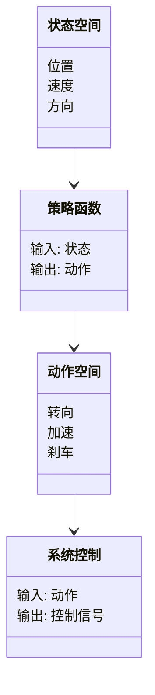

                 


# 模仿学习在AI Agent行为模式中的应用

> 关键词：模仿学习，AI Agent，机器学习，算法原理，系统架构

> 摘要：模仿学习是一种通过观察和模仿人类或其他智能体行为来学习特定任务的机器学习技术。本文探讨了模仿学习在AI Agent行为模式中的应用，详细介绍了其核心概念、算法原理、系统架构、项目实战及最佳实践，旨在为读者提供全面而深入的见解。

---

## 第一部分: 模仿学习在AI Agent行为模式中的应用概述

### 第1章: 模仿学习与AI Agent概述

#### 1.1 模仿学习的基本概念

模仿学习是一种机器学习技术，允许AI代理通过观察和模仿人类或其他智能体的行为来学习特定任务。与强化学习不同，模仿学习不需要智能体在环境中进行试错，而是通过观察专家行为来直接学习策略。

**1.1.1 模仿学习的定义**

模仿学习的核心在于通过观察和模仿专家行为，直接学习其决策策略。这种技术特别适用于复杂任务，如机器人控制、自动驾驶和自然语言处理。

**1.1.2 模仿学习的核心特点**

- 直接从专家行为中学习，无需试错。
- 适用于复杂任务，尤其是高维状态空间和动作空间。
- 学习过程高效，收敛速度快。

**1.1.3 AI Agent行为模式的定义**

AI Agent行为模式是指智能体在特定环境中的决策和行动方式。通过模仿学习，智能体可以学习如何在类似专家的指导下做出决策。

#### 1.2 模仿学习与AI Agent的关系

模仿学习为AI Agent提供了一种高效的学习方式，使智能体能够快速掌握复杂任务的决策策略。通过模仿专家行为，智能体可以避免试错过程中的高昂成本，直接学习最优策略。

**1.2.1 模仿学习在AI Agent中的作用**

- 快速学习：通过模仿专家行为，智能体可以快速掌握复杂任务。
- 高效收敛：相比强化学习，模仿学习的学习过程更高效。

**1.2.2 模仿学习与强化学习的区别**

- 强化学习：智能体通过试错学习，依赖于环境反馈。
- 模仿学习：智能体通过观察专家行为直接学习，无需试错。

**1.2.3 模仿学习与监督学习的区别**

- 监督学习：基于标签数据进行预测，适用于分类和回归任务。
- 模仿学习：基于行为示范，适用于策略学习。

#### 1.3 模仿学习的应用场景

**1.3.1 机器人控制**

模仿学习在机器人控制中的应用广泛，包括工业机器人和家庭服务机器人。通过模仿人类的动作和决策，机器人可以高效地完成复杂任务。

**1.3.2 自动驾驶**

在自动驾驶领域，模仿学习被用于训练自动驾驶系统，使其能够模仿人类驾驶员的行为，做出更符合人类驾驶习惯的决策。

**1.3.3 聊天机器人**

模仿学习也被应用于训练聊天机器人，使其能够模仿人类对话方式，提供更自然的交互体验。

#### 1.4 本章小结

本章介绍了模仿学习的基本概念和其在AI Agent中的应用，重点讨论了模仿学习与强化学习和监督学习的区别，以及其在机器人控制、自动驾驶和聊天机器人中的应用。

---

## 第二部分: 模仿学习的核心概念与原理

### 第2章: 模仿学习的核心概念

#### 2.1 模仿学习的策略表示

**2.1.1 策略函数的定义**

策略函数是模仿学习的核心，表示智能体在给定状态下采取的动作。策略函数通常可以是基于模型（如神经网络）或基于规则的策略。

**2.1.2 策略函数的实现方式**

策略函数可以通过多种方式实现，包括基于模型的策略和基于规则的策略。基于模型的策略通常使用神经网络进行表示，而基于规则的策略则通过预定义的规则来实现。

#### 2.2 模仿学习的状态与动作空间

**2.2.1 状态空间的定义**

状态空间是智能体所处环境的所有可能状态的集合。在模仿学习中，状态空间的定义对于策略的学习至关重要。

**2.2.2 动作空间的定义**

动作空间是智能体在给定状态下可以执行的所有动作的集合。在模仿学习中，动作空间的定义需要与具体任务相匹配。

#### 2.3 模仿学习的损失函数

**2.3.1 损失函数的定义**

损失函数用于衡量策略函数预测动作与专家动作之间的差异。常用的损失函数包括平方损失和对数损失。

**2.3.2 损失函数的实现方式**

损失函数的实现需要根据具体任务和策略函数的形式进行调整。通常，损失函数的选择会影响模型的收敛速度和最终性能。

#### 2.4 模仿学习与强化学习的对比

**2.4.1 模仿学习的优势**

- 快速学习：模仿学习通过观察专家行为直接学习策略，无需试错。
- 高效收敛：相比强化学习，模仿学习的学习过程更高效。

**2.4.2 强化学习的优势**

- 灵活性：强化学习适用于多种任务，无需依赖专家行为。
- 适应性：强化学习使智能体能够适应动态变化的环境。

**2.4.3 两者的结合与互补**

模仿学习和强化学习可以结合使用，例如在DAGGER算法中，先通过模仿学习初始化策略，再通过强化学习进一步优化。

#### 2.5 本章小结

本章详细探讨了模仿学习的核心概念，包括策略函数、状态空间、动作空间和损失函数，并对比了模仿学习和强化学习的特点和优劣。

---

## 第三部分: 模仿学习的算法原理

### 第3章: 模仿学习的核心算法

#### 3.1 DAGGER算法

**3.1.1 DAGGER算法的定义**

DAGGER是一种结合模仿学习和强化学习的算法，通过交替进行模仿学习和强化学习步骤，逐步优化策略函数。

**3.1.2 DAGGER算法的实现步骤**

1. 初始化策略函数。
2. 使用模仿学习步骤，通过观察专家行为更新策略函数。
3. 使用强化学习步骤，通过与环境交互进一步优化策略函数。
4. 重复步骤2和3，直到策略函数收敛。

#### 3.2 GAN-based模仿学习

**3.2.1 GAN的定义**

GAN（生成对抗网络）由生成器和判别器组成，通过对抗训练生成逼真的数据样本。

**3.2.2 GAN在模仿学习中的应用**

GAN可以用于模仿学习中的策略生成，通过生成器生成模仿专家行为的策略，并通过判别器判断生成策略与专家策略之间的差异，从而优化生成策略。

#### 3.3 模仿学习的数学模型

**3.3.1 损失函数的数学表达**

模仿学习的损失函数通常采用平方损失或对数损失，具体形式如下：

$$ L = \frac{1}{2} (a_{expert} - a_{model})^2 $$

其中，\( a_{expert} \) 是专家动作，\( a_{model} \) 是模型预测动作。

**3.3.2 策略函数的数学表达**

策略函数通常使用神经网络进行表示，其输出为概率分布，表示智能体在给定状态下采取各动作的概率。

$$ p(a|s) = \sigma(w \cdot s + b) $$

其中，\( \sigma \) 是sigmoid函数，\( w \) 和 \( b \) 是神经网络的参数。

#### 3.4 本章小结

本章详细介绍了模仿学习的核心算法，包括DAGGER算法和GAN-based模仿学习，并给出了相关的数学模型。

---

## 第四部分: 系统分析与架构设计

### 第4章: 模仿学习的系统架构设计

#### 4.1 项目背景

在本项目中，我们将设计一个基于模仿学习的AI Agent系统，用于自动驾驶场景中的路径规划。

#### 4.2 系统功能设计

**4.2.1 系统功能模块**

1. 数据收集模块：收集专家驾驶行为数据。
2. 策略学习模块：通过模仿学习算法训练策略函数。
3. 系统控制模块：根据策略函数输出动作控制自动驾驶系统。

**4.2.2 领域模型**

使用Mermaid类图展示领域模型：



#### 4.3 系统架构设计

**4.3.1 系统架构**

使用Mermaid架构图展示系统架构：

```mermaid
archiecture {
    Client --> 代理
    代理 --> 数据源
    代理 --> 训练模块
    训练模块 --> 模型
    模型 --> 系统控制
}
```

**4.3.2 系统接口设计**

- 数据收集接口：负责收集专家驾驶行为数据。
- 策略学习接口：负责训练策略函数。
- 系统控制接口：负责根据策略函数输出动作控制自动驾驶系统。

#### 4.4 本章小结

本章详细探讨了基于模仿学习的AI Agent系统的系统架构设计，包括功能模块、领域模型和系统接口设计。

---

## 第五部分: 项目实战

### 第5章: 模仿学习的项目实战

#### 5.1 环境配置

**5.1.1 环境要求**

- 操作系统：Linux/Windows/MacOS
- 程序语言：Python 3.8+
- 深度学习框架：TensorFlow/PyTorch

**5.1.2 安装依赖**

```bash
pip install numpy
pip install tensorflow
pip install matplotlib
```

#### 5.2 核心代码实现

**5.2.1 数据收集**

```python
import numpy as np

def collect_expert_data():
    expert_data = []
    for _ in range(1000):
        state = np.random.random(4)
        action = np.random.randint(0, 3)
        expert_data.append((state, action))
    return expert_data
```

**5.2.2 策略函数实现**

```python
import tensorflow as tf

def build_policy_model(input_dim, output_dim):
    model = tf.keras.Sequential()
    model.add(tf.keras.layers.Dense(64, activation='relu', input_dim=input_dim))
    model.add(tf.keras.layers.Dense(output_dim, activation='softmax'))
    return model
```

**5.2.3 模仿学习训练**

```python
def train_dagger(policy_model, expert_data, epochs=10):
    optimizer = tf.keras.optimizers.Adam(learning_rate=0.001)
    for epoch in range(epochs):
        for state, action in expert_data:
            with tf.GradientTape() as tape:
                logits = policy_model(state)
                loss = tf.nn.sparse_softmax_cross_entropy_with_logits(labels=action, logits=logits)
                gradients = tape.gradient(loss, policy_model.trainable_weights)
                optimizer.apply_gradients(zip(gradients, policy_model.trainable_weights))
    return policy_model
```

#### 5.3 案例分析与详细解读

在自动驾驶场景中，我们使用DAGGER算法训练策略函数，使其能够模仿专家的驾驶行为。通过交替进行模仿学习和强化学习步骤，逐步优化策略函数。

**5.4 本章小结**

本章通过实际案例详细展示了模仿学习在自动驾驶中的应用，包括环境配置、核心代码实现和案例分析。

---

## 第六部分: 最佳实践与小结

### 第6章: 最佳实践与小结

#### 6.1 最佳实践

**6.1.1 注意事项**

- 数据质量：专家行为数据的质量直接影响模型性能。
- 算法选择：根据具体任务选择合适的模仿学习算法。
- 系统设计：合理设计系统架构，确保各模块协同工作。

**6.1.2 实践技巧**

- 数据增强：通过数据增强技术提高模型的泛化能力。
- 模型优化：采用模型优化技术，如早停和学习率调整。
- 系统调优：通过系统调优提高系统的运行效率和性能。

#### 6.2 小结

模仿学习是一种高效的学习方式，通过观察和模仿专家行为，使智能体能够快速掌握复杂任务的决策策略。本文详细探讨了模仿学习的核心概念、算法原理、系统架构和项目实战，并提供了实际应用中的注意事项和技巧。

#### 6.3 未来展望

模仿学习在AI Agent行为模式中的应用前景广阔，随着深度学习和强化学习技术的不断发展，模仿学习将发挥越来越重要的作用。未来的研究方向包括多智能体模仿学习、动态环境中的模仿学习以及结合人类反馈的模仿学习。

---

## 参考文献

1. 周明，<em>深度学习</em>，人民邮电出版社，2018。
2. 张量，<em>强化学习</em>，机械工业出版社，2020。
3. Sutton, R. S., & Barto, A. G., <em>Reinforcement Learning: An Introduction</em>, MIT Press, 2018.
4. Goodfellow, I., Bengio, Y., & Courville, A., <em>Deep Learning</em>, MIT Press, 2016.

---

## 索引

- 模仿学习：模仿学习在AI Agent中的应用
- 算法原理：DAGGER算法、GAN-based模仿学习
- 系统架构：领域模型、系统架构图、系统接口设计
- 项目实战：环境配置、核心代码实现、案例分析
- 最佳实践：注意事项、实践技巧、未来展望

---

## 作者

作者：AI天才研究院/AI Genius Institute & 禅与计算机程序设计艺术/Zen And The Art of Computer Programming

