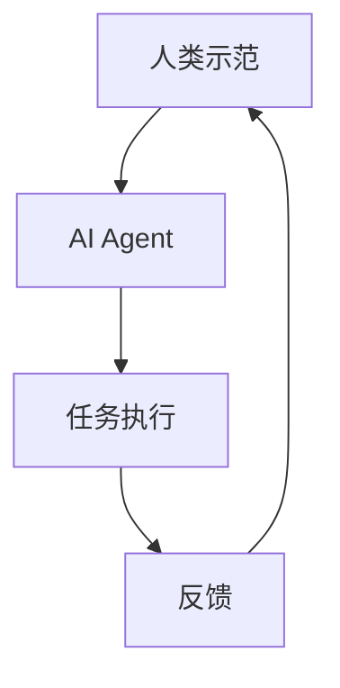
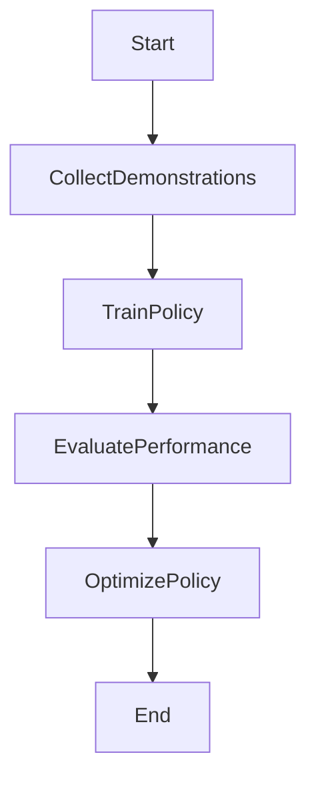
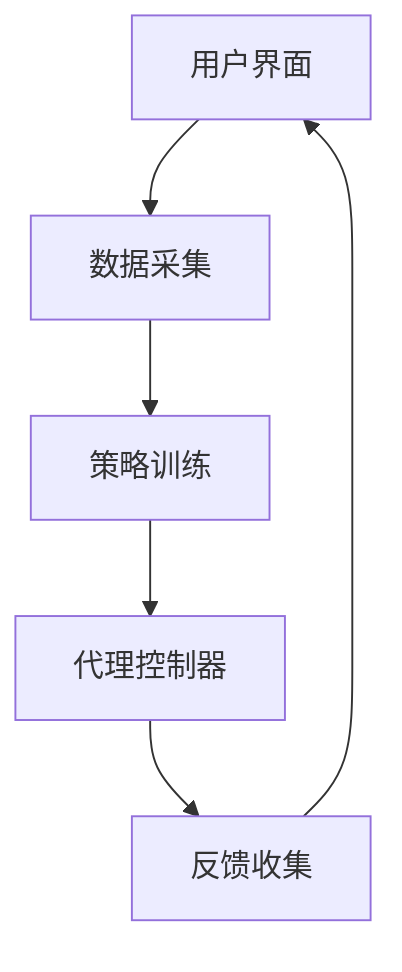

                 

# 模仿学习：从人类示范中学习的AI Agent

## 关键词：
模仿学习，AI Agent，机器学习，强化学习，监督学习，ER实体关系图，算法原理

## 摘要：
模仿学习是一种通过观察人类行为或示范来学习的AI技术，结合了监督学习和强化学习的优势，广泛应用于机器人控制、自然语言处理等领域。本文系统地介绍了模仿学习的核心概念、算法原理、系统架构，并通过案例分析展示了其实现过程。

---

### 第1章: 模仿学习概述

#### 1.1 模仿学习的定义与背景
- 1.1.1 什么是模仿学习：模仿学习通过观察人类行为来学习任务，介于监督和强化学习之间。
- 1.1.2 背景与动机：随着AI需求增加，模仿学习因其无需大量标注数据而备受关注。
- 1.1.3 应用领域：如机器人、自动驾驶、游戏AI等。

#### 1.2 模仿学习的核心问题
- 从人类示范中学习的挑战，包括示范数据的质量和多样性。
- 模仿学习的目标与边界，如学习策略与环境交互。
- 核心要素：人类示范、任务目标、学习算法。

#### 1.3 模仿学习与相关概念的联系
- 监督学习：基于标注数据，而模仿学习基于行为示范。
- 强化学习：基于奖励，而模仿学习基于示教。
- 对比分析表格：展示模仿学习与其他学习方法的优缺点。

#### 1.4 模仿学习的数学模型基础
- 基本符号定义：状态s，动作a，策略π。
- 数学表达式：$\pi(a|s)$ 表示在状态s下选择动作a的概率。
- 核心算法框架：包括数据收集、策略优化等步骤。

### 第2章: 模仿学习的核心概念与联系

#### 2.1 模仿学习的核心原理
- 基本流程：数据收集、策略学习、任务执行。
- 关键技术：行为建模、策略优化、经验重放。
- 算法特点：高效性、可解释性、适应性。

#### 2.2 核心概念对比
- 模仿学习与监督学习：对比分析表格，展示数据来源、目标、应用等差异。
- 模仿学习与强化学习：对比表格，突出两者在学习机制上的不同。

#### 2.3 ER实体关系图

### 第3章: 模仿学习的算法原理

#### 3.1 典型算法
- Dagger算法：结合示教和强化学习，通过监督和强化信号优化策略。
- Argmax算法：选择最佳动作，确保与人类示范一致。
- BC算法：基于最大似然估计，直接拟合人类策略。

#### 3.2 算法流程图

#### 3.3 算法实现
- Python代码示例：展示Dagger算法的实现步骤，包括数据收集、策略训练等。
- 代码分析：解释关键部分，如数据预处理、模型训练等。

### 第4章: 模仿学习的数学模型

#### 4.1 数学公式
- 策略评估公式：$J(\pi) = \mathbb{E}_{s \sim \mu}[J(\pi(s))]$
- 策略优化公式：$\arg\max_\pi \sum_{s} \mu(s) \log \pi(a|s)$

#### 4.2 数学模型推导
- 从策略梯度到Actor-Critic方法的推导过程，展示如何优化策略。

### 第5章: 系统分析与架构设计

#### 5.1 问题场景
- 描述一个具体的模仿学习应用场景，如机器人导航。

#### 5.2 系统功能设计
- 领域模型：展示系统功能模块之间的关系，如数据采集模块、策略优化模块等。

#### 5.3 系统架构设计

### 第6章: 项目实战

#### 6.1 环境安装
- 安装Python、TensorFlow、OpenAI Gym等依赖库。

#### 6.2 核心实现
- 实现Dagger算法，包括数据预处理、模型训练等步骤。

#### 6.3 案例分析
- 分析一个具体案例，如训练AI代理进行游戏任务。

### 第7章: 研究热点与未来发展

#### 7.1 研究热点
- 结合其他学习方法：如与强化学习、迁移学习的结合。
- 多智能体协作：在多agent系统中的应用。

#### 7.2 未来趋势
- 新型算法：如基于Transformer的模仿学习。
- 应用扩展：在教育、医疗等领域的应用。

#### 7.3 注意事项
- 数据质量：确保示范数据的多样性和代表性。
- 安全问题：避免学习到有害行为。

### 第8章: 总结

#### 8.1 内容回顾
- 总结模仿学习的核心概念、算法、应用。

#### 8.2 进一步学习
- 建议阅读相关论文，参与开源项目。

---

**作者：AI天才研究院 & 禅与计算机程序设计艺术**

---

通过以上结构，文章详细介绍了模仿学习的各个方面，从基础概念到算法实现，再到实际应用，确保读者能够全面理解和掌握模仿学习的知识。

