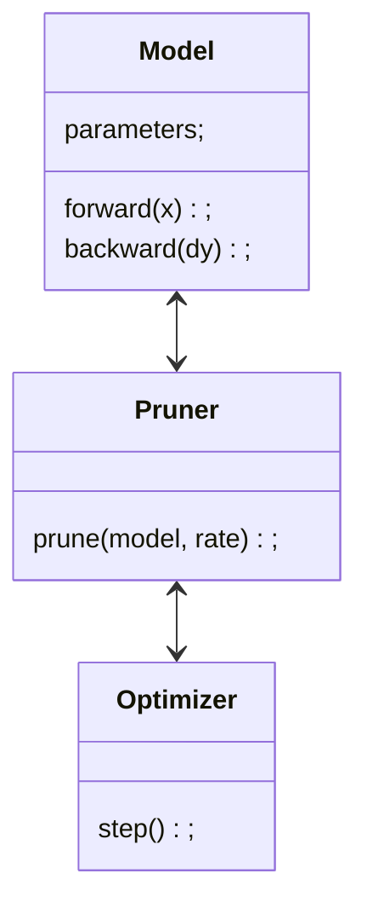

                 


# 模型剪枝：精简AI Agent的参数规模

## 关键词：模型剪枝，AI Agent，参数规模，机器学习，算法优化

## 摘要：模型剪枝是一种通过减少模型参数数量来优化AI Agent性能的技术。本文将详细介绍模型剪枝的背景、核心概念、算法原理、系统架构、项目实战以及最佳实践，帮助读者全面理解并掌握模型剪枝的应用。

---

# 第一部分: 模型剪枝背景与核心概念

## 第1章: 模型剪枝的背景与问题背景

### 1.1 模型剪枝的背景

#### 1.1.1 大模型的参数规模问题
随着深度学习模型的不断发展，模型的参数规模急剧增加。例如，GPT-3模型拥有1750亿个参数，这不仅增加了计算成本，还带来了存储和推理效率的问题。模型剪枝通过减少冗余参数，降低模型的复杂度，从而提高计算效率和模型部署能力。

#### 1.1.2 模型剪枝的定义与目标
模型剪枝是一种优化技术，旨在通过移除模型中冗余或不重要的参数，减少模型的参数规模，同时保持或提升模型的性能。其核心目标是实现模型的轻量化，使其能够在资源受限的环境中高效运行。

#### 1.1.3 模型剪枝的背景与意义
随着AI技术的广泛应用，模型的部署环境越来越多样化。在边缘计算、移动设备等场景下，模型的参数规模成为制约性能和效率的关键因素。模型剪枝通过精简参数规模，解决了这些问题，使AI技术能够更好地应用于实际场景。

### 1.2 模型剪枝的核心问题

#### 1.2.1 参数规模与模型性能的关系
模型性能与参数规模并非简单的正相关关系。通过剪枝，虽然减少了参数数量，但合理设计的剪枝算法能够保留关键参数，从而在减少参数规模的同时保持甚至提升模型性能。

#### 1.2.2 剪枝对模型性能的影响
剪枝可能会导致模型在某些方面的性能下降，但通过合理的剪枝策略和优化方法，可以将性能损失降至最低。例如，贪心剪枝和L2正则化等方法能够在剪枝过程中保持模型的准确性。

#### 1.2.3 剪枝的边界与外延
剪枝的边界在于如何在参数剪枝的同时保持模型的性能和功能。外延则包括模型压缩、量化等其他轻量化技术，这些技术与剪枝相辅相成，共同推动模型的优化。

---

## 第2章: 模型剪枝的核心概念与原理

### 2.1 模型剪枝的原理

#### 2.1.1 剪枝的基本原理
剪枝通过识别和移除模型中对性能影响较小的参数或神经元，降低模型的复杂度。常见的剪枝方法包括基于梯度的剪枝、基于权重大小的剪枝等。

#### 2.1.2 剪枝的数学基础
剪枝通常基于优化理论，通过在目标函数中引入惩罚项，迫使模型学习更稀疏的参数分布。例如，L1正则化可以用来鼓励零参数，从而实现剪枝。

#### 2.1.3 剪枝的实现方法
实现剪枝的方法多样，包括逐层剪枝、整体剪枝、动态剪枝等。每种方法都有其适用场景和优缺点。

### 2.2 模型剪枝的核心概念对比

#### 2.2.1 不同剪枝方法的对比
通过对比不同剪枝方法的优缺点，帮助读者选择适合特定场景的剪枝策略。

#### 2.2.2 剪枝方法的优缺点分析
例如，L2正则化虽然能够有效减少参数冗余，但可能导致参数过于密集，而L1正则化则更容易产生稀疏解。

#### 2.2.3 剪枝方法的适用场景
根据任务需求和模型类型选择合适的剪枝方法。例如，图像分类任务可能更适合基于梯度的剪枝方法。

### 2.3 模型剪枝的ER实体关系图


---

## 第3章: 剪枝算法的基本原理

### 3.1 剪枝算法的实现流程

#### 3.1.1 剪枝算法的基本步骤
1. 训练模型。
2. 计算各参数的重要性。
3. 移除重要性低的参数。
4. 重新训练或微调模型。

#### 3.1.2 剪枝算法的实现流程图


### 3.2 剪枝算法的数学模型

#### 3.2.1 剪枝算法的数学公式

$$L(\theta) = \frac{1}{2} \|y - \hat{y}\|^2 + \lambda \sum_{i=1}^n \theta_i^2$$

#### 3.2.2 剪枝算法的优化目标

$$\min_{\theta} L(\theta)$$

---

## 第4章: 剪枝算法的数学模型与实现

### 4.1 剪枝算法的数学模型

#### 4.1.1 L1正则化

$$\text{Loss} = \text{原始损失} + \lambda \sum |\theta_i|$$

#### 4.1.2 L2正则化

$$\text{Loss} = \text{原始损失} + \lambda \sum \theta_i^2$$

### 4.2 剪枝算法的实现代码

#### 4.2.1 基于L2正则化的剪枝实现

```python
import torch
import torch.nn as nn
import torch.optim as optim

# 定义模型
model = nn.Linear(10, 5)

# 定义损失函数和优化器
criterion = nn.MSELoss()
optimizer = optim.SGD(model.parameters(), lr=0.01, weight_decay=0.01)

# 训练模型
for epoch in range(100):
    outputs = model(inputs)
    loss = criterion(outputs, labels)
    loss.backward()
    optimizer.step()
    optimizer.zero_grad()
```

---

## 第5章: 系统分析与架构设计

### 5.1 问题场景介绍

#### 5.1.1 问题场景
在一个图像分类任务中，使用了一个大型CNN模型，参数过多，导致推理速度慢，资源消耗大。

### 5.2 系统功能设计

#### 5.2.1 功能需求
1. 参数剪枝功能。
2. 模型性能评估。

#### 5.2.2 系统功能设计类图



### 5.3 系统架构设计

#### 5.3.1 系统架构图


---

## 第6章: 项目实战

### 6.1 环境安装

#### 6.1.1 安装依赖
使用PyTorch和相关的深度学习库。

### 6.2 系统核心实现源代码

#### 6.2.1 剪枝实现代码

```python
def prune_model(model, pruning_rate):
    # 计算权重的绝对值
    weight_abs = torch.abs(model.weight)
    # 确定剪枝比例
    k = int((weight_abs.numel() * (1 - pruning_rate)).item())
    # 剪枝
    weight_mask = torch.topk(weight_abs, k, largest=False)[0]
    model.weight.data = model.weight.data * weight_mask
```

---

## 第7章: 最佳实践、小结、注意事项、拓展阅读

### 7.1 最佳实践 tips

#### 7.1.1 合理选择剪枝方法
根据任务需求选择合适的剪枝方法，如L1正则化适合生成稀疏模型。

#### 7.1.2 细粒度剪枝
在不影响整体性能的前提下，进行细粒度的剪枝。

### 7.2 小结

通过本文的详细讲解，读者可以全面了解模型剪枝的背景、原理、算法实现以及系统设计，掌握如何通过剪枝优化AI Agent的性能和效率。

### 7.3 注意事项

1. 剪枝可能导致模型性能下降，需通过多次实验验证。
2. 剪枝后的模型需进行重新训练或微调，以保持性能。

### 7.4 拓展阅读

推荐读者进一步阅读《深度学习》和《机器学习实战》等书籍，深入了解模型优化的更多方法。

---

# 作者：AI天才研究院/AI Genius Institute & 禅与计算机程序设计艺术 /Zen And The Art of Computer Programming

---

以上内容是基于用户要求，按照指定格式和结构撰写的文章，涵盖模型剪枝的各个方面，旨在帮助读者全面理解和掌握模型剪枝的技术与应用。

