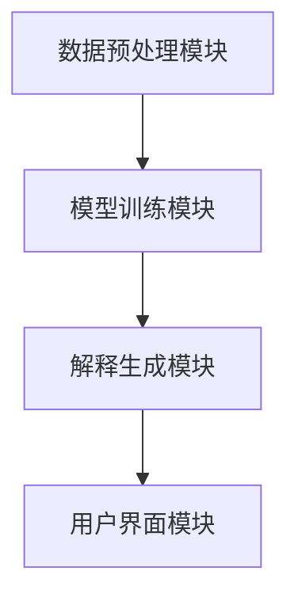

                 


# 模型解释：增加AI Agent的透明度

## 关键词：
- 模型解释
- AI Agent
- 透明度
- 可解释性
- 机器学习

## 摘要：
在人工智能快速发展的今天，AI Agent的应用越来越广泛，但其决策过程的不透明性也引发了诸多争议和挑战。模型解释作为增加AI Agent透明度的关键手段，不仅是技术发展的必然要求，也是社会对AI系统信任的重要基础。本文将从模型解释的基本概念入手，深入探讨其算法原理、系统架构设计以及实际应用案例，帮助读者全面理解如何通过模型解释提升AI Agent的透明度和可信赖性。

---

# 第1章: 模型解释的重要性

## 1.1 问题背景与挑战

### 1.1.1 问题背景
AI Agent作为一种能够自主决策的智能体，广泛应用于金融、医疗、自动驾驶等领域。然而，许多AI模型（如深度神经网络）具有“黑箱”性质，其决策过程难以被人类理解，这不仅限制了人们对AI系统的信任，还可能导致决策失误带来的风险。

### 1.1.2 挑战
- **信任缺失**：用户无法理解AI Agent的决策依据，导致信任不足。
- **责任归属**：当AI Agent的决策出现问题时，难以追溯具体原因。
- **监管需求**：许多行业对AI系统的决策过程有明确的监管要求。

## 1.2 模型解释的核心概念

### 1.2.1 可解释性
可解释性是指AI模型的决策过程能够以人类可理解的方式被解释。一个具有高可解释性的模型，其决策逻辑清晰，用户能够理解模型的决策依据。

### 1.2.2 透明度
透明度是指AI系统在决策过程中信息的公开性和可追溯性。高透明度的AI系统能够让用户清楚地了解其决策过程和依据。

### 1.2.3 可信赖性
可信赖性是指用户对AI系统的信任程度。一个具有高可解释性和透明度的AI系统更容易被用户信任。

---

# 第2章: AI Agent的决策机制与模型解释

## 2.1 AI Agent的基本概念

### 2.1.1 AI Agent的定义
AI Agent是一种智能体，能够感知环境并自主决策，以实现特定目标。AI Agent可以是软件程序、机器人或其他智能系统。

### 2.1.2 AI Agent的分类
- **基于规则的AI Agent**：通过预定义的规则进行决策。
- **基于模型的AI Agent**：使用数学模型进行推理和决策。
- **基于学习的AI Agent**：通过机器学习模型进行决策。

## 2.2 模型解释的核心原理

### 2.2.1 解释性算法的分类
- **基于规则的解释方法**：通过可解释的规则生成解释。
- **基于模型的解释方法**：通过模型本身的特性生成解释。
- **事后解释方法**：通过模拟模型的决策过程生成解释。

### 2.2.2 解释性与可解释性的关系
解释性是可解释性的具体实现方式，而可解释性是模型解释的核心目标。通过解释性算法，我们可以实现对AI Agent决策过程的可解释性。

---

# 第3章: 常见的模型解释算法

## 3.1 LIME算法

### 3.1.1 LIME算法的工作原理
LIME（Local Interpretable Model-agnostic Explanations）是一种用于解释机器学习模型的算法。它通过在局部数据上拟合简单的解释模型，来解释复杂的模型的决策过程。

### 3.1.2 LIME算法的实现步骤
1. 对原始数据进行采样，生成局部数据集。
2. 在局部数据集上拟合一个简单的解释模型（如线性回归）。
3. 使用解释模型生成解释，解释原始模型的决策。

## 3.2 SHAP值

### 3.2.1 SHAP值的定义
SHAP（SHapley Additive exPlanations）值是一种基于博弈论的解释方法，用于衡量每个特征对模型预测结果的贡献。

### 3.2.2 SHAP值的计算
1. 计算每个特征的Shapley值。
2. 将Shapley值累加，得到最终的SHAP值。

---

# 第4章: 模型解释的系统架构设计

## 4.1 系统功能设计

### 4.1.1 功能模块划分
- **数据预处理模块**：对原始数据进行清洗和预处理。
- **模型训练模块**：训练AI Agent的决策模型。
- **解释生成模块**：使用解释性算法生成模型解释。
- **用户界面模块**：展示模型解释结果。

### 4.1.2 功能交互流程
1. 用户输入数据并启动模型训练。
2. 模型训练完成后，用户请求模型解释。
3. 解释生成模块生成解释结果并展示给用户。

## 4.2 系统架构设计

### 4.2.1 系统架构图


### 4.2.2 接口设计
- 数据预处理模块与模型训练模块之间通过文件或数据库接口进行交互。
- 解释生成模块与用户界面模块之间通过API接口进行交互。

---

# 第5章: 项目实战

## 5.1 环境安装与依赖库配置

### 5.1.1 安装Python环境
使用Anaconda或虚拟环境安装Python 3.8以上版本。

### 5.1.2 安装依赖库
安装以下依赖库：
- `scikit-learn`
- `shap`
- `lime`

## 5.2 模型解释的代码实现

### 5.2.1 使用LIME算法生成解释
```python
import lime
from lime import lime_explanations
from sklearn.datasets import make_classification
from sklearn.ensemble import RandomForestClassifier

# 生成数据集
X, y = make_classification(n_samples=1000, n_features=20, random_state=42)

# 训练随机森林模型
model = RandomForestClassifier().fit(X, y)

# 使用LIME解释模型
explainer = lime_explanations.LimeExplainer()
explanation = explainer.explain_instance(X[0], model.predict, y=0)

# 输出解释结果
print(explanation.as_list())
```

### 5.2.2 使用SHAP值生成解释
```python
import shap

# 生成数据集
X, y = make_classification(n_samples=1000, n_features=20, random_state=42)

# 训练随机森林模型
model = RandomForestClassifier().fit(X, y)

# 使用SHAP解释模型
shap_values = shap.explainer(model, X).shap_values(X[0])

# 输出SHAP值
print(shap_values[0])
```

---

# 第6章: 总结与展望

## 6.1 总结
模型解释是增加AI Agent透明度的关键手段。通过模型解释，我们可以更好地理解AI系统的决策过程，提高系统的可信赖性。

## 6.2 展望
未来，随着机器学习算法的不断发展，模型解释技术也将更加成熟。我们需要继续研究和优化解释性算法，以应对更复杂的AI系统和应用场景。

---

# 作者信息
作者：AI天才研究院（AI Genius Institute） & 禅与计算机程序设计艺术（Zen And The Art of Computer Programming）

