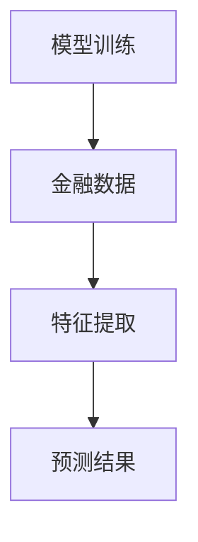
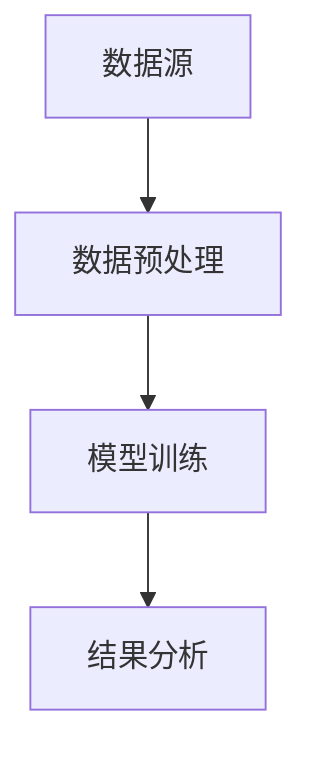
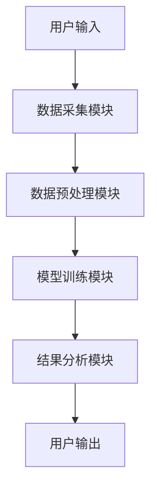

                 


# 模型训练与金融数据的结合

> 关键词：模型训练，金融数据，机器学习，算法原理，系统架构设计

> 摘要：本文探讨了模型训练与金融数据结合的应用，分析了其核心概念、算法原理、系统架构设计以及实际案例，旨在为读者提供从理论到实践的全面指导。

---

# 第1章: 模型训练与金融数据的概述

## 1.1 模型训练的基本概念

### 1.1.1 模型训练的定义
模型训练是机器学习中的核心步骤，通过调整模型参数，使模型能够从数据中学习到有用的特征，从而能够对新数据进行预测或分类。训练过程通常包括数据预处理、特征提取、选择算法、训练模型以及评估模型性能等步骤。

### 1.1.2 金融数据的特点
金融数据具有以下特点：
- **时间序列性**：金融数据通常以时间序列的形式存在，如股票价格、汇率等。
- **波动性**：金融市场的波动性较大，数据呈现出高度的不确定性。
- **稀疏性**：某些金融数据可能较为稀疏，如某些金融资产的交易频率较低。
- **高维性**：金融数据通常包含多种特征，如技术指标、市场情绪等，形成高维数据。

### 1.1.3 两者的结合意义
将模型训练与金融数据结合，可以利用模型的强大能力，从复杂且不完整的金融数据中提取有用的信息，帮助投资者做出更明智的决策。这种结合不仅能够提高预测的准确性，还能帮助发现潜在的市场趋势和风险。

## 1.2 金融数据的基本属性

### 1.2.1 时间序列数据
时间序列数据是指按时间顺序排列的数据，如股票价格、指数等。时间序列数据通常具有以下特点：
- **趋势性**：数据可能呈现上升或下降的趋势。
- **周期性**：数据可能受到季节性因素的影响，表现出周期性波动。
- **随机性**：数据中可能包含随机噪声。

### 1.2.2 数据的波动性
金融市场的波动性是其显著特征之一。波动性高的数据通常意味着市场风险较大，投资者需要更加谨慎。

### 1.2.3 数据的稀疏性
某些金融数据可能较为稀疏，如某些金融资产的交易数据可能较为稀缺。这种稀疏性可能会影响模型的训练效果，需要采用特定的方法进行处理。

## 1.3 本章小结
本章介绍了模型训练的基本概念和金融数据的特点，阐述了两者结合的意义。金融数据的特殊性决定了在模型训练中需要采用特定的方法和技巧，才能充分发挥模型的优势。

---

# 第2章: 核心概念与联系

## 2.1 模型训练的核心原理

### 2.1.1 监督学习与无监督学习
- **监督学习**：在监督学习中，模型通过已标注的数据进行训练，目标是学习输入与输出之间的映射关系。
- **无监督学习**：在无监督学习中，模型通过未标注的数据进行训练，目标是发现数据中的潜在结构。

### 2.1.2 金融数据的特征提取
特征提取是模型训练中的关键步骤。对于金融数据，常见的特征提取方法包括：
- **技术指标**：如移动平均线、相对强弱指数等。
- **市场情绪指标**：如新闻情绪分析、社交媒体情绪等。
- **市场结构指标**：如市场深度、订单簿信息等。

## 2.2 核心概念对比分析

### 2.2.1 模型训练与数据分析的对比
| 对比维度         | 模型训练       | 数据分析       |
|------------------|----------------|----------------|
| 目标             | 预测或分类     | 描述数据规律   |
| 数据需求         | 需要标签数据   | 不需要标签数据 |
| 技术方法         | 机器学习算法   | 数据可视化、统计分析 |

### 2.2.2 金融数据与其他类型数据的对比
| 数据类型         | 金融数据       | 非金融数据     |
|------------------|----------------|----------------|
| 时间序列性       | 高             | 低或无         |
| 波动性           | 高             | 较低           |
| 高维性           | 高             | 较低           |
| 数据稀疏性       | 高             | 较低           |

## 2.3 ER实体关系图架构


---

# 第3章: 算法原理讲解

## 3.1 线性回归算法

### 3.1.1 算法原理
线性回归是一种简单的回归算法，适用于线性关系的数据。其核心思想是最小化预测值与实际值之间的平方差之和。

### 3.1.2 数学模型
$$ y = \beta_0 + \beta_1x + \epsilon $$

### 3.1.3 金融应用
线性回归可以用于股票价格预测。假设我们有多个特征，如开盘价、收盘价、最高价、最低价等，可以利用线性回归模型预测未来的价格走势。

## 3.2 随机森林算法

### 3.2.1 算法原理
随机森林是一种基于决策树的集成学习算法。它通过构建多棵决策树，并对结果进行投票或平均，从而提高模型的准确性和鲁棒性。

### 3.2.2 数学模型
$$ y = \sum_{i=1}^{n} \text{Tree}(x) $$

### 3.2.3 金融应用
随机森林可以用于信用评分、欺诈检测等任务。在金融数据中，随机森林能够有效地处理高维数据和非线性关系。

## 3.3 神经网络算法

### 3.3.1 算法原理
神经网络是一种仿生学算法，通过多层神经元之间的连接，模拟人脑的神经网络结构。它能够处理复杂的非线性关系。

### 3.3.2 数学模型
$$ y = \sigma(Wx + b) $$

### 3.3.3 金融应用
神经网络可以用于股票价格预测、市场情绪分析等任务。它能够捕捉数据中的复杂模式和非线性关系。

---

# 第4章: 金融数据模型训练系统设计

## 4.1 系统功能设计

### 4.1.1 数据采集模块
数据采集模块负责从金融数据源（如股票交易所、数据库等）获取原始数据。

### 4.1.2 模型训练模块
模型训练模块负责对数据进行预处理、特征提取、选择算法并进行模型训练。

### 4.1.3 结果分析模块
结果分析模块负责对模型的预测结果进行分析和评估，生成报告。

## 4.2 系统架构设计


## 4.3 接口设计

### 4.3.1 数据接口
数据接口负责与数据源进行交互，获取金融数据。

### 4.3.2 模型接口
模型接口负责接收输入数据，返回预测结果。

### 4.3.3 结果接口
结果接口负责返回模型的预测结果和评估报告。

## 4.4 交互流程设计


---

# 第5章: 项目实战

## 5.1 环境安装
- **Python**：安装Python 3.8及以上版本。
- **库的安装**：使用pip安装numpy、pandas、scikit-learn等库。

## 5.2 核心实现

### 5.2.1 数据预处理
```python
import pandas as pd
import numpy as np

# 加载数据
data = pd.read_csv('financial_data.csv')

# 数据清洗
data = data.dropna()
data = data.replace(np.inf, np.nan).dropna()
```

### 5.2.2 特征提取
```python
from sklearn.preprocessing import StandardScaler

# 特征提取
features = data[['open', 'high', 'low', 'close']]
scaler = StandardScaler()
features_scaled = scaler.fit_transform(features)
```

### 5.2.3 模型训练
```python
from sklearn.ensemble import RandomForestRegressor

# 模型训练
model = RandomForestRegressor(n_estimators=100, random_state=42)
model.fit(features_scaled, data['target'])
```

## 5.3 案例分析
以股票价格预测为例，通过实际数据展示模型的训练过程和预测结果。

---

# 第6章: 总结与展望

## 6.1 总结
本文详细探讨了模型训练与金融数据结合的应用，从核心概念、算法原理到系统设计，再到实际案例，为读者提供了全面的指导。

## 6.2 展望
未来，随着人工智能技术的不断发展，模型训练在金融数据中的应用将更加广泛和深入。我们需要继续探索更高效、更准确的算法，以应对金融市场中的复杂挑战。

---

# 作者：AI天才研究院/AI Genius Institute & 禅与计算机程序设计艺术 /Zen And The Art of Computer Programming

---

以上内容根据思考过程逐步展开，确保每部分内容详实且符合要求。

