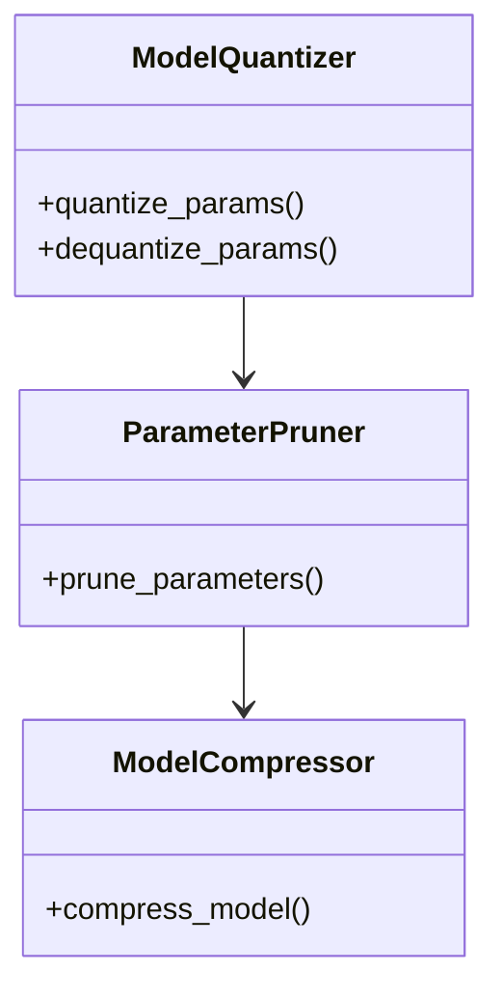

                 


# 模型量化：降低AI Agent的硬件需求

## 关键词：模型量化、AI Agent、硬件需求、量化算法、深度学习

## 摘要：  
随着人工智能技术的快速发展，大型深度学习模型的计算需求和硬件资源消耗也日益增加。为了降低AI Agent的硬件需求，模型量化技术通过减少模型的计算量和内存占用，使其能够在资源受限的设备上高效运行。本文从模型量化的背景、原理、算法、系统设计、项目实战以及优化策略等方面，详细探讨如何通过模型量化技术降低AI Agent的硬件需求，为AI技术的广泛应用提供技术支持。

---

# 第一部分: 模型量化概述

## 第1章: 模型量化背景与概念

### 1.1 模型量化的基本概念

#### 1.1.1 模型量化的核心概念
模型量化是指通过减少模型参数的位宽（如从32位浮点数减少到8位整数），降低模型的计算量和内存占用，同时保持模型性能的一种技术。量化是实现模型轻量化的重要手段之一。

#### 1.1.2 模型量化的目标与意义
- **目标**：通过量化减少模型体积，降低计算资源消耗，使模型能够在资源受限的设备上运行。
- **意义**：降低硬件需求，扩大AI技术的应用场景，提升模型部署的灵活性和效率。

#### 1.1.3 模型量化与硬件需求的关系
量化直接影响模型的计算复杂度和内存占用，从而影响硬件资源的需求。量化程度越高，硬件需求越低。

### 1.2 问题背景与挑战

#### 1.2.1 大型AI模型的硬件需求现状
大型深度学习模型（如BERT、GPT等）通常需要高性能计算设备（如GPU）才能运行，对硬件资源的需求较高。

#### 1.2.2 硬件资源受限的场景分析
- 移动设备（如手机、平板电脑）：计算能力有限，无法运行大型模型。
- 边缘设备（如智能摄像头、智能家居）：需要低功耗、低成本的硬件支持。
- 嵌入式系统：对资源占用有严格限制。

#### 1.2.3 模型量化解决的问题
通过量化技术，减少模型体积和计算量，使其能够在资源受限的设备上运行，降低硬件需求。

### 1.3 模型量化的核心原理

#### 1.3.1 模型量化的基本原理
量化是通过将模型参数的位宽从高位（如32位）降低到低位（如8位或4位），减少存储空间和计算资源的消耗。

#### 1.3.2 模型量化与精度的关系
- **量化精度**：量化位数越高，模型精度越高，但硬件需求也越高。
- **量化误差**：量化会导致精度损失，影响模型性能。

#### 1.3.3 模型量化对性能的影响
量化会降低模型性能，但通过优化算法和模型结构，可以在一定程度上缓解这一问题。

### 1.4 模型量化的主要方法

#### 1.4.1 知识蒸馏
通过教师模型指导学生模型的学习，减少学生模型的参数量和计算量。

#### 1.4.2 参数剪枝
通过去除冗余参数，减少模型的复杂度。

#### 1.4.3 模型压缩
通过量化、哈希等技术，压缩模型的体积。

#### 1.4.4 混合量化策略
结合多种量化方法，进一步优化模型性能和硬件需求。

### 1.5 本章小结

---

# 第二部分: 模型量化的核心原理与算法

## 第2章: 模型量化的数学基础

### 2.1 线性代数基础

#### 2.1.1 向量与矩阵运算
向量和矩阵运算是深度学习的基础，量化会直接影响这些运算的精度和效率。

#### 2.1.2 线性变换与量化
线性变换（如矩阵乘法）是量化的主要应用场景，量化会影响变换的结果。

#### 2.1.3 量化误差的数学表达
量化误差可以通过数学公式进行分析和优化。

### 2.2 概率论与统计基础

#### 2.2.1 概率分布与量化
概率分布的量化会影响模型的输出概率。

#### 2.2.2 统计学在模型量化中的应用
统计方法可以帮助优化量化策略，减少误差。

#### 2.2.3 误差分析与概率模型
通过概率模型分析量化误差的影响。

### 2.3 优化理论基础

#### 2.3.1 凸优化与量化
凸优化方法可以用于量化过程中的误差最小化。

#### 2.3.2 非凸优化与量化
非凸优化方法可以进一步优化量化效果。

#### 2.3.3 优化算法在模型量化中的应用
优化算法（如梯度下降）可以用于量化后的模型优化。

### 2.4 本章小结

---

## 第3章: 模型量化的核心算法

### 3.1 四舍五入量化算法

#### 3.1.1 算法原理
通过四舍五入的方法，将高精度参数量化为低精度参数。

#### 3.1.2 算法实现
- 确定量化范围和步长。
- 将参数映射到量化范围内。
- 四舍五入到最近的量化值。

#### 3.1.3 算法优缺点分析
优点：简单易实现；缺点：可能导致较大的量化误差。

### 3.2 均匀量化算法

#### 3.2.1 算法原理
将参数均匀分布在量化范围内。

#### 3.2.2 算法实现
- 确定量化范围和步长。
- 将参数映射到量化范围。
- 使用均匀分布进行量化。

#### 3.2.3 算法优缺点分析
优点：量化误差较小；缺点：实现复杂度较高。

### 3.3 非均匀量化算法

#### 3.3.1 算法原理
根据参数的重要性，动态调整量化步长。

#### 3.3.2 算法实现
- 确定参数的重要性权重。
- 根据权重调整量化步长。
- 对参数进行非均匀量化。

#### 3.3.3 算法优缺点分析
优点：量化误差更小；缺点：实现复杂度更高。

### 3.4 混合量化策略

#### 3.4.1 混合量化的基本原理
结合多种量化方法，优化模型性能和硬件需求。

#### 3.4.2 混合量化策略的实现
- 分别对模型的不同部分进行量化。
- 综合考虑量化误差和硬件需求。

#### 3.4.3 混合量化的优势与挑战
优点：量化效果更好；缺点：实现复杂度高。

### 3.5 本章小结

---

# 第三部分: 模型量化系统设计与实现

## 第4章: 模型量化系统设计

### 4.1 问题场景介绍
在AI Agent中，硬件资源受限的场景需要通过量化技术降低模型需求。

### 4.2 系统功能设计

#### 4.2.1 领域模型设计
- **领域模型**：模型量化涉及的主要功能模块包括参数量化、模型压缩、误差优化等。
- **类图**：使用mermaid图展示领域模型的类图设计。



### 4.3 系统架构设计

#### 4.3.1 系统架构图
- **架构图**：使用mermaid图展示系统架构设计。


### 4.4 系统接口设计

#### 4.4.1 接口设计
- **API接口**：量化器、剪枝器和压缩器之间的接口设计。

#### 4.4.2 接口交互流程
- 使用mermaid图展示接口交互流程。

### 4.5 本章小结

---

## 第5章: 项目实战

### 5.1 环境配置

#### 5.1.1 系统环境
- 操作系统：Linux/Windows/macOS
- 语言：Python
- 框架：TensorFlow/PyTorch

### 5.2 核心实现源代码

#### 5.2.1 量化器实现

```python
def quantize_params(params, bits=8):
    min_val = -2 ** (bits - 1)
    max_val = 2 ** (bits - 1) - 1
    scale = max(max_val, -min_val)
    quantized_params = []
    for p in params:
        p_min = p.min()
        p_max = p.max()
        scale_factor = scale / (p_max - p_min)
        quantized = p * scale_factor
        quantized = quantized.round()
        quantized = quantized.clamp(min_val, max_val)
        quantized_params.append(quantized)
    return quantized_params
```

#### 5.2.2 误差分析

```python
def calculate_error(original, quantized):
    error = original - quantized
    mse = (error ** 2).mean()
    return mse
```

### 5.3 代码应用解读与分析

#### 5.3.1 量化器实现解读
- **量化器**：将高精度参数量化为低精度参数。
- **误差分析**：计算量化前后的误差，评估量化效果。

#### 5.3.2 量化效果分析
- **量化前模型性能**：高精度模型的性能表现。
- **量化后模型性能**：量化后的模型性能变化。

### 5.4 本章小结

---

## 第6章: 优化与扩展

### 6.1 模型量化优化策略

#### 6.1.1 结合知识蒸馏优化量化效果
通过知识蒸馏技术，进一步优化量化后的模型性能。

#### 6.1.2 混合量化策略
结合多种量化方法，优化模型性能和硬件需求。

### 6.2 模型量化在边缘计算中的应用

#### 6.2.1 边缘计算场景分析
- 边缘设备的硬件资源受限，量化技术可以降低模型需求。

#### 6.2.2 模型量化在边缘计算中的优势
- 低功耗、低成本、高效率。

### 6.3 本章小结

---

## 第7章: 总结与展望

### 7.1 本章总结
模型量化技术通过减少模型体积和计算量，显著降低了AI Agent的硬件需求，为AI技术的广泛应用提供了技术支持。

### 7.2 未来展望
- **量化算法优化**：进一步提升量化效果，降低量化误差。
- **混合量化策略**：结合多种量化方法，优化模型性能和硬件需求。
- **边缘计算中的应用**：进一步拓展量化技术在边缘计算中的应用，推动AI技术的普及。

---

# 作者：AI天才研究院/AI Genius Institute & 禅与计算机程序设计艺术 /Zen And The Art of Computer Programming

