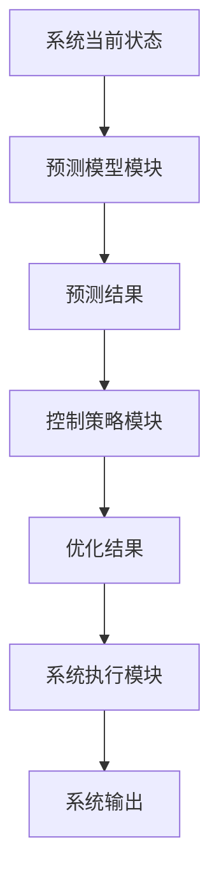

                 

# 模型预测控制：提高AI Agent的决策质量

> 关键词：模型预测控制（MPC）、AI Agent、决策优化、预测模型、控制策略

> 摘要：模型预测控制（Model Predictive Control，MPC）是一种基于预测模型和实时反馈的控制方法，能够显著提高AI Agent的决策质量。本文将详细探讨模型预测控制的基本原理、算法实现、系统架构设计以及实际应用案例，帮助读者全面理解如何通过模型预测控制优化AI Agent的决策能力。

---

## 第一部分：模型预测控制概述

### 第1章：模型预测控制的基本概念

#### 1.1 什么是模型预测控制
模型预测控制（Model Predictive Control，MPC）是一种基于系统预测模型的控制方法，通过持续预测系统行为并优化控制策略，以实现最优的系统性能。与传统反馈控制不同，MPC结合了预测和实时优化的特点，能够更好地应对复杂动态系统的控制问题。

#### 1.2 模型预测控制的特点
- **预测性**：基于模型预测系统未来状态。
- **优化性**：通过实时优化找到最优控制策略。
- **鲁棒性**：能够适应系统不确定性。
- **多目标优化**：可以同时优化多个性能指标。

#### 1.3 模型预测控制的应用领域
- **工业自动化**：优化生产流程，提高效率。
- **机器人控制**：实现复杂动作的精准控制。
- **自动驾驶**：优化路径规划和车辆控制。
- **智能电网**：优化能源分配和负载管理。

---

### 第2章：AI Agent与模型预测控制的关系

#### 2.1 AI Agent的定义与特点
AI Agent是一种能够感知环境、自主决策并执行任务的智能体。它需要具备感知、推理、规划和执行的能力，以在动态环境中完成目标。

#### 2.2 模型预测控制在AI Agent中的作用
模型预测控制为AI Agent提供了一种基于预测和优化的决策方法，能够帮助AI Agent更好地处理不确定性，优化决策质量。

#### 2.3 模型预测控制如何提高决策质量
- **基于预测的决策**：通过预测未来状态，AI Agent可以提前规划最优动作。
- **实时优化**：根据实时反馈调整控制策略，确保决策的最优性。
- **多目标优化**：同时考虑多个目标，如效率、安全性和成本。

---

## 第二部分：模型预测控制的核心概念与联系

### 第3章：模型预测控制的核心原理

#### 3.1 预测模型的构建
模型预测控制的核心在于构建一个能够准确预测系统行为的模型。常见的预测模型包括：
- **动态模型**：描述系统状态随时间变化的规律。
- **回归模型**：通过历史数据预测未来状态。
- **马尔可夫链模型**：预测系统状态转移概率。

#### 3.2 控制策略的优化
模型预测控制通过实时优化找到最优控制策略。优化目标通常包括：
- **性能优化**：最大化系统性能。
- **约束优化**：满足系统约束条件。
- **鲁棒性优化**：增强系统对不确定性适应能力。

#### 3.3 预测模型与实际系统的结合
模型预测控制通过不断校正预测模型与实际系统的偏差，确保预测的准确性。这种实时校正能力使得模型预测控制能够适应动态变化的环境。

---

### 第4章：模型预测控制与传统控制方法的对比

#### 4.1 传统控制方法的局限性
- **基于当前状态的反馈**：无法预测未来状态，决策缺乏前瞻性。
- **单目标优化**：难以同时优化多个性能指标。
- **适应性差**：难以应对复杂动态系统的不确定性。

#### 4.2 模型预测控制的优势
- **基于预测的决策**：能够提前规划最优动作。
- **多目标优化**：能够同时优化多个性能指标。
- **适应性强**：能够更好地应对复杂动态系统的不确定性。

#### 4.3 两种方法的对比分析
通过对比分析，可以看出模型预测控制在复杂动态系统中的优势，尤其是在需要多目标优化和实时调整的场景中。

---

### 第5章：模型预测控制的系统架构

#### 5.1 系统输入与输出
- **输入**：系统当前状态、目标和约束条件。
- **输出**：最优控制策略和系统反馈。

#### 5.2 预测模型的构建与训练
- **数据收集**：收集系统的历史数据。
- **模型训练**：训练预测模型，使其能够准确预测系统行为。
- **模型校正**：根据实际系统的反馈不断校正模型。

#### 5.3 控制策略的优化与执行
- **优化算法选择**：选择适合的优化算法，如线性二次调节器（LQR）或最小二乘法。
- **策略执行**：将优化得到的控制策略应用于系统。
- **反馈调整**：根据系统反馈调整预测模型和控制策略。

---

## 第三部分：模型预测控制的算法原理

### 第6章：模型预测控制的数学模型

#### 6.1 状态空间模型
状态空间模型是模型预测控制的基础，描述了系统的状态、输入、输出和转移关系。其数学表达式如下：
$$
\mathbf{x}_{k+1} = \mathbf{A}\mathbf{x}_k + \mathbf{B}\mathbf{u}_k + \mathbf{w}_k
$$
其中，$\mathbf{x}_k$ 是系统状态，$\mathbf{u}_k$ 是控制输入，$\mathbf{w}_k$ 是系统噪声。

#### 6.2 线性回归模型
线性回归模型用于预测系统行为，其数学表达式为：
$$
\mathbf{y}_k = \mathbf{C}\mathbf{x}_k + \mathbf{D}\mathbf{u}_k + \mathbf{v}_k
$$
其中，$\mathbf{y}_k$ 是系统输出，$\mathbf{v}_k$ 是测量噪声。

#### 6.3 动态规划模型
动态规划模型用于优化控制策略，通过分阶段决策找到最优控制序列。

---

### 第7章：模型预测控制的优化算法

#### 7.1 最小二乘法
最小二乘法是一种常用的优化算法，用于求解线性回归问题：
$$
\min_{\mathbf{w}} \sum_{i=1}^n (y_i - \mathbf{w}^T x_i)^2
$$

#### 7.2 增广拉格朗日法
增广拉格朗日法用于解决带约束的优化问题，其数学表达式为：
$$
\mathcal{L} = f(\mathbf{x}) + \sum_{i=1}^m \lambda_i g_i(\mathbf{x}) + \frac{1}{2\mu} \sum_{i=1}^m \lambda_i^2
$$

#### 7.3 线性二次调节器
线性二次调节器（LQR）是一种常用的优化算法，用于解决线性系统的最优控制问题。其数学表达式为：
$$
\min_{\mathbf{u}} \mathbf{u}^T Q \mathbf{u} + \mathbf{x}^T R \mathbf{x}
$$

---

### 第8章：模型预测控制的实现流程

#### 8.1 系统建模
- **数据收集**：收集系统的历史数据。
- **模型训练**：训练预测模型，使其能够准确预测系统行为。
- **模型校正**：根据实际系统的反馈不断校正模型。

#### 8.2 预测与优化
- **预测未来状态**：基于当前状态和模型预测未来状态。
- **优化控制策略**：根据预测结果优化控制策略。
- **选择最优控制序列**：根据优化结果选择最优控制序列。

#### 8.3 控制策略的执行与反馈
- **执行控制策略**：将优化得到的控制策略应用于系统。
- **获取系统反馈**：获取系统实际输出和状态。
- **更新预测模型**：根据系统反馈更新预测模型。

---

## 第四部分：模型预测控制的系统分析与架构设计

### 第9章：系统分析与需求定义

#### 9.1 问题场景介绍
以自动驾驶为例，模型预测控制可以帮助自动驾驶系统预测未来车辆状态和环境变化，从而优化路径规划和车辆控制。

#### 9.2 系统功能需求
- **环境感知**：感知周围环境信息。
- **路径规划**：规划车辆行驶路径。
- **车辆控制**：控制车辆执行规划路径。

#### 9.3 系统性能指标
- **响应时间**：系统对环境变化的响应时间。
- **控制精度**：车辆控制的精确度。
- **鲁棒性**：系统对环境变化和不确定性适应能力。

---

### 第10章：系统架构设计

#### 10.1 预测模型模块
- **功能**：预测系统未来状态。
- **输入**：当前系统状态和环境信息。
- **输出**：预测系统未来状态。

#### 10.2 控制策略模块
- **功能**：优化控制策略。
- **输入**：系统预测结果和目标。
- **输出**：最优控制策略。

#### 10.3 系统执行模块
- **功能**：执行控制策略。
- **输入**：最优控制策略。
- **输出**：系统执行结果。

---

### 第11章：接口与交互设计

#### 11.1 系统接口定义
- **输入接口**：接收系统当前状态和环境信息。
- **输出接口**：输出预测结果和控制策略。

#### 11.2 系统交互流程
1. 系统接收当前状态和环境信息。
2. 预测模型模块预测系统未来状态。
3. 控制策略模块优化控制策略。
4. 系统执行模块执行优化后的控制策略。
5. 系统反馈执行结果。

#### 11.3 系统架构图

---

## 第五部分：模型预测控制的项目实战

### 第12章：环境安装与配置

#### 12.1 开发环境的选择
推荐使用Python编程语言，结合Jupyter Notebook进行开发。

#### 12.2 依赖库的安装
安装必要的库，如NumPy、Scikit-learn、Matplotlib等。

#### 12.3 开发工具的配置
配置Jupyter Notebook和Python环境，确保所有依赖库安装完成。

---

### 第13章：核心算法的实现

#### 13.1 预测模型的实现
使用线性回归模型预测系统未来状态。

#### 13.2 优化算法的实现
使用最小二乘法优化控制策略。

#### 13.3 系统控制的实现
将优化得到的控制策略应用于系统。

---

### 第14章：实际案例分析

#### 14.1 案例背景
以自动驾驶为例，分析模型预测控制在路径规划和车辆控制中的应用。

#### 14.2 数据收集与预处理
收集车辆状态和环境数据，进行预处理。

#### 14.3 模型训练与优化
训练预测模型，优化控制策略。

#### 14.4 系统测试与验证
测试系统性能，验证模型预测控制的有效性。

---

## 第六部分：总结与展望

### 第15章：总结与小结

#### 15.1 核心内容回顾
模型预测控制是一种基于预测和优化的控制方法，能够显著提高AI Agent的决策质量。

#### 15.2 项目小结
通过项目实战，验证了模型预测控制在实际应用中的有效性。

---

### 第16章：最佳实践与注意事项

#### 16.1 最佳实践
- **数据质量**：确保数据准确性和完整性。
- **模型选择**：根据具体场景选择合适的预测模型。
- **优化算法**：根据系统特点选择合适的优化算法。

#### 16.2 注意事项
- **系统复杂性**：模型预测控制适用于复杂动态系统。
- **计算资源**：需要足够的计算资源支持实时预测和优化。

---

### 第17章：未来展望

#### 17.1 技术发展
模型预测控制将更加智能化和自动化，能够更好地应对复杂动态系统的挑战。

#### 17.2 应用领域扩展
模型预测控制将在更多领域得到应用，如智能交通、智能制造等。

---

## 作者：AI天才研究院/AI Genius Institute & 禅与计算机程序设计艺术 /Zen And The Art of Computer Programming

---

通过本文的详细讲解，读者可以全面理解模型预测控制的基本原理、算法实现、系统架构设计以及实际应用案例，从而掌握如何通过模型预测控制提高AI Agent的决策质量。

