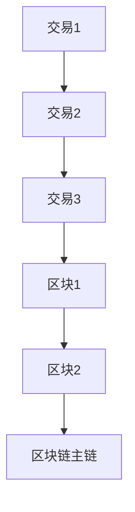
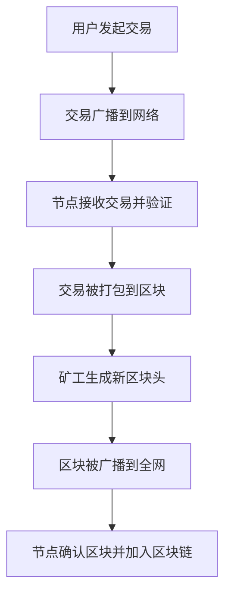
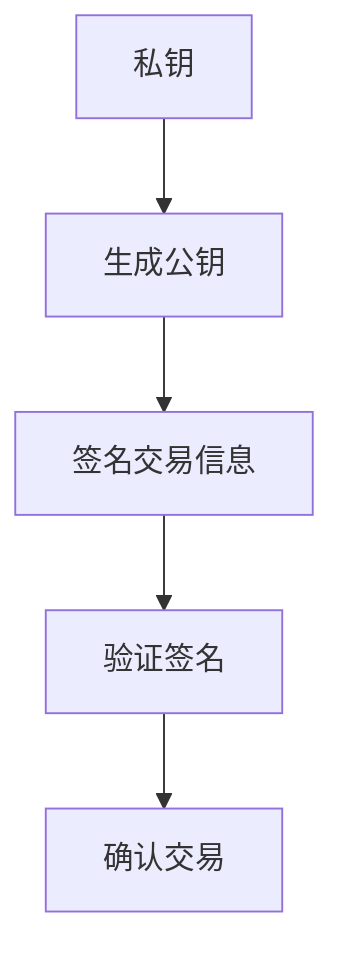

                 

# 比特币和加密货币：数字资产的投资价值

> **关键词**：比特币、加密货币、数字资产、投资价值、区块链、货币政策、经济分析

> **摘要**：本文深入分析比特币和加密货币的起源、技术原理及其在数字资产领域中的投资价值。通过探讨区块链技术、经济模型和市场趋势，揭示比特币与其他加密货币的潜在价值与风险，为投资者提供专业的分析和见解。

---

## 第一部分: 比特币和加密货币的背景与核心概念

### 第1章: 比特币和加密货币的概述

#### 1.1 比特币的起源与背景

比特币作为第一种去中心化的加密货币，其起源可以追溯到2008年金融危机时期。2008年，一篇名为《比特币：一种点对点的电子现金系统》的论文被发布，提出了比特币的概念。论文的作者中本聪（Satoshi Nakamoto）并未透露真实身份，但这一创新性设计为加密货币领域奠定了基础。

比特币的起源可以理解为对传统金融体系的一种反思。传统金融体系在2008年金融危机中暴露了许多问题，如金融机构的过度杠杆、信用评级机构的失灵以及监管的不足。比特币的设计目标是建立一个去中心化的金融系统，通过区块链技术实现点对点的交易，消除中间机构的控制。

#### 1.2 加密货币的基本概念

加密货币是一种基于密码学原理的数字货币，通过区块链技术实现去中心化的价值转移。以下是加密货币的几个核心概念：

1. **区块链技术**：区块链是一个分布式账本，记录所有交易信息。每个区块包含一定数量的交易数据，并通过哈希指针连接到前一个区块，形成一条不可篡改的链式结构。

2. **去中心化**：比特币不依赖于任何中央机构，交易通过点对点网络进行，由全网节点共同验证和记录交易。

3. **共识机制**：比特币采用工作量证明（PoW）机制，通过矿工竞争解决数学难题来验证交易，确保网络安全。

4. **数字签名**：比特币交易通过数字签名技术实现身份验证和权限控制，确保交易的安全性。

#### 1.3 比特币的经济模型与货币政策

比特币的货币政策设计是其区别于传统货币的重要特征。比特币总量上限为2100万枚，每四年减半的机制确保了货币供应的可控性和稀缺性。以下是比特币经济模型的关键点：

1. **总量限制**：比特币的总量上限为2100万枚，这一设计模仿了黄金的稀缺性，赋予其保值和增值的潜力。

2. **发行机制**：比特币通过挖矿机制发行，每10分钟产生一个新区块，每块奖励一定数量的比特币。奖励每四年减半，从50枚比特币逐步减少到25、12.5、6.25枚。

3. **交易成本与激励**：比特币网络中的交易费用由用户支付，矿工通过打包交易获得奖励。这种机制确保了网络安全和交易的激励机制。

---

### 第2章: 加密货币的核心技术原理

#### 2.1 区块链技术的核心原理

区块链技术是比特币和加密货币的核心基础，其工作原理可以分为以下几个步骤：

1. **交易生成**：用户发起交易请求，交易信息包括付款方地址、收款方地址和金额。

2. **交易验证**：交易信息通过网络传播，全网节点验证交易的有效性，包括检查付款方的余额和签名。

3. **区块打包**：矿工将多个交易打包成区块，并通过哈希计算生成区块头的随机数，使得区块哈希满足特定难度要求。

4. **区块广播**：矿工成功找到符合条件的区块头后，将该区块广播到全网，其他节点验证后将其加入本地区块链。

5. **链上确认**：交易经过一定数量的区块确认后，被视为最终有效，无法被篡改。

图1-1展示了比特币区块链的基本结构：

#### 2.2 比特币的交易与验证机制

比特币的交易验证过程涉及多个关键步骤，包括交易广播、区块打包、链上确认和交易最终性。以下是交易验证的详细流程：

1. **交易广播**：用户发起交易请求后，交易信息会被广播到整个比特币网络。

2. **交易池确认**：全网节点接收交易信息后，将其加入本地的交易池，并开始验证交易的有效性。

3. **区块打包**：矿工将交易池中的交易打包成区块，并通过工作量证明机制生成区块头。

4. **区块确认**：其他节点收到新区块后，验证交易是否合法，并将该区块加入本地区块链。

5. **交易最终性**：交易经过6个确认后，被视为最终有效，无法被逆转。

图1-2展示了比特币交易的验证流程：

#### 2.3 加密算法与数字签名

比特币的安全性依赖于强大的密码学算法，包括哈希函数和椭圆曲线加密。以下是关键算法的详细说明：

1. **哈希函数**：比特币使用SHA-256哈希函数，将任意长度的输入数据映射为固定长度的哈希值。哈希函数的特性包括确定性、抗碰撞性和不可逆性。

2. **椭圆曲线加密（ECC）**：比特币的数字签名基于ECC算法，通过生成公钥和私钥对来实现身份验证。ECC的安全性依赖于椭圆曲线上的点加法运算。

3. **数字签名过程**：
    - 用户使用私钥对交易信息进行签名，生成数字签名。
    - 收款方通过公钥验证签名的有效性，确认交易的合法性。

图1-3展示了椭圆曲线加密的数学模型：

---

### 第3章: 比特币的经济模型与投资价值分析

#### 3.1 比特币的经济模型分析

比特币的经济模型设计使其具备独特的货币属性和投资价值。以下是经济模型的几个关键点：

1. **货币属性**：比特币是一种去中心化的数字货币，具备价值存储和交换媒介的双重功能。

2. **稀缺性**：比特币总量上限为2100万枚，稀缺性赋予其保值和增值的潜力。

3. **货币政策**：比特币采用渐进式减半机制，确保货币供应的可控性和稳定性。

#### 3.2 加密货币的投资价值评估

投资价值评估是比特币投资的重要环节，以下是评估的关键指标：

1. **市场供需**：比特币的供给固定，需求主要来自支付、投资和储值需求。

2. **技术优势**：比特币的区块链技术具备安全性、去中心化和可扩展性等优势。

3. **政策风险**：各国对比特币的监管政策对市场价值产生重要影响。

#### 3.3 加密货币市场的波动性与投资策略

比特币市场的高波动性是投资者需要面对的主要挑战。以下是应对市场波动的投资策略：

1. **长期投资**：基于比特币的稀缺性和技术优势，长期持有可以实现价值增值。

2. **风险管理**：投资者应合理配置资产，避免过度集中，分散投资风险。

3. **市场分析**：通过技术分析和基本面研究，识别市场趋势和潜在风险。

---

### 第4章: 加密货币的法律与合规问题

#### 4.1 比特币的法律地位与监管框架

比特币的法律地位因国家而异，以下是主要的法律框架：

1. **全球监管现状**：部分国家对比特币持支持态度，如新加坡和日本；部分国家则采取严格监管，如中国和印度。

2. **合规要求**：比特币交易需遵守反洗钱（AML）和了解客户（KYC）等法规，交易所需获得相关牌照。

3. **未来展望**：随着技术发展和市场成熟，比特币的法律地位将逐步明确，监管政策也将趋于完善。

#### 4.2 加密货币的税务与合规问题

税务问题是比特币投资中的重要考量因素，以下是主要的税务处理方式：

1. **税务申报**：投资者需按照所在国家的税务规定，申报比特币交易收益和资本 gains。

2. **税务合规**：加密货币交易所需记录交易信息，协助税务机关进行税务征管。

3. **税务优化**：投资者可通过合理配置资产和选择税务洼地，降低税务负担。

---

## 作者：AI天才研究院/AI Genius Institute & 禅与计算机程序设计艺术 /Zen And The Art of Computer Programming

