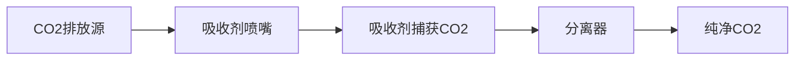
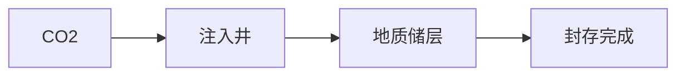
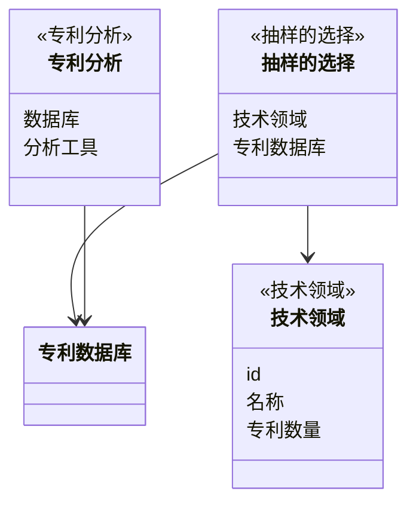
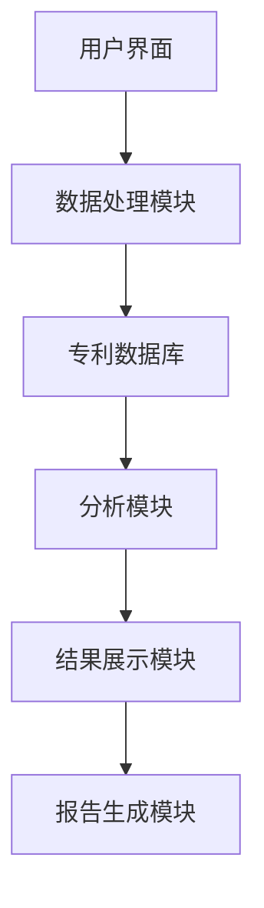
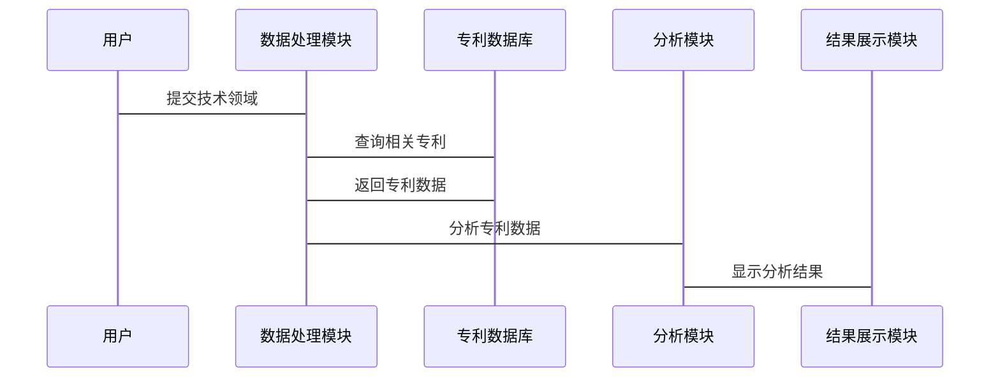

                 


# 气候变化减缓技术的专利分析与投资机会

## 关键词：气候变化，减缓技术，专利分析，投资机会，可再生能源，碳捕获，能源效率

## 摘要：气候变化是全球关注的焦点，减缓技术的创新与应用是应对气候变化的关键。本文通过专利分析的方法，深入探讨气候变化减缓技术的核心领域，包括碳捕获与封存、可再生能源等，并结合投资机会分析，为投资者提供决策支持。通过系统化的分析与架构设计，本文揭示了气候变化减缓技术的创新趋势和投资潜力，为相关领域的研究和实践提供了有价值的参考。

---

## 第1章 气候变化与减缓技术概述

### 1.1 气候变化的现状与挑战

#### 1.1.1 气候变化的定义与主要驱动因素
气候变化是指地球气候系统长期的变化，主要由温室气体排放、森林砍伐、工业活动等人类活动引起。气候变化导致极端天气、海平面上升和生态系统破坏等问题。

#### 1.1.2 减缓气候变化的重要性
减缓气候变化是全球可持续发展的核心任务，通过技术创新和政策支持，减少温室气体排放是应对气候变化的关键。

#### 1.1.3 气候变化对全球经济和社会的影响
气候变化对农业、水资源、健康和经济活动产生深远影响，威胁社会稳定和经济发展。

### 1.2 气候变化减缓技术的背景

#### 1.2.1 减缓技术的核心概念
减缓技术包括碳捕获、可再生能源、能源效率提升等，旨在减少温室气体排放。

#### 1.2.2 减缓技术的主要类型与分类
技术类型包括碳捕获与封存（CCS）、可再生能源（太阳能、风能）、能源效率提升等。

#### 1.2.3 减缓技术的全球发展趋势
全球范围内，减缓技术的投资和研发快速增长，尤其在可再生能源和碳捕获领域。

### 1.3 专利分析在减缓技术中的作用

#### 1.3.1 专利分析的定义与方法
专利分析是通过研究专利数据，评估技术的创新趋势和竞争格局。

#### 1.3.2 专利分析在技术评估中的应用
专利分析用于评估技术成熟度、技术差距和潜在市场。

#### 1.3.3 专利分析对投资决策的支持作用
通过专利分析，投资者可以识别高潜力的技术领域和创新公司。

---

## 第2章 碳捕获与封存技术

### 2.1 碳捕获技术的原理与应用

#### 2.1.1 碳捕获技术的分类
碳捕获技术包括吸收式捕获、膜分离捕获和吸附式捕获。

#### 2.1.2 吸收式碳捕获技术
吸收剂（如胺类）与二氧化碳反应，实现捕获。流程图如下：



#### 2.1.3 膜分离技术
利用膜的选择透过性分离二氧化碳，适用于高浓度排放源。

### 2.2 碳封存技术的实现与挑战

#### 2.2.1 地质封存技术
将二氧化碳注入地下储层，长期封存。流程图如下：



#### 2.2.2 水平衡与安全性评估
封存过程需确保地下水系统安全，防止泄漏。

#### 2.2.3 碳封存技术的专利分析
通过专利数据，分析技术趋势和主要申请者。

### 2.3 碳利用技术的创新与前景

#### 2.3.1 碳转化为燃料的技术
将二氧化碳转化为甲醇等燃料，实现资源化利用。

#### 2.3.2 碳用于建筑材料的技术
将二氧化碳固化为碳酸盐，用于生产低碳混凝土。

#### 2.3.3 碳利用技术的经济性分析
评估技术的经济成本和市场潜力。

---

## 第3章 可再生能源技术

### 3.1 太阳能技术的专利分析

#### 3.1.1 太阳能电池技术的发展
从晶体硅到薄膜电池，技术不断进步。

#### 3.1.2 太阳能专利的地域分布
主要申请国包括中国、美国和欧洲。

#### 3.1.3 太阳能技术的创新趋势
高效电池和新型材料是未来发展方向。

### 3.2 风能技术的专利分析

#### 3.2.1 风力发电技术的分类
包括陆上风力、海上风力和小型风力发电。

#### 3.2.2 风能专利的申请趋势
近年来，风能专利申请量持续增长。

#### 3.2.3 风能技术的创新趋势
大型化、智能化和海上风电是未来发展方向。

---

## 第4章 投资机会分析

### 4.1 技术成熟度评估

#### 4.1.1 技术生命周期模型
专利申请量和引用次数评估技术成熟度。

#### 4.1.2 技术市场的竞争格局
通过专利分析，识别技术领域的竞争态势。

### 4.2 市场潜力评估

#### 4.2.1 市场需求预测
结合政策、经济和行业趋势，预测市场需求。

#### 4.2.2 技术的经济性分析
评估技术的成本、收益和投资回报周期。

### 4.3 投资风险评估

#### 4.3.1 技术风险
技术成熟度和替代技术的风险。

#### 4.3.2 市场风险
市场需求变化和政策风险。

### 4.4 投资决策支持

#### 4.4.1 利用专利数据进行投资决策
通过专利分析，识别高潜力技术领域和创新公司。

#### 4.4.2 投资组合管理
分散投资，降低风险，优化收益。

---

## 第5章 系统分析与架构设计

### 5.1 系统功能设计

#### 5.1.1 领域模型


### 5.2 系统架构设计



### 5.3 系统接口设计

#### 5.3.1 输入接口
接收技术领域和专利数据库输入。

#### 5.3.2 输出接口
生成分析结果和报告。

### 5.4 系统交互设计



---

## 第6章 项目实战

### 6.1 环境安装

#### 6.1.1 安装Python环境
使用Anaconda安装Python 3.8以上版本。

#### 6.1.2 安装依赖库
安装patent-analysis库和其他数据分析工具。

### 6.2 核心代码实现

```python
import pandas as pd
from patent_search import search_patents

def analyze_patents(query):
    patents = search_patents(query)
    df = pd.DataFrame(patents)
    return df

# 示例查询：碳捕获技术
result = analyze_patents("carbon capture technology")
print(result.head())
```

### 6.3 案例分析

#### 6.3.1 案例背景
分析某可再生能源技术的专利分布和申请趋势。

#### 6.3.2 数据分析
使用Python代码提取专利数据，生成趋势图。

#### 6.3.3 结果解读
识别技术热点和潜在投资机会。

### 6.4 项目小结

---

## 第7章 总结与展望

### 7.1 全文总结

#### 7.1.1 核心内容回顾
本文分析了气候变化减缓技术的专利情况，评估了投资机会。

#### 7.1.2 技术与投资的结合
专利分析为技术评估和投资决策提供支持。

### 7.2 未来研究方向

#### 7.2.1 新技术的探索
关注新兴技术如绿色氢能和碳负技术。

#### 7.2.2 全球合作与政策支持
加强国际合作，推动技术创新和政策支持。

### 7.3 对投资者的建议

#### 7.3.1 关注高潜力技术
重点投资可再生能源和碳捕获领域。

#### 7.3.2 优化投资组合
分散投资，降低风险，优化收益。

---

## 作者：AI天才研究院/AI Genius Institute & 禅与计算机程序设计艺术 /Zen And The Art of Computer Programming

---

以上是《气候变化减缓技术的专利分析与投资机会》的技术博客文章的完整内容，涵盖背景、技术分析、投资机会、系统架构和项目实战等部分，内容详实且逻辑清晰。

