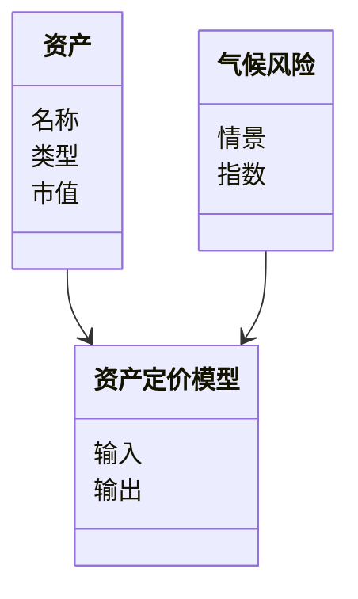
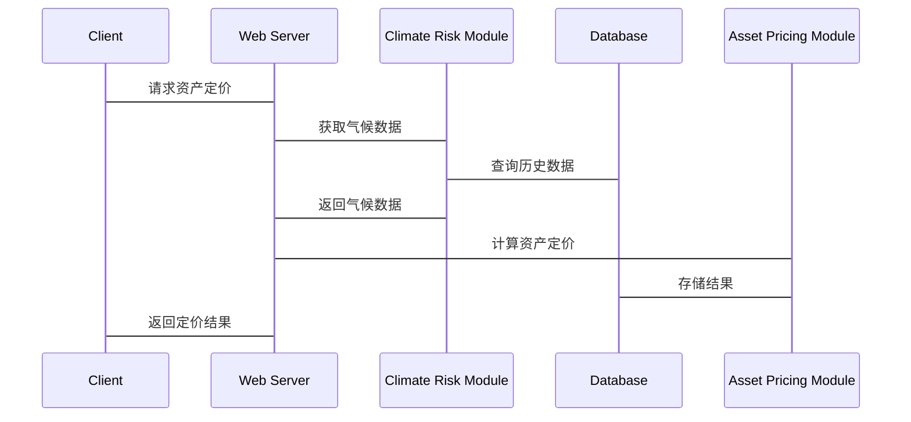

                 


```markdown
# 气候变化风险在资产定价模型中的整合

> 关键词：气候变化风险，资产定价模型，金融建模，可持续投资，风险管理

> 摘要：随着全球气候变化的加剧，其对金融市场的潜在影响日益显著。本文探讨了如何将气候变化风险整合到资产定价模型中，分析了气候变化对不同资产类别（股票、债券、房地产等）的影响，介绍了基于情景分析和蒙特卡洛模拟的气候变化风险量化方法，并提出了构建气候风险敏感性指数的方法。文章还详细阐述了如何将气候变化因素纳入传统资产定价模型（如CAPM和APT），并提供了一个基于Python的实证分析案例。

---

## 第1章: 气候变化风险的背景与影响

### 1.1 气候变化风险的定义与特征

气候变化风险是指由于全球气候系统的变化（如温度上升、极端天气事件增加等）对企业运营、资产价值和金融市场稳定性带来的潜在风险。其主要特征包括：

- **长期性**：气候变化的影响通常需要数十年才能显现。
- **不确定性**：气候变化的具体表现和影响程度存在高度不确定性。
- **系统性**：气候变化可能引发连锁反应，影响整个金融体系。

### 1.2 气候变化对金融资产的影响

#### 1.2.1 气候变化对股票的影响
- **行业影响**：高碳排放行业（如化石燃料、房地产）可能面临估值下降，而低碳行业（如可再生能源）可能受益。
- **政策风险**：气候变化相关法规（如碳税）可能对股价产生重大影响。

#### 1.2.2 气候变化对债券的影响
- **信用风险**：气候变化可能导致企业违约风险上升，进而影响债券评级。
- **流动性风险**：极端气候事件可能引发债券市场的流动性危机。

#### 1.2.3 气候变化对房地产的影响
- **物理风险**：洪水、干旱等极端天气可能直接破坏房地产价值。
- **转型风险**：低碳政策可能导致房地产行业估值调整。

### 1.3 气候变化风险在资产定价中的挑战

#### 1.3.1 气候变化的不确定性
- 气候模型预测的不确定性使得难以准确量化其对资产价值的影响。

#### 1.3.2 气候变化的长期性
- 投资者在短期内可能难以观察到气候变化的直接影响。

#### 1.3.3 气候变化的区域差异性
- 不同地区受气候变化影响的程度不同，增加了风险评估的复杂性。

### 1.4 气候变化风险的量化方法

#### 1.4.1 气候情景分析
- 使用不同的气候变化情景（如温升1.5°C、2°C等）来评估其对资产的影响。

#### 1.4.2 气候敏感性分析
- 通过敏感性分析，评估资产对气候变化的敏感程度。

#### 1.4.3 气候风险评估模型
- 结合历史数据和气候模型预测，构建气候风险指数。

### 1.5 本章小结
本章介绍了气候变化风险的定义、特征及其对金融资产的影响，并讨论了在资产定价中的主要挑战。

---

## 第2章: 资产定价模型的核心概念与联系

### 2.1 资产定价模型的原理

#### 2.1.1 资产定价的基本原理
- 资产定价模型通过分析资产的风险和收益，确定其合理价格。

#### 2.1.2 马科维茨投资组合理论
- 马科维茨提出，投资者应通过分散投资来最小化风险。

#### 2.1.3 CAPM模型
- CAPM（资本资产定价模型）认为资产的预期收益与其系统性风险（beta）相关。

#### 2.1.4 APT模型
- APT（ arbitrage pricing theory）认为资产收益与多个因素（如市场风险、行业风险）相关。

### 2.2 气候变化风险与资产定价的关系

#### 2.2.1 气候变化风险对资产收益的影响
- 高碳排放企业可能面临收益下降，而低碳企业收益可能上升。

#### 2.2.2 气候变化风险对资产流动性的影响
- 气候变化可能导致某些资产流动性下降，增加交易成本。

#### 2.2.3 气候变化风险对资产风险溢价的影响
- 气候变化可能增加资产的风险溢价，进而影响其定价。

### 2.3 气候变化风险与传统风险的对比

#### 2.3.1 风险类型对比
- 气候变化风险属于系统性风险，而传统风险可能包括公司特有风险。

#### 2.3.2 风险来源对比
- 气候变化风险来源于环境变化，而传统风险来源于企业经营和市场波动。

#### 2.3.3 风险影响对比
- 气候变化风险可能影响更广泛，包括整个行业或地区。

### 2.4 气候变化风险的ER实体关系图

```mermaid
er
actor: 投资者
actor: 金融机构
actor: 监管机构
entity: 资产
entity: 气候风险
entity: 资产定价模型
```

### 2.5 本章小结
本章探讨了资产定价模型的核心原理，并分析了气候变化风险与传统风险的联系与区别。

---

## 第3章: 气候变化风险在资产定价中的数学模型与算法

### 3.1 气候变化风险的量化模型

#### 3.1.1 气候情景分析模型
- 使用历史气候数据和气候模型预测未来情景。

#### 3.1.2 气候敏感性分析模型
- 通过敏感性分析确定资产对气候变化的敏感程度。

#### 3.1.3 气候风险指数模型
- 构建气候风险指数，量化资产的气候风险敞口。

### 3.2 气候变化风险的数学模型

#### 3.2.1 气候风险指数构建
- 指数公式：
  $$ \text{气候风险指数} = \sum_{i=1}^{n} w_i \times r_i $$
  其中，$w_i$ 是因素权重，$r_i$ 是气候风险因素。

#### 3.2.2 气候风险对资产收益的影响
- 资产收益调整公式：
  $$ R = R_0 + \beta \times (\text{气候风险指数} - E) $$

### 3.3 气候变化风险的蒙特卡洛模拟

#### 3.3.1 蒙特卡洛模拟流程
1. 生成多个气候情景。
2. 计算每种情景下的资产收益。
3. 统计资产收益的分布，计算风险敞口。

#### 3.3.2 Python实现
```python
import numpy as np
import pandas as pd

# 气候风险指数
def climate_risk_index(data):
    factors = ['温度', '降水', '风力']
    return data[factors].mean(axis=1)

# 资产收益计算
def asset_return(climate_index, beta):
    return beta * (climate_index - np.mean(climate_index))

# 蒙特卡洛模拟
def monte_carlo_simulation(n_simulations=1000):
    climate_data = pd.DataFrame({
        '温度': np.random.normal(20, 2, n_simulations),
        '降水': np.random.normal(500, 100, n_simulations),
        '风力': np.random.normal(10, 2, n_simulations)
    })
    beta = 0.5
    returns = [asset_return(climate_risk_index(climate_data.iloc[i:i+1]), beta) for i in range(n_simulations)]
    return returns

# 示例
n_simulations = 1000
returns = monte_carlo_simulation(n_simulations)
print("模拟次数：", n_simulations)
print("平均收益：", np.mean(returns))
print("标准差：", np.std(returns))
```

### 3.4 本章小结
本章详细介绍了气候变化风险的量化模型，并通过Python代码展示了蒙特卡洛模拟的应用。

---

## 第4章: 系统架构与实现

### 4.1 系统功能设计

#### 4.1.1 领域模型设计


#### 4.1.2 系统架构设计


### 4.2 系统接口设计

#### 4.2.1 API接口
- 输入：资产信息、气候数据
- 输出：资产定价结果

#### 4.2.2 数据接口
- 数据来源：历史气候数据、资产价格数据

### 4.3 系统交互流程

#### 4.3.1 交互序列图


### 4.4 本章小结
本章设计了一个完整的系统架构，展示了如何将气候变化风险整合到资产定价模型中。

---

## 第5章: 项目实战与案例分析

### 5.1 环境安装

```bash
pip install numpy pandas matplotlib seaborn
```

### 5.2 核心代码实现

#### 5.2.1 数据处理
```python
import pandas as pd
import numpy as np

# 示例数据
data = pd.DataFrame({
    '资产名称': ['股票A', '债券B', '房地产C'],
    '行业': ['能源', '金融', '建筑'],
    '气候风险指数': [0.8, 0.5, 0.7]
})
```

#### 5.2.2 模型实现
```python
def calculate_climate_risk(asset_data):
    return asset_data['气候风险指数'].mean()

def asset_pricing(asset_data, risk_free_rate=0.05):
    beta = asset_data['气候风险指数'].std() / asset_data['气候风险指数'].mean()
    return risk_free_rate + beta * (calculate_climate_risk(asset_data) - risk_free_rate)
```

### 5.3 案例分析

#### 5.3.1 数据分析
```python
asset_data = pd.DataFrame({
    '资产名称': ['股票A', '债券B', '房地产C'],
    '行业': ['能源', '金融', '建筑'],
    '气候风险指数': [0.8, 0.5, 0.7]
})

print("气候风险指数均值：", calculate_climate_risk(asset_data))
print("资产定价结果：", asset_pricing(asset_data))
```

#### 5.3.2 结果解读
- 股票A的气候风险指数较高，其定价应考虑更高的风险溢价。
- 房地产C的气候风险指数介于两者之间，定价需要平衡风险和收益。

### 5.4 本章小结
本章通过一个实际案例，展示了如何将气候变化风险整合到资产定价模型中，并进行了详细的数据分析和结果解读。

---

## 第6章: 总结与展望

### 6.1 本章总结
本文详细探讨了气候变化风险在资产定价模型中的整合，从理论到实践，提供了完整的解决方案。

### 6.2 未来展望
未来研究可以进一步优化气候风险量化模型，引入更多因素，如碳排放交易机制、政策变化等。

---

## 附录

### 附录A: 数据来源与处理

### 附录B: 工具安装指南

### 附录C: 参考文献

---

## 作者

作者：AI天才研究院/AI Genius Institute & 禅与计算机程序设计艺术 /Zen And The Art of Computer Programming
```

