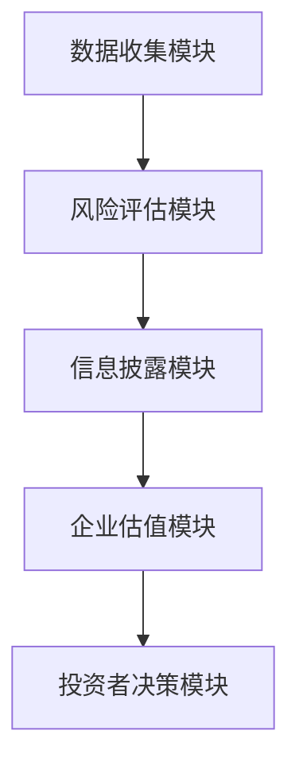
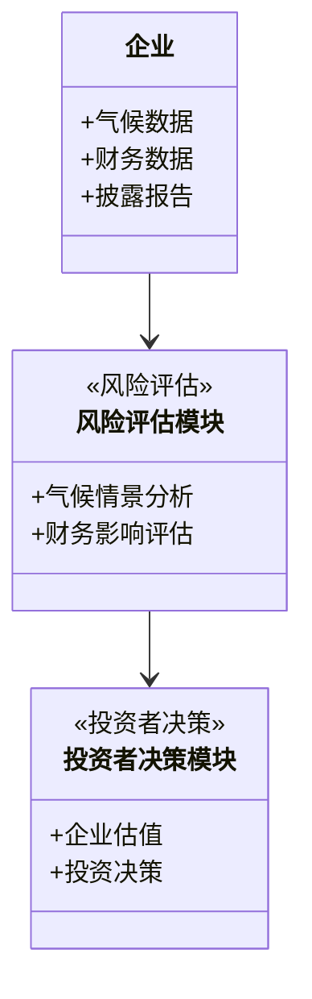

                 


```markdown
# 气候风险信息披露对公司估值的影响

## 关键词：气候风险、信息披露、公司估值、财务模型、可持续发展

## 摘要：气候风险信息披露已成为企业财务管理的重要组成部分。随着全球气候变化的加剧，企业面临的气候相关风险日益显著，而这些风险的信息披露对公司的估值产生深远影响。本文从气候风险的定义、分类、披露框架出发，结合具体的算法原理和系统设计，分析气候风险披露如何影响企业估值，并通过实际案例展示其应用。文章最后总结了实施气候风险信息披露的最佳实践和未来趋势。

---

# 第一部分: 气候风险与信息披露的背景

## 第1章: 气候风险与企业价值的关联

### 1.1 气候风险的定义与分类
- **1.1.1 气候风险的定义**：气候风险是指由于气候变化对企业运营、财务状况和资产价值产生的潜在影响。
- **1.1.2 气候风险的分类**：
  - **物理风险**：如极端天气事件对企业造成的直接损失。
  - **转型风险**：指政策变化、技术革新对企业运营模式的影响。
  - **声誉风险**：企业在应对气候变化中的表现影响其市场形象。

### 1.2 气候风险与企业估值的关系
- **1.2.1 气候风险对企业财务状况的影响**：包括收入减少、成本增加、资产减值等。
- **1.2.2 气候风险对投资决策的影响**：投资者越来越关注企业的气候风险管理能力，影响企业的融资成本和市场价值。
- **1.2.3 气候风险与企业估值模型的结合**：将气候风险因素纳入DCF模型，调整折现率和现金流预测。

### 1.3 气候风险信息披露的背景与意义
- **1.3.1 全球气候变化的挑战**：气候变化已成为全球性问题，对企业运营环境产生深远影响。
- **1.3.2 企业社会责任的增强**：企业需要向利益相关者披露其应对气候变化的策略和措施。
- **1.3.3 监管机构的推动作用**：越来越多的监管机构要求企业披露气候相关信息，如欧盟的TCFD框架。

---

# 第二部分: 气候风险信息披露的核心概念与联系

## 第2章: 气候风险披露的核心框架

### 2.1 TCFD框架的详细介绍
- **2.1.1 TCFD框架的核心内容**：包括治理、战略、风险管理、目标设定等方面。
- **2.1.2 TCFD框架与其他披露框架的对比**：如GRI、CDSB等框架的异同点。

### 2.2 气候风险与企业价值的关系
- **2.2.1 气候风险对企业财务状况的影响**：通过案例分析说明气候风险如何影响企业的收入和成本。
- **2.2.2 气候风险对投资决策的影响**：投资者如何利用气候信息披露评估企业的长期价值。
- **2.2.3 气候风险与企业估值模型的结合**：将气候风险纳入贴现现金流模型，调整关键参数。

### 2.3 气候风险披露的实体关系图
```mermaid
er
actor 企业 {
  direction LR
  actor 气候风险 {
    role: 影响企业运营和财务
  }
  actor 信息披露 {
    role: 提供气候相关信息
  }
  actor 投资者 {
    role: 评估企业气候风险管理能力
  }
  actor 监管机构 {
    role: 制定和监督披露标准
  }
}
```

---

# 第三部分: 气候风险披露的算法原理与系统设计

## 第3章: 气候风险披露的算法原理

### 3.1 气候风险影响评估的算法流程
- **3.1.1 数据收集与处理**：收集企业的历史气候数据和相关财务数据。
- **3.1.2 风险评估与量化**：使用情景分析法评估不同气候情景下的财务影响。
- **3.1.3 财务模型调整**：将气候风险因素纳入财务模型，计算调整后的企业估值。

### 3.2 气候风险披露的系统架构设计


---

# 第四部分: 气候风险信息披露的系统实现

## 第4章: 气候风险披露的系统实现

### 4.1 系统功能设计
- **4.1.1 数据收集功能**：收集企业的气候相关数据和财务数据。
- **4.1.2 风险评估功能**：基于情景分析法评估气候风险。
- **4.1.3 信息披露功能**：生成符合TCFD框架的披露报告。

### 4.2 系统架构设计


---

# 第五部分: 气候风险信息披露的项目实战

## 第5章: 气候风险信息披露的案例分析

### 5.1 案例背景介绍
- 某制造企业面临的气候变化风险及其信息披露实践。

### 5.2 项目实施过程
- **环境安装**：搭建气候风险信息披露系统。
- **核心代码实现**：编写气候风险评估算法。
- **实际案例分析**：分析气候风险对企业估值的影响。

### 5.3 案例分析结果
- **气候风险对收入的影响**：通过具体数据展示。
- **气候风险对成本的影响**：通过具体数据展示。
- **气候风险对估值的影响**：通过具体数据展示。

---

# 第六部分: 气候风险信息披露的最佳实践与小结

## 第6章: 气候风险信息披露的最佳实践

### 6.1 实施气候风险信息披露的建议
- **制定明确的气候风险管理策略**。
- **选择合适的气候披露框架**。
- **建立有效的数据收集与分析机制**。
- **加强与利益相关者的沟通**。

### 6.2 气候风险信息披露的未来趋势
- **绿色金融的发展**：气候风险信息披露将与绿色金融更加紧密地结合。
- **气候风险管理的数字化**：利用人工智能和大数据技术提升气候风险评估能力。

### 6.3 本章小结
- 总结气候风险信息披露的重要性。
- 提出未来发展的建议。

---

# 作者

作者：AI天才研究院/AI Genius Institute & 禅与计算机程序设计艺术 /Zen And The Art of Computer Programming
```

