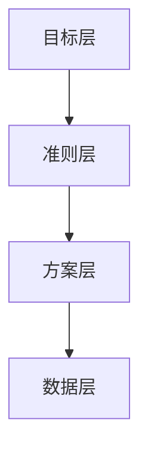
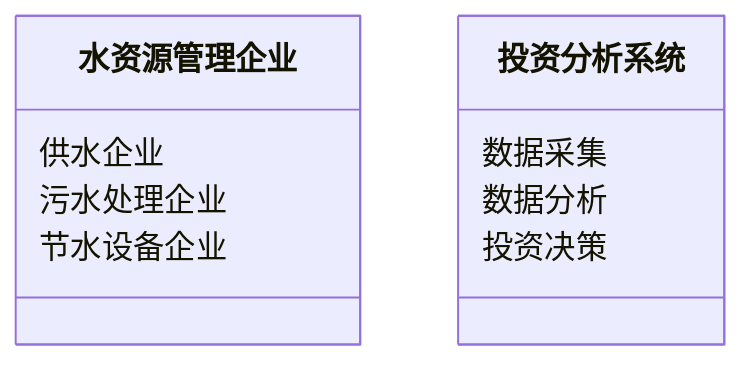
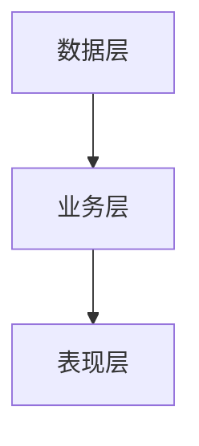
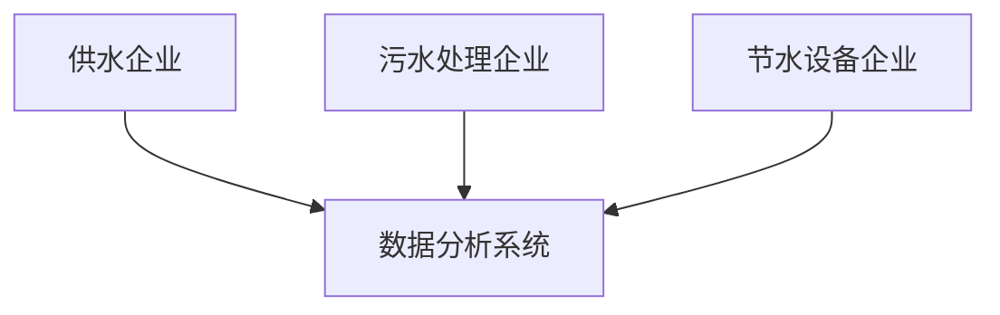

                 


# 水资源管理相关企业的投资前景分析

## 关键词：水资源管理、投资前景、企业分析、技术应用、数据分析、系统架构

## 摘要：水资源管理在现代社会中扮演着至关重要的角色，而与水资源管理相关的企业在投资领域具有广阔的发展前景。本文将从背景介绍、核心概念、算法原理、数学模型、系统架构、项目实战等多个方面进行详细分析，结合实际案例，探讨水资源管理相关企业的投资前景，为企业投资者和决策者提供科学依据。

---

## 第一部分: 水资源管理相关企业的背景介绍

### 第1章: 水资源管理的重要性

#### 1.1 水资源在现代社会中的地位
水资源是人类生存和发展的基础，是农业、工业和生活的重要支撑。随着全球人口增长和经济发展，水资源短缺问题日益严重，水资源管理的重要性愈发凸显。

#### 1.2 水资源管理的核心问题
水资源管理的核心问题包括水资源的合理分配、污染控制、节约利用以及应对气候变化带来的不确定性。这些问题直接影响到企业的运营成本和投资回报。

#### 1.3 水资源管理的边界与外延
水资源管理的边界包括水资源的开发、利用、保护和修复，外延则涉及政策法规、技术创新、市场需求等多个方面。

---

### 第2章: 水资源管理相关企业的定义与分类

#### 2.1 水资源管理企业的定义
水资源管理企业是指那些从事水资源开发、利用、保护和修复的企业，主要包括供水企业、污水处理企业、节水设备制造企业等。

#### 2.2 水资源管理企业的分类
1. **供水企业**：负责水资源的收集、储存和供应。
2. **污水处理企业**：处理污水，确保水质符合排放标准。
3. **节水设备制造企业**：生产节水型产品，推动水资源节约利用。
4. **水资源技术服务企业**：提供水资源管理的技术咨询和解决方案。

#### 2.3 水资源管理企业的核心要素
1. **技术能力**：企业需要具备先进的水资源管理技术。
2. **政策支持**：政府政策和法规对企业的发展至关重要。
3. **市场需求**：水资源短缺和环保需求推动企业的投资前景。

---

## 第二部分: 水资源管理相关企业的核心概念与联系

### 第3章: 水资源管理的核心原理

#### 3.1 水资源管理的核心原理
水资源管理的核心原理包括水资源的循环利用、污染控制和生态平衡。通过科学的管理和技术创新，实现水资源的可持续利用。

#### 3.2 相关企业的运营模式
水资源管理企业的运营模式包括直接投资、技术合作和第三方服务。企业需要根据市场需求和技术发展，灵活调整经营策略。

#### 3.3 投资分析的基本原理
投资分析的基本原理包括风险评估、收益预测和投资回报分析。通过这些分析，投资者可以更好地评估水资源管理企业的投资价值。

---

### 第4章: 概念属性特征对比表格

#### 4.1 水资源管理企业的属性特征
| 属性 | 特征 |
|------|------|
| 行业类型 | 环境保护与公用事业 |
| 技术门槛 | 高 |
| 市场需求 | 高且稳定 |

#### 4.2 投资分析的关键指标
| 指标 | 解释 |
|------|------|
| 投资回报率（ROI） | 项目收益与投资成本的比率 |
| 风险评估 | 项目可能面临的风险因素及影响程度 |
| 市场增长率 | 行业市场容量的年增长率 |

#### 4.3 实体关系图架构

```mermaid
erd
  企业
  项目
  资源
  风险
  收益
  企业 <-- 关联 --> 项目
  项目 <-- 关联 --> 资源
  项目 <-- 关联 --> 风险
  项目 <-- 关联 --> 收益
```

---

## 第三部分: 水资源管理相关企业的算法原理讲解

### 第5章: 数据分析与预测算法

#### 5.1 层次分析法（AHP）
层次分析法是一种用于多因素决策分析的方法，适用于水资源管理企业的投资决策。

**流程图：**



**Python代码示例：**
```python
import numpy as np
import pandas as pd

# 示例数据
data = pd.DataFrame({
    '项目': ['项目A', '项目B', '项目C'],
    '收益': [10, 15, 12],
    '风险': [5, 3, 7]
})

# 计算层次分析法权重
weights = np.array([0.6, 0.4])
data['综合得分'] = data['收益'] * weights[0] + data['风险'] * weights[1]

print(data)
```

---

### 第6章: 数学模型与公式

#### 6.1 水资源需求预测模型
$$ D = a \times T + b \times P + c $$

其中：
- \( D \) 表示水资源需求量
- \( T \) 表示温度
- \( P \) 表示降水量
- \( a, b, c \) 是系数

#### 6.2 投资回报模型
$$ ROI = \frac{净收益}{投资成本} \times 100\% $$

#### 6.3 风险评估模型
$$ R = \sum_{i=1}^{n} w_i \times r_i $$

其中：
- \( R \) 表示风险值
- \( w_i \) 表示风险因素的权重
- \( r_i \) 表示风险因素的影响程度

---

## 第四部分: 水资源管理相关企业的系统分析与架构设计

### 第7章: 问题场景介绍

#### 7.1 水资源管理的复杂性
水资源管理涉及多个领域，包括环境科学、工程技术和社会经济。

#### 7.2 相关企业的投资需求
企业需要通过技术创新和管理优化，提高水资源利用效率，降低运营成本。

#### 7.3 系统设计的目标
设计一个高效、可靠的水资源管理与投资分析系统，为企业提供科学决策支持。

---

### 第8章: 系统功能设计

#### 8.1 领域模型类图



#### 8.2 功能模块划分
1. 数据采集模块
2. 数据分析模块
3. 投资决策模块

---

### 第9章: 系统架构设计

#### 9.1 分层架构图



#### 9.2 微服务架构图



---

## 第五部分: 水资源管理相关企业的项目实战

### 第10章: 环境安装与配置

#### 10.1 数据分析工具安装
安装Python、Pandas、NumPy等工具。

#### 10.2 系统开发环境搭建
安装Jupyter Notebook、Django框架等。

#### 10.3 数据集获取与预处理
从公开数据源获取水资源相关数据，进行清洗和转换。

---

### 第11章: 核心代码实现

#### 11.1 数据分析代码

```python
import pandas as pd
import numpy as np

data = pd.read_csv('water_data.csv')
data['预测需求'] = np.nan
# 数据分析逻辑
print(data.head())
```

#### 11.2 系统核心代码

```python
def investment_analysis(projects):
    for project in projects:
        print(f"项目 {project['name']} 的 ROI 为 {project['roi']}")
```

---

## 第六部分: 最佳实践、小结、注意事项和拓展阅读

### 第12章: 最佳实践

1. **数据驱动决策**：利用数据分析技术提高投资决策的科学性。
2. **技术创新**：加强技术研发，提升水资源管理效率。
3. **政策支持**：密切关注政策变化，争取政府支持。

---

### 第13章: 小结

水资源管理相关企业在投资前景方面具有广阔的市场空间和技术发展潜力。通过科学的分析和系统的构建，企业可以更好地把握投资机会，实现可持续发展。

---

### 第14章: 注意事项

1. **数据准确性**：确保数据来源可靠，避免分析误差。
2. **技术可行性**：选择适合的技术方案，确保系统稳定运行。
3. **政策合规性**：遵守相关法规，确保投资活动合法合规。

---

### 第15章: 拓展阅读

1. 《水资源管理与可持续发展》
2. 《投资分析与风险管理》
3. 《系统架构设计与实现》

---

## 作者：AI天才研究院/AI Genius Institute & 禅与计算机程序设计艺术 /Zen And The Art of Computer Programming

---

通过以上结构和内容，您可以开始撰写详细的博客文章。如果需要更详细的部分或具体章节的内容，请随时告诉我！

