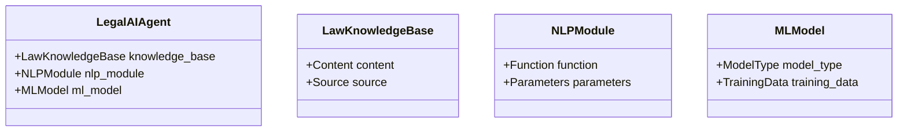
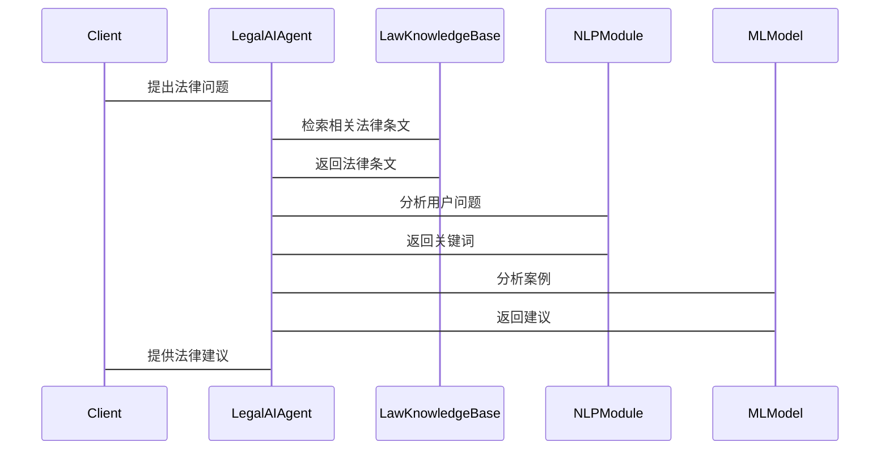

                 


# 《法律AI Agent：法律咨询与案例分析助手》

## 关键词：法律AI、自然语言处理、机器学习、法律咨询、案例分析、知识库、系统架构

## 摘要：本文系统介绍了法律AI Agent的概念、原理及其在法律咨询与案例分析中的应用。从背景到核心概念，从算法原理到系统架构设计，再到项目实战，全面解析了法律AI Agent的构建过程。文章通过详细的技术分析和实际案例，展示了如何利用自然语言处理和机器学习技术提升法律咨询的效率与准确性。

---

# 第一部分：法律AI Agent的背景与核心概念

## 第1章：法律AI Agent的背景与问题背景

### 1.1 法律AI Agent的基本概念

#### 1.1.1 法律AI Agent的定义
法律AI Agent是一种基于人工智能技术的法律咨询与案例分析工具，能够通过自然语言处理（NLP）和机器学习（ML）技术，帮助用户快速获取法律信息、分析案例并提供法律建议。

#### 1.1.2 法律AI Agent的核心功能
- **法律信息检索**：通过关键词或问题，快速检索相关法律条文、案例和法规。
- **案例分析**：基于历史案例数据，分析相似案例的判决结果和法律依据。
- **法律咨询**：根据用户提供的信息，提供初步的法律建议和解决方案。

#### 1.1.3 法律AI Agent的应用场景
- **法律咨询**：为企业或个人提供法律问题解答。
- **案例分析**：协助律师或法官分析复杂案例。
- **法律教育**：用于法律教育和培训中的案例分析和知识检索。

### 1.2 法律咨询与案例分析的现状

#### 1.2.1 传统法律咨询的特点
- 依赖人工检索和分析，效率较低。
- 成本较高，尤其是对于复杂案件。
- 受限于咨询人员的经验和知识储备。

#### 1.2.2 现代法律咨询的痛点
- 数据量庞大，人工检索效率低下。
- 案例分析需要大量时间和资源。
- 法律法规更新频繁，人工更新难以及时。

#### 1.2.3 法律AI Agent的解决方案
通过自动化技术，法律AI Agent能够快速检索和分析法律信息，显著提高咨询效率和准确性。

### 1.3 法律AI Agent的边界与外延

#### 1.3.1 法律AI Agent的功能边界
- **边界**：专注于法律咨询和案例分析，不涉及实际法律事务的处理。
- **外延**：可以与其他法律工具集成，如合同管理、法律文书生成等。

#### 1.3.2 法律AI Agent的外延应用
- **合同审查**：自动审查合同中的法律条款。
- **法律风险评估**：评估商业行为的法律风险。

#### 1.3.3 法律AI Agent与其他法律技术工具的区别
| 工具类型 | 功能特点 | 适用场景 |
|----------|----------|----------|
| 法律AI Agent | 咨询与分析 | 法律咨询、案例分析 |
| 合同管理工具 | 合同生成与审查 | 合同管理 |
| 法律文书生成工具 | 文书自动生成 | 法律文书撰写 |

### 1.4 法律AI Agent的概念结构与核心要素

#### 1.4.1 法律知识库的构建
法律知识库是法律AI Agent的核心，包含法律条文、案例、法规等数据。

#### 1.4.2 自然语言处理技术的作用
NLP技术用于理解用户的问题并生成自然语言的回复。

#### 1.4.3 机器学习模型的应用
ML模型用于分析案例数据，预测判决结果和法律建议。

## 1.5 本章小结

---

## 第2章：法律AI Agent的核心概念与联系

### 2.1 法律知识库的构建原理

#### 2.1.1 法律知识库的组成要素
- **法律条文**：包括宪法、法律、法规等。
- **案例数据**：包括历史案例的判决书和分析。
- **术语库**：法律术语和定义的集合。

#### 2.1.2 法律知识库的构建流程
1. 数据收集：从法律数据库中获取条文和案例。
2. 数据清洗：去除重复和无效数据。
3. 数据标注：对数据进行分类和标注。
4. 知识抽取：提取关键信息，如法律条文、案例中的关键因素。

#### 2.1.3 法律知识库的更新与维护
定期更新法律法规和新案例，确保知识库的准确性。

### 2.2 自然语言处理技术的原理

#### 2.2.1 分词技术
将用户的问题分割成词语，以便后续处理。

#### 2.2.2 语义分析
理解用户问题的意图和背景。

#### 2.2.3 命名实体识别
识别问题中的关键实体，如人名、地名、机构名等。

### 2.3 机器学习模型的应用

#### 2.3.1 分类模型
将案例分类为不同类别，如民事、刑事等。

#### 2.3.2 回归模型
预测判决金额或概率。

#### 2.3.3 聚类模型
将相似的案例归为一类。

### 2.4 法律AI Agent的核心概念对比表

| 概念 | 描述 | 作用 |
|------|------|------|
| 法律知识库 | 存储法律条文、案例 | 支持法律咨询 |
| NLP技术 | 处理自然语言 | 理解用户问题 |
| 机器学习模型 | 分析数据 | 提供法律建议 |

### 2.5 法律AI Agent的ER实体关系图

```mermaid
erd
    LawKnowledgeBase {
        LawKnowledgeBaseID
        Content
        Source
    }
    NLPModule {
        ModuleID
        Function
        Parameters
    }
    MLModel {
        ModelID
        ModelType
        TrainingData
    }
    LegalAIAgent {
        AgentID
        KnowledgeBaseID
        NLPModuleID
        MLModelID
    }
```

---

## 第3章：法律AI Agent的算法原理

### 3.1 法律AI Agent的工作流程

#### 3.1.1 用户输入
用户提出法律问题，如“合同违约责任如何承担？”

#### 3.1.2 数据预处理
对输入的自然语言进行分词和标注。

#### 3.1.3 案例检索
基于关键词检索相关案例。

#### 3.1.4 案例分析
利用机器学习模型分析案例，生成建议。

#### 3.1.5 结果输出
将分析结果返回给用户。

### 3.2 法律AI Agent的算法实现

#### 3.2.1 数据预处理
```python
import jieba

text = "合同违约责任如何承担？"
tokens = jieba.lcut(text)
```

#### 3.2.2 案例检索
使用向量空间模型进行语义检索。

#### 3.2.3 模型训练
使用支持向量机（SVM）进行分类。

#### 3.2.4 模型评估
通过准确率、召回率和F1分数评估模型性能。

---

## 第4章：法律AI Agent的系统分析与架构设计

### 4.1 问题场景介绍

#### 4.1.1 用户场景
用户提出法律问题，系统进行分析并提供建议。

#### 4.1.2 系统目标
构建一个高效的法律咨询与案例分析工具。

### 4.2 系统功能设计

#### 4.2.1 领域模型


#### 4.2.2 系统架构设计


#### 4.2.3 接口设计
- 用户接口：HTTP API。
- 数据接口：数据库接口。

#### 4.2.4 交互流程


---

## 第5章：法律AI Agent的项目实战

### 5.1 环境安装

#### 5.1.1 Python安装
```bash
python --version
pip install -y jieba
pip install -y scikit-learn
```

#### 5.1.2 依赖库安装
```bash
pip install jieba
pip install scikit-learn
```

### 5.2 系统核心实现

#### 5.2.1 法律知识库的构建
```python
import json

class LawKnowledgeBase:
    def __init__(self):
        self.content = []
        self.source = []
    
    def add_content(self, text, source):
        self.content.append(text)
        self.source.append(source)
```

#### 5.2.2 NLP模块的实现
```python
import jieba

class NLPModule:
    def __init__(self):
        pass
    
    def tokenize(self, text):
        return jieba.lcut(text)
```

#### 5.2.3 机器学习模块的实现
```python
from sklearn.svm import SVC

class MLModel:
    def __init__(self):
        self.model = SVC()
    
    def train(self, X, y):
        self.model.fit(X, y)
    
    def predict(self, X):
        return self.model.predict(X)
```

### 5.3 实际案例分析

#### 5.3.1 案例背景
用户咨询“合同违约责任如何承担？”

#### 5.3.2 数据预处理
```python
text = "合同违约责任如何承担？"
tokens = jieba.lcut(text)
```

#### 5.3.3 案例分析
```python
X = [[1, 2], [3, 4]]  # 示例特征
y = [0, 1]  # 示例标签
model = MLModel()
model.train(X, y)
prediction = model.predict([[3, 4]])
```

### 5.4 项目小结

---

## 第6章：法律AI Agent的总结与展望

### 6.1 最佳实践tips

#### 6.1.1 数据质量的重要性
确保法律知识库的数据准确性和全面性。

#### 6.1.2 模型优化
定期更新模型，提高准确率。

### 6.2 小结

### 6.3 注意事项

#### 6.3.1 数据隐私
确保用户数据的隐私和安全。

#### 6.3.2 法律合规性
遵守相关法律法规，确保工具的合法性。

### 6.4 拓展阅读

#### 6.4.1 推荐书籍
- 《法律人工智能》
- 《自然语言处理实战》

#### 6.4.2 推荐博客
- 法律AI技术博客
- 机器学习与法律应用博客

---

## 作者：AI天才研究院/AI Genius Institute & 禅与计算机程序设计艺术 /Zen And The Art of Computer Programming

---

**注意：** 以上文章内容仅为目录大纲，实际写作时需要根据每个部分展开详细的技术内容和案例分析。

