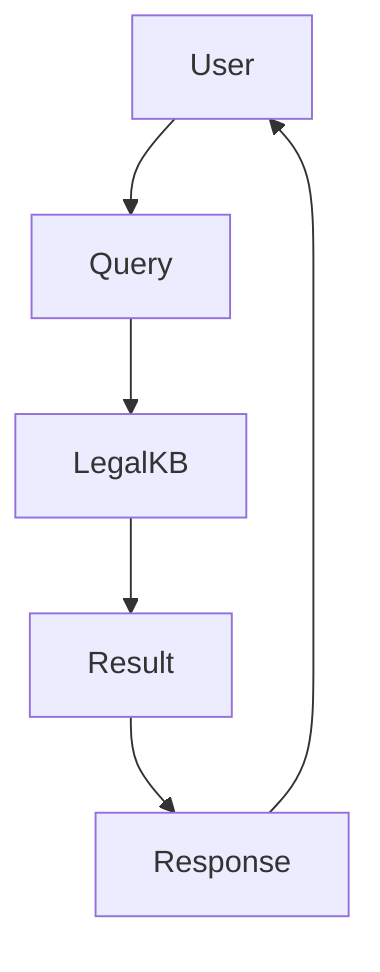
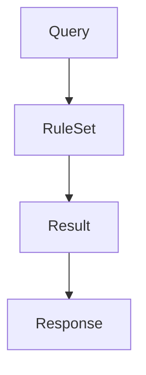
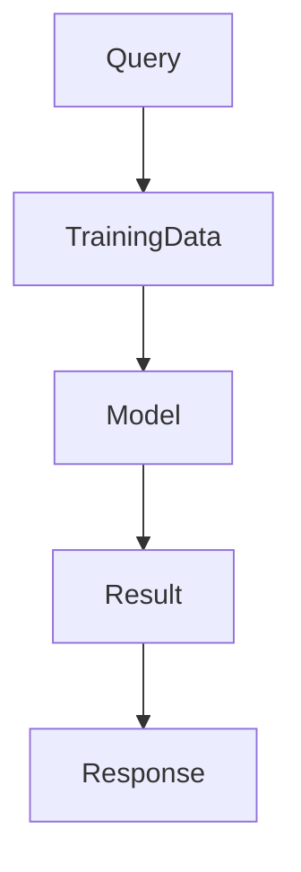
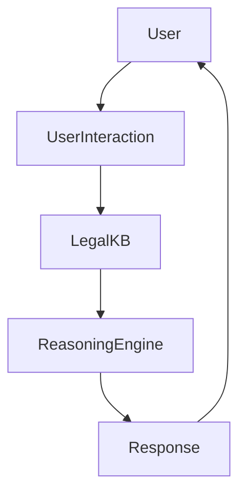

                 


# 《法律咨询领域的AI Agent辅助系统》

## 关键词：AI Agent，法律咨询，自然语言处理，知识图谱，机器学习，法律推理

## 摘要：本文将深入探讨AI Agent在法律咨询领域的应用，从理论到实践，系统地分析其核心概念、算法原理、系统架构设计以及项目实现。通过详细的技术分析和案例研究，揭示AI Agent如何在法律咨询中提高效率、降低成本并提供个性化服务。本文将为法律咨询行业的数字化转型提供理论支持和实践指导。

---

## 目录大纲

# 第一部分: 法律咨询领域的AI Agent辅助系统概述

# 第1章: 法律咨询领域的背景与需求

## 1.1 法律咨询行业的现状

### 1.1.1 传统法律咨询的特点与挑战

- 传统法律咨询的流程与痛点
- 人工咨询的局限性：成本高、效率低、覆盖范围有限
- 用户需求的多样性和复杂性

### 1.1.2 数字化转型的必要性

- 技术进步对法律咨询行业的推动
- 用户对实时、便捷服务的需求
- 企业对高效法律支持的需求

### 1.1.3 AI技术在法律咨询中的潜力

- AI技术如何解决传统法律咨询的痛点
- AI Agent在法律咨询中的独特优势
- 法律咨询行业对AI技术的适应性

## 1.2 AI Agent在法律咨询中的应用价值

### 1.2.1 提高效率与降低成本

- AI Agent如何优化法律咨询流程
- 通过自动化减少人工成本
- 提高法律信息检索的效率

### 1.2.2 提供24/7的实时法律支持

- 解决传统法律咨询的时间限制
- AI Agent的实时响应能力
- 夜间或紧急情况下的法律支持

### 1.2.3 个性化法律服务的可能性

- 基于用户数据的个性化推荐
- AI Agent如何满足不同用户的需求
- 法律咨询的定制化服务

## 1.3 法律咨询领域AI Agent的定义与优势

### 1.3.1 AI Agent的定义

- AI Agent的定义与基本特征
- 法律咨询领域AI Agent的特殊性
- AI Agent与传统法律咨询工具的区别

### 1.3.2 法律咨询领域AI Agent的核心功能

- 自然语言处理（NLP）能力
- 知识图谱构建与法律信息检索
- 机器学习驱动的法律推理
- 个性化推荐与实时反馈

### 1.3.3 与传统法律咨询工具的区别

- 功能上的差异
- 技术实现上的差异
- 用户体验上的差异

## 1.4 本章小结

- 总结法律咨询行业面临的挑战
- 强调AI Agent在法律咨询中的潜在价值
- 为后续章节的深入分析奠定基础

---

# 第2章: 法律咨询领域的核心概念与问题分析

## 2.1 法律咨询的核心问题

### 2.1.1 法律问题的复杂性

- 法律问题的多样性和复杂性
- 不同法律领域的特点
- 法律信息的多样性和模糊性

### 2.1.2 用户需求的多样性

- 不同用户群体的需求差异
- 用户对法律咨询的不同期望
- 个性化需求与共性需求的平衡

### 2.1.3 法律信息的准确性和权威性

- 法律信息的准确性和权威性的重要性
- 如何确保AI Agent提供的信息的准确性
- 法律信息更新的及时性

## 2.2 AI Agent在法律咨询中的关键问题

### 2.2.1 自然语言理解的准确性

- NLP技术在法律咨询中的应用
- 法律文本的理解难点
- 提高AI Agent自然语言理解能力的方法

### 2.2.2 法律知识库的构建与更新

- 法律知识库的构建方法
- 知识图谱在法律咨询中的应用
- 知识库的动态更新与维护

### 2.2.3 个性化推荐的实现

- 基于用户数据的个性化推荐
- AI Agent如何实现个性化法律服务
- 个性化推荐的算法实现

## 2.3 法律咨询领域的边界与外延

### 2.3.1 核心业务范围

- 法律咨询的核心业务
- AI Agent在核心业务中的应用
- 边界场景的定义

### 2.3.2 边界场景的界定

- AI Agent在法律咨询中的适用范围
- 超出AI Agent能力范围的情况
- 如何处理边界场景

### 2.3.3 外延功能的扩展

- AI Agent的扩展功能
- 法律咨询与其他业务的协同
- AI Agent的未来发展方向

## 2.4 本章小结

- 总结法律咨询领域的核心问题
- 强调AI Agent在解决这些问题中的关键作用
- 为后续章节的技术实现提供理论支持

---

# 第3章: 法律咨询领域AI Agent的核心概念与联系

## 3.1 核心概念原理

### 3.1.1 自然语言处理（NLP）在法律咨询中的应用

- NLP技术在法律咨询中的具体应用
- 常见的NLP算法及其在法律咨询中的应用
- NLP在法律信息检索中的作用

### 3.1.2 知识图谱构建与法律信息检索

- 知识图谱的基本概念
- 法律知识图谱的构建方法
- 知识图谱在法律信息检索中的应用

### 3.1.3 机器学习在法律推理中的应用

- 机器学习在法律推理中的作用
- 常见的机器学习算法及其在法律推理中的应用
- 法律推理的复杂性与机器学习的挑战

## 3.2 核心概念属性特征对比

### 3.2.1 对比表格：法律咨询与一般咨询的差异

| 对比维度 | 法律咨询 | 一般咨询 |
|----------|----------|----------|
| 专业性   | 高       | 中       |
| 信息复杂性 | 高       | 低       |
| 需求多样性 | 高       | 中       |
| 对结果的依赖性 | 高       | 中       |

### 3.2.2 对比表格：AI Agent与传统法律咨询工具的差异

| 对比维度 | AI Agent | 传统法律咨询工具 |
|----------|----------|------------------|
| 可用性   | 24/7     | 限工作时间       |
| 个性化   | 高       | 低               |
| 效率     | 高       | 中               |
| 成本     | 低       | 高               |

## 3.3 ER实体关系图架构



- 说明：用户提出查询请求，查询请求被传递到法律知识库中进行检索，检索结果生成响应返回给用户。

## 3.4 本章小结

- 总结法律咨询领域AI Agent的核心概念
- 通过对比分析明确AI Agent的独特优势
- 为后续章节的技术实现奠定基础

---

# 第4章: 法律咨询领域AI Agent的算法原理

## 4.1 法律咨询领域的算法选择

### 4.1.1 基于规则的法律推理

- 基于规则的法律推理的基本原理
- 规则的制定与维护
- 基于规则的法律推理的优势与局限性

### 4.1.2 基于机器学习的法律推理

- 机器学习在法律推理中的应用
- 常见的机器学习算法及其在法律推理中的应用
- 机器学习模型的训练与优化

## 4.2 法律推理算法的实现步骤

### 4.2.1 基于规则的法律推理流程



### 4.2.2 基于机器学习的法律推理流程



## 4.3 法律推理算法的数学模型

### 4.3.1 基于规则的法律推理模型

- 规则的表示方法
- 规则的匹配与推理
- 规则的冲突解决

### 4.3.2 基于机器学习的法律推理模型

- 机器学习模型的训练数据
- 模型的训练与优化
- 模型的预测与解释

## 4.4 本章小结

- 总结法律咨询领域AI Agent的核心算法
- 分析不同算法的优缺点
- 为后续章节的技术实现提供理论支持

---

# 第5章: 法律咨询领域AI Agent的系统架构设计

## 5.1 系统功能设计

### 5.1.1 系统功能模块划分

- 用户交互模块
- 法律知识库模块
- 法律推理引擎模块
- 个性化推荐模块

### 5.1.2 功能模块的交互流程



## 5.2 系统架构设计

### 5.2.1 系统架构的选择

- 选择微服务架构的原因
- 微服务架构的优势与挑战
- 系统架构的可扩展性

### 5.2.2 系统架构图

```mermaid
graph TD
    User --> API Gateway
    API Gateway --> LegalKB
    LegalKB --> ReasoningEngine
    ReasoningEngine --> Response
    Response --> User
```

## 5.3 系统接口设计

### 5.3.1 API接口的设计

- API的定义与作用
- API的调用流程
- API的安全性与稳定性

### 5.3.2 接口的实现

- API的开发与测试
- API的文档编写
- API的版本管理

## 5.4 系统交互设计

### 5.4.1 用户与系统的交互流程

- 用户发起查询请求
- 系统响应查询请求
- 用户反馈与系统的交互

### 5.4.2 系统的响应机制

- 系统的实时响应能力
- 系统的错误处理与反馈
- 系统的性能优化

## 5.5 本章小结

- 总结系统架构设计的核心内容
- 分析不同架构选择的优缺点
- 为后续章节的实现提供系统设计参考

---

# 第6章: 法律咨询领域AI Agent的项目实战

## 6.1 环境安装与配置

### 6.1.1 开发环境的搭建

- 开发工具的选择与安装
- 开发环境的配置与优化
- 开发团队的协作与管理

### 6.1.2 法律知识库的构建

- 法律知识库的数据来源
- 法律知识库的构建工具
- 法律知识库的维护与更新

## 6.2 系统核心实现

### 6.2.1 法律知识库的实现

- 法律知识库的数据结构
- 法律知识库的存储与管理
- 法律知识库的检索与查询

### 6.2.2 法律推理引擎的实现

- 法律推理引擎的算法实现
- 法律推理引擎的优化与调优
- 法律推理引擎的测试与验证

## 6.3 代码实现与解读

### 6.3.1 法律知识库的代码实现

```python
class LegalKB:
    def __init__(self, data):
        self.data = data

    def query(self, question):
        # 简单的关键词匹配
        result = []
        for entry in self.data:
            if question in entry['content']:
                result.append(entry)
        return result
```

### 6.3.2 法律推理引擎的代码实现

```python
from sklearn.feature_extraction.text import TfidfVectorizer
from sklearn.metrics.pairwise import cosine_similarity

class LegalReasoningEngine:
    def __init__(self, corpus):
        self.vectorizer = TfidfVectorizer()
        self.corpus = corpus
        self.vectors = self.vectorizer.fit_transform(corpus)

    def infer(self, query):
        query_vector = self.vectorizer.transform([query])
        similarity_scores = cosine_similarity(query_vector, self.vectors)
        return similarity_scores.argmax()
```

## 6.4 实际案例分析

### 6.4.1 案例背景与需求

- 案例的背景介绍
- 案例的需求分析
- 案例的目标与期望

### 6.4.2 系统实现与分析

- 系统如何处理该案例
- 系统的响应与结果
- 系统的优缺点与改进建议

## 6.5 本章小结

- 总结项目实战的核心内容
- 分析实际案例中的问题与解决方案
- 总结项目实现的经验与教训

---

# 第7章: 法律咨询领域AI Agent的最佳实践与未来展望

## 7.1 最佳实践

### 7.1.1 知识库的构建与维护

- 知识库的构建与维护策略
- 知识库的更新与优化
- 知识库的质量控制

### 7.1.2 系统的性能优化

- 系统性能的优化方法
- 系统的可扩展性设计
- 系统的稳定性与可靠性

### 7.1.3 用户体验的提升

- 用户体验设计的原则与方法
- 系统的交互设计优化
- 用户反馈的收集与处理

## 7.2 未来展望

### 7.2.1 技术的发展方向

- AI技术在法律咨询中的未来发展趋势
- 新兴技术（如区块链、大数据）的应用潜力
- 多模态AI的发展前景

### 7.2.2 法律咨询行业的数字化转型

- 数字化转型的未来趋势
- AI Agent在法律咨询行业的深度应用
- 法律咨询行业的生态重构

## 7.3 本章小结

- 总结法律咨询领域AI Agent的最佳实践
- 展望未来技术与行业的发展趋势
- 总结全文的核心观点与主要结论

---

# 作者

作者：AI天才研究院/AI Genius Institute  
& 禅与计算机程序设计艺术 /Zen And The Art of Computer Programming

