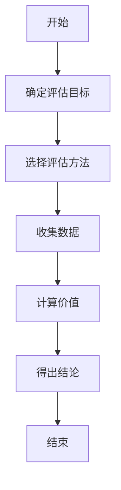
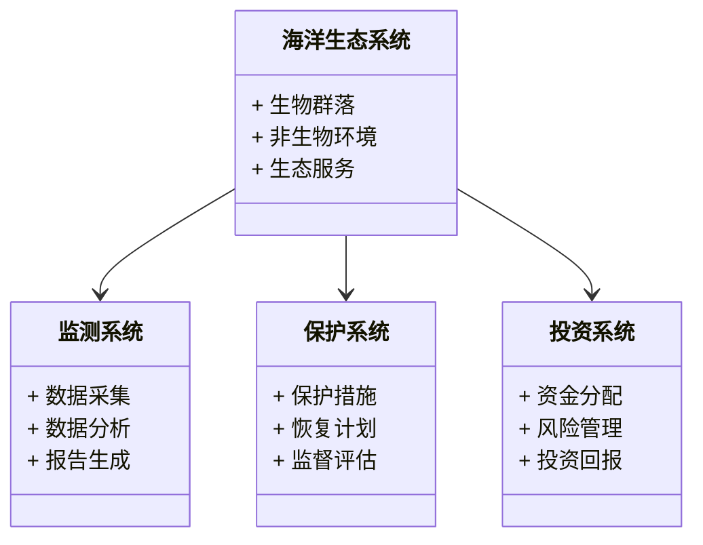
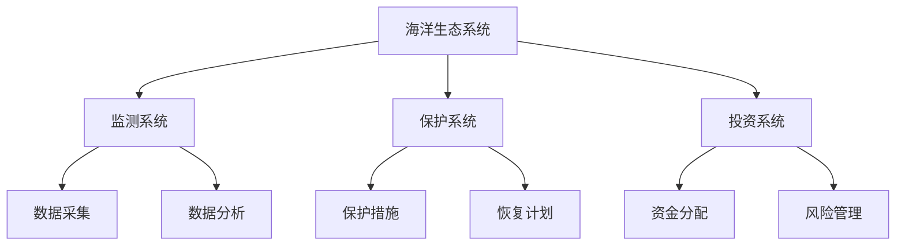

                 


# 《海洋生态系统保护的经济价值与投资策略》

**关键词：** 海洋生态系统、经济价值、投资策略、环境保护、可持续发展、生态系统服务

**摘要：** 本文深入探讨了海洋生态系统在全球经济中的重要价值及其保护策略。通过分析海洋生态系统的经济价值，包括直接价值、间接价值和选择价值，本文提出了科学的投资策略，以实现海洋资源的可持续利用。结合实际案例和数学模型，本文为投资者和政策制定者提供了可行的参考。

---

## 第1章: 海洋生态系统的基本概念与重要性

### 1.1 海洋生态系统的定义与组成

#### 1.1.1 海洋生态系统的定义
海洋生态系统是由海洋生物群落及其所处的非生物环境（如水、底质和光线）共同构成的动态系统。它包括从浅海区域到深海 trenches 的各种生态系统，如珊瑚礁、红树林、海草床和冷水珊瑚等。

#### 1.1.2 海洋生态系统的组成要素
海洋生态系统由以下几个主要部分组成：
- **生物部分：** 包括浮游生物、底栖生物、鱼类、海鸟和海洋哺乳动物等。
- **非生物部分：** 包括水、盐度、温度、光照、营养盐和海底地形等。

#### 1.1.3 海洋生态系统的核心功能
海洋生态系统的核心功能包括：
- **物质循环：** 如碳循环、氮循环等。
- **能量流动：** 通过食物链传递能量。
- **生态服务：** 如调节气候、提供氧气、净化水质等。

---

### 1.2 海洋生态系统的重要性

#### 1.2.1 海洋生态系统在全球生态中的地位
海洋覆盖了地球表面的70%以上，是地球上最大的生态系统。海洋不仅是地球上生命起源的地方，也是全球气候调节的重要组成部分。

#### 1.2.2 海洋生态系统对人类社会的贡献
海洋为人类提供了食物、能源、药品和工业原料。此外，海洋还是重要的交通和通信通道，支持着全球经济的运转。

#### 1.2.3 海洋生态系统面临的威胁与挑战
- **过度捕捞：** 导致鱼类资源枯竭。
- **海洋污染：** 包括塑料污染、石油泄漏和化学污染。
- **栖息地破坏：** 如珊瑚礁的退化和红树林的消失。
- **气候变化：** 海水酸化和海平面上升对海洋生态系统造成威胁。

---

### 1.3 本章小结
本章介绍了海洋生态系统的定义、组成和核心功能，并强调了海洋生态系统在全球生态和人类社会中的重要性。同时，本章也指出了海洋生态系统面临的威胁和挑战，为后续的保护策略奠定了基础。

---

## 第2章: 海洋生态系统经济价值的评估方法

### 2.1 经济价值的定义与分类

#### 2.1.1 经济价值的定义
经济价值是指海洋生态系统在经济活动中所能提供的价值，包括直接和间接的经济贡献。

#### 2.1.2 经济价值的分类
海洋生态系统的经济价值可以分为以下三类：
- **直接价值：** 指人类可以直接利用的资源，如渔业资源、海洋能源和旅游资源。
- **间接价值：** 指海洋生态系统对全球生态系统的支持作用，如调节气候、净化水质等。
- **选择价值：** 指人类对海洋生态系统的未来潜在价值的偏好，如保护濒危物种。

---

### 2.2 海洋生态系统经济价值的评估指标

#### 2.2.1 生物多样性价值
生物多样性是海洋生态系统的重要组成部分，其价值体现在以下几个方面：
- **生态功能：** 生物多样性有助于维持生态系统的稳定性和生产力。
- **科学研究：** 生物多样性为科学研究提供了丰富的资源。
- **旅游价值：** 生物多样性吸引了大量游客，创造了经济价值。

#### 2.2.2 生态服务功能价值
海洋生态系统提供的生态服务包括：
- **碳汇功能：** 海洋是地球上最大的碳汇，通过光合作用吸收大量的二氧化碳。
- **水质净化：** 海洋生态系统通过过滤和分解污染物来净化水质。
- **洪水调节：** 海洋生态系统（如红树林）可以减少洪水和海岸侵蚀的影响。

#### 2.2.3 文化与旅游价值
海洋生态系统在文化和旅游方面具有重要意义：
- **文化价值：** 海洋文化是许多沿海社区的重要组成部分。
- **旅游价值：** 海洋旅游（如潜水、钓鱼和海滨度假）是重要的经济来源。

---

### 2.3 经济价值评估的数学模型

#### 2.3.1 生态系统服务价值计算公式
$$ V = \sum_{i=1}^{n} v_i $$
其中，$V$ 表示生态系统服务的总价值，$v_i$ 表示第 $i$ 项生态服务的价值。

#### 2.3.2 综合经济价值评估流程图


---

### 2.4 本章小结
本章详细介绍了海洋生态系统经济价值的分类和评估方法，并通过数学模型和流程图展示了评估过程。这些方法为后续的投资策略提供了理论基础。

---

## 第3章: 海洋生态系统保护的经济驱动因素

### 3.1 经济驱动因素的分析

#### 3.1.1 市场需求与供给
海洋资源的市场需求包括渔业、能源、旅游和药物开发等。供给方面，海洋生态系统提供了丰富的资源，但过度开发可能导致资源枯竭。

#### 3.1.2 政策支持与法规
政府政策和法规在海洋生态系统保护中起着重要作用。例如，通过设立海洋保护区、限制捕捞和控制污染等措施来保护海洋生态系统。

#### 3.1.3 技术进步与创新
技术创新是保护海洋生态系统的重要手段。例如，使用遥感技术和人工智能来监测海洋环境和评估生态系统的健康状况。

---

### 3.2 投资策略与风险管理

#### 3.2.1 投资策略
- **长期投资：** 通过长期投资来实现海洋资源的可持续利用。
- **风险分散：** 通过多元化投资来降低风险。
- **政策导向：** 关注政策变化，选择符合政策支持的项目。

#### 3.2.2 风险管理
- **环境风险：** 由于海洋污染和气候变化等因素可能导致投资失败。
- **市场风险：** 由于市场需求变化可能导致投资亏损。
- **政策风险：** 由于政策变化可能导致投资损失。

---

### 3.3 本章小结
本章分析了海洋生态系统保护的经济驱动因素，并提出了科学的投资策略和风险管理方法，为投资者提供了参考。

---

## 第4章: 海洋生态系统保护的系统分析与架构设计

### 4.1 系统分析

#### 4.1.1 项目背景
海洋生态系统保护是一个复杂的系统工程，涉及多个利益相关者，包括政府、企业和社区。

#### 4.1.2 系统功能设计
- **监测与评估：** 监测海洋生态系统的健康状况，并评估其经济价值。
- **保护与恢复：** 通过保护措施恢复受损的海洋生态系统。
- **教育与宣传：** 提高公众对海洋生态系统保护的意识。

---

### 4.2 系统架构设计

#### 4.2.1 领域模型（mermaid 类图）


#### 4.2.2 系统架构图


---

### 4.3 本章小结
本章通过系统分析和架构设计，为海洋生态系统保护提供了理论支持和实践指导。

---

## 第5章: 项目实战与案例分析

### 5.1 项目实战

#### 5.1.1 环境安装
为了进行海洋生态系统保护的经济价值评估，需要安装以下工具：
- 数据采集工具：如卫星遥感和水质监测设备。
- 数据分析工具：如Python和R语言。
- 报告生成工具：如Word和Excel。

#### 5.1.2 核心实现
以下是一个简单的Python代码示例，用于计算海洋生态系统的经济价值：

```python
# 计算生态系统服务的总价值
def calculate_value(service_values):
    total_value = sum(service_values)
    return total_value

# 示例数据
service_values = [100, 200, 300, 400, 500]
total_value = calculate_value(service_values)
print(f"生态系统服务的总价值为：{total_value}")
```

---

### 5.2 案例分析

#### 5.2.1 案例背景
假设某国家计划保护其沿海红树林生态系统，以提供生态服务价值。

#### 5.2.2 数据分析
通过数据采集和分析，计算红树林的生态服务价值，包括碳汇、水质净化和旅游价值。

#### 5.2.3 投资回报
通过投资保护红树林，可以减少洪水损失，提高旅游收入，从而实现投资回报。

---

### 5.3 本章小结
本章通过项目实战和案例分析，展示了如何将理论应用于实际，为海洋生态系统保护提供了具体的指导。

---

## 第6章: 总结与展望

### 6.1 本章总结
本文详细探讨了海洋生态系统保护的经济价值与投资策略，通过理论分析和案例实践，为投资者和政策制定者提供了参考。

### 6.2 未来展望
未来的研究可以进一步探讨海洋生态系统保护的长期影响和全球气候变化的互动关系，同时探索更多创新的投资策略。

---

## 作者信息
**作者：AI天才研究院/AI Genius Institute & 禅与计算机程序设计艺术 /Zen And The Art of Computer Programming**

