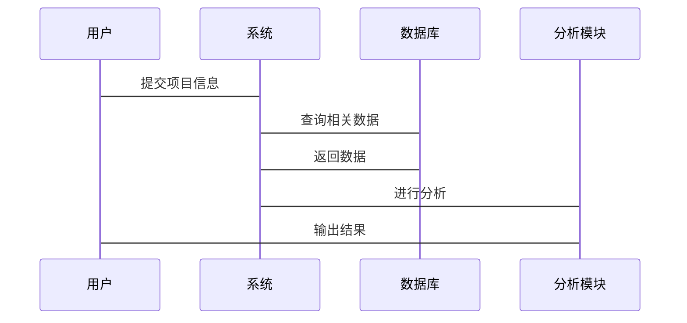

                 


# 海洋经济开发中的投资机会分析

## 关键词：海洋经济，投资机会，经济开发，可持续发展，风险管理

## 摘要：海洋经济开发作为一项重要的经济活动，具有巨大的潜力和挑战。本文从海洋经济的定义和特点入手，分析当前海洋经济开发的现状与趋势，探讨投资机会分析的核心概念与方法。通过建立数学模型和分析算法，评估海洋经济开发中的投资机会，并提供实际案例分析和最佳实践，为投资者提供科学的决策依据。

---

## 第1章: 海洋经济开发的背景与现状

### 1.1 海洋经济的定义与特点

#### 1.1.1 海洋经济的定义
海洋经济是指利用海洋资源进行生产、服务和贸易的经济活动，涵盖渔业、航运、能源、旅游等多个领域。

#### 1.1.2 海洋经济的核心特点
- **资源丰富性**：海洋蕴藏着丰富的资源，如石油、天然气、渔业资源等。
- **可持续性**：海洋经济的发展需要平衡资源利用与环境保护。
- **区域差异性**：不同地区的海洋经济发展水平差异显著。

#### 1.1.3 海洋经济与可持续发展的关系
海洋经济的发展必须遵循可持续原则，避免过度开发和环境污染，实现经济与环境的协调发展。

### 1.2 海洋经济开发的现状与趋势

#### 1.2.1 全球海洋经济开发的现状
全球海洋经济规模庞大，涵盖渔业、航运、能源等领域，但发展水平不均衡。

#### 1.2.2 中国海洋经济开发的现状
中国海洋经济快速发展，成为全球海洋经济的重要力量，但仍面临资源利用效率低、环境保护压力大等问题。

#### 1.2.3 海洋经济开发的未来趋势
海洋经济将向绿色化、智能化方向发展，注重生态保护和高效利用。

### 1.3 海洋经济开发中的问题与挑战

#### 1.3.1 资源利用效率低的问题
部分海洋资源未得到充分利用，开发效率有待提高。

#### 1.3.2 环境保护的压力
海洋污染、生态破坏等问题严重，制约了可持续发展。

#### 1.3.3 投资风险与不确定性
海洋经济开发涉及高风险，如自然灾害、政策变化等，增加了投资的不确定性。

---

## 第2章: 投资机会分析的核心概念与方法

### 2.1 投资机会分析的定义与框架

#### 2.1.1 投资机会分析的定义
投资机会分析是对潜在投资项目进行评估，判断其可行性和盈利能力的过程。

#### 2.1.2 投资机会分析的框架与流程
- **问题背景**：明确投资目标和范围。
- **数据收集**：收集相关经济、市场、技术数据。
- **分析与评估**：利用模型和方法进行评估。
- **决策与优化**：根据评估结果做出决策并优化方案。

### 2.2 海洋经济开发中的投资机会分析模型

#### 2.2.1 投资机会分析的关键要素
- **市场需求**：目标市场的规模和增长潜力。
- **竞争分析**：竞争对手的市场份额和策略。
- **资源与成本**：项目的资源 availability 和成本结构。

#### 2.2.2 投资机会分析的层次结构
- **顶层**：战略层面，确定投资方向。
- **中层**：战术层面，评估具体项目。
- **底层**：操作层面，实施和监控。

#### 2.2.3 投资机会分析的数学模型
- **加权评分模型**：$$\text{总评分} = \sum (\text{权重} \times \text{评分})$$
- **净现值（NPV）**：$$\text{NPV} = \sum \frac{\text{现金流}}{(1 + r)^t} - \text{初始投资}$$

### 2.3 投资机会分析的核心方法

#### 2.3.1 财务分析方法
- **净现值法**：评估项目的财务可行性。
- **内部收益率法**：衡量项目的盈利能力。

#### 2.3.2 市场分析方法
- **SWOT分析**：分析项目的优势、劣势、机会和威胁。
- **PEST分析**：分析宏观环境因素（政治、经济、社会、技术）。

#### 2.3.3 风险评估方法
- **风险矩阵法**：根据风险概率和影响程度进行分类。
- **蒙特卡洛模拟**：评估项目风险的分布情况。

---

## 第3章: 海洋经济开发中的投资机会评估

### 3.1 海洋资源的评估与分析

#### 3.1.1 海洋资源的分类与特点
- **可再生资源**：如渔业资源、滨海旅游。
- **不可再生资源**：如石油、天然气。

#### 3.1.2 海洋资源的经济价值评估
- **直接价值**：资源本身的经济价值。
- **间接价值**：生态系统服务价值。

#### 3.1.3 资源利用的可持续性分析
- **可持续利用**：确保资源的长期供应。
- **过度开发**：避免资源枯竭。

### 3.2 投资项目的可行性分析

#### 3.2.1 项目可行性分析的步骤
1. 明确目标。
2. 收集数据。
3. 分析评估。
4. 制定决策。

#### 3.2.2 项目可行性分析的关键指标
- **回收期**：$$\text{回收期} = \frac{\text{初始投资}}{\text{年现金流}}$$
- **投资回报率（ROI）**：$$\text{ROI} = \frac{\text{净利润}}{\text{初始投资}} \times 100\%$$

#### 3.2.3 项目可行性分析的案例研究
- **案例**：某海洋能源项目，分析其经济、技术和环境可行性。

### 3.3 投资风险与风险管理

#### 3.3.1 投资风险的分类与特征
- **市场风险**：市场需求变化带来的风险。
- **环境风险**：政策和法规变化的影响。

#### 3.3.2 投资风险的评估方法
- **风险矩阵法**：根据风险概率和影响程度分类。
- **情景分析法**：模拟不同情景下的风险影响。

#### 3.3.3 风险管理的策略与措施
- **风险规避**：避免高风险项目。
- **风险转移**：通过保险或合同转移风险。
- **风险缓解**：采取措施降低风险影响。

---

## 第4章: 海洋经济开发中的投资机会分析模型

### 4.1 投资机会分析的层次分析模型

#### 4.1.1 层次分析法的基本原理
层次分析法（AHP）是一种定性和定量相结合的决策分析方法，适用于多目标决策问题。

#### 4.1.2 层次分析法在投资机会分析中的应用
- **步骤**：构建层次结构、确定权重、计算一致性检验。
- **应用**：评估不同投资项目的综合优势。

#### 4.1.3 层次分析法的优缺点
- **优点**：简单直观，适用于复杂问题。
- **缺点**：依赖专家判断，可能存在主观性。

### 4.2 投资机会分析的数学模型

#### 4.2.1 投资机会评分模型
$$\text{总评分} = \sum (\text{权重}_i \times \text{评分}_i)$$

#### 4.2.2 投资回报率预测模型
$$\text{ROI} = \frac{\text{净利润}}{\text{初始投资}} \times 100\%$$

#### 4.2.3 投资风险评估模型
$$\text{风险评分} = \text{概率} \times \text{影响程度}$$

### 4.3 投资机会分析的算法实现

#### 4.3.1 算法原理
层次分析法通过构建层次结构，计算各因素的权重，最终确定最优方案。

#### 4.3.2 Python代码实现
```python
import numpy as np

# 定义层次分析法函数
def ahp分析(准则权重, 项目评分):
    总评分 = np.dot(准则权重, 项目评分)
    return 总评分

# 示例数据
准则权重 = np.array([0.4, 0.3, 0.3])
项目评分 = np.array([0.8, 0.6, 0.9])
结果 = ahp分析(准则权重, 项目评分)
print("总评分:", 结果)
```

---

## 第5章: 系统分析与架构设计方案

### 5.1 问题场景介绍
海洋经济开发涉及多个领域，需要建立一个综合的分析系统，帮助投资者做出科学决策。

### 5.2 系统功能设计

#### 5.2.1 领域模型


#### 5.2.2 系统架构设计


#### 5.2.3 系统接口设计
- **输入接口**：用户输入项目信息。
- **输出接口**：系统输出分析结果。

### 5.3 系统交互设计


---

## 第6章: 项目实战

### 6.1 环境安装
安装Python、NumPy、Matplotlib等工具，配置开发环境。

### 6.2 系统核心实现源代码
```python
import numpy as np

def 计算NPV(现金流, 初始投资, 折现率):
    npv = 0
    for t in range(len(现金流)):
        npv += 现金流[t] / (1 + 折现率) ** t
    npv -= 初始投资
    return npv

现金流 = [100, 200, 300]
初始投资 = 500
折现率 = 0.1
结果 = 计算NPV(现金流, 初始投资, 折现率)
print("净现值:", 结果)
```

### 6.3 代码应用解读与分析
计算NPV函数用于评估项目的财务可行性，结果为正则项目可行。

### 6.4 实际案例分析
以某海洋能源项目为例，分析其NPV、ROI等指标，评估投资可行性。

### 6.5 项目小结
通过案例分析，验证模型的有效性，总结经验教训。

---

## 第7章: 最佳实践、小结与展望

### 7.1 最佳实践
- **数据收集**：确保数据的准确性和完整性。
- **模型选择**：根据实际情况选择合适的分析方法。
- **风险管理**：制定有效的风险管理策略。

### 7.2 小结
本文系统地分析了海洋经济开发中的投资机会，提出了多种分析方法和模型，为投资者提供了科学的决策依据。

### 7.3 展望
未来，随着技术进步和政策支持，海洋经济开发将更加智能化和可持续化。

---

## 作者：AI天才研究院/AI Genius Institute & 禅与计算机程序设计艺术 /Zen And The Art of Computer Programming

