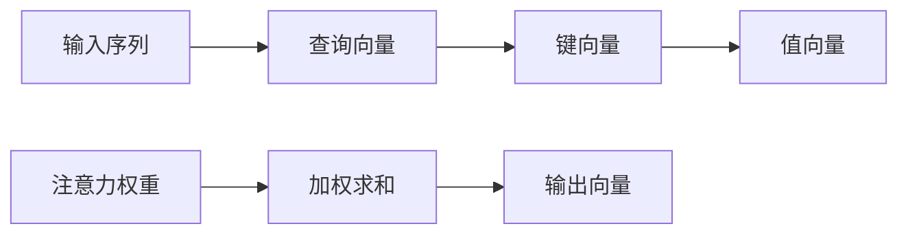
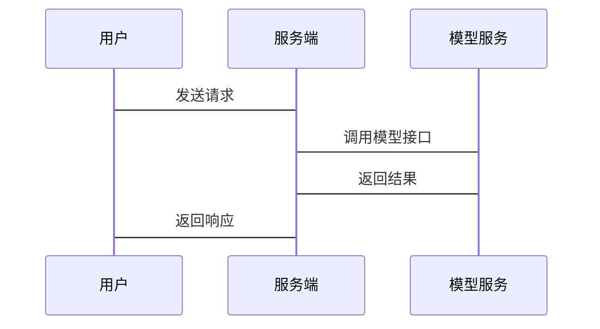

                 


```markdown
# 深入理解LLM大模型：从GPT到企业级应用

## 关键词
大语言模型, LLM, GPT, 企业级应用, 人工智能, 深度学习, 自然语言处理

## 摘要
本文深入探讨了大语言模型（LLM）的核心原理、算法实现、系统架构以及在企业级应用中的实践。从GPT模型的背景出发，详细分析了LLM的数学基础、模型架构、训练优化技术，以及在企业级应用中的系统设计和实际案例。本文旨在帮助读者全面理解LLM的技术细节，并为企业级应用的落地提供实用的指导和建议。

---

## 第三章: LLM的核心算法解析

### 3.1 Transformer模型的算法流程

#### 3.1.1 输入处理与嵌入层
输入的文本首先需要进行分词和嵌入编码。文本通过词嵌入层转换为向量表示，然后输入到编码器中。

#### 3.1.2 自注意力机制的实现
自注意力机制通过计算输入序列中每个位置的注意力权重，生成上下文相关的表示。



#### 3.1.3 前向网络的传递
编码器通过多层前向网络对输入进行处理，生成最终的编码表示。

### 3.2 注意力机制的数学公式

#### 3.2.1 自注意力机制的公式推导
自注意力机制的计算公式如下：

$$
\text{Attention}(Q, K, V) = \text{softmax}\left(\frac{QK^T}{\sqrt{d_k}}\right)V
$$

其中，$Q$、$K$、$V$分别是查询、键和值向量，$d_k$是向量的维度。

#### 3.2.2 多头注意力机制的实现
多头注意力机制将输入分成多个子空间进行独立计算，最后将结果拼接起来。

### 3.3 模型训练的数学模型

#### 3.3.1 损失函数的定义
常用的损失函数是交叉熵损失函数：

$$
\text{Loss} = -\sum_{i=1}^{N} \text{log}(p(y_i|x_i))
$$

其中，$p(y_i|x_i)$是模型对标签的概率预测。

#### 3.3.2 优化算法的选择
常用的优化算法包括随机梯度下降（SGD）和Adam优化器。

#### 3.3.3 模型评估的指标
常用的评估指标包括准确率、F1分数和困惑度（Perplexity）。

### 3.4 本章小结
本章详细解析了LLM的核心算法，包括Transformer模型的算法流程、注意力机制的数学公式以及模型训练的数学模型。通过这些分析，读者可以理解LLM的内部工作机制。

---

## 第四章: 企业级LLM系统的架构设计

### 4.1 企业级应用的核心需求

#### 4.1.1 高可用性与稳定性
企业级应用需要确保系统的高可用性和稳定性，避免因故障导致的服务中断。

#### 4.1.2 高扩展性与灵活性
系统需要支持大规模数据处理和高并发请求，同时能够灵活适应业务需求的变化。

#### 4.1.3 安全性与隐私保护
企业级应用需要严格的数据安全和隐私保护措施，确保数据不被泄露或篡改。

### 4.2 LLM系统的架构设计

#### 4.2.1 分层架构的设计
分层架构将系统划分为多个层次，每一层负责不同的功能模块，如数据层、计算层和应用层。

#### 4.2.2 微服务架构的应用
微服务架构将系统功能模块化，每个服务独立运行，便于管理和扩展。

#### 4.2.3 模型服务的部署
模型服务可以通过容器化技术（如Docker）进行部署，确保系统的稳定性和可扩展性。

### 4.3 系统接口设计与交互流程

#### 4.3.1 API接口的设计规范
API接口需要遵循RESTful规范，确保前后端通信的高效和可靠。

#### 4.3.2 请求与响应的协议
常用的协议包括HTTP和WebSocket，支持长连接和实时通信。

#### 4.3.3 系统交互的流程图
以下是系统交互的流程图：



### 4.4 本章小结
本章详细探讨了企业级LLM系统的架构设计，包括分层架构、微服务架构以及系统接口设计。通过这些设计，可以确保系统的高可用性、扩展性和安全性。

---

## 第五章: 企业级LLM系统的实现

### 5.1 环境搭建与配置

#### 5.1.1 开发环境的选择
推荐使用Python 3.8及以上版本，安装必要的库如TensorFlow、PyTorch等。

#### 5.1.2 模型框架的安装
安装主流的深度学习框架，如TensorFlow或PyTorch。

#### 5.1.3 依赖管理工具的使用
使用pip或conda管理依赖包，确保环境一致性。

### 5.2 系统核心实现源代码

#### 5.2.1 模型训练代码
以下是一个简单的模型训练代码示例：

```python
import tensorflow as tf
from tensorflow.keras import layers

# 定义模型
model = tf.keras.Sequential([
    layers.Embedding(input_dim=10000, output_dim=16),
    layers.SpatialDropout1D(0.2),
    layers.Bidirectional(layers.LSTM(64, return_sequences=True)),
    layers.GlobalMaxPool1D(),
    layers.Dense(1, activation='sigmoid')
])

# 编译模型
model.compile(optimizer='adam', loss='binary_crossentropy', metrics=['accuracy'])

# 训练模型
model.fit(X_train, y_train, epochs=10, batch_size=32)
```

#### 5.2.2 接口服务代码
以下是一个简单的API接口代码示例：

```python
from flask import Flask, request, jsonify

app = Flask(__name__)

@app.route('/predict', methods=['POST'])
def predict():
    data = request.json
    text = data['text']
    # 调用模型进行预测
    result = model.predict(text)
    return jsonify({'result': result})

if __name__ == '__main__':
    app.run(debug=True)
```

### 5.3 代码应用解读与分析

#### 5.3.1 模型训练代码解读
上述训练代码使用了Keras构建了一个简单的文本分类模型，包括嵌入层、双向LSTM和全连接层。训练过程中使用了Adam优化器和二进制交叉熵损失函数。

#### 5.3.2 接口服务代码解读
上述接口代码使用了Flask框架搭建了一个简单的API服务，接收文本输入并返回模型预测结果。

### 5.4 实际案例分析

#### 5.4.1 案例背景
假设我们正在为一家电商公司开发一个智能客服系统，需要实现自动回复客户问题的功能。

#### 5.4.2 案例实现
通过训练一个基于LLM的模型，实现对客户问题的自动理解和生成回复。

### 5.5 本章小结
本章通过具体的代码实现和案例分析，展示了如何将LLM技术应用于企业级应用中。通过实际操作，读者可以更好地理解LLM的实现细节和应用场景。

---

## 第六章: 未来展望与最佳实践

### 6.1 未来技术趋势

#### 6.1.1 多模态模型的发展
未来的LLM将更加注重多模态能力，支持图像、视频等多种数据类型的处理。

#### 6.1.2 更高效的训练方法
研究人员将致力于开发更高效的训练算法，降低计算成本和时间。

#### 6.1.3 更强的推理能力
未来的LLM将具备更强的推理能力，能够更好地理解和解决复杂问题。

### 6.2 最佳实践 tips

#### 6.2.1 数据隐私保护
在处理企业数据时，务必注意数据隐私保护，避免数据泄露。

#### 6.2.2 模型调优技巧
通过超参数调优和模型剪枝等技术，可以进一步提升模型的性能和效率。

#### 6.2.3 系统性能优化
优化系统架构和部署策略，可以提升系统的整体性能和稳定性。

### 6.3 小结
本章展望了LLM技术的未来发展趋势，并提供了一些实用的最佳实践建议。通过这些内容，读者可以更好地把握LLM技术的发展方向和实际应用中的注意事项。

---

## 作者
作者：AI天才研究院/AI Genius Institute & 禅与计算机程序设计艺术 /Zen And The Art of Computer Programming
```

