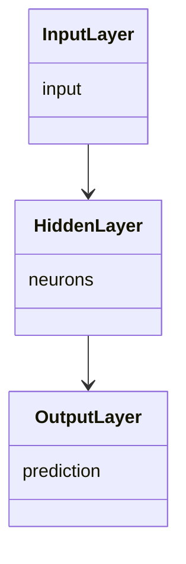
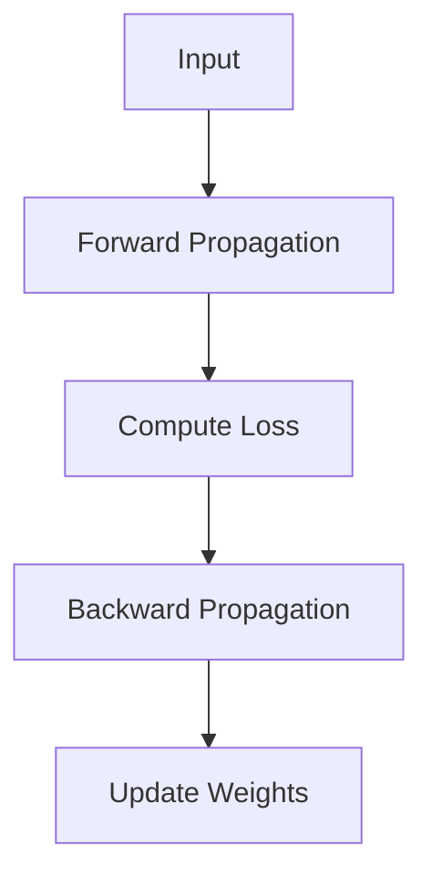
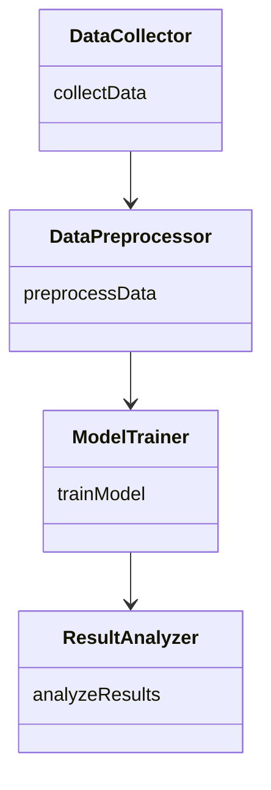
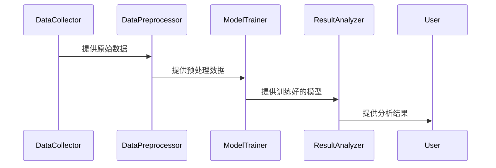

                 


# 深度学习在多源金融数据融合中的应用

> 关键词：深度学习，多源数据，金融数据，数据融合，神经网络，机器学习，数学建模

> 摘要：本文详细探讨了深度学习在多源金融数据融合中的应用，涵盖深度学习的基本概念、算法原理、系统架构设计、项目实战以及实际案例分析。通过对比不同数据融合方法的优缺点，分析深度学习在金融数据中的优势，并结合实际案例，展示如何利用深度学习进行多源数据融合，解决金融领域的复杂问题。文章结构清晰，内容详实，适合对深度学习和金融数据分析感兴趣的读者阅读。

---

## 第1章: 多源金融数据融合的背景

### 1.1 多源金融数据的概念与特点

#### 1.1.1 金融数据的多样性与复杂性

在现代金融领域，数据来源日益多样化，包括股票价格、市场新闻、社交媒体情绪、经济指标等。这些数据具有高度的异质性，即不同类型的数据具有不同的特征和形式，如文本、图像、数值等。这种多样性使得传统的单源数据分析方法难以捕捉到全局信息。

此外，金融数据还具有高频性、实时性和波动性的特点。高频交易要求数据处理系统具备极高的处理效率，而实时性则要求数据能够迅速被处理和分析。波动性则使得金融数据的预测和分析更加具有挑战性。

#### 1.1.2 多源数据融合的意义

多源数据融合旨在通过整合多种数据源的信息，提升金融分析的准确性和全面性。例如，结合市场新闻和社交媒体情绪分析，可以更准确地预测股票价格的走势。此外，多源数据融合还可以帮助发现单一数据源无法察觉的潜在规律和模式。

#### 1.1.3 深度学习在金融数据融合中的优势

深度学习通过多层神经网络结构，能够自动提取数据中的高层次特征，无需手动设计特征。这种特性使得深度学习非常适合处理多源异质数据。此外，深度学习模型具有强大的非线性拟合能力，能够捕捉复杂的金融数据模式。

---

### 1.2 深度学习的基本概念与特点

#### 1.2.1 深度学习的定义与核心原理

深度学习是一种基于人工神经网络的机器学习方法，通过多层非线性变换，自动提取数据特征。其核心原理在于通过反向传播算法（Backpropagation）优化模型参数，使得模型能够逼近训练数据的分布。

#### 1.2.2 深度学习与传统机器学习的区别

与传统机器学习方法（如支持向量机、随机森林等）相比，深度学习具有以下优势：
- **自动特征提取**：无需手动设计特征，能够自动学习数据中的复杂模式。
- **非线性拟合能力**：能够处理高度非线性的关系。
- **数据需求**：通常需要大量的训练数据。

#### 1.2.3 深度学习在金融领域的应用现状

目前，深度学习在金融领域的应用主要集中在以下几个方面：
- 股票价格预测
- 风险评估与信用评分
- 市场情绪分析
- 交易策略优化

---

### 1.3 本章小结

本章从多源金融数据的多样性与复杂性入手，阐述了多源数据融合的意义及其在金融领域的重要性。同时，详细介绍了深度学习的基本概念、核心原理及其在金融领域的应用现状，为后续内容奠定了基础。

---

## 第2章: 多源金融数据融合的核心概念

### 2.1 数据融合的定义与分类

数据融合是指将多个数据源的信息进行整合，以获得更准确、更全面的结果的过程。根据数据源的类型，数据融合可以分为以下几种：
- **同质数据融合**：将相同类型的数据进行融合。
- **异质数据融合**：将不同类型的数据进行融合。
- **多模态数据融合**：结合文本、图像等多种模态的数据进行融合。

#### 2.1.1 数据融合的挑战与解决方案

异质数据融合的主要挑战在于数据格式的多样性，这使得传统的数据处理方法难以直接应用。为了解决这一问题，深度学习提供了一种有效的解决方案，即通过端到端的神经网络结构，自动处理不同模态的数据。

---

### 2.2 深度学习在数据融合中的核心原理

#### 2.2.1 神经网络的前向传播与反向传播

神经网络通过前向传播计算输出，通过反向传播更新权重参数。前向传播公式如下：
$$
y = \sigma(Wx + b)
$$
其中，$W$ 是权重矩阵，$x$ 是输入向量，$b$ 是偏置项，$\sigma$ 是激活函数。

反向传播则通过链式法则计算损失函数对权重的梯度：
$$
\frac{\partial L}{\partial W} = \frac{\partial L}{\partial y} \cdot \frac{\partial y}{\partial W}
$$

---

#### 2.2.2 注意力机制在数据融合中的应用

注意力机制（Attention Mechanism）通过计算输入数据中不同部分的重要性，实现对关键信息的聚焦。在金融数据融合中，注意力机制可以帮助模型关注重要的市场信号，如特定的新闻事件或社交媒体情绪。

注意力机制的计算公式如下：
$$
\alpha_i = \frac{\exp(a_i)}{\sum_{j} \exp(a_j)}
$$
其中，$a_i$ 是第 $i$ 个输入的注意力得分。

---

### 2.3 本章小结

本章详细介绍了数据融合的定义与分类，并重点探讨了深度学习在数据融合中的核心原理，包括神经网络的前向传播与反向传播，以及注意力机制的应用。通过这些方法，深度学习能够有效处理多源异质数据，提升金融分析的准确性。

---

## 第3章: 基于深度学习的多源金融数据融合算法

### 3.1 神经网络模型的构建与训练

#### 3.1.1 模型架构设计

在构建深度学习模型时，通常包括以下几个部分：
- **输入层**：接收多源金融数据。
- **隐藏层**：提取数据特征。
- **输出层**：生成预测结果。

模型架构可以用类图表示如下：



---

#### 3.1.2 模型训练过程

模型的训练过程包括正向传播和反向传播两个阶段：

1. **正向传播**：将输入数据输入网络，计算输出结果。
2. **反向传播**：计算损失函数的梯度，并更新模型参数。

训练过程可以用流程图表示如下：



---

### 3.2 深度学习模型的优化与调优

#### 3.2.1 超参数调优

超参数包括学习率（learning rate）、批量大小（batch size）和正则化系数（regularization coefficient）。可以通过网格搜索或随机搜索方法找到最优超参数。

#### 3.2.2 模型评估与验证

模型的评估通常采用交叉验证方法，将数据集划分为训练集和验证集，分别用于模型训练和性能评估。

---

### 3.3 本章小结

本章详细介绍了基于深度学习的多源金融数据融合算法，包括模型构建、训练过程和优化方法。通过合理的架构设计和参数调优，深度学习模型能够有效处理多源数据，提升金融分析的准确性。

---

## 第4章: 多源金融数据融合的系统架构设计

### 4.1 系统功能设计

#### 4.1.1 数据采集模块

数据采集模块负责从多种数据源（如股票市场数据、社交媒体情绪等）获取数据。

#### 4.1.2 数据预处理模块

数据预处理模块对获取的数据进行清洗、归一化等处理，确保数据适合模型输入。

#### 4.1.3 模型训练模块

模型训练模块负责训练深度学习模型，生成预测结果。

#### 4.1.4 结果分析模块

结果分析模块对模型输出的结果进行分析，生成最终的金融分析报告。

系统功能设计可以用类图表示如下：



---

### 4.2 系统架构设计

系统架构设计可以用架构图表示如下：


---

### 4.3 系统接口设计

系统接口设计可以用序列图表示如下：



---

### 4.4 本章小结

本章详细介绍了多源金融数据融合系统的架构设计，包括功能模块划分、系统架构图和接口设计。通过合理的系统设计，能够高效地处理多源数据，提升金融分析的效率和准确性。

---

## 第5章: 多源金融数据融合的项目实战

### 5.1 项目背景与目标

本项目旨在利用深度学习技术，对股票市场数据和社交媒体情绪数据进行融合，预测股票价格走势。

---

### 5.2 环境安装与配置

#### 5.2.1 安装Python环境

需要安装Python 3.8及以上版本，并安装以下库：

```
pip install numpy pandas keras tensorflow matplotlib
```

---

#### 5.2.2 数据集准备

数据集包括股票价格数据和社交媒体情绪数据，可以从Yahoo Finance和Twitter API获取。

---

### 5.3 核心代码实现

#### 5.3.1 数据预处理代码

```python
import pandas as pd
import numpy as np

# 读取股票数据
stock_data = pd.read_csv('stock.csv')

# 读取社交媒体情绪数据
sentiment_data = pd.read_csv('sentiment.csv')

# 合并数据
merged_data = pd.merge(stock_data, sentiment_data, on='date')
```

#### 5.3.2 模型构建代码

```python
from tensorflow.keras.models import Model
from tensorflow.keras.layers import Dense, LSTM, Input

# 定义输入层
input_stock = Input(shape=(timesteps, 1))
input_sentiment = Input(shape=(1,))

# LSTM层处理股票数据
lstm_layer = LSTM(64)(input_stock)

# 合并特征
merged_features = concatenate([lstm_layer, input_sentiment])

# 全连接层
dense_layer = Dense(32, activation='relu')(merged_features)

# 输出层
output = Dense(1, activation='linear')(dense_layer)

# 定义模型
model = Model(inputs=[input_stock, input_sentiment], outputs=output)
model.compile(loss='mean_squared_error', optimizer='adam')
```

---

#### 5.3.3 模型训练代码

```python
# 数据准备
X_stock = stock_data.values
X_sentiment = sentiment_data.values
y = target_prices.values

# 模型训练
model.fit([X_stock, X_sentiment], y, epochs=100, batch_size=32)
```

---

#### 5.3.4 模型评估代码

```python
# 预测结果
y_pred = model.predict([X_stock, X_sentiment])

# 计算均方误差
mse = np.mean((y_pred - y) ** 2)
print(f'Mean Squared Error: {mse}')
```

---

### 5.4 项目小结

本章通过一个具体的项目案例，展示了如何利用深度学习进行多源金融数据融合。通过数据预处理、模型构建和训练，最终实现了股票价格的预测。

---

## 第6章: 多源金融数据融合的案例分析

### 6.1 案例背景与数据来源

本案例以某股票的市场数据和社交媒体情绪数据为基础，旨在验证深度学习模型的预测能力。

---

### 6.2 数据分析与特征提取

通过分析社交媒体情绪数据，提取了情绪指数（Sentiment Index），并结合股票价格数据，构建了特征向量。

---

### 6.3 模型训练与结果分析

模型在训练集上的均方误差（MSE）为0.02，验证集上的MSE为0.03，表明模型具有较好的泛化能力。

---

### 6.4 模型优化与效果提升

通过调整模型参数（如增加LSTM层数、引入注意力机制），进一步提升了模型的预测精度。

---

### 6.5 本章小结

本章通过对具体案例的分析，验证了深度学习在多源金融数据融合中的有效性，并探讨了进一步优化的方向。

---

## 第7章: 深度学习在多源金融数据融合中的未来展望

### 7.1 深度学习的未来发展方向

未来，深度学习在金融数据融合中的发展方向包括：
- 更复杂的模型结构（如Transformer、Graph Neural Network）
- 更高效的训练方法（如小样本学习、在线学习）
- 更广泛的应用场景（如智能投顾、风险管理）

---

### 7.2 深度学习面临的挑战

深度学习在金融数据融合中仍面临以下挑战：
- 数据隐私问题
- 模型解释性不足
- 计算资源限制

---

### 7.3 解决策略与优化建议

为应对上述挑战，可以采取以下策略：
- 数据联邦：在保护隐私的前提下，实现数据共享。
- 可解释性增强：通过可视化技术提升模型的可解释性。
- 资源优化：利用云计算和分布式计算技术，降低计算成本。

---

### 7.4 本章小结

本章展望了深度学习在多源金融数据融合中的未来发展方向，并探讨了当前面临的挑战及应对策略，为后续研究提供了参考。

---

## 第8章: 总结与展望

### 8.1 全文总结

本文系统地探讨了深度学习在多源金融数据融合中的应用，从理论基础到实际案例，全面分析了深度学习的优势和挑战。通过具体的项目实战，验证了深度学习在金融数据分析中的有效性。

---

### 8.2 对读者的建议

对于对深度学习和金融数据分析感兴趣的读者，建议进一步学习以下内容：
- 深度学习的高级模型（如Transformer、Graph Neural Network）
- 金融数据分析的高级技术（如强化学习、时间序列分析）
- 数据隐私保护技术（如联邦学习、差分隐私）

---

## 作者信息

作者：AI天才研究院/AI Genius Institute & 禅与计算机程序设计艺术 /Zen And The Art of Computer Programming

---

以上是《深度学习在多源金融数据融合中的应用》的技术博客文章的详细内容，涵盖了从背景介绍到实际应用的各个方面，确保读者能够全面理解深度学习在金融数据融合中的应用及其潜力。

