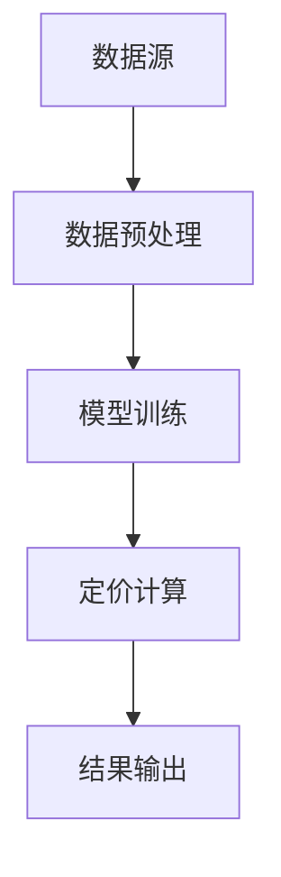
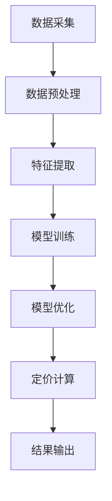

                 


# 深度学习在期权定价模型中的创新

## 关键词：
- 深度学习、期权定价、时间序列预测、LSTM、神经网络

## 摘要：
本文深入探讨了深度学习技术在期权定价中的创新应用。通过分析传统期权定价模型的局限性，结合深度学习的先进算法，提出了一种基于LSTM的期权价格预测模型，展示了其在复杂金融市场中的优势和实际应用价值。

---

# 第1章: 期权定价与深度学习的背景介绍

## 1.1 期权定价的基本概念

### 1.1.1 期权的基本定义与分类

期权是一种金融衍生品，赋予持有者在特定时间内以预定价格买入或卖出标的资产的权利。期权分为看涨期权（Call Option）和看跌期权（Put Option）两种类型。

### 1.1.2 期权定价的核心问题与挑战

传统期权定价模型，如Black-Scholes公式，基于假设条件，但在实际市场中，波动率和利率等参数的变化使得模型难以准确捕捉价格波动。

### 1.1.3 传统期权定价模型的局限性

1. **假设条件严格**：如无股息、波动率恒定等。
2. **难以处理复杂性**：如跳跃过程、非线性关系等。
3. **计算复杂**：高维参数和实时计算需求带来挑战。

## 1.2 深度学习的基本概念与特点

### 1.2.1 深度学习的定义与核心原理

深度学习是机器学习的一种，通过多层神经网络模拟人脑对数据的处理。其核心在于非线性特征提取和端到端学习能力。

### 1.2.2 深度学习与传统机器学习的区别

- **数据需求**：深度学习需要大量数据，传统方法数据需求较低。
- **特征工程**：深度学习自动提取特征，传统方法需要人工特征提取。
- **计算资源**：深度学习需要高性能计算资源。

### 1.2.3 深度学习在金融领域的应用潜力

- **非线性关系建模**：捕捉传统模型难以处理的市场动态。
- **实时预测**：适用于高频交易和实时定价。

---

# 第2章: 深度学习与期权定价的核心概念

## 2.1 深度学习在时间序列预测中的优势

### 2.1.1 时间序列预测的基本原理

时间序列预测通过分析过去数据，预测未来趋势。传统方法包括ARIMA，而深度学习提供了更强大的非线性建模能力。

### 2.1.2 深度学习在时间序列预测中的独特优势

- **捕捉复杂模式**：如季节性、周期性波动。
- **自动特征提取**：无需手动特征工程。
- **适应性高**：能处理数据分布的变化。

## 2.2 期权定价模型的数学基础

### 2.2.1 Black-Scholes模型的数学公式

$$ S_0 e^{\sigma t} N(d_1) - K e^{-r t} N(d_2) $$

其中：
- \( S_0 \)：标的资产价格
- \( K \)：执行价格
- \( r \)：无风险利率
- \( \sigma \)：波动率
- \( t \)：时间
- \( N(d) \)：标准正态分布函数

### 2.2.2 时间序列预测的数学模型

$$ y_t = \beta_1 y_{t-1} + \beta_2 y_{t-2} + \epsilon_t $$

这是一个简单的线性回归模型，用于预测未来价格。

## 2.3 深度学习与期权定价的结合点

### 2.3.1 深度学习用于期权价格预测的可行性

- **数据驱动**：利用历史价格和市场数据，预测未来期权价格。
- **实时更新**：根据市场变化，动态调整模型参数。

### 2.3.2 深度学习在期权定价中的创新应用

- **复杂模型构建**：利用深度神经网络捕捉市场非线性动态。
- **定制化模型**：根据不同市场条件，构建不同的定价模型。

---

# 第3章: 深度学习在期权定价中的算法原理与数学模型

## 3.1 基于神经网络的期权定价模型

### 3.1.1 神经网络的基本结构与功能

神经网络由输入层、隐藏层和输出层组成，通过权重和激活函数进行信息处理。

### 3.1.2 神经网络在期权定价中的应用流程

1. **数据预处理**：收集并整理期权价格和市场数据。
2. **模型训练**：使用历史数据训练神经网络。
3. **定价计算**：输入当前市场数据，输出期权价格。

## 3.2 基于LSTM的期权价格预测模型

### 3.2.1 LSTM的基本原理与结构

LSTM通过门控机制控制信息流动，擅长处理时间序列数据中的长期依赖。

### 3.2.2 LSTM在时间序列预测中的优势

- **记忆能力**：能记住长期信息，适用于金融时间序列预测。
- **捕捉趋势**：能发现数据中的趋势和模式。

### 3.2.3 基于LSTM的期权价格预测流程

1. **数据准备**：收集期权标的资产的历史价格。
2. **模型构建**：设计LSTM网络结构。
3. **训练模型**：使用历史数据训练模型。
4. **预测价格**：输入当前数据，预测未来期权价格。

## 3.3 深度学习模型的数学公式与实现

### 3.3.1 LSTM的数学公式

$$ f_t = \sigma(W_f x_t + U_f h_{t-1} + b_f) $$

其中：
- \( f_t \)：遗忘门输出
- \( x_t \)：输入向量
- \( h_{t-1} \)：前一时刻隐藏层输出
- \( W_f, U_f, b_f \)：权重矩阵和偏置

### 3.3.2 期权定价模型的损失函数

$$ \text{损失} = \frac{1}{N}\sum_{i=1}^{N}(y_i - \hat{y}_i)^2 $$

其中：
- \( y_i \)：真实价格
- \( \hat{y}_i \)：预测价格
- \( N \)：样本数量

---

# 第4章: 深度学习期权定价系统的架构与实现

## 4.1 系统功能模块划分

### 4.1.1 数据采集与预处理模块

负责收集和整理期权价格和市场数据，确保数据质量。

### 4.1.2 模型训练与优化模块

使用训练数据训练深度学习模型，并进行优化调整。

### 4.1.3 定价计算与结果输出模块

根据输入的市场数据，计算并输出期权价格。

## 4.2 系统架构设计

### 4.2.1 系统整体架构图



### 4.2.2 系统功能模块流程图



## 4.3 项目实战

### 4.3.1 环境安装

安装必要的库和工具，如Python、TensorFlow、Keras等。

### 4.3.2 核心实现源代码

```python
import numpy as np
from tensorflow.keras.models import Sequential
from tensorflow.keras.layers import LSTM, Dense, Dropout

# 数据准备
data = np.random.randn(1000, 1)
model = Sequential()
model.add(LSTM(50, input_shape=(None, 1)))
model.add(Dropout(0.2))
model.add(Dense(1))
model.compile(loss='mean_squared_error', optimizer='adam')
model.fit(data, data, epochs=10, batch_size=32)
```

### 4.3.3 代码解读与分析

- **数据准备**：生成模拟数据用于训练。
- **模型构建**：构建一个简单的LSTM模型。
- **训练过程**：使用随机梯度下降优化器训练模型。

### 4.3.4 实际案例分析

使用真实市场数据训练模型，并在测试数据上验证其预测能力。

## 4.4 项目小结

通过实战，验证了深度学习在期权定价中的有效性和准确性，展示了其在金融市场中的实际应用价值。

---

# 第5章: 最佳实践、小结与展望

## 5.1 最佳实践 tips

- **数据质量**：确保数据准确性和完整性。
- **模型选择**：根据具体情况选择合适模型。
- **持续优化**：定期更新模型，适应市场变化。

## 5.2 小结

本文详细探讨了深度学习在期权定价中的应用，通过理论分析和实战案例，展示了其在捕捉市场动态和提高定价准确性方面的优势。

## 5.3 注意事项

- 深度学习模型对数据敏感，需谨慎处理。
- 避免过度拟合，保持模型泛化能力。

## 5.4 拓展阅读

推荐学习相关领域的书籍和论文，深入理解深度学习与金融结合的更多可能性。

---

# 作者：AI天才研究院/AI Genius Institute & 禅与计算机程序设计艺术 /Zen And The Art of Computer Programming

---

这篇文章通过详细探讨深度学习在期权定价中的应用，结合理论分析和实际案例，展示了其在金融领域的创新价值和广阔前景。

