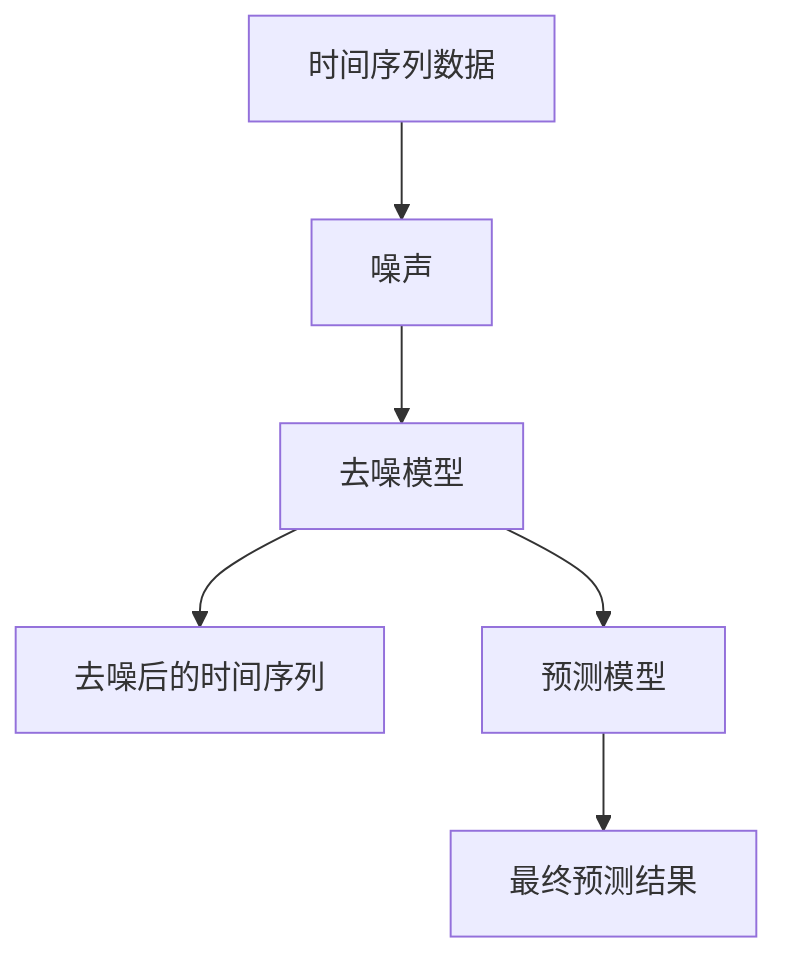
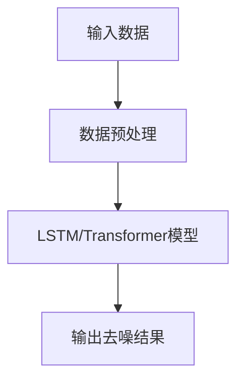
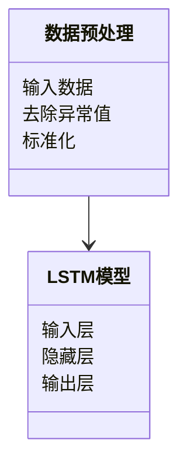
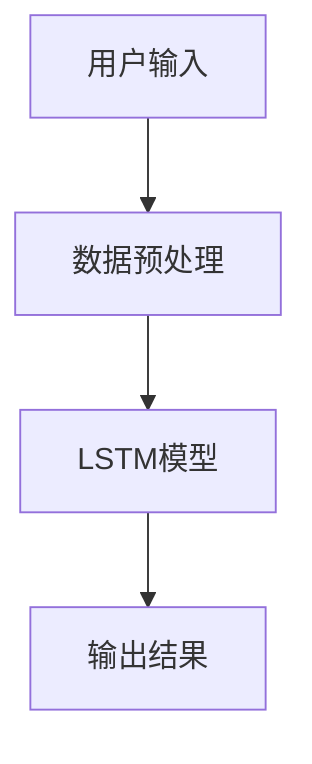
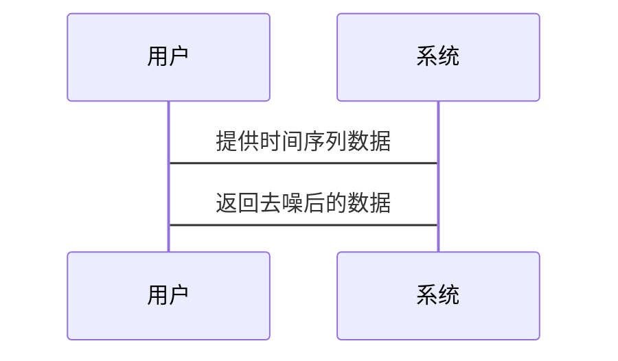

                 


# 深度学习在金融时间序列去噪中的应用

> **关键词**：深度学习，时间序列，去噪，金融数据，LSTM，Transformer，数学建模  
> **摘要**：本文系统介绍了深度学习在金融时间序列去噪中的应用，从问题背景、算法原理到系统设计和项目实战，全面阐述了如何利用深度学习技术有效去除金融时间序列中的噪声，提升金融数据分析的准确性和可靠性。

---

## 第1章: 金融时间序列去噪的背景与挑战

### 1.1 金融时间序列的基本概念

#### 1.1.1 金融时间序列的定义与特点
金融时间序列是指在金融市场上按时间顺序记录的数值型数据，例如股票价格、汇率、利率等。这些数据通常具有以下特点：
- **连续性**：数据按时间顺序排列。
- **波动性**：金融市场的不确定性导致数据波动较大。
- **非线性**：价格变化往往受到多种因素影响，表现出非线性特征。
- **噪声干扰**：市场噪声（如高频交易、突发事件）会影响数据的真实性和稳定性。

#### 1.1.2 金融时间序列中的噪声来源
噪声是影响金融时间序列分析的主要障碍，常见的噪声来源包括：
- **市场噪声**：如投资者情绪、市场波动等。
- **数据采集误差**：数据采集过程中的错误或不完整。
- **高频交易干扰**：高频交易可能导致数据异常波动。

#### 1.1.3 时间序列去噪的必要性与应用场景
去噪是提高金融数据分析质量的关键步骤。应用场景包括：
- **金融预测**：去噪后的时间序列可以用于股票价格预测、市场趋势分析。
- **风险控制**：通过去噪识别潜在风险点，帮助机构做出更准确的决策。
- **异常检测**：去噪有助于发现数据中的异常点，如欺诈交易。

### 1.2 深度学习在金融时间序列分析中的优势

#### 1.2.1 传统时间序列去噪方法的局限性
传统方法如移动平均、指数平滑等，难以捕捉非线性特征，且对噪声的去除效果有限。

#### 1.2.2 深度学习在非线性建模中的优势
深度学习模型（如RNN、LSTM、Transformer）能够有效捕捉时间序列中的非线性关系，提高去噪效果。

#### 1.2.3 深度学习在金融时间序列分析中的成功案例
近年来，深度学习在金融时间序列分析中取得了显著成果，例如：
- 基于LSTM的股票价格预测模型。
- Transformer在金融时间序列分类中的应用。

### 1.3 本书的核心目标与结构安排

#### 1.3.1 本书的核心目标
通过系统介绍深度学习在金融时间序列去噪中的原理、算法和应用，帮助读者掌握去噪技术的核心方法。

#### 1.3.2 本书的主要内容框架
- 章节1：背景与挑战。
- 章节2：核心概念与联系。
- 章节3：深度学习模型的算法原理与实现。
- 章节4：系统分析与架构设计。
- 章节5：项目实战与案例分析。
- 章节6：总结与未来展望。

#### 1.3.3 本书的读者对象与学习要求
适合金融从业者、数据科学家以及对深度学习感兴趣的读者。读者应具备基本的编程能力和对时间序列分析的基本了解。

---

## 第2章: 时间序列去噪的核心概念与联系

### 2.1 时间序列去噪的基本原理

#### 2.1.1 时间序列去噪的数学模型
时间序列去噪的目标是通过模型去除噪声，提取有用信息。数学模型通常包括：
- **信号模型**：$y_t = s_t + n_t$，其中$y_t$是观测值，$s_t$是信号，$n_t$是噪声。
- **目标函数**：最小化预测误差，例如最小化均方误差（MSE）。

#### 2.1.2 噪声的分类与特征
噪声可以分为白噪声、随机游走噪声和周期性噪声。不同类型的噪声对时间序列的影响不同。

#### 2.1.3 时间序列去噪的目标函数与优化方法
目标函数通常为：
$$
\min_{s_t} \sum_{t=1}^T (y_t - s_t)^2
$$
其中$T$是时间步数。

### 2.2 深度学习模型的核心原理

#### 2.2.1 常见深度学习模型概述
- **RNN**：适合处理序列数据，但存在梯度消失问题。
- **LSTM**：通过门控机制解决RNN的梯度消失问题。
- **Transformer**：基于自注意力机制，适合长序列处理。

#### 2.2.2 RNN、LSTM与Transformer在时间序列分析中的应用
| 模型 | 优缺点 | 适用场景 |
|------|--------|----------|
| RNN  | 易训练，但长序列效果差 | 短序列去噪 |
| LSTM | 解决RNN梯度消失问题 | 长序列去噪 |
| Transformer | 长序列效果好，但计算复杂 | 高频金融数据 |

#### 2.2.3 深度学习模型的训练与调优
模型训练需要考虑以下因素：
- **超参数选择**：如学习率、批量大小。
- **模型结构**：如隐藏层大小。
- **训练数据**：需包含噪声和干净数据。

### 2.3 时间序列去噪的核心概念对比表

| 概念       | 特征                         | 对比分析                        |
|------------|------------------------------|---------------------------------|
| 噪声类型    | 白噪声、随机游走、周期性噪声 | 噪声对时间序列预测的影响程度不同 |
| 模型选择    | RNN、LSTM、Transformer         | 模型对时间依赖性的捕捉能力不同 |
| 优化目标    | 最小化预测误差                | 不同目标函数对去噪效果的影响     |

### 2.4 时间序列去噪的实体关系图



---

## 第3章: 深度学习模型的算法原理与实现

### 3.1 基于LSTM的时间序列去噪算法

#### 3.1.1 LSTM的基本结构
LSTM由输入门、遗忘门和输出门组成，公式如下：
$$
i_t = \sigma(W_i x_t + U_i h_{t-1} + b_i)
$$
$$
f_t = \sigma(W_f x_t + U_f h_{t-1} + b_f)
$$
$$
o_t = \sigma(W_o x_t + U_o h_{t-1} + b_o)
$$
$$
h_t = i_t \cdot \tanh(W_c x_t + U_c h_{t-1} + b_c)
$$

#### 3.1.2 LSTM在时间序列去噪中的应用流程
1. 数据预处理：去除异常值，标准化数据。
2. 模型训练：使用LSTM网络拟合数据。
3. 去噪：通过模型预测去噪后的数据。

#### 3.1.3 LSTM去噪的数学模型
LSTM去噪的目标函数为：
$$
\min_{\theta} \sum_{t=1}^T (y_t - \hat{y}_t)^2
$$
其中$\theta$是模型参数，$\hat{y}_t$是模型预测值。

### 3.2 基于Transformer的时间序列去噪算法

#### 3.2.1 Transformer的基本结构
Transformer由编码器和解码器组成，编码器负责提取特征，解码器负责生成输出。

#### 3.2.2 Transformer在时间序列分析中的优势
- **全局依赖**：通过自注意力机制捕捉全局关系。
- **长序列处理**：适合处理高频金融数据。

#### 3.2.3 Transformer去噪的数学模型
自注意力机制公式：
$$
\alpha_{ij} = \frac{\exp(\text{sim}(x_i, x_j))}{\sum_{k} \exp(\text{sim}(x_i, x_k))}
$$
其中$\text{sim}(x_i, x_j)$是相似度计算。

### 3.3 时间序列去噪算法的实现代码

#### 3.3.1 基于LSTM的实现

```python
import numpy as np
from tensorflow.keras.models import Sequential
from tensorflow.keras.layers import LSTM, Dense

# 示例：基于LSTM的时间序列去噪模型
def build_lstm_model(input_shape):
    model = Sequential()
    model.add(LSTM(units=64, return_sequences=True, input_shape=input_shape))
    model.add(LSTM(units=32, return_sequences=False))
    model.add(Dense(1))
    model.compile(optimizer='adam', loss='mean_squared_error')
    return model

# 数据准备
X_train = np.random.randn(100, 10, 1)
y_train = np.random.randn(100, 1)

# 模型训练
model = build_lstm_model((10, 1))
model.fit(X_train, y_train, epochs=10, batch_size=32)
```

#### 3.3.2 基于Transformer的实现

```python
import tensorflow as tf
from tensorflow.keras.layers import Dense, MultiHeadAttention

def build_transformer_model(input_shape):
    inputs = tf.keras.Input(shape=input_shape)
    attention = MultiHeadAttention(heads=4, key_dim=8)(inputs, inputs)
    outputs = Dense(1)(attention)
    model = tf.keras.Model(inputs=inputs, outputs=outputs)
    model.compile(optimizer='adam', loss='mean_squared_error')
    return model

# 数据准备
X_train = np.random.randn(100, 10, 1)
y_train = np.random.randn(100, 1)

# 模型训练
model = build_transformer_model((10, 1))
model.fit(X_train, y_train, epochs=10, batch_size=32)
```

### 3.4 算法流程图



---

## 第4章: 系统分析与架构设计

### 4.1 问题场景介绍
金融时间序列去噪系统需要处理高频、多维的金融数据，目标是通过深度学习模型去除噪声，提高数据质量。

### 4.2 系统功能设计

#### 4.2.1 领域模型


#### 4.2.2 系统架构


### 4.3 系统接口设计
- **输入接口**：接收原始时间序列数据。
- **输出接口**：输出去噪后的数据。

### 4.4 系统交互图



---

## 第5章: 项目实战与案例分析

### 5.1 项目实战

#### 5.1.1 环境安装
- 安装Python、TensorFlow、Keras等工具。

#### 5.1.2 核心实现
```python
import numpy as np
from tensorflow.keras.models import Sequential
from tensorflow.keras.layers import LSTM, Dense

def build_lstm_model(input_shape):
    model = Sequential()
    model.add(LSTM(units=64, return_sequences=True, input_shape=input_shape))
    model.add(LSTM(units=32, return_sequences=False))
    model.add(Dense(1))
    model.compile(optimizer='adam', loss='mean_squared_error')
    return model

# 数据准备
X_train = np.random.randn(100, 10, 1)
y_train = np.random.randn(100, 1)

# 模型训练
model = build_lstm_model((10, 1))
model.fit(X_train, y_train, epochs=10, batch_size=32)
```

#### 5.1.3 代码解读与分析
- **数据预处理**：标准化数据，去除异常值。
- **模型训练**：使用LSTM网络拟合数据。
- **结果分析**：通过预测值与真实值的对比，评估去噪效果。

### 5.2 案例分析

#### 5.2.1 数据来源
使用股票价格数据，例如苹果公司股票价格。

#### 5.2.2 数据处理
- **数据获取**：从金融数据源获取股票价格。
- **数据清洗**：去除缺失值，标准化数据。

#### 5.2.3 模型训练
- 训练LSTM模型，评估去噪效果。

#### 5.2.4 结果分析
- 对比去噪前后的数据，验证模型的去噪效果。

### 5.3 项目总结

#### 5.3.1 项目实现的关键点
- 数据预处理：标准化、去除异常值。
- 模型选择：LSTM适合时间序列数据。

#### 5.3.2 模型调优
- 调整超参数：学习率、批量大小。
- 优化模型结构：隐藏层数、单元数。

---

## 第6章: 总结与未来展望

### 6.1 本书的总结
通过系统介绍深度学习在金融时间序列去噪中的应用，帮助读者掌握核心方法和技术。

### 6.2 未来展望
- **模型优化**：探索更高效的深度学习模型，如混合模型。
- **多模态数据**：结合文本、图像等多模态数据，提升去噪效果。
- **实时处理**：研究实时去噪技术，适用于高频交易。

### 6.3 最佳实践 tips

#### 6.3.1 数据预处理注意事项
- 数据清洗：去除异常值。
- 数据标准化：归一化处理。

#### 6.3.2 模型调优建议
- 调整超参数：学习率、批量大小。
- 优化模型结构：隐藏层数、单元数。

#### 6.3.3 拓展阅读
- 《Deep Learning for Time Series Forecasting》
- 《Attention Is All You Need》

---

## 作者：AI天才研究院/AI Genius Institute & 禅与计算机程序设计艺术/Zen And The Art of Computer Programming

---

本文通过系统介绍深度学习在金融时间序列去噪中的应用，从背景、算法原理到系统设计和项目实战，全面阐述了如何利用深度学习技术有效去除金融时间序列中的噪声。希望读者通过本文能够掌握深度学习在金融时间序列分析中的核心方法和技术。

