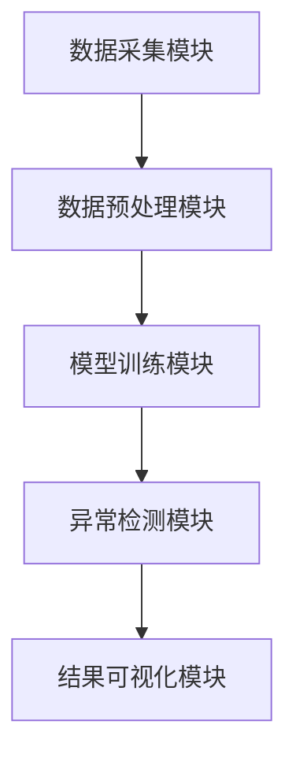

                 


# 深度学习在金融时间序列异常检测中的应用

> **关键词**：深度学习，时间序列，异常检测，金融，LSTM，GRU，Transformer

> **摘要**：金融时间序列异常检测是金融风险管理中的关键问题，传统的统计方法在处理复杂金融数据时表现有限。深度学习的引入为金融时间序列分析提供了新的视角和方法。本文系统介绍了深度学习在金融时间序列异常检测中的应用，从基本概念、算法原理、系统设计到实际应用，全面解析了该领域的最新进展和挑战。文章结合具体案例，详细阐述了LSTM、GRU和Transformer等模型的应用，并提出了优化策略和未来研究方向。

---

# 第1章: 金融时间序列异常检测概述

## 1.1 金融时间序列的基本概念

### 1.1.1 时间序列的定义与特征
时间序列是指按照时间顺序排列的数据，通常以等间隔的时间点为索引。金融时间序列具有以下特征：
- **连续性**：金融数据通常连续生成，如股票价格、交易量等。
- **波动性**：金融市场的波动性较强，容易受到多种因素影响。
- **非线性**：金融数据往往表现出非线性特征，难以用简单的线性模型描述。
- **依赖性**：当前时刻的值可能与过去时刻的值密切相关。

### 1.1.2 金融时间序列的独特性
金融时间序列与其他领域的时间序列相比，具有以下独特性：
- **高波动性**：金融市场波动剧烈，容易受到突发事件的影响。
- **复杂性**：金融数据受到多种因素影响，如市场情绪、政策变化等。
- **稀疏性**：异常样本在金融时间序列中往往较为稀疏，增加了检测的难度。

### 1.1.3 异常检测的定义与分类
异常检测是指通过分析数据，识别出与正常数据模式不一致的异常点。在金融领域，异常检测可以分为以下几类：
- **点异常**：单个时间点的异常值，如某时刻的股价突然大幅波动。
- **区间异常**：某段时间内的整体异常，如交易量突然激增。
- **上下文异常**：相对于特定上下文的异常，如某只股票的交易量在特定时间段内异常。

---

## 1.2 金融时间序列异常检测的重要性

### 1.2.1 金融风险控制的需求
金融市场的波动性要求金融机构能够及时识别和预警潜在风险。异常检测可以帮助金融机构识别市场中的异常波动，从而采取相应的风险管理措施。

### 1.2.2 异常交易识别的必要性
异常交易识别是打击市场操纵和欺诈行为的重要手段。通过检测交易中的异常行为，可以有效维护市场的公平性和稳定性。

### 1.2.3 传统方法的局限性
传统的异常检测方法，如基于统计的方法（Z-score、马科夫链等），在处理复杂金融数据时存在以下局限性：
- **假设的限制**：传统方法通常假设数据服从特定分布，而金融数据往往偏离这些假设。
- **非线性关系的捕捉不足**：传统方法难以捕捉复杂的非线性关系。
- **计算效率问题**：在处理大规模金融数据时，传统方法的计算效率较低。

---

## 1.3 深度学习在金融时间序列分析中的优势

### 1.3.1 深度学习的基本原理
深度学习是一种基于人工神经网络的机器学习方法，通过多层非线性变换，自动提取数据中的高层次特征。其核心在于模型的表示能力，能够捕捉数据中的复杂模式。

### 1.3.2 深度学习在时间序列分析中的独特优势
- **自动特征提取**：深度学习模型能够自动提取时间序列中的特征，无需人工设计特征。
- **非线性建模能力**：深度学习模型能够捕捉复杂的非线性关系，适合处理金融数据的复杂性。
- **长时记忆能力**：如LSTM和GRU模型，能够有效捕捉时间序列中的长程依赖关系。

### 1.3.3 深度学习在金融领域的应用现状
目前，深度学习在金融领域的应用已经取得了显著成果，特别是在时间序列分析方面：
- **股票价格预测**：基于LSTM的模型在股票价格预测中表现出色。
- **金融风险预警**：通过深度学习模型识别市场风险的前兆。
- **欺诈检测**：深度学习模型能够有效识别异常交易行为。

---

## 1.4 本章小结
本章从金融时间序列的基本概念出发，分析了金融时间序列异常检测的重要性，并介绍了深度学习在金融时间序列分析中的独特优势。下一章将深入探讨深度学习与时间序列分析的核心概念。

---

# 第2章: 深度学习与时间序列分析的核心概念

## 2.1 深度学习模型的基本原理

### 2.1.1 神经网络的基本结构
神经网络由输入层、隐藏层和输出层组成，通过多层非线性变换，实现数据的特征提取和模式识别。

### 2.1.2 深度学习的核心算法
- **卷积神经网络（CNN）**：适用于图像识别等任务，但在时间序列分析中的应用有限。
- **循环神经网络（RNN）**：适合处理序列数据，能够捕捉时间序列中的依赖关系。
- **长短期记忆网络（LSTM）**：一种改进的RNN，能够有效捕捉长程依赖关系。
- **变换器（Transformer）**：基于自注意力机制，适用于并行处理长序列数据。

### 2.1.3 深度学习与浅层学习的对比
| 对比维度 | 深度学习 | 浅层学习 |
|----------|----------|----------|
| 表示能力 | 强，可以捕捉复杂模式 | 弱，依赖人工特征设计 |
| 计算效率 | 较低，需要大量计算资源 | 较高，适合实时处理 |
| 应用场景 | 适合复杂任务，如金融时间序列分析 | 适合简单任务，如线性回归 |

---

## 2.2 时间序列分析的基本方法

### 2.2.1 时间序列的分解方法
时间序列可以分解为趋势（Trend）、周期性（Seasonality）和随机性（Noise）三部分。常见的分解方法包括：
- **移动平均法（MA）**：通过计算移动平均值来提取趋势。
- **指数平滑法（ES）**：通过加权平均来预测未来值。

### 2.2.2 时间序列的预测模型
- **ARIMA模型**：基于自回归和滑动平均的线性模型。
- **GARCH模型**：用于建模金融时间序列的波动性。

### 2.2.3 时间序列的特征提取
特征提取是时间序列分析的关键步骤，常见的特征包括：
- **均值**：序列的平均值。
- **方差**：序列的波动程度。
- **自相关系数（ACF）**：序列中不同时间点之间的相关性。

---

## 2.3 异常检测的核心原理

### 2.3.1 异常检测的定义与分类
异常检测的目标是识别与正常数据模式不一致的异常点。常见的异常检测方法包括：
- **基于统计的方法**：如Z-score、马科夫链。
- **基于机器学习的方法**：如KNN、孤立林。
- **基于深度学习的方法**：如AE（自编码器）、VAE（变分自编码器）。

### 2.3.2 深度学习在异常检测中的应用
- **无监督学习**：通过无监督模型（如AE）学习正常数据的特征，识别异常点。
- **有监督学习**：利用标注数据训练分类模型，识别异常样本。
- **半监督学习**：结合少量标注数据和大量未标注数据进行训练。

---

## 2.4 深度学习与时间序列异常检测的结合点

### 2.4.1 深度学习在时间序列特征提取中的应用
深度学习模型能够自动提取时间序列中的高层次特征，如时间依赖性、非线性关系等。

### 2.4.2 深度学习在异常检测中的独特优势
- **自动特征学习**：深度学习模型能够自动捕捉异常样本的特征。
- **非线性建模能力**：深度学习模型能够处理复杂的非线性关系。
- **长时记忆能力**：LSTM和Transformer模型能够捕捉长程依赖关系。

---

## 2.5 本章小结
本章介绍了深度学习与时间序列分析的核心概念，分析了深度学习在异常检测中的独特优势。下一章将探讨深度学习在金融时间序列异常检测中的应用现状。

---

# 第3章: 深度学习在金融时间序列异常检测中的应用现状

## 3.1 金融时间序列异常检测的主要挑战

### 3.1.1 数据的复杂性
金融数据通常具有复杂的非线性关系和高度的波动性，增加了模型的训练难度。

### 3.1.2 异常样本的稀疏性
在金融时间序列中，异常样本往往非常稀疏，导致模型难以有效学习。

### 3.1.3 计算资源的限制
深度学习模型通常需要大量的计算资源和数据支持，而金融数据的实时性要求进一步增加了计算的难度。

---

## 3.2 深度学习在金融时间序列分析中的应用案例

### 3.2.1 股票价格预测
通过LSTM模型预测股票价格的变化趋势，帮助投资者做出更明智的投资决策。

### 3.2.2 交易量异常检测
利用深度学习模型识别交易量的异常波动，帮助监管机构打击市场操纵行为。

### 3.2.3 风险预警系统
基于深度学习模型构建金融风险预警系统，提前识别潜在的市场风险。

---

## 3.3 当前研究的热点与难点

### 3.3.1 模型的可解释性
深度学习模型通常被视为“黑箱”，缺乏可解释性，影响了其在金融领域的广泛应用。

### 3.3.2 数据的实时性要求
金融数据的实时性要求较高，需要模型能够快速处理和分析数据。

### 3.3.3 模型的泛化能力
金融市场的复杂性和多变性要求模型具有较强的泛化能力，能够适应不同的市场环境。

---

## 3.4 本章小结
本章分析了深度学习在金融时间序列异常检测中的应用现状，指出了当前研究的热点与难点。下一章将深入探讨深度学习模型在时间序列异常检测中的原理与实现。

---

# 第4章: 深度学习模型在时间序列异常检测中的原理与实现

## 4.1 常见深度学习模型概述

### 4.1.1 RNN与LSTM
RNN（循环神经网络）通过循环结构处理序列数据，但存在梯度消失问题。LSTM（长短期记忆网络）通过引入记忆单元，有效解决了RNN的长程依赖捕捉问题。

### 4.1.2 GRU
GRU（门控循环单元）是对LSTM的一种简化，通过合并输入门和遗忘门，减少了模型的复杂性。

### 4.1.3 Transformer
Transformer基于自注意力机制，适用于并行处理长序列数据。其核心思想是通过全局注意力机制捕捉序列中的长程依赖关系。

---

## 4.2 基于LSTM的时间序列异常检测模型

### 4.2.1 LSTM的基本结构
LSTM由输入门（Input Gate）、遗忘门（Forget Gate）和输出门（Output Gate）组成，能够有效捕捉时间序列中的长程依赖关系。

### 4.2.2 LSTM在时间序列异常检测中的应用
通过训练LSTM模型识别正常数据的特征，进而检测异常样本。具体步骤如下：
1. **数据预处理**：将金融时间序列数据标准化或归一化。
2. **模型训练**：利用正常数据训练LSTM模型，使其能够生成正常序列的预测值。
3. **异常检测**：将实际数据与预测值进行对比，识别差异较大的点为异常点。

### 4.2.3 模型的训练与优化
- **损失函数**：使用均方误差（MSE）作为损失函数。
- **优化算法**：采用Adam优化器。
- **超参数调优**：调整学习率、批量大小等超参数，优化模型性能。

---

## 4.3 基于Transformer的时间序列异常检测模型

### 4.3.1 Transformer的基本原理
Transformer由编码器和解码器组成，通过自注意力机制捕捉序列中的全局依赖关系。编码器将输入序列编码为高维向量，解码器根据编码结果生成输出序列。

### 4.3.2 Transformer在时间序列分析中的应用
- **特征提取**：通过编码器提取时间序列的高层次特征。
- **异常检测**：通过对比实际数据与模型生成的预测值，识别异常点。

### 4.3.3 模型的改进与优化
- **位置编码**：通过引入位置编码，增强模型对时间顺序的感知能力。
- **多头注意力**：通过多头注意力机制，捕捉不同的依赖关系。

---

## 4.4 深度学习模型的对比分析

### 4.4.1 RNN与Transformer的对比
| 对比维度 | RNN | Transformer |
|----------|-----|------------|
| 并行性 | 串行处理 | 并行处理 |
| 长程依赖捕捉 | 需要使用LSTM或GRU | 通过自注意力机制 |
| 计算效率 | 较低 | 较高 |

### 4.4.2 LSTM与GRU的对比
| 对比维度 | LSTM | GRU |
|----------|------|-----|
| 复杂性 | 较高 | 较低 |
| 内存占用 | 较高 | 较低 |
| 性能 | 在某些任务中表现较好 | 在某些任务中表现较好 |

### 4.4.3 模型选择的策略
- **任务需求**：根据具体任务需求选择模型，如时间序列预测选择LSTM，异常检测选择Transformer。
- **数据规模**：大规模数据优先选择Transformer，小规模数据可以选择LSTM。
- **计算资源**：计算资源有限时选择GRU。

---

## 4.5 本章小结
本章详细介绍了几种常见的深度学习模型，并分析了它们在时间序列异常检测中的应用。下一章将探讨模型的训练与优化策略。

---

# 第5章: 深度学习模型的训练与优化

## 5.1 数据预处理

### 5.1.1 数据清洗
- **缺失值处理**：填补、删除或插值。
- **异常值处理**：识别并处理异常值。

### 5.1.2 数据归一化
- **标准化**：将数据标准化为均值为0，方差为1。
- **归一化**：将数据缩放到0-1范围。

### 5.1.3 数据分割
- **训练集**：用于模型训练。
- **验证集**：用于模型调优。
- **测试集**：用于模型评估。

---

## 5.2 模型训练策略

### 5.2.1 损失函数
- **均方误差（MSE）**：适用于回归任务。
- **交叉熵损失**：适用于分类任务。

### 5.2.2 优化算法
- **随机梯度下降（SGD）**：适用于大规模数据。
- **Adam优化器**：适用于大多数任务，收敛速度快。

### 5.2.3 正则化
- **L2正则化**：防止模型过拟合。
- **Dropout**：随机屏蔽部分神经元，防止过拟合。

---

## 5.3 模型优化

### 5.3.1 超参数调优
- **学习率**：调整学习率大小，影响模型收敛速度。
- **批量大小**：调整批量大小，影响模型训练的稳定性和效率。
- **模型深度**：调整神经网络的深度，影响模型的表达能力。

### 5.3.2 模型评估
- **准确率**：正确分类的样本数占总样本数的比例。
- **召回率**：正确识别的异常样本数占所有异常样本数的比例。
- **F1分数**：准确率和召回率的调和平均数。

---

## 5.4 本章小结
本章详细介绍了深度学习模型的训练与优化策略，包括数据预处理、损失函数选择、优化算法选择以及模型调优。下一章将探讨深度学习在金融时间序列异常检测中的实际应用。

---

# 第6章: 项目实战：深度学习在金融时间序列异常检测中的应用

## 6.1 项目背景

### 6.1.1 项目目标
本项目旨在利用深度学习技术，构建一个金融时间序列异常检测系统，帮助金融机构识别异常交易和市场风险。

### 6.1.2 数据来源
- **股票价格数据**：从Yahoo Finance获取某股票的历史价格数据。
- **交易量数据**：从交易所获取某股票的交易量数据。

---

## 6.2 系统功能设计

### 6.2.1 功能模块
- **数据采集**：从数据源获取金融时间序列数据。
- **数据预处理**：清洗、归一化和分割数据。
- **模型训练**：训练深度学习模型，识别正常数据的特征。
- **异常检测**：将实际数据输入模型，识别异常点。
- **结果可视化**：将检测结果可视化，帮助用户直观理解。

### 6.2.2 系统架构设计
使用Mermaid绘制系统架构图：



---

## 6.3 项目实现

### 6.3.1 环境安装
- **Python**：安装Python 3.8及以上版本。
- **深度学习框架**：安装TensorFlow或Keras。
- **数据处理库**：安装Pandas、NumPy。
- **数据可视化库**：安装Matplotlib、Seaborn。

### 6.3.2 核心代码实现

#### 数据预处理
```python
import pandas as pd
import numpy as np
from sklearn.preprocessing import MinMaxScaler

# 加载数据
data = pd.read_csv('stock_price.csv')

# 数据归一化
scaler = MinMaxScaler()
data_scaled = scaler.fit_transform(data)

# 数据分割
train_data = data_scaled[:800]
test_data = data_scaled[800:]
```

#### 模型训练
```python
from tensorflow.keras.models import Sequential
from tensorflow.keras.layers import LSTM, Dense

# 构建LSTM模型
model = Sequential()
model.add(LSTM(64, input_shape=(None, 1)))
model.add(Dense(1))
model.compile(loss='mean_squared_error', optimizer='adam')

# 训练模型
model.fit(train_data, epochs=50, batch_size=32, verbose=1)
```

#### 异常检测
```python
# 预测测试数据
predictions = model.predict(test_data)

# 计算异常分数
errors = abs(test_data - predictions)
threshold = np.percentile(errors, 95)
anomalies = errors > threshold

# 可视化结果
import matplotlib.pyplot as plt
plt.plot(test_data, label='正常值')
plt.plot(predictions, label='预测值')
plt.scatter(range(len(anomalies)), test_data[anomalies], color='red', label='异常点')
plt.legend()
plt.show()
```

---

## 6.4 项目小结
本章通过一个实际项目展示了深度学习在金融时间序列异常检测中的应用，从数据预处理、模型训练到结果可视化，详细介绍了项目的实现过程。通过本章的学习，读者可以掌握深度学习模型在实际应用中的具体步骤。

---

# 第7章: 总结与展望

## 7.1 总结

### 7.1.1 深度学习在金融时间序列异常检测中的优势
- **自动特征提取**：深度学习模型能够自动捕捉数据中的高层次特征。
- **非线性建模能力**：深度学习模型能够处理复杂的非线性关系。
- **长时记忆能力**：LSTM和Transformer模型能够捕捉长程依赖关系。

### 7.1.2 项目实现的关键步骤
- **数据预处理**：数据清洗、归一化和分割。
- **模型选择与训练**：选择合适的深度学习模型，并进行参数调优。
- **异常检测与可视化**：识别异常点，并通过可视化展示结果。

---

## 7.2 未来研究方向

### 7.2.1 模型的可解释性
未来的研究需要关注模型的可解释性，帮助用户理解模型的决策过程。

### 7.2.2 数据的实时性要求
随着金融市场的快速发展，模型需要能够实时处理数据，满足实时性要求。

### 7.2.3 模型的泛化能力
金融市场的复杂性和多变性要求模型具有较强的泛化能力，能够适应不同的市场环境。

---

## 7.3 注意事项

### 7.3.1 数据隐私与安全
在处理金融数据时，需要严格遵守数据隐私和安全规定，确保数据不被泄露或滥用。

### 7.3.2 模型的鲁棒性
模型需要具有较强的鲁棒性，能够适应不同市场环境的变化。

### 7.3.3 模型的可扩展性
随着数据量的增加，模型需要具有较强的可扩展性，能够处理更大规模的数据。

---

## 7.4 拓展阅读

### 7.4.1 经典论文
- **"Learning Deep Representations of Time Series"**：介绍了深度学习在时间序列分析中的应用。
- **"Attention Is All You Need"**：提出了Transformer模型，为时间序列分析提供了新的思路。

### 7.4.2 经典书籍
- **《Deep Learning》**：介绍了深度学习的基本原理和核心算法。
- **《时间序列分析：方法与应用》**：详细介绍了时间序列分析的方法和应用。

---

# 作者：AI天才研究院/AI Genius Institute & 禅与计算机程序设计艺术 /Zen And The Art of Computer Programming

---

> 本文为AI天才研究院（AI Genius Institute）原创，转载请注明出处。

