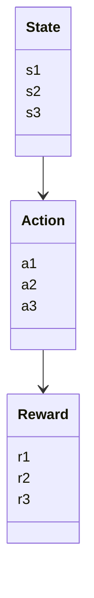
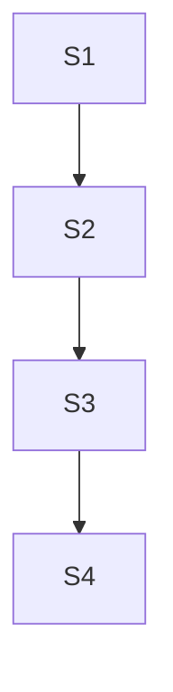
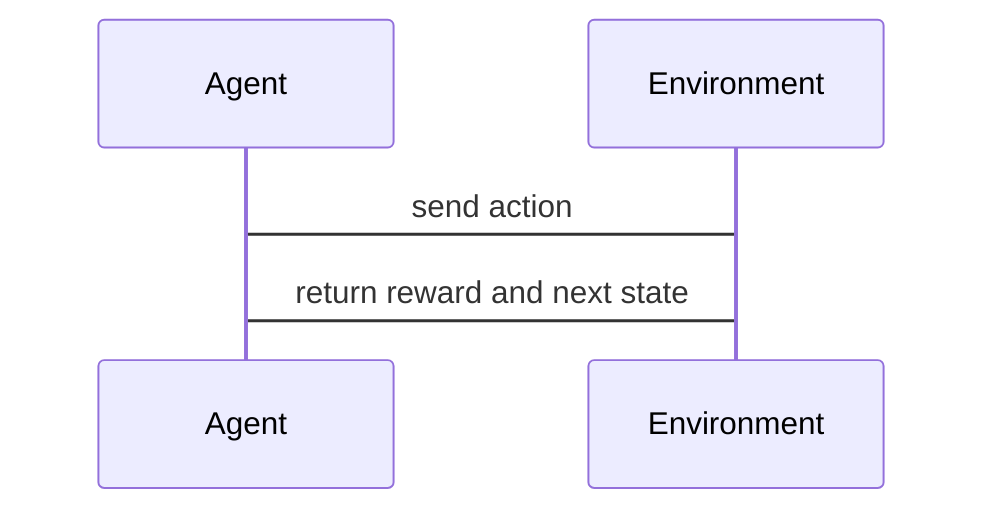

                 


# 深度强化学习在AI Agent控制中的应用

## 关键词：
- 深度强化学习
- AI Agent
- 强化学习算法
- 系统架构设计
- 项目实战

## 摘要：
本文深入探讨了深度强化学习（Deep Reinforcement Learning，DRL）在AI Agent控制中的应用。通过系统地分析DRL的基本概念、核心算法、系统架构设计以及实际项目案例，本文旨在帮助读者理解如何将DRL技术应用于复杂的AI Agent控制系统中。文章从背景介绍、核心概念、算法原理、系统架构设计、项目实战到高级主题，层层展开，结合丰富的图表和代码示例，详细阐述了DRL在AI Agent中的应用原理和实践方法。通过本文的阅读，读者将能够掌握DRL的核心技术，并能够在实际项目中灵活运用这些知识。

---

## 第一部分: 深度强化学习基础

### 第1章: 深度强化学习概述

#### 1.1 强化学习的基本概念
##### 1.1.1 强化学习的定义与特点
强化学习（Reinforcement Learning，RL）是一种机器学习范式，通过智能体（Agent）与环境的交互，学习如何做出决策以最大化某种累积奖励。与监督学习和无监督学习不同，强化学习强调实时反馈和长期决策优化。其特点包括：
- **实时反馈**：智能体通过与环境交互，获得即时奖励或惩罚。
- **长期决策优化**：强化学习关注的是全局最优策略，而非局部最优。
- **探索与利用平衡**：智能体需要在探索新状态和利用已知策略之间找到平衡。

##### 1.1.2 深度强化学习的引入
随着人工智能的快速发展，强化学习的计算复杂性和环境状态空间的扩大，传统的强化学习算法在处理高维复杂任务时逐渐显得力不从心。深度强化学习（DRL）应运而生，它将深度学习（Deep Learning）的强大特征提取能力与强化学习的决策优化能力相结合，显著提升了智能体的决策能力和处理复杂任务的能力。

##### 1.1.3 深度强化学习的核心要素
深度强化学习的核心要素包括：
1. **状态空间（State Space）**：智能体所处环境的所有可能状态。
2. **动作空间（Action Space）**：智能体在给定状态下可执行的所有动作。
3. **奖励函数（Reward Function）**：定义智能体在某一状态和动作下的奖励值。
4. **策略（Policy）**：智能体选择动作的概率分布函数。
5. **价值函数（Value Function）**：评估某状态或状态-动作对的优劣。

#### 1.2 AI Agent的基本概念
##### 1.2.1 AI Agent的定义与分类
AI Agent是指在特定环境中能够感知环境、自主决策并执行动作的智能体。根据智能体的智能水平和决策能力，可以将AI Agent分为以下几类：
- **反应式智能体（Reactive Agent）**：仅基于当前感知做出决策。
- **基于模型的智能体（Model-based Agent）**：通过构建环境模型来规划和决策。
- **分层智能体（Hierarchical Agent）**：通过层次化结构分解任务，提高决策效率。

##### 1.2.2 AI Agent的智能层次结构
AI Agent的智能层次结构通常包括以下几个层次：
1. **感知层**：通过传感器或接口获取环境信息。
2. **决策层**：基于感知信息和内部状态，选择最优动作。
3. **执行层**：将决策转化为具体动作，与环境交互。
4. **学习层**：通过与环境的交互，不断优化决策策略。

##### 1.2.3 AI Agent在实际应用中的角色
AI Agent在实际应用中扮演着多种角色，如自动驾驶中的路径规划模块、智能客服系统中的对话管理模块等。AI Agent的核心目标是通过与环境的交互，实现目标函数的最优。

#### 1.3 深度强化学习与AI Agent的结合
##### 1.3.1 深度强化学习在AI Agent控制中的优势
深度强化学习将深度学习的特征提取能力和强化学习的决策优化能力相结合，使得AI Agent能够在复杂的高维状态下做出高效的决策。

##### 1.3.2 深度强化学习与传统控制方法的对比
传统控制方法（如动态规划、模型预测控制等）通常依赖于精确的环境模型，而深度强化学习则通过数据驱动的方式，无需明确的环境模型，适用于复杂动态环境。

##### 1.3.3 深度强化学习在AI Agent中的应用领域
深度强化学习在AI Agent中的应用领域包括：
- **游戏AI**：如AlphaGo、DeepMind在棋类游戏中的应用。
- **自动驾驶**：路径规划、障碍避让等。
- **机器人控制**：智能机器人动作决策。
- **智能推荐系统**：个性化推荐策略优化。

---

### 第2章: 深度强化学习的核心算法

#### 2.1 Q-Learning算法
##### 2.1.1 Q-Learning的基本原理
Q-Learning是一种基于价值函数的强化学习算法，通过更新Q值表（Q-table）来学习最优策略。Q值表记录了每个状态-动作对的期望奖励。

##### 2.1.2 Q-Learning的数学模型
Q-Learning的更新公式如下：
$$ Q(s,a) = Q(s,a) + \alpha [r + \gamma \max Q(s',a') - Q(s,a)] $$
其中：
- $\alpha$ 是学习率。
- $\gamma$ 是折扣因子。
- $r$ 是即时奖励。

##### 2.1.3 Q-Learning的优缺点
- **优点**：简单易实现，适用于离散状态空间。
- **缺点**：在高维或连续状态空间中，Q值表的存储和更新效率较低。

#### 2.2 深度Q网络（DQN）
##### 2.2.1 DQN的基本原理
DQN通过深度神经网络近似Q值函数，解决了传统Q-Learning在高维状态空间中的存储和计算问题。

##### 2.2.2 DQN的算法流程
1. 初始化神经网络参数$\theta$。
2. 对环境进行观测，获取当前状态$s$。
3. 根据当前状态$s$，选择一个动作$a$（$\epsilon$-贪心策略）。
4. 执行动作$a$，获得新的状态$s'$和奖励$r$。
5. 将经验$(s,a,r,s')$存储在经验回放库中。
6. 从经验回放库中随机抽取一批经验，计算目标Q值：
   $$ Q_{target} = r + \gamma \max Q(s',a') $$
7. 更新神经网络参数$\theta$，以最小化预测Q值与目标Q值的差值。

##### 2.2.3 DQN的数学模型与公式
DQN的目标函数为：
$$ \min_{\theta} \mathbb{E}[ (Q_{target} - Q(s,a))^2 ] $$
其中，$Q(s,a)$是神经网络的输出，$Q_{target}$是目标Q值。

##### 2.2.4 DQN的优缺点
- **优点**：能够处理高维复杂状态空间。
- **缺点**：训练过程需要经验回放和目标网络，增加了实现复杂性。

#### 2.3 策略梯度方法（PG）
##### 2.3.1 PG的基本原理
策略梯度方法通过直接优化策略$\pi(s)$，最大化累积奖励的期望。

##### 2.3.2 PG的数学模型
策略梯度的目标函数为：
$$ \mathcal{J} = \mathbb{E}_{s,a}[\log \pi(a|s) Q(s,a)] $$
其中，$Q(s,a)$是Q值函数。

##### 2.3.3 PG的优缺点
- **优点**：直接优化策略，适用于连续动作空间。
- **缺点**：梯度估计的方差较大，训练不稳定。

---

### 第3章: 深度强化学习的系统架构设计

#### 3.1 系统功能设计
##### 3.1.1 领域模型设计
领域模型是AI Agent的核心，描述了环境的状态、动作和奖励之间的关系。领域模型可以用Mermaid类图表示：



##### 3.1.2 系统架构设计
系统架构设计通常采用分层结构，包括感知层、决策层和执行层。可以用Mermaid架构图表示：



##### 3.1.3 系统接口设计
系统接口设计需要定义智能体与环境之间的交互接口。可以用Mermaid序列图表示：



---

### 第4章: 项目实战

#### 4.1 环境安装
为了实现深度强化学习在AI Agent中的应用，首先需要安装以下环境：
- Python 3.8+
- TensorFlow/PyTorch
- OpenAI Gym或其他强化学习框架

#### 4.2 系统核心实现
##### 4.2.1 DQN实现
```python
import numpy as np
import tensorflow as tf

class DQN:
    def __init__(self, state_space, action_space, learning_rate=0.01, gamma=0.99):
        self.state_space = state_space
        self.action_space = action_space
        self.memory = []
        self.model = self.build_model()
        self.target_model = self.build_model()
        self.learning_rate = learning_rate
        self.gamma = gamma

    def build_model(self):
        model = tf.keras.Sequential([
            tf.keras.layers.Dense(64, activation='relu', input_dim=self.state_space),
            tf.keras.layers.Dense(32, activation='relu'),
            tf.keras.layers.Dense(self.action_space, activation='linear')
        ])
        model.compile(optimizer=tf.keras.optimizers.Adam(self.learning_rate), loss='mse')
        return model

    def remember(self, state, action, reward, next_state):
        self.memory.append((state, action, reward, next_state))

    def act(self, state, epsilon=0.1):
        if np.random.random() < epsilon:
            return np.random.randint(self.action_space)
        return np.argmax(self.model.predict(state)[0])

    def replay(self, batch_size):
        if len(self.memory) < batch_size:
            return
        minibatch = np.random.choice(self.memory, batch_size)
        states = np.array([x[0] for x in minibatch])
        actions = np.array([x[1] for x in minibatch])
        rewards = np.array([x[2] for x in minibatch])
        next_states = np.array([x[3] for x in minibatch])
        
        targets = self.model.predict(states)
        next_targets = self.target_model.predict(next_states)
        targets[range(batch_size), actions] = rewards + self.gamma * np.max(next_targets, axis=1)
        self.model.fit(states, targets, epochs=1, verbose=0)
```

##### 4.2.2 PG实现
```python
import torch
import torch.nn as nn
import torch.optim as optim

class PG:
    def __init__(self, state_space, action_space, learning_rate=0.01):
        self.state_space = state_space
        self.action_space = action_space
        self.model = self.build_model()
        self.optimizer = optim.Adam(self.model.parameters(), lr=learning_rate)

    def build_model(self):
        return nn.Sequential(
            nn.Linear(self.state_space, 64),
            nn.ReLU(),
            nn.Linear(64, self.action_space),
            nn.Softmax(dim=1)
        )

    def act(self, state):
        with torch.no_grad():
            action_probs = self.model(state)
            action = torch.multinomial(action_probs, 1).item()
        return action

    def update(self, policy_loss):
        self.optimizer.zero_grad()
        policy_loss.backward()
        self.optimizer.step()
```

#### 4.3 项目实战案例分析
以智能客服系统为例，通过DQN算法实现对话管理。首先定义状态空间和动作空间：
- **状态空间**：用户输入、对话历史、情感倾向。
- **动作空间**：回复、转移话题、结束对话。

通过训练DQN网络，智能客服系统能够在复杂对话中做出最优决策。

---

### 第5章: 深度强化学习的高级主题与应用案例

#### 5.1 多智能体协作
多智能体协作是深度强化学习的重要应用之一，如无人机编队、分布式机器人协作等。

#### 5.2 分布式深度强化学习
分布式深度强化学习通过多台设备协作，提高计算效率和模型鲁棒性。

#### 5.3 游戏AI与自动驾驶中的应用
深度强化学习在游戏AI和自动驾驶中的应用已经取得了显著成果，如AlphaGo、特斯拉自动驾驶系统等。

---

### 第6章: 总结与展望

#### 6.1 总结
本文系统地介绍了深度强化学习在AI Agent控制中的应用，从基本概念、核心算法到系统架构设计和项目实战，全面阐述了DRL的核心技术和实践方法。

#### 6.2 展望
随着深度强化学习技术的不断发展，未来AI Agent将在更多领域展现出强大的应用潜力，如智能机器人、智慧城市、医疗健康等。

---

## 作者：AI天才研究院/AI Genius Institute & 禅与计算机程序设计艺术 /Zen And The Art of Computer Programming

