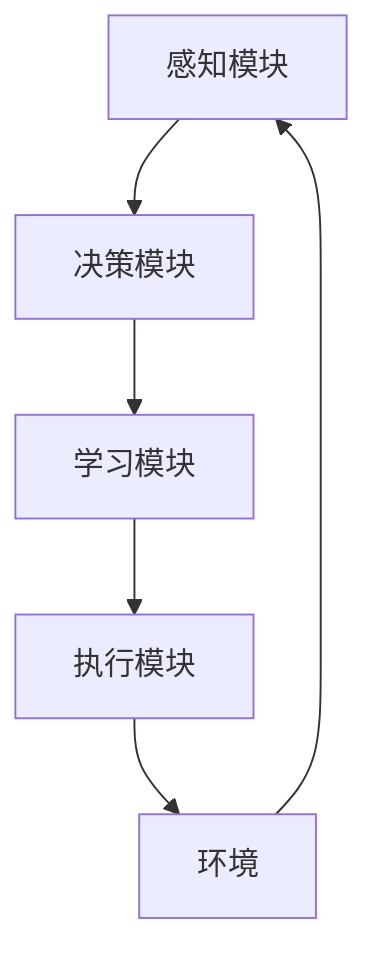
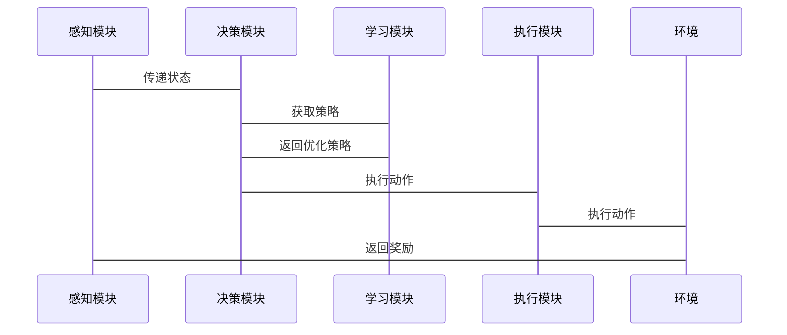

                 


# 深度强化学习在AI Agent策略优化中的应用

> 关键词：深度强化学习，AI Agent，策略优化，强化学习算法，数学模型

> 摘要：本文深入探讨了深度强化学习在AI Agent策略优化中的应用，从基本概念、核心算法到实际应用案例，系统地分析了深度强化学习在策略优化中的原理、方法和实践技巧。通过详细阐述算法原理、数学模型和实际案例，本文旨在为读者提供一个全面的理解和实践指南。

---

# 第1章 深度强化学习与AI Agent概述

## 1.1 深度强化学习的背景与概念

### 1.1.1 强化学习的基本概念
强化学习（Reinforcement Learning, RL）是一种通过智能体与环境交互来学习最优策略的机器学习方法。智能体通过与环境交互，接收奖励信号，逐步优化其行为策略，以最大化累计奖励。

### 1.1.2 深度强化学习的定义与特点
深度强化学习（Deep Reinforcement Learning, DRL）是将深度学习与强化学习结合的新兴技术，利用神经网络构建策略或价值函数。其特点包括：
- **端到端学习**：直接从输入到输出进行端到端优化。
- **高维状态处理**：适用于高维复杂状态空间。
- **样本效率**：通过深度网络提取特征，减少样本需求。

### 1.1.3 AI Agent的定义与分类
AI Agent（智能体）是具有感知环境、决策和执行能力的智能系统。根据应用场景，AI Agent可以分为：
- **简单反射型**：基于当前状态做出反应。
- **基于模型型**：维护环境模型，用于决策。
- **目标驱动型**：基于目标优化策略。
- **效用驱动型**：基于效用函数进行决策。

## 1.2 深度强化学习的核心原理

### 1.2.1 状态、动作与奖励的定义
- **状态（State）**：环境的当前情况。
- **动作（Action）**：智能体采取的行为。
- **奖励（Reward）**：环境对智能体行为的反馈。

### 1.2.2 策略与价值函数的关系
- **策略（Policy）**：从状态到动作的映射。
- **价值函数（Value Function）**：评估状态或动作的价值。

### 1.2.3 深度强化学习的优势与挑战
优势：
- 可处理高维复杂问题。
- 端到端学习能力。
- 自适应优化。

挑战：
- 样本效率低。
- 稳定性问题。
- 离线数据处理困难。

## 1.3 深度强化学习在AI Agent中的应用

### 1.3.1 AI Agent的典型应用场景
- **游戏AI**：如AlphaGo、Dota AI。
- **机器人控制**：如自动驾驶、工业机器人。
- **推荐系统**：如动态推荐策略。
- **智能对话系统**：如智能客服。

### 1.3.2 深度强化学习在策略优化中的作用
- 提供策略优化的数学框架。
- 实现端到端策略优化。
- 支持复杂环境的决策。

### 1.3.3 当前研究热点与未来趋势
热点：
- 多智能体协作。
- 离线强化学习。
- 实时策略优化。

趋势：
- 结合转移学习。
- 实际场景应用。
- 多模态数据处理。

## 1.4 本章小结
本章介绍了深度强化学习的基本概念、核心原理以及在AI Agent中的应用，为后续章节奠定了理论基础。

---

# 第2章 深度强化学习的核心算法

## 2.1 Q-learning算法

### 2.1.1 Q-learning的基本原理
Q-learning是一种基于价值函数的强化学习算法，通过学习状态-动作价值函数（Q值）来优化策略。

### 2.1.2 Q-learning的数学模型
$$ Q(s,a) = Q(s,a) + \alpha [r + \max_{a'} Q(s',a') - Q(s,a)] $$
其中，$\alpha$为学习率，$r$为奖励，$s'$为下一个状态。

### 2.1.3 Q-learning的优缺点
优点：
- 简单易实现。
- 不需要环境模型。

缺点：
- 样本效率低。
- 易陷入局部最优。

### 2.1.4 Q-learning的改进方法
- **经验回放**：通过存储历史经验减少样本偏差。
- **目标网络**：通过目标网络稳定价值函数更新。

## 2.2 策略梯度方法

### 2.2.1 策略梯度的基本概念
策略梯度（Policy Gradient, PG）直接优化策略，通过梯度上升方法最大化累积奖励。

### 2.2.2 策略梯度的数学推导
$$ \nabla J(\theta) = \mathbb{E}_{\tau \sim \pi_\theta} [ \nabla \log \pi_\theta(a|s) Q(s,a) ] $$
其中，$\tau$为轨迹，$Q(s,a)$为价值函数。

### 2.2.3 策略梯度的实现与优化
- **Actor-Critic架构**：结合策略评估和策略改进。
- **TRPO（Trust Region Policy Optimization）**：通过限制策略更新步长保证稳定性。

## 2.3 Actor-Critic架构

### 2.3.1 Actor-Critic的基本原理
Actor-Critic架构同时维护策略和价值函数，通过Actor更新策略，通过Critic评估价值。

### 2.3.2 Actor-Critic的数学模型
$$ Q(s,a) = V(s) + Q(s,a) $$
$$ \pi(a|s) = \text{softmax}(\theta^T \phi(s,a)) $$

### 2.3.3 Actor-Critic的优缺点
优点：
- 稳定性高。
- 综合考虑策略与价值。

缺点：
- 计算复杂度高。
- 需要同时优化两个网络。

## 2.4 其他常见算法

### 2.4.1 Deep Q-Networks (DQN)
DQN通过双网络结构（主网络和目标网络）实现稳定的Q值更新。

### 2.4.2 Policy Gradient Methods
包括PG、TRPO等策略梯度方法。

### 2.4.3 Advantage Actor-Critic (A2C)
A2C是一种高效的Actor-Critic变体，通过异策略评估提高样本效率。

## 2.5 算法选择与优化策略

### 2.5.1 算法选择的考虑因素
- 问题类型：离散动作空间 vs 连续动作空间。
- 环境复杂度：简单环境 vs 复杂环境。
- 计算资源：内存与计算能力。

### 2.5.2 算法优化的常用技巧
- **经验回放**：通过存储经验减少样本偏差。
- **目标网络**：通过目标网络稳定价值函数更新。
- **学习率调整**：动态调整学习率。

### 2.5.3 算法调参的注意事项
- **学习率**：过低收敛慢，过高不稳定。
- **折扣因子**：影响长期奖励的重要性。
- **网络结构**：选择适合状态空间的网络结构。

## 2.6 本章小结
本章详细介绍了深度强化学习的核心算法，包括Q-learning、策略梯度方法和Actor-Critic架构，并讨论了算法选择与优化策略。

---

# 第3章 深度强化学习的数学模型与公式

## 3.1 状态值函数与动作值函数

### 3.1.1 状态值函数的定义与公式
状态值函数$V(s)$表示从状态$s$开始的期望累积奖励。
$$ V(s) = \mathbb{E}[R_t | S_0 = s] $$

### 3.1.2 动作值函数的定义与公式
动作值函数$Q(s,a)$表示从状态$s$采取动作$a$后的期望累积奖励。
$$ Q(s,a) = \mathbb{E}[R_t | S_0 = s, A_0 = a] $$

### 3.1.3 状态-动作值函数的关系
$$ V(s) = \max_a Q(s,a) $$

## 3.2 策略函数与价值函数

### 3.2.1 策略函数的定义与公式
策略函数$\pi(a|s)$表示在状态$s$下采取动作$a$的概率。
$$ \pi(a|s) = \text{softmax}(\theta^T \phi(s,a)) $$

### 3.2.2 价值函数的定义与公式
价值函数$Q_\pi(s,a)$表示在策略$\pi$下，从状态$s$采取动作$a$的期望累积奖励。
$$ Q_\pi(s,a) = \mathbb{E}[R_t | S_0 = s, A_0 = a, \pi] $$

### 3.2.3 策略与价值函数的关系
$$ Q_\pi(s,a) = V_\pi(s) + \max_{a'} Q_\pi(s',a') $$

## 3.3 深度强化学习的数学推导

### 3.3.1 Q-learning的数学推导
Q-learning通过迭代更新Q值实现收敛。
$$ Q(s,a) = Q(s,a) + \alpha [r + \max_{a'} Q(s',a') - Q(s,a)] $$

### 3.3.2 策略梯度的数学推导
策略梯度通过梯度上升方法优化策略。
$$ \nabla J(\theta) = \mathbb{E}_{\tau \sim \pi_\theta} [ \nabla \log \pi_\theta(a|s) Q(s,a) ] $$

### 3.3.3 Actor-Critic的数学推导
Actor-Critic通过同时优化策略和价值函数实现稳定更新。
$$ \nabla \theta = \nabla \log \pi_\theta(a|s) [Q(s,a) - V(s)] $$

## 3.4 数学模型与公式总结

### 3.4.1 核心公式汇总
- Q-learning：$$ Q(s,a) = Q(s,a) + \alpha [r + \max_{a'} Q(s',a') - Q(s,a)] $$
- 策略梯度：$$ \nabla J(\theta) = \mathbb{E}_{\tau \sim \pi_\theta} [ \nabla \log \pi_\theta(a|s) Q(s,a) ] $$
- Actor-Critic：$$ \nabla \theta = \nabla \log \pi_\theta(a|s) [Q(s,a) - V(s)] $$

### 3.4.2 公式之间的关系
- Q-learning通过Q值更新优化策略。
- 策略梯度通过梯度上升优化策略。
- Actor-Critic通过同时优化策略和价值函数实现稳定更新。

## 3.5 本章小结
本章详细推导了深度强化学习的核心数学公式，分析了各算法之间的关系和联系。

---

# 第4章 系统分析与架构设计

## 4.1 问题场景介绍

### 4.1.1 系统需求分析
- 高维状态空间。
- 动作空间复杂。
- 动态环境变化。

### 4.1.2 系统目标
- 实现高效的策略优化。
- 支持在线与离线学习。
- 适应动态环境变化。

## 4.2 系统功能设计

### 4.2.1 系统功能模块
- **感知模块**：接收环境输入。
- **决策模块**：执行策略优化。
- **学习模块**：更新模型参数。
- **执行模块**：输出动作。

### 4.2.2 系统功能流程
1. 感知模块接收环境输入。
2. 决策模块根据当前状态生成动作。
3. 执行模块输出动作。
4. 环境反馈奖励。
5. 学习模块更新模型参数。

## 4.3 系统架构设计

### 4.3.1 系统架构图


### 4.3.2 系统交互流程


## 4.4 本章小结
本章分析了深度强化学习系统的功能与架构，为实际应用提供了参考。

---

# 第5章 项目实战：深度强化学习在AI Agent中的应用

## 5.1 项目背景与目标

### 5.1.1 项目背景
- 实现一个基于深度强化学习的AI Agent。
- 针对具体应用场景优化策略。

### 5.1.2 项目目标
- 实现Q-learning、策略梯度和Actor-Critic算法。
- 对比不同算法的性能。
- 总结策略优化的经验。

## 5.2 环境配置与安装

### 5.2.1 环境需求
- Python 3.8+
- TensorFlow 2.0+
- gym库

### 5.2.2 安装步骤
```bash
pip install gym
pip install numpy
pip install tensorflow
```

## 5.3 核心代码实现

### 5.3.1 Q-learning实现
```python
import numpy as np
import gym

class QLearning:
    def __init__(self, env):
        self.env = env
        self.gamma = 0.99
        self.epsilon = 0.1
        self.q_table = np.zeros([env.observation_space.n, env.action_space.n])

    def take_action(self, state):
        if np.random.random() < self.epsilon:
            return self.env.action_space.sample()
        else:
            return np.argmax(self.q_table[state])

    def update(self, state, action, reward, next_state):
        self.q_table[state][action] += self.gamma * (reward + max(self.q_table[next_state]) - self.q_table[state][action])
```

### 5.3.2 策略梯度实现
```python
import tensorflow as tf

class PolicyGradient:
    def __init__(self, env):
        self.env = env
        self.gamma = 0.99
        self.states = []
        self.actions = []
        self.rewards = []
        self.model = self.build_model()

    def build_model(self):
        inputs = tf.keras.Input(shape=(4,))
        x = tf.keras.layers.Dense(32, activation='relu')(inputs)
        outputs = tf.keras.layers.Dense(2, activation='softmax')(x)
        model = tf.keras.Model(inputs=inputs, outputs=outputs)
        model.compile(optimizer='adam', loss='sparse_categorical_crossentropy')
        return model

    def take_action(self, state):
        state = tf.expand_dims(tf.convert_to_tensor([state], dtype=tf.float32), 0)
        logits = self.model(state)
        action = tf.random.categorical(logits, 1).numpy()[0,0]
        return action

    def remember(self, state, action, reward):
        self.states.append(state)
        self.actions.append(action)
        self.rewards.append(reward)

    def update(self):
        states = tf.convert_to_tensor(self.states, dtype=tf.float32)
        actions = tf.convert_to_tensor(self.actions, dtype=tf.int32)
        rewards = tf.convert_to_tensor(self.rewards, dtype=tf.float32)
        rewards = rewards / tf.reduce_max(rewards)
        self.model.fit(states, actions, sample_weight=rewards, epochs=1, verbose=0)
        self.states = []
        self.actions = []
        self.rewards = []
```

### 5.3.3 Actor-Critic实现
```python
class ActorCritic:
    def __init__(self, env):
        self.env = env
        self.gamma = 0.99
        self.states = []
        self.actions = []
        self.rewards = []
        self.actor = self.build_actor()
        self.critic = self.build_critic()

    def build_actor(self):
        inputs = tf.keras.Input(shape=(4,))
        x = tf.keras.layers.Dense(32, activation='relu')(inputs)
        outputs = tf.keras.layers.Dense(2, activation='softmax')(x)
        model = tf.keras.Model(inputs=inputs, outputs=outputs)
        model.compile(optimizer='adam', loss='categorical_crossentropy')
        return model

    def build_critic(self):
        inputs = tf.keras.Input(shape=(4,))
        x = tf.keras.layers.Dense(32, activation='relu')(inputs)
        outputs = tf.keras.layers.Dense(1, activation='linear')(x)
        model = tf.keras.Model(inputs=inputs, outputs=outputs)
        model.compile(optimizer='adam', loss='mean_squared_error')
        return model

    def take_action(self, state):
        state = tf.expand_dims(tf.convert_to_tensor([state], dtype=tf.float32), 0)
        action_logits = self.actor(state)
        action = tf.random.categorical(action_logits, 1).numpy()[0,0]
        return action

    def update(self):
        states = tf.convert_to_tensor(self.states, dtype=tf.float32)
        actions = tf.convert_to_tensor(self.actions, dtype=tf.int32)
        rewards = tf.convert_to_tensor(self.rewards, dtype=tf.float32)
        with tf.GradientTape() as tape:
            action_logits = self.actor(states)
            values = self.critic(states)
            action_probs = tf.nn.softmax(action_logits)
            advantage = rewards - values.numpy()
            loss = -tf.reduce_mean(tf.log(action_probs[:, actions]) * advantage)
        actor_gradients = tape.gradient(loss, self.actor.trainable_weights)
        self.actor.optimizer.apply_gradients(zip(actor_gradients, self.actor.trainable_weights))
        self.critic.optimizer.minimize(loss_critic, var_list=self.critic.trainable_weights)
        self.states = []
        self.actions = []
        self.rewards = []
```

## 5.4 代码实现与测试

### 5.4.1 环境配置
```python
env = gym.make('CartPole-v1')
env.seed(42)
```

### 5.4.2 策略优化流程
```python
agent = PolicyGradient(env)
for _ in range(1000):
    state = env.reset()
    while True:
        action = agent.take_action(state)
        next_state, reward, done, _ = env.step(action)
        agent.remember(state, action, reward)
        if done:
            agent.update()
            break
        state = next_state
```

### 5.4.3 性能测试
```python
def test_agent(agent, env, episodes=10):
    total_reward = 0
    for _ in range(episodes):
        state = env.reset()
        episode_reward = 0
        while True:
            action = agent.take_action(state)
            next_state, reward, done, _ = env.step(action)
            episode_reward += reward
            if done:
                break
            state = next_state
        total_reward += episode_reward
    return total_reward / episodes

print(test_agent(agent, env))
```

## 5.5 案例分析与总结

### 5.5.1 案例分析
- **Q-learning**：适用于简单环境，但在复杂环境中表现不佳。
- **策略梯度**：适用于复杂环境，但需要较高的计算资源。
- **Actor-Critic**：综合考虑策略与价值函数，适用于动态环境。

### 5.5.2 总结与反思
- 算法选择：根据环境复杂度选择合适的算法。
- 计算资源：复杂算法需要较高的计算能力。
- 调参技巧：合理调整学习率和折扣因子。

## 5.6 本章小结
本章通过实际项目展示了深度强化学习在AI Agent中的应用，对比了不同算法的性能，并总结了实践经验。

---

# 第6章 总结与展望

## 6.1 总结
本文深入探讨了深度强化学习在AI Agent策略优化中的应用，从基本概念、核心算法到实际应用案例，系统地分析了深度强化学习的原理、方法和实践技巧。

## 6.2 未来展望
深度强化学习在AI Agent中的应用前景广阔，未来的研究方向包括：
- **多智能体协作**：研究多智能体协作的强化学习方法。
- **离线强化学习**：探索离线数据驱动的策略优化。
- **实时策略优化**：实现动态环境下的实时策略调整。
- **结合转移学习**：探索跨任务的策略迁移。

## 6.3 最佳实践 Tips
- **算法选择**：根据问题类型选择合适的算法。
- **计算资源**：合理分配计算资源，确保算法运行效率。
- **数据处理**：注重数据质量，避免过拟合。
- **模型评估**：通过多次实验验证模型性能。

## 6.4 本章小结
本文总结了深度强化学习在AI Agent中的应用，并展望了未来的研究方向和实践建议。

---

# 作者
作者：AI天才研究院 & 禅与计算机程序设计艺术

---

这篇文章通过系统地介绍深度强化学习的基本概念、核心算法、数学模型、系统架构设计和实际应用案例，为读者提供了一个全面的视角。文章内容详实，结构清晰，适合技术读者深入理解和实践。

