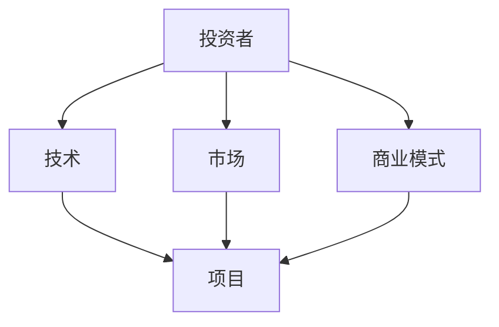
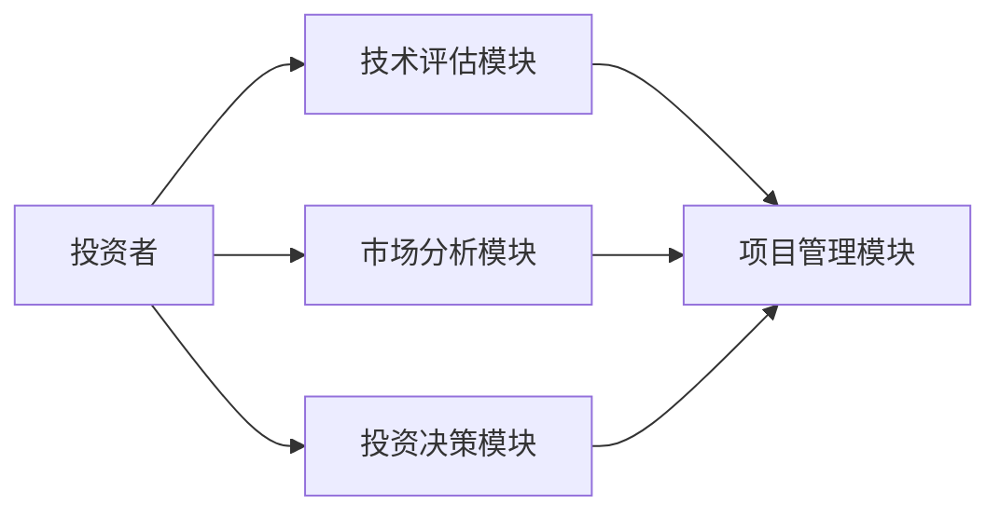
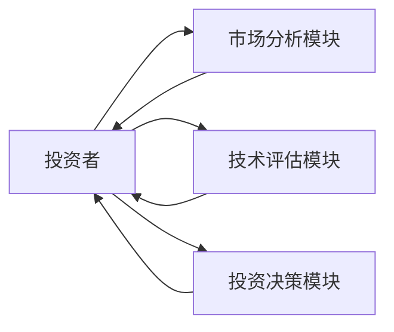

                 


# 清洁技术风险投资基金的策略与表现

## 关键词：清洁技术、风险投资、策略分析、表现评估、系统架构、项目实战

## 摘要：本文深入探讨了清洁技术风险投资的核心策略与表现分析，结合实际案例和系统架构设计，为投资者提供科学的决策支持。

---

# 第一部分: 清洁技术风险投资基金的背景与核心概念

## 第1章: 清洁技术与风险投资的概述

### 1.1 清洁技术的定义与分类

#### 1.1.1 清洁技术的定义
清洁技术是指能够减少资源消耗、降低污染排放、提高能源利用效率的技术和解决方案。其目标是实现可持续发展，应对全球气候变化和资源短缺问题。

#### 1.1.2 清洁技术的主要分类
- **可再生能源技术**：如太阳能、风能、生物质能等。
- **节能技术**：如能效优化、智能电网等。
- **环保技术**：如污水处理、废物回收利用等。
- **绿色交通技术**：如电动汽车、智能交通系统等。

#### 1.1.3 清洁技术的全球发展趋势
全球各国政府和企业正在加大对清洁技术的投入，推动能源结构转型和环境保护。

### 1.2 风险投资的基本概念

#### 1.2.1 风险投资的定义
风险投资是指向高风险、高潜力的初创企业或项目提供资金，并通过股权或债权的形式获得高回报的投资方式。

#### 1.2.2 风险投资的主要特点
- 高风险：项目失败概率较高。
- 高回报：成功项目可带来超额回报。
- 长期性：投资周期较长，通常为5-10年。

#### 1.2.3 风险投资的运作模式
- **种子期投资**：支持初创企业的产品开发和市场验证。
- **成长期投资**：支持企业扩展市场份额和生产能力。
- **成熟期投资**：支持企业巩固市场地位，实现上市或并购。

### 1.3 清洁技术与风险投资的结合

#### 1.3.1 清洁技术领域的投资机会
随着环保政策的加强和市场需求的增长，清洁技术领域具备较大的投资潜力。

#### 1.3.2 风险投资在清洁技术中的作用
- 提供资金支持。
- 优化资源配置。
- 推动技术创新。

#### 1.3.3 清洁技术风险投资的边界与外延
清洁技术风险投资不仅关注技术创新，还注重商业化能力，强调技术与市场的结合。

### 1.4 清洁技术风险投资的核心要素

#### 1.4.1 技术创新性
技术必须具备显著的创新性，能够解决现有问题或提供更优解决方案。

#### 1.4.2 市场需求
技术必须有明确的市场需求，具备商业化潜力。

#### 1.4.3 商业化潜力
技术应具备清晰的商业模式，能够在市场上实现盈利。

---

## 第2章: 清洁技术风险投资的核心概念与联系

### 2.1 清洁技术风险投资的核心原理

#### 2.1.1 技术评估方法
- **技术可行性**：评估技术的成熟度和可实施性。
- **市场适应性**：评估技术是否符合市场需求。

#### 2.1.2 市场分析方法
- **市场规模**：评估目标市场的容量。
- **竞争分析**：分析竞争对手的情况。

#### 2.1.3 商业模式分析
- **收入来源**：评估技术的盈利能力。
- **成本结构**：评估技术的经济性。

### 2.2 清洁技术与风险投资的属性对比

| 属性         | 清洁技术                     | 风险投资                     |
|--------------|------------------------------|------------------------------|
| 技术属性     | 创新性高，技术复杂           | 投资对象广泛，技术门槛高     |
| 市场属性     | 市场需求增长快               | 市场波动大                   |
| 财务属性     | 投资周期长，回报潜力大       | 风险高，回报不确定性大       |

### 2.3 清洁技术风险投资的ER实体关系图



---

## 第3章: 清洁技术风险投资的策略分析

### 3.1 投资策略的分类

#### 3.1.1 初创期投资
- **特点**：项目处于早期阶段，技术尚未成熟。
- **策略**：支持技术开发和市场验证。

#### 3.1.2 成长期投资
- **特点**：项目已进入市场扩展阶段。
- **策略**：支持企业扩大市场份额。

#### 3.1.3 成熟期投资
- **特点**：项目已进入稳定发展阶段。
- **策略**：支持企业巩固市场地位。

### 3.2 投资策略的选择

#### 3.2.1 技术评估的重要性
- 技术创新性是投资决策的核心依据。

#### 3.2.2 市场需求的匹配
- 选择符合市场需求的技术。

#### 3.2.3 商业模式的可行性
- 确保技术具备可持续的盈利能力。

### 3.3 投资组合的构建

#### 3.3.1 多元化投资策略
- 通过多元化降低整体投资风险。

#### 3.3.2 风险控制策略
- 通过严格的筛选标准和技术评估降低投资风险。

---

## 第4章: 清洁技术风险投资的表现分析

### 4.1 投资表现的评估指标

#### 4.1.1 投资回报率(ROI)
- ROI = (投资收益 - 投资成本) / 投资成本 × 100%

#### 4.1.2 投资回收期(PPM)
- PPM = 投资总额 / 年均净现金流

#### 4.1.3 风险调整后回报(IRR)
- IRR 是使得净现值为零的折现率。

### 4.2 历史案例分析

#### 4.2.1 太阳能电池技术投资案例
- **投资金额**：1000万美元。
- **投资回报**：5年收回成本，年回报率20%。

#### 4.2.2 电动汽车充电技术投资案例
- **投资金额**：500万美元。
- **投资回报**：3年收回成本，年回报率30%。

### 4.3 未来趋势预测

#### 4.3.1 技术创新
- 新型储能技术、智能电网技术将受到更多关注。

#### 4.3.2 市场扩展
- 亚洲和非洲市场将成为新的增长点。

#### 4.3.3 政策支持
- 各国政府将继续出台支持清洁技术的政策。

---

## 第5章: 清洁技术风险投资的系统架构设计

### 5.1 系统功能设计

#### 5.1.1 技术评估模块
- 功能：对清洁技术项目进行技术评估。
- 输入：技术文档、市场数据。
- 输出：评估报告。

#### 5.1.2 投资决策模块
- 功能：辅助投资者做出投资决策。
- 输入：项目信息、市场数据。
- 输出：决策建议。

#### 5.1.3 风险管理模块
- 功能：监控投资风险，制定应对策略。
- 输入：市场数据、项目进展。
- 输出：风险报告。

### 5.2 系统架构设计



### 5.3 系统交互设计



---

## 第6章: 清洁技术风险投资的项目实战

### 6.1 项目环境安装

#### 6.1.1 操作系统
- 建议使用Linux或Windows。

#### 6.1.2 开发工具
- Python、Jupyter Notebook、Git。

#### 6.1.3 依赖库安装
- pip install numpy pandas matplotlib。

### 6.2 核心代码实现

```python
import numpy as np
import pandas as pd
import matplotlib.pyplot as plt

# 数据读取
data = pd.read_csv('clean_technology.csv')

# 数据分析
data.head()
data.describe()

# 可视化
plt.plot(data['year'], data['investment'], label='投资金额')
plt.xlabel('年份')
plt.ylabel('投资金额（百万美元）')
plt.title('清洁技术投资趋势')
plt.legend()
plt.show()
```

### 6.3 代码应用解读

- 上述代码用于分析清洁技术领域的投资趋势。
- 使用了Python的pandas库进行数据处理，matplotlib库进行可视化。

---

## 第7章: 清洁技术风险投资的最佳实践

### 7.1 总结与回顾

- 清洁技术风险投资具有重要的社会和经济意义。
- 投资者需要具备技术评估和市场分析的双重能力。

### 7.2 小结

- 本文系统地探讨了清洁技术风险投资的策略与表现。
- 通过实际案例和系统架构设计，为投资者提供了科学的决策支持。

### 7.3 注意事项

- 投资者需谨慎评估技术风险和市场风险。
- 保持对技术发展趋势的关注。

### 7.4 拓展阅读

- 建议阅读《风险投资与创新》、《清洁技术与可持续发展》等书籍。

---

# 结语

清洁技术风险投资是推动可持续发展的重要力量。本文通过系统化的分析和实际案例的探讨，为投资者提供了科学的决策支持。未来，随着技术的不断进步和市场的扩展，清洁技术风险投资将发挥更大的作用。

---

作者：AI天才研究院/AI Genius Institute & 禅与计算机程序设计艺术 /Zen And The Art of Computer Programming

