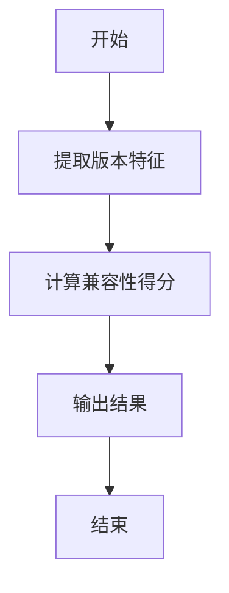
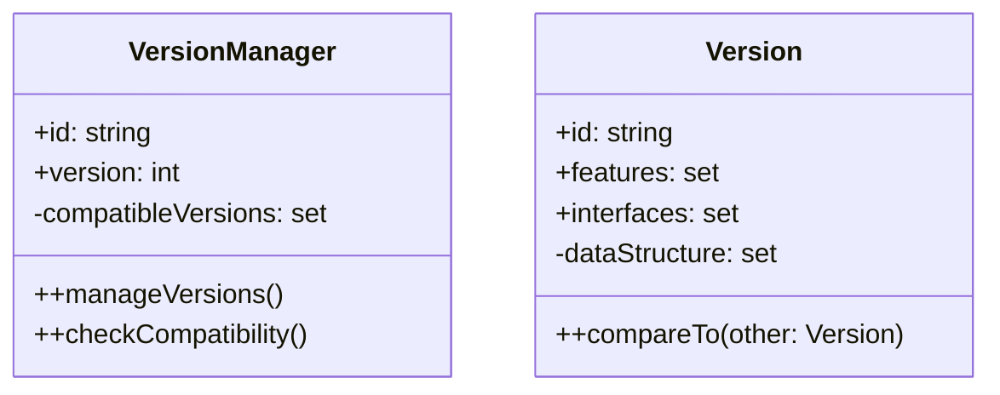

                 


# 版本兼容性：管理AI Agent的历史版本

> 关键词：版本兼容性，AI Agent，历史版本管理，软件架构，系统设计

> 摘要：本文深入探讨了AI Agent的历史版本管理中的版本兼容性问题，分析了版本兼容性的核心概念、算法原理、系统架构设计以及实际项目中的应用案例。通过详细的分析和示例，为读者提供了全面的解决方案和实践指南。

---

## 第1章: AI Agent与版本兼容性背景

### 1.1 AI Agent的基本概念
AI Agent是一种智能体，能够感知环境并采取行动以实现目标。它可以在多种场景中应用，如自动驾驶、智能助手和推荐系统。

### 1.2 AI Agent的历史演变
AI Agent的发展经历了从简单的行为反应模型到复杂的学习和推理模型的演变。版本管理在这一过程中显得尤为重要。

### 1.3 版本兼容性的重要性
版本兼容性确保不同版本的AI Agent能够协同工作，避免功能冲突和数据丢失。它是系统稳定性和可扩展性的关键。

---

## 第2章: 版本兼容性的核心概念

### 2.1 版本兼容性的定义
版本兼容性是指不同版本的AI Agent在功能、接口和数据结构上保持一致，确保它们可以互操作。

### 2.2 核心要素对比
| 要素 | 版本A | 版本B | 兼容性 |
|---|---|---|---|
| 功能 | 支持语音识别 | 支持语音识别和图像识别 | 兼容 |
| 接口 | 使用HTTP API | 使用gRPC | 不兼容 |

### 2.3 实体关系图
```mermaid
er
    actor VersionManager {
        id: string
        version: int
        compatibleWith: [Version]
    }
    entity Version {
        id: string
        features: set
        interfaces: set
        dataStructure: set
    }
    VersionManager -> Version: 管理
    Version --> Version: 兼容性检查
```

---

## 第3章: 版本兼容性检测算法

### 3.1 检测流程
1. **特征提取**：提取每个版本的功能、接口和数据结构。
2. **兼容性评估**：使用兼容性评估函数计算兼容性得分。
3. **结果输出**：输出兼容性报告。

### 3.2 兼容性评估函数
$$ C(v1, v2) = \frac{f(v1) \cap f(v2)}{|f(v1) \cup f(v2)|} $$
其中，$f(v)$表示版本$v$的功能集合。

### 3.3 算法流程图


---

## 第4章: 系统架构设计

### 4.1 系统功能模块


### 4.2 系统架构图


---

## 第5章: 项目实战与案例分析

### 5.1 环境安装
安装必要的工具和库，如Python、Git和Docker。

### 5.2 核心代码实现
```python
def check_compatibility(version_a, version_b):
    # 特征提取
    features_a = get_features(version_a)
    features_b = get_features(version_b)
    # 兼容性计算
    common = features_a & features_b
    total = features_a | features_b
    compatibility_score = len(common) / len(total)
    return compatibility_score > 0.8
```

### 5.3 案例分析
通过具体案例展示如何检测和解决兼容性问题，如从版本1到版本2的迁移过程。

---

## 第6章: 最佳实践与总结

### 6.1 设计原则
- **模块化设计**：确保每个模块独立。
- **版本控制**：使用Git等工具管理版本。

### 6.2 测试策略
- **单元测试**：测试每个模块的功能。
- **集成测试**：测试模块之间的交互。

### 6.3 工具选择
推荐使用Docker和Kubernetes进行版本管理和部署。

### 6.4 未来展望
探索AI Agent的自适应版本管理，实现自动兼容性检测和修复。

---

## 作者：AI天才研究院 & 禅与计算机程序设计艺术

---

**注**：本文是基于AI Agent的历史版本管理问题进行的详细分析，旨在为技术从业者提供理论和实践指导。

