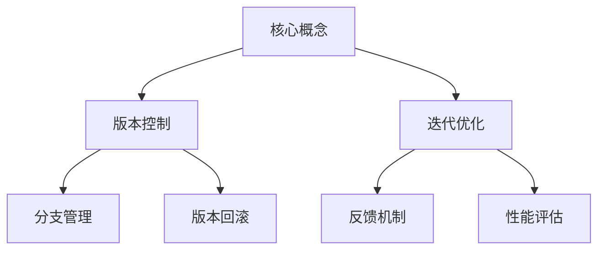
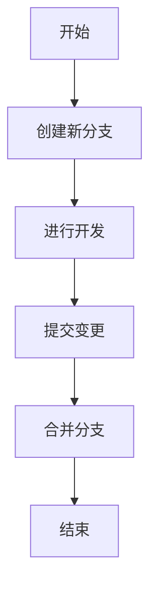
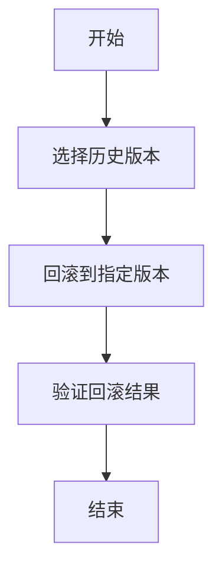
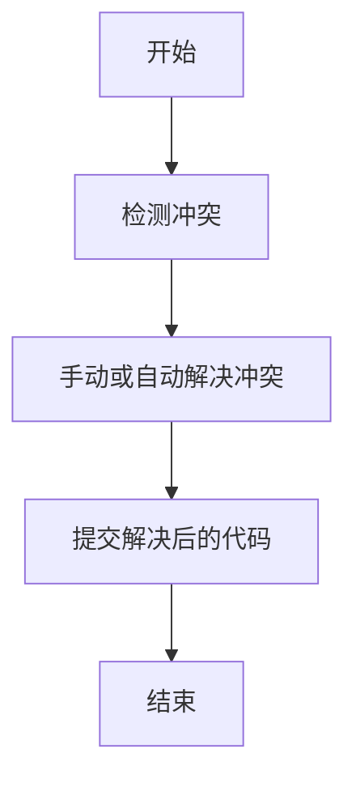
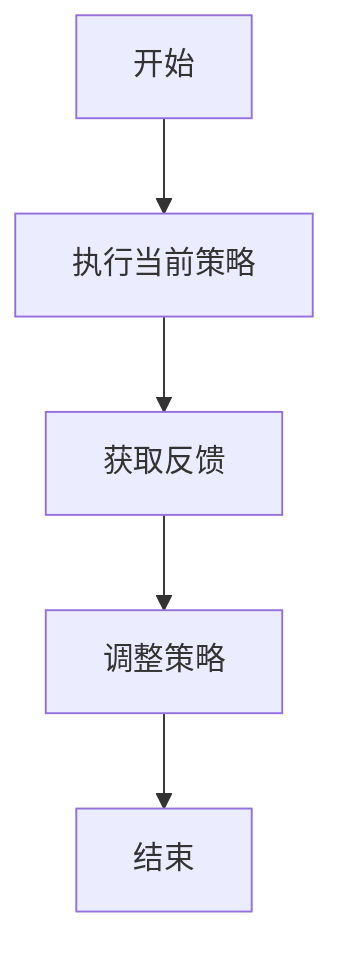
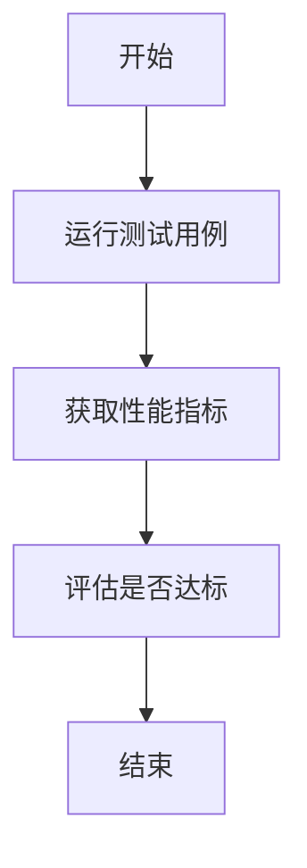
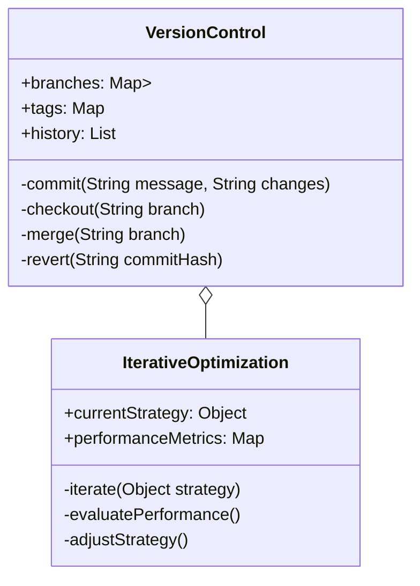
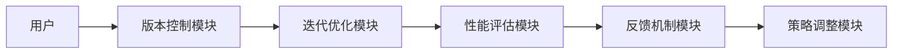

                 


# 版本控制与迭代：AI Agent的持续优化策略

> 关键词：版本控制、迭代优化、AI Agent、持续优化、系统架构、算法原理、项目实战

> 摘要：本文将深入探讨版本控制与迭代优化在AI Agent持续优化中的策略。通过分析版本控制与迭代优化的核心概念、算法原理、系统架构设计、项目实战以及最佳实践，为读者提供一套完整的AI Agent优化方案。从理论到实践，从算法到系统架构，本文将全面解析如何通过版本控制与迭代优化实现AI Agent的持续改进。

---

## 第1章：版本控制与迭代优化的背景与概念

### 1.1 版本控制的基本概念

#### 1.1.1 版本控制的定义与作用
版本控制是一种对代码或系统状态进行记录、追踪和管理的技术。它允许开发人员在不同的时间点保存系统的状态，并能够方便地回溯和恢复到任意一个历史版本。版本控制的核心作用在于管理变更，确保系统的稳定性和可追溯性。

#### 1.1.2 版本控制的核心功能
- **分支与合并**：允许开发人员在独立的分支上进行开发，避免主分支的不稳定。
- **版本回滚**：在出现错误时，能够快速恢复到一个已知的稳定版本。
- **冲突解决**：当多个开发人员同时修改同一文件时，版本控制系统能够检测和解决冲突。

#### 1.1.3 版本控制的分类与特点
版本控制主要分为集中式和分布式两类。集中式版本控制（如svn）依赖于中心服务器，而分布式版本控制（如git）则将仓库复制到每个开发者的本地机器上。分布式版本控制具有更高的灵活性和容错性。

---

### 1.2 迭代优化的基本概念

#### 1.2.1 迭代优化的定义与作用
迭代优化是一种通过多次小幅度改进系统或算法以达到优化目标的方法。它强调持续的反馈和调整，适用于复杂问题的求解。迭代优化的核心在于通过每一次迭代逐步逼近最优解。

#### 1.2.2 迭代优化的核心功能
- **反馈机制**：根据当前结果调整下一步的优化方向。
- **目标设定与调整**：在每一次迭代中，根据反馈动态调整优化目标。
- **性能评估与优化**：通过评估当前状态，决定是否进行调整或继续优化。

#### 1.2.3 迭代优化的分类与特点
迭代优化可以分为贪心迭代和随机迭代。贪心迭代每次选择当前最优的改进方向，而随机迭代则通过随机选择改进方向来避免陷入局部最优。迭代优化的特点是高效性、适应性和灵活性。

---

### 1.3 AI Agent的定义与特点

#### 1.3.1 AI Agent的定义
AI Agent（人工智能代理）是指能够感知环境并采取行动以实现目标的智能体。它通过感知环境、做出决策、执行动作来实现特定的任务。

#### 1.3.2 AI Agent的核心特点
- **自主性**：能够在没有外部干预的情况下自主运行。
- **反应性**：能够根据环境的变化动态调整行为。
- **目标导向性**：所有的行为都围绕着实现特定目标展开。

#### 1.3.3 AI Agent与传统软件的区别
AI Agent具有学习能力和适应性，能够通过数据和经验不断优化自身的性能。而传统软件的功能通常是静态的，无法根据环境变化自动调整。

---

## 第2章：版本控制与迭代优化的核心原理

### 2.1 版本控制的原理

#### 2.1.1 分支与合并机制
版本控制通过分支与合并机制实现多人协作开发。每个开发人员可以在独立的分支上进行开发，完成后将代码合并到主分支。这种机制能够避免多人协作时的冲突问题。

#### 2.1.2 版本冲突与解决方法
当多个开发人员同时修改同一文件时，版本控制系统会检测到版本冲突。解决冲突的方法包括手动合并和自动合并。

#### 2.1.3 版本回滚与历史追踪
版本回滚是指将系统恢复到一个历史版本的操作。历史追踪则是记录每一次版本变更的详细信息，以便在出现问题时能够快速定位问题。

---

### 2.2 迭代优化的原理

#### 2.2.1 迭代过程中的反馈机制
迭代优化通过反馈机制不断调整优化方向。每次迭代后，系统会根据当前状态生成反馈，指导下一步的优化。

#### 2.2.2 迭代中的目标设定与调整
在迭代过程中，目标设定是动态变化的。根据反馈，优化目标可能会被调整，以适应环境的变化。

#### 2.2.3 迭代中的性能评估与优化
性能评估是迭代优化的核心步骤。通过评估当前系统的性能，决定是否进行优化调整。

---

### 2.3 版本控制与迭代优化的结合

#### 2.3.1 版本控制在迭代优化中的作用
版本控制为迭代优化提供了版本回滚和历史追踪的功能，能够确保每次迭代的稳定性和可追溯性。

#### 2.3.2 迭代优化对版本控制的需求
迭代优化需要版本控制的支持，以实现多人协作开发和版本管理。

#### 2.3.3 两者的协同工作流程
版本控制与迭代优化的协同工作流程包括需求分析、分支开发、迭代优化、测试验证和版本发布。

---

## 第3章：AI Agent的持续优化策略

### 3.1 AI Agent优化的背景介绍

#### 3.1.1 问题背景
AI Agent在实际应用中会面临环境变化和任务需求的变化，需要通过持续优化来保持性能。

#### 3.1.2 问题描述
AI Agent的性能优化需要通过版本控制和迭代优化来实现。版本控制用于管理优化过程中的版本，迭代优化用于逐步提升性能。

#### 3.1.3 问题解决
通过版本控制与迭代优化的结合，AI Agent能够实现持续优化。

#### 3.1.4 边界与外延
AI Agent优化的边界在于其核心功能的改进，外延则包括性能提升和功能扩展。

#### 3.1.5 概念结构与核心要素
AI Agent优化的核心要素包括版本控制、迭代优化、反馈机制和性能评估。

---

### 3.2 核心概念与联系

#### 3.2.1 核心概念原理
版本控制与迭代优化的结合能够实现AI Agent的持续优化。版本控制提供了版本管理和协作开发的功能，而迭代优化提供了动态调整和性能提升的功能。

#### 3.2.2 核心概念属性特征对比表格
以下是版本控制与迭代优化的核心概念对比表格：

| 特性       | 版本控制         | 迭代优化         |
|------------|----------------|----------------|
| 目标       | 管理变更         | 提升性能         |
| 方法       | 分支与合并       | 反馈与调整       |
| 应用场景     | 多人协作开发     | 绩效优化         |

#### 3.2.3 实体关系图
以下是版本控制与迭代优化的实体关系图：



---

### 3.3 算法原理讲解

#### 3.3.1 版本控制的算法原理

##### 3.3.1.1 分支管理的算法流程
以下是分支管理的mermaid流程图：



##### 3.3.1.2 版本回滚的算法流程
以下是版本回滚的mermaid流程图：



##### 3.3.1.3 冲突解决的算法流程
以下是冲突解决的mermaid流程图：



#### 3.3.2 迭代优化的算法原理

##### 3.3.2.1 反馈机制的算法流程
以下是反馈机制的mermaid流程图：



##### 3.3.2.2 性能评估的算法流程
以下是性能评估的mermaid流程图：



---

### 3.4 系统分析与架构设计

#### 3.4.1 问题场景介绍
AI Agent的持续优化需要一个高效的版本控制和迭代优化系统。该系统需要支持多人协作开发、动态调整优化策略、实时反馈性能指标等功能。

#### 3.4.2 项目介绍
本项目旨在设计一个支持AI Agent持续优化的系统，通过版本控制和迭代优化的结合，实现AI Agent的性能提升。

#### 3.4.3 系统功能设计
以下是系统功能设计的mermaid类图：



#### 3.4.4 系统架构设计
以下是系统架构设计的mermaid架构图：



#### 3.4.5 系统接口设计
系统接口设计包括版本控制接口和迭代优化接口。版本控制接口提供分支管理、版本回滚等功能，迭代优化接口提供反馈机制、性能评估等功能。

#### 3.4.6 系统交互设计
以下是系统交互设计的mermaid序列图：

```mermaid
graph LR
    A[用户] -> B[版本控制模块]: 提交代码
    B -> C[迭代优化模块]: 开始迭代
    C -> D[性能评估模块]: 评估性能
    D -> C: 反馈结果
    C -> B: 调整策略
    B -> A: 提交新版本
```

---

### 3.5 项目实战

#### 3.5.1 环境安装
需要安装Git和相关版本控制工具。

#### 3.5.2 系统核心实现源代码
以下是版本控制与迭代优化的核心实现代码：

```python
class VersionControl:
    def __init__(self):
        self.branches = {}
        self.current_branch = "main"

    def commit(self, message, changes):
        # 提交变更
        pass

    def checkout(self, branch):
        # 切换分支
        pass

    def merge(self, branch):
        # 合并分支
        pass

    def revert(self, commit_hash):
        # 回滚到指定版本
        pass

class IterativeOptimization:
    def __init__(self):
        self.current_strategy = None
        self.performance_metrics = {}

    def iterate(self, strategy):
        # 执行当前策略
        pass

    def evaluate_performance(self):
        # 评估性能
        pass

    def adjust_strategy(self):
        # 调整策略
        pass
```

#### 3.5.3 代码应用解读与分析
版本控制类和迭代优化类通过协作实现AI Agent的持续优化。版本控制类负责管理代码的分支和版本，迭代优化类负责根据反馈调整优化策略。

#### 3.5.4 实际案例分析
通过一个实际案例分析，展示版本控制与迭代优化在AI Agent优化中的应用。

#### 3.5.5 项目小结
本项目通过版本控制与迭代优化的结合，实现了AI Agent的持续优化。版本控制确保了开发过程的稳定性和可追溯性，迭代优化实现了性能的逐步提升。

---

## 第4章：版本控制与迭代优化的系统架构设计

### 4.1 问题场景介绍
AI Agent的持续优化需要一个高效的版本控制和迭代优化系统。该系统需要支持多人协作开发、动态调整优化策略、实时反馈性能指标等功能。

### 4.2 项目介绍
本项目旨在设计一个支持AI Agent持续优化的系统，通过版本控制和迭代优化的结合，实现AI Agent的性能提升。

### 4.3 系统功能设计
以下是系统功能设计的mermaid类图：


### 4.4 系统架构设计
以下是系统架构设计的mermaid架构图：


### 4.5 系统接口设计
系统接口设计包括版本控制接口和迭代优化接口。版本控制接口提供分支管理、版本回滚等功能，迭代优化接口提供反馈机制、性能评估等功能。

### 4.6 系统交互设计
以下是系统交互设计的mermaid序列图：

```mermaid
graph LR
    A[用户] -> B[版本控制模块]: 提交代码
    B -> C[迭代优化模块]: 开始迭代
    C -> D[性能评估模块]: 评估性能
    D -> C: 反馈结果
    C -> B: 调整策略
    B -> A: 提交新版本
```

---

## 第5章：版本控制与迭代优化的项目实战

### 5.1 环境安装
需要安装Git和相关版本控制工具。

### 5.2 系统核心实现源代码
以下是版本控制与迭代优化的核心实现代码：

```python
class VersionControl:
    def __init__(self):
        self.branches = {}
        self.current_branch = "main"

    def commit(self, message, changes):
        # 提交变更
        pass

    def checkout(self, branch):
        # 切换分支
        pass

    def merge(self, branch):
        # 合并分支
        pass

    def revert(self, commit_hash):
        # 回滚到指定版本
        pass

class IterativeOptimization:
    def __init__(self):
        self.current_strategy = None
        self.performance_metrics = {}

    def iterate(self, strategy):
        # 执行当前策略
        pass

    def evaluate_performance(self):
        # 评估性能
        pass

    def adjust_strategy(self):
        # 调整策略
        pass
```

### 5.3 代码应用解读与分析
版本控制类和迭代优化类通过协作实现AI Agent的持续优化。版本控制类负责管理代码的分支和版本，迭代优化类负责根据反馈调整优化策略。

### 5.4 实际案例分析
通过一个实际案例分析，展示版本控制与迭代优化在AI Agent优化中的应用。

### 5.5 项目小结
本项目通过版本控制与迭代优化的结合，实现了AI Agent的持续优化。版本控制确保了开发过程的稳定性和可追溯性，迭代优化实现了性能的逐步提升。

---

## 第6章：版本控制与迭代优化的最佳实践

### 6.1 最佳实践 tips
- 定期进行代码审查和测试，确保每次迭代的质量。
- 在版本控制中使用分支策略，避免主分支的不稳定。
- 通过自动化工具实现持续集成和持续交付。

### 6.2 小结
版本控制与迭代优化的结合能够实现AI Agent的持续优化。版本控制提供了版本管理和协作开发的功能，而迭代优化提供了动态调整和性能提升的功能。

### 6.3 注意事项
- 在迭代优化过程中，要注意避免陷入局部最优。
- 版本控制与迭代优化的结合需要根据具体需求进行调整。

### 6.4 拓展阅读
推荐阅读《版本控制的艺术》和《迭代优化的实践》等书籍，以深入了解版本控制与迭代优化的理论与实践。

---

## 作者：AI天才研究院/AI Genius Institute & 禅与计算机程序设计艺术 /Zen And The Art of Computer Programming

