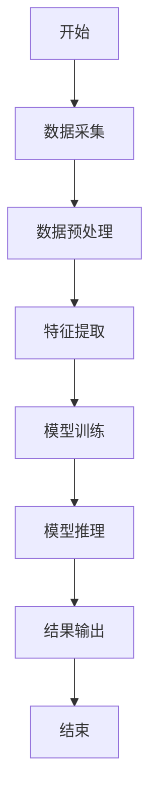
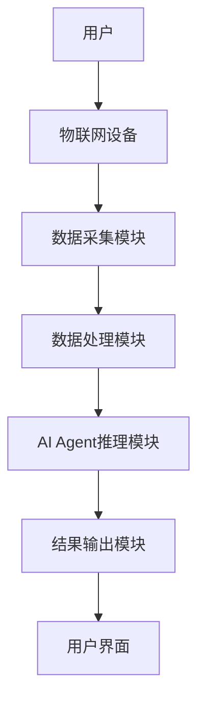

                 


# 物联网AI：构建智能家居和工业互联网的AI Agent

> 关键词：物联网，AI Agent，智能家居，工业互联网，人工智能

> 摘要：本文系统地探讨了如何利用人工智能技术构建智能家居和工业互联网中的AI Agent，涵盖了从概念到实现的全过程，包括算法原理、系统架构设计、项目实战等，旨在帮助读者深入理解并掌握物联网AI Agent的核心技术。

---

# 第1章: 物联网与AI Agent概述

## 1.1 物联网的基本概念

### 1.1.1 物联网的定义与特点

物联网（Internet of Things, IoT）是指通过各种信息传感设备，如传感器、射频识别（RFID）技术、全球定位系统、红外感应器等，按照约定的协议，把任何物品与互联网连接起来，进行信息交换和通信，以实现智能化识别、定位、跟踪、监控和管理。

物联网具有以下特点：
- **全面感知**：通过各种信息传感设备，实现对物理世界中物体的全面感知。
- **可靠传递**：利用网络技术，实现感知信息的可靠传递。
- **智能处理**：通过云计算、大数据等技术，对传递的信息进行智能处理，实现物体的智能控制和决策。

### 1.1.2 物联网的核心技术

物联网的核心技术包括：
1. **传感器技术**：用于采集物理世界中的各种数据。
2. **通信技术**：如Wi-Fi、蓝牙、ZigBee等，用于数据的传输。
3. **边缘计算与云计算**：用于数据的处理和存储。
4. **人工智能技术**：用于数据的分析和智能决策。

### 1.1.3 物联网的应用场景

物联网的应用场景非常广泛，包括：
- **智能家居**：通过物联网技术实现家居设备的智能控制。
- **工业互联网**：通过物联网技术实现生产设备的智能化管理和优化。
- **智慧城市**：通过物联网技术实现城市交通、环境监测等的智能化管理。

## 1.2 AI Agent的基本概念

### 1.2.1 AI Agent的定义与特点

AI Agent（人工智能代理）是指在计算机系统中，能够感知环境并采取行动以实现目标的实体。AI Agent具有以下特点：
- **自主性**：能够在没有外部干预的情况下自主决策。
- **反应性**：能够根据环境的变化实时调整行为。
- **目标导向性**：具有明确的目标，并采取行动以实现目标。

### 1.2.2 AI Agent的核心技术

AI Agent的核心技术包括：
1. **感知技术**：通过传感器或其他信息源感知环境。
2. **推理技术**：通过逻辑推理或机器学习模型，分析感知到的信息，做出决策。
3. **行动计划**：根据推理结果，执行相应的行动计划。

### 1.2.3 AI Agent的应用场景

AI Agent的应用场景包括：
- **智能家居**：通过AI Agent实现家居设备的智能控制。
- **工业互联网**：通过AI Agent实现生产设备的智能化管理和优化。
- **智能客服**：通过AI Agent实现智能问答和客户支持。

## 1.3 物联网与AI Agent的结合

### 1.3.1 物联网AI Agent的定义

物联网AI Agent是指在物联网环境下，通过AI技术实现智能感知、智能决策和智能控制的实体。

### 1.3.2 物联网AI Agent的核心优势

物联网AI Agent的核心优势包括：
- **智能化**：能够通过AI技术实现智能感知和智能决策。
- **实时性**：能够实时感知环境并做出反应。
- **自主性**：能够在没有外部干预的情况下自主决策。

### 1.3.3 物联网AI Agent的应用前景

物联网AI Agent的应用前景非常广阔，包括：
- **智能家居**：通过物联网AI Agent实现家居设备的智能控制。
- **工业互联网**：通过物联网AI Agent实现生产设备的智能化管理和优化。
- **智慧城市**：通过物联网AI Agent实现城市交通、环境监测等的智能化管理。

---

# 第2章: 物联网AI Agent的核心概念与联系

## 2.1 物联网AI Agent的核心概念

### 2.1.1 物联网AI Agent的实体关系图

以下是物联网AI Agent的实体关系图：

```mermaid
er
  entity IoT设备 {
    id
    类型
    状态
  }
  entity AI Agent {
    id
    类型
    状态
  }
  entity 用户 {
    id
    名称
    类型
  }
  IoT设备 -- 用户: 连接
  AI Agent -- 用户: 服务
  IoT设备 -- AI Agent: 数据交互
```

### 2.1.2 物联网AI Agent的算法流程图

以下是物联网AI Agent的算法流程图：



## 2.2 物联网AI Agent的算法原理

### 2.2.1 物联网数据的采集与预处理

物联网数据的采集与预处理是AI Agent实现的基础。数据采集的方法包括：
- **传感器采集**：通过传感器采集物理世界中的数据。
- **网络采集**：通过网络接口采集数据。

数据预处理技术包括：
- **数据清洗**：去除噪声数据。
- **数据归一化**：将数据归一化到统一的范围内。
- **数据转换**：将数据转换为适合模型输入的形式。

### 2.2.2 物联网AI Agent的模型训练

物联网AI Agent的模型训练是实现智能决策的核心。模型训练的方法包括：
- **监督学习**：通过标注数据训练模型。
- **无监督学习**：通过无标注数据训练模型。
- **强化学习**：通过与环境的交互训练模型。

### 2.2.3 物联网AI Agent的推理与应用

物联网AI Agent的推理与应用是实现智能控制的关键。推理算法包括：
- **逻辑推理**：通过逻辑规则进行推理。
- **概率推理**：通过概率模型进行推理。
- **深度学习推理**：通过深度学习模型进行推理。

---

# 第3章: 物联网AI Agent的系统架构设计

## 3.1 物联网AI Agent的系统架构

### 3.1.1 系统架构图

以下是物联网AI Agent的系统架构图：



### 3.1.2 系统接口设计

系统接口设计包括：
- **数据接口**：用于数据的采集和传输。
- **控制接口**：用于设备的控制和管理。
- **用户接口**：用于用户的交互和操作。

### 3.1.3 系统交互流程

系统交互流程包括：
1. 用户通过用户界面发送指令。
2. 指令通过控制接口传递到物联网设备。
3. 物联网设备采集数据并返回。
4. 数据通过数据接口传递到AI Agent推理模块。
5. AI Agent推理模块进行推理并输出结果。
6. 结果通过数据接口返回到用户界面。

---

# 第4章: 物联网AI Agent的项目实战

## 4.1 智能家居环境监控系统

### 4.1.1 环境配置

智能家居环境监控系统的环境配置包括：
- **硬件设备**：如温度传感器、湿度传感器、摄像头等。
- **软件环境**：如Python、TensorFlow、Keras等。

### 4.1.2 系统核心实现源代码

以下是智能家居环境监控系统的核心代码：

```python
import numpy as np
import tensorflow as tf

# 数据预处理
def preprocess(data):
    # 数据归一化
    normalized_data = (data - np.mean(data)) / np.std(data)
    return normalized_data

# 模型训练
def train_model(train_data, train_labels):
    model = tf.keras.Sequential([
        tf.keras.layers.Dense(64, activation='relu'),
        tf.keras.layers.Dense(1, activation='sigmoid')
    ])
    model.compile(optimizer='adam', loss='binary_crossentropy', metrics=['accuracy'])
    model.fit(train_data, train_labels, epochs=10, batch_size=32)
    return model

# 模型推理
def infer(model, test_data):
    predictions = model.predict(test_data)
    return predictions

# 主程序
def main():
    # 数据采集
    data = np.random.randn(100, 1)
    labels = np.random.randint(2, size=100)
    
    # 数据预处理
    processed_data = preprocess(data)
    
    # 模型训练
    model = train_model(processed_data, labels)
    
    # 模型推理
    test_data = np.random.randn(1, 1)
    processed_test_data = preprocess(test_data)
    result = infer(model, processed_test_data)
    
    # 结果输出
    print("Prediction result:", result)

if __name__ == "__main__":
    main()
```

### 4.1.3 案例分析与详细讲解

智能家居环境监控系统的案例分析包括：
- **数据采集**：通过传感器采集环境数据。
- **数据预处理**：对数据进行归一化处理。
- **模型训练**：使用深度学习模型进行训练。
- **模型推理**：通过模型进行推理并输出结果。

---

# 第5章: 物联网AI Agent的最佳实践与小结

## 5.1 最佳实践

物联网AI Agent的最佳实践包括：
- **数据质量管理**：确保数据的准确性和完整性。
- **模型优化**：通过模型优化提高推理效率。
- **系统安全性**：确保系统的安全性，防止数据泄露和攻击。

## 5.2 小结

物联网AI Agent是物联网与人工智能技术结合的产物，具有广泛的应用前景。通过本文的讲解，读者可以深入了解物联网AI Agent的核心概念、算法原理和系统架构设计，并通过项目实战掌握其实现方法。

## 5.3 注意事项

物联网AI Agent的实现需要注意以下几点：
- **数据隐私**：确保数据的隐私性和安全性。
- **系统稳定性**：确保系统的稳定性和可靠性。
- **模型可解释性**：确保模型的可解释性，方便调试和优化。

---

作者：AI天才研究院/AI Genius Institute & 禅与计算机程序设计艺术 /Zen And The Art of Computer Programming

