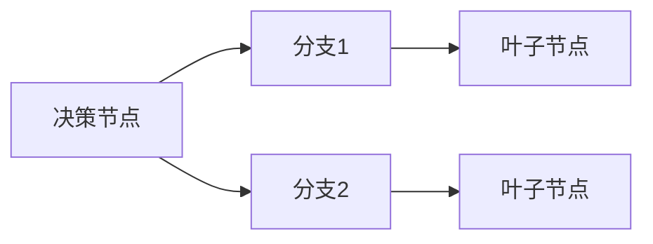
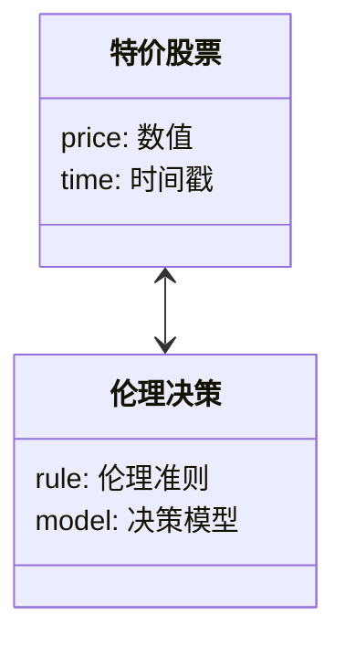
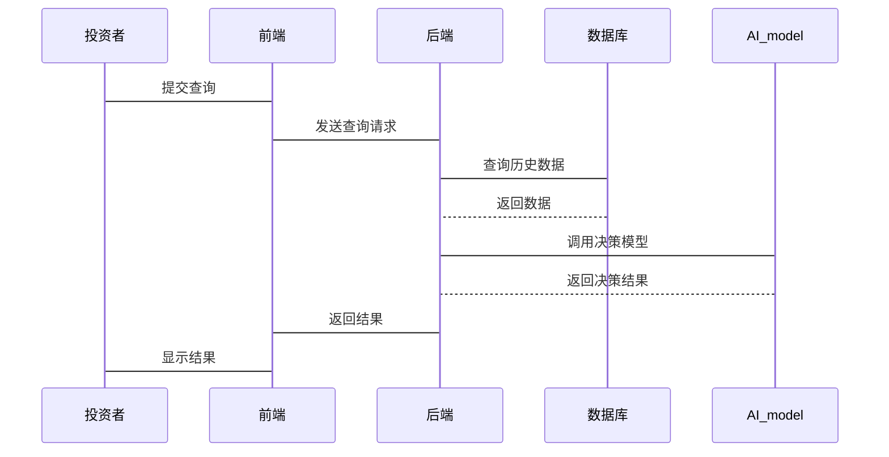

                 


# 特价股票与公司人工智能伦理决策能力的长期关系分析

> 关键词：特价股票，人工智能，伦理决策，时间序列分析，系统架构

> 摘要：本文探讨了特价股票市场与公司人工智能伦理决策能力之间的长期关系。通过分析特价股票的市场特性、人工智能伦理决策的核心概念与算法原理，构建了伦理决策框架，并通过系统架构设计和项目实战展示了如何将伦理决策应用于特价股票分析。文章最后提出了最佳实践建议，为投资者和AI开发者提供了理论与实践指导。

---

# 第一部分：特价股票与人工智能伦理决策的背景与概念

## 第1章：特价股票与人工智能伦理决策的背景介绍

### 1.1 特价股票的定义与特性

#### 1.1.1 特价股票的定义
特价股票是指在特定时间点，由于市场波动、公司公告或其他外部因素，股票价格出现大幅波动的股票。这些波动通常伴随着高风险和高回报的特性，吸引了很多短期投资者。

#### 1.1.2 特价股票的市场特性
- **高波动性**：特价股票的价格在短时间内可能剧烈波动。
- **低流动性**：某些特价股票的交易量可能较低，导致买卖价差较大。
- **高风险**：投资者可能面临较大的本金损失风险。

#### 1.1.3 特价股票与传统股票的区别
| 特性       | 特价股票         | 传统股票         |
|------------|------------------|------------------|
| 波动性       | 高               | 低               |
| 风险         | 高               | 中到低           |
| 投资策略     | 短期交易         | 长期投资         |

### 1.2 人工智能伦理决策的定义与核心要素

#### 1.2.1 人工智能伦理决策的定义
人工智能伦理决策是指在人工智能系统中，基于伦理准则和价值观，对复杂问题进行判断和选择的过程。这种决策过程旨在平衡利益相关者的权益，确保决策的透明性和可解释性。

#### 1.2.2 人工智能伦理决策的核心要素
- **伦理准则**：如公平性、透明性、可解释性等。
- **决策框架**：用于指导AI系统如何在不同情境下做出决策。
- **可解释性**：确保决策过程和结果能够被人类理解和验证。

#### 1.2.3 人工智能伦理决策的实现框架
人工智能伦理决策的实现通常包括以下几个步骤：
1. **识别问题**：明确需要决策的具体问题。
2. **制定准则**：建立决策的伦理准则。
3. **构建模型**：设计算法和模型来模拟决策过程。
4. **验证与优化**：通过测试和反馈不断优化决策模型。

### 1.3 特价股票与人工智能伦理决策的关系

#### 1.3.1 特价股票市场的复杂性与不确定性
特价股票市场的波动性高，信息不完全，投资者需要快速做出决策，这为人工智能伦理决策提供了应用场景。

#### 1.3.2 人工智能在股票决策中的优势
人工智能可以通过分析大量历史数据，识别市场模式，预测价格波动，帮助投资者做出更明智的决策。

#### 1.3.3 伦理决策对股票投资的长期影响
伦理决策可以帮助投资者在追求利润的同时，避免对市场造成过度波动，促进市场的长期稳定。

---

## 第2章：人工智能伦理决策的核心概念与联系

### 2.1 人工智能伦理决策的核心原理

#### 2.1.1 人工智能伦理决策的基本原理
人工智能伦理决策依赖于数据、算法和伦理准则。系统通过分析数据，应用算法生成决策，并根据伦理准则进行优化。

#### 2.1.2 伦理决策框架的构建
伦理决策框架通常包括以下几个部分：
1. **目标设定**：明确决策的目标。
2. **数据收集**：获取与决策相关的数据。
3. **算法选择**：选择适合的算法进行决策。
4. **伦理评估**：评估决策是否符合伦理准则。

#### 2.1.3 伦理决策模型的数学表达
伦理决策模型可以通过数学公式表示，例如：
$$
\text{决策} = \arg\min_{d \in D} (C(d) - V(d))
$$
其中，$C(d)$ 是决策的成本函数，$V(d)$ 是决策的价值函数。

### 2.2 特价股票与人工智能伦理决策的属性对比

#### 2.2.1 特价股票的属性特征
| 特性       | 描述             |
|------------|------------------|
| 波动性       | 高               |
| 风险         | 高               |
| 交易频率     | 高               |

#### 2.2.2 人工智能伦理决策的属性特征
| 特性       | 描述             |
|------------|------------------|
| 可解释性     | 高               |
| 透明性       | 高               |
| 灵活性       | 中               |

#### 2.2.3 两者的属性对比分析
通过对比分析，可以发现特价股票的高波动性和高风险特性，使得人工智能伦理决策在其中扮演着关键角色。

### 2.3 人工智能伦理决策的ER实体关系图

```mermaid
er
  actor:投资者
  action:决策行为
  entity:股票
  rule:伦理规则
  relation:属于
  relation:影响
  relation:触发
  actor -[决策行为]-> action
  action -[属于]-> entity
  entity -[影响]-> rule
  rule -[触发]-> action
```

---

## 第3章：人工智能伦理决策算法原理

### 3.1 时间序列分析算法

#### 3.1.1 时间序列分析的基本原理
时间序列分析是一种通过分析历史数据，预测未来趋势的方法。常用的算法包括ARIMA和LSTM。

#### 3.1.2 ARIMA模型的数学公式
$$
ARIMA(p, d, q)
$$
其中，$p$ 是自回归阶数，$d$ 是差分阶数，$q$ 是移动平均阶数。

#### 3.1.3 LSTM网络的应用


### 3.2 伦理决策模型的构建

#### 3.2.1 决策树模型的构建


### 3.3 算法实现与代码示例

#### 3.3.1 时间序列分析的Python代码
```python
import pandas as pd
import numpy as np
from statsmodels.tsa.arima_model import ARIMA

# 示例数据
data = pd.Series([1, 2, 3, 4, 5])
model = ARIMA(data, order=(1, 1, 1))
model_fit = model.fit()

# 预测下一个值
next_value = model_fit.forecast()[0]
print(f"预测的下一个值为：{next_value}")
```

---

## 第4章：系统分析与架构设计方案

### 4.1 问题场景介绍
本文构建了一个基于人工智能伦理决策的特价股票分析系统，旨在帮助投资者在波动性高的市场中做出更明智的决策。

### 4.2 项目介绍
本项目旨在通过人工智能技术，分析特价股票的市场波动，构建伦理决策框架，优化投资策略。

### 4.3 系统功能设计
#### 4.3.1 领域模型类图


### 4.4 系统架构设计

#### 4.4.1 系统架构图


### 4.5 系统接口设计
系统主要接口包括数据输入接口、决策模型接口和结果输出接口。

### 4.6 系统交互流程

#### 4.6.1 系统交互序列图


---

## 第5章：项目实战

### 5.1 环境安装
需要安装Python、Pandas、NumPy和Statsmodels等库。

### 5.2 核心代码实现

#### 5.2.1 时间序列分析代码
```python
import pandas as pd
import numpy as np
from statsmodels.tsa.arima_model import ARIMA

# 示例数据
data = pd.Series([1, 2, 3, 4, 5])
model = ARIMA(data, order=(1, 1, 1))
model_fit = model.fit()

# 预测下一个值
next_value = model_fit.forecast()[0]
print(f"预测的下一个值为：{next_value}")
```

#### 5.2.2 伦理决策模型代码
```python
class EthicalDecisionModel:
    def __init__(self, rules):
        self.rules = rules

    def make_decision(self, scenario):
        # 根据规则进行决策
        for rule in self.rules:
            if rule.apply(scenario):
                return rule.decision
        return None
```

### 5.3 案例分析与结果解读
通过分析一个实际的特价股票案例，展示如何应用上述算法进行决策。

### 5.4 项目总结
总结项目实现的过程，指出可能的优化方向和未来的改进空间。

---

## 第6章：最佳实践与注意事项

### 6.1 最佳实践
- **数据质量**：确保输入数据的准确性和完整性。
- **模型选择**：根据具体问题选择合适的算法和模型。
- **伦理准则**：确保决策过程符合伦理规范。

### 6.2 小结
本文通过分析特价股票与人工智能伦理决策的关系，构建了伦理决策框架，并展示了如何在实际项目中应用这些技术。

### 6.3 注意事项
- 伦理决策模型的复杂性可能会影响决策速度。
- 需要定期更新模型以适应市场变化。

### 6.4 拓展阅读
建议读者进一步阅读关于时间序列分析和伦理决策的文献，深入理解相关技术。

---

## 作者：AI天才研究院/AI Genius Institute & 禅与计算机程序设计艺术 /Zen And The Art of Computer Programming

---

以上就是《特价股票与公司人工智能伦理决策能力的长期关系分析》的完整目录和内容框架。通过系统的分析和详细的讲解，本文为读者提供了从理论到实践的全面指导。

