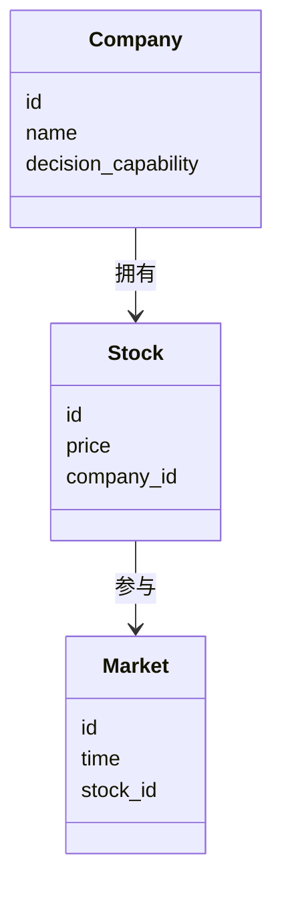
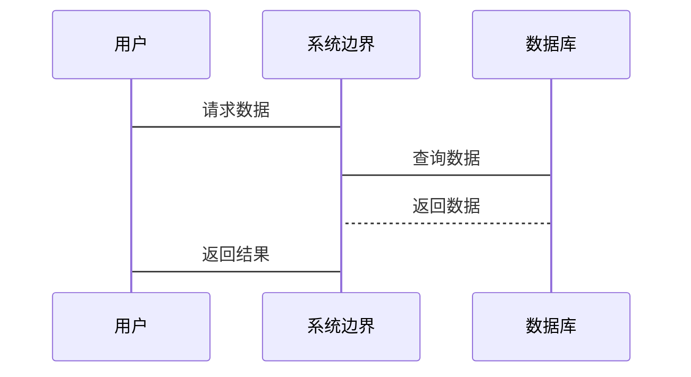

                 


# 特价股票与公司人工智能驱动决策能力的长期关系分析

**关键词**：特价股票、人工智能、决策能力、长期关系、股票价格预测

**摘要**：  
本文探讨了特价股票与公司人工智能驱动决策能力之间的长期关系。首先，介绍了特价股票的定义、特征及其在股票市场中的重要性。接着，分析了人工智能在公司决策能力中的应用，包括机器学习、数据挖掘和自然语言处理等技术。然后，详细阐述了人工智能驱动决策能力的长期性及其对股票市场的影响。通过对比分析，揭示了特价股票与公司决策能力之间的内在联系。最后，结合实际案例，探讨了人工智能技术在特价股票分析中的应用，展望了未来的发展趋势。

---

## 第一部分：特价股票与公司人工智能驱动决策能力的背景介绍

### 第1章：特价股票与公司决策能力的概述

#### 1.1 特价股票的定义与特征
##### 1.1.1 特价股票的定义
特价股票是指在特定市场条件下，由于公司内部问题、市场波动或其他外部因素导致股票价格显著低于其内在价值的股票。这类股票通常被视为具有潜在投资机会，因为它们可能在短期内被市场低估。

##### 1.1.2 特价股票的特征
- **价格低廉**：特价股票的价格通常远低于市场平均水平。
- **高波动性**：由于市场情绪的影响，特价股票的价格波动较大。
- **高风险**：投资特价股票的风险较高，但潜在回报也较大。

##### 1.1.3 特价股票与普通股票的区别
- 普通股票的价格相对稳定，而特价股票价格波动较大。
- 普通股票通常反映公司的长期价值，而特价股票可能因短期因素被低估。

#### 1.2 公司人工智能驱动决策能力的定义
##### 1.2.1 人工智能在公司决策中的作用
人工智能（AI）通过大数据分析、机器学习和自然语言处理等技术，帮助公司做出更精准的决策。AI能够处理大量数据，识别潜在的市场趋势和风险，从而优化决策过程。

##### 1.2.2 公司决策能力的评估标准
- **准确性**：决策是否基于可靠的数据和分析。
- **及时性**：决策是否能够快速响应市场变化。
- **长期性**：决策是否考虑了公司的长期目标和市场趋势。

##### 1.2.3 人工智能驱动决策的实现方式
- **数据驱动决策**：利用大数据分析技术，提取有价值的信息。
- **智能预测模型**：通过机器学习算法预测市场趋势和公司绩效。
- **实时监控**：利用AI实时监控市场变化，及时调整决策。

#### 1.3 特价股票与公司人工智能驱动决策能力的关系
##### 1.3.1 特价股票的形成机制
特价股票的形成通常与市场波动、公司业绩不佳或市场情绪等因素有关。通过人工智能技术，可以更准确地识别特价股票的形成原因。

##### 1.3.2 人工智能在股票价格预测中的应用
人工智能技术可以通过分析历史数据、市场情绪和公司基本面，预测股票价格的变化趋势。这为投资者提供了更科学的决策依据。

##### 1.3.3 公司决策能力对股票价格的影响
公司决策能力的强弱直接影响其市场表现和股票价格。通过人工智能技术优化决策能力，可以提升公司的市场表现，从而影响股票价格。

---

### 第2章：人工智能在金融领域的应用背景

#### 2.1 人工智能在金融领域的应用现状
##### 2.1.1 人工智能在金融分析中的应用
人工智能技术在金融分析中的应用包括股票价格预测、市场趋势分析和风险评估等。

##### 2.1.2 人工智能在风险管理中的应用
通过AI技术，金融机构可以实时监控市场风险，及时发现潜在问题，从而降低风险。

##### 2.1.3 人工智能在投资决策中的应用
人工智能技术可以帮助投资者制定投资策略，优化投资组合，提高投资回报率。

#### 2.2 特价股票与人工智能技术的结合
##### 2.2.1 特价股票的市场特点
特价股票通常具有高波动性和高风险的特征，这为人工智能技术的应用提供了挑战和机遇。

##### 2.2.2 人工智能技术在特价股票分析中的优势
- **数据处理能力**：AI能够处理大量数据，识别潜在的市场机会。
- **预测能力**：通过机器学习算法，AI可以预测特价股票的价格变化趋势。
- **实时监控**：AI可以实时监控市场变化，及时发现特价股票的投资机会。

##### 2.2.3 人工智能技术对股票市场的影响
人工智能技术的应用改变了股票市场的交易方式和市场结构，提高了市场的效率和透明度。

#### 2.3 人工智能驱动决策能力的长期性
##### 2.3.1 长期决策能力的定义
长期决策能力是指公司在长期时间内做出的决策是否能够实现其战略目标。

##### 2.3.2 人工智能在长期决策中的作用
人工智能技术可以帮助公司制定长期战略，优化资源配置，提升公司的核心竞争力。

##### 2.3.3 长期决策能力对股票市场的影响
公司长期决策能力的提升可以增强投资者的信心，从而对股票价格产生积极影响。

---

## 第二部分：人工智能驱动决策能力的核心概念与联系

### 第3章：人工智能驱动决策能力的核心原理

#### 3.1 机器学习在决策中的应用
##### 3.1.1 机器学习的基本原理
机器学习是一种人工智能技术，通过训练数据，模型可以自动学习特征，从而进行预测或分类。

##### 3.1.2 机器学习在决策中的具体应用
- **股票价格预测**：通过训练数据，机器学习模型可以预测股票价格的变化趋势。
- **风险评估**：通过分析历史数据，机器学习模型可以评估公司的风险水平。

##### 3.1.3 机器学习模型的训练与优化
训练机器学习模型需要大量的数据和计算资源。优化模型的目的是提高预测的准确性和稳定性。

#### 3.2 数据挖掘与决策支持
##### 3.2.1 数据挖掘的基本概念
数据挖掘是从大量数据中提取有价值信息的过程。

##### 3.2.2 数据挖掘在决策支持中的应用
- **市场分析**：通过数据挖掘，公司可以分析市场趋势，制定营销策略。
- **客户画像**：通过数据挖掘，公司可以了解客户的需求和行为，制定个性化服务。

##### 3.2.3 数据挖掘技术对决策能力的提升
数据挖掘技术可以帮助公司更准确地识别市场机会和风险，从而优化决策过程。

#### 3.3 自然语言处理在决策中的应用
##### 3.3.1 自然语言处理的基本原理
自然语言处理（NLP）是人工智能技术的一个分支，旨在让计算机能够理解和处理人类语言。

##### 3.3.2 自然语言处理在金融领域的应用
- **新闻分析**：通过NLP技术，可以分析新闻内容，预测股票价格的变化趋势。
- **情感分析**：通过NLP技术，可以分析市场情绪，评估股票的潜在风险。

##### 3.3.3 自然语言处理对决策能力的提升
自然语言处理技术可以帮助公司更准确地理解市场信息，从而做出更科学的决策。

### 第4章：核心概念与联系的对比分析

#### 4.1 人工智能驱动决策能力的属性特征
##### 4.1.1 数据驱动性
人工智能驱动决策能力依赖于大量数据的输入和处理。

##### 4.1.2 智能性
人工智能技术可以通过学习和推理，做出更智能的决策。

##### 4.1.3 实时性
人工智能技术可以实时处理数据，做出快速响应。

#### 4.2 特价股票与公司决策能力的ER实体关系图
```mermaid
er
  company {
    id
    name
    decision_capability
  }
  stock {
    id
    price
    company_id
  }
  market {
    id
    time
    stock_id
  }
```

---

## 第三部分：人工智能驱动决策能力的算法原理与系统架构

### 第4章：算法原理与系统架构

#### 4.1 算法原理
##### 4.1.1 算法选择
选择随机森林（Random Forest）作为股票价格预测的算法。

##### 4.1.2 算法流程


##### 4.1.3 算法实现
```python
import pandas as pd
from sklearn.ensemble import RandomForestRegressor
from sklearn.model_selection import train_test_split
from sklearn.metrics import mean_squared_error

# 数据加载
data = pd.read_csv('stock_data.csv')

# 特征选择
features = ['open', 'high', 'low', 'volume']
target = 'close'

# 数据分割
X_train, X_test, y_train, y_test = train_test_split(data[features], data[target], test_size=0.2)

# 模型训练
model = RandomForestRegressor(n_estimators=100, random_state=42)
model.fit(X_train, y_train)

# 模型预测
y_pred = model.predict(X_test)

# 模型评估
 mse = mean_squared_error(y_test, y_pred)
 print(f"均方误差：{mse}")
```

##### 4.1.4 数学公式
股票价格预测的随机森林模型公式如下：
$$
\hat{y} = \text{预测的股票价格}
$$

#### 4.2 系统架构
##### 4.2.1 系统功能设计


##### 4.2.2 系统架构设计
```mermaid
rectangle 系统边界 {
    系统边界
}

actor 用户
user -> 系统边界: 请求数据
系统边界 -> 数据库: 查询数据
数据库 --> 系统边界: 返回数据
系统边界 -> 用户: 返回结果
```

##### 4.2.3 系统接口设计
- **输入接口**：用户输入股票代码和时间范围。
- **输出接口**：返回股票价格预测结果和分析报告。

##### 4.2.4 系统交互


---

## 第四部分：项目实战与最佳实践

### 第5章：项目实战

#### 5.1 环境安装
- 安装Python和必要的库（如pandas、scikit-learn、mermaid等）。

#### 5.2 核心代码实现
```python
import pandas as pd
from sklearn.ensemble import RandomForestRegressor
from sklearn.metrics import mean_squared_error

# 数据加载
data = pd.read_csv('stock_data.csv')

# 特征选择
features = ['open', 'high', 'low', 'volume']
target = 'close'

# 数据分割
X_train, X_test, y_train, y_test = train_test_split(data[features], data[target], test_size=0.2)

# 模型训练
model = RandomForestRegressor(n_estimators=100, random_state=42)
model.fit(X_train, y_train)

# 模型预测
y_pred = model.predict(X_test)

# 模型评估
mse = mean_squared_error(y_test, y_pred)
print(f"均方误差：{mse}")
```

#### 5.3 代码解读与分析
- 数据加载：读取股票数据。
- 特征选择：选择影响股票价格的关键特征。
- 数据分割：将数据分为训练集和测试集。
- 模型训练：训练随机森林模型。
- 模型预测：预测股票价格。
- 模型评估：评估模型的准确性。

#### 5.4 实际案例分析
以某公司为例，分析其股票价格的波动情况，预测其未来的价格走势。

#### 5.5 项目小结
通过项目实战，验证了人工智能技术在股票价格预测中的有效性。

### 第6章：最佳实践

#### 6.1 小结
人工智能技术在特价股票分析中的应用具有重要意义。

#### 6.2 注意事项
- 数据质量：确保数据的准确性和完整性。
- 模型选择：选择适合的算法和模型。
- 风险控制：制定合理的风险管理策略。

#### 6.3 拓展阅读
建议读者进一步学习机器学习和自然语言处理技术，深入研究人工智能在金融领域的应用。

---

## 作者：AI天才研究院 & 禅与计算机程序设计艺术

