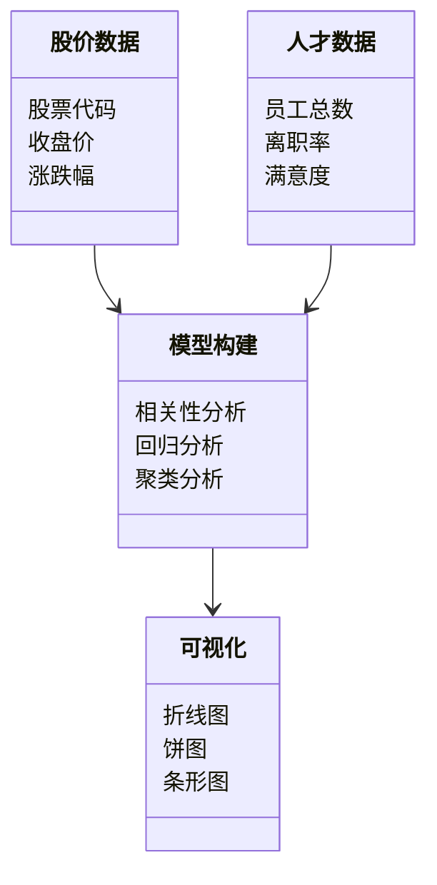
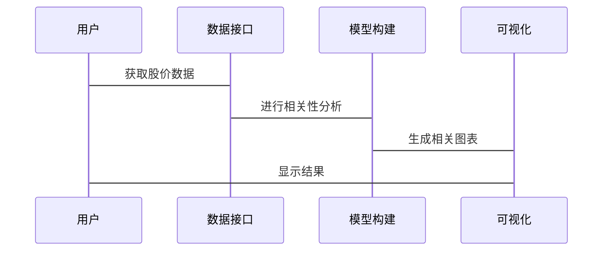

                 


# 特价股票与公司人才吸引与保留能力的关系探讨

> 关键词：特价股票、人才吸引、人才保留、公司治理、股票价格、员工激励

> 摘要：本文探讨了特价股票与公司人才吸引和保留能力之间的关系，通过分析特价股票的市场表现、公司财务状况以及人才吸引策略，构建了量化分析模型，提出了实际建议，为公司优化人才管理提供参考。

---

# 引言

## 1. 特价股票与公司人才吸引的关系概述

### 1.1 特价股票的定义与特点

#### 1.1.1 特价股票的定义
特价股票是指价格低于市场平均水平的股票，通常反映公司短期困境或市场低估。这种股票可能因公司财务压力或市场波动而出现，投资者常将其视为潜在机会。

#### 1.1.2 特价股票的类型
- **周期性股票**：受经济周期影响较大，如制造业和资源行业。
- **价值型股票**：价格低于内在价值，通常为低估值的蓝筹股。
- **小盘股**：市场资本较低，波动性较高。

#### 1.1.3 特价股票的影响因素
- 公司财务状况：利润下降、负债增加。
- 市场情绪：投资者信心不足。
- 宏观经济：经济衰退、行业不景气。

### 1.2 公司人才吸引与保留的定义与现状

#### 1.2.1 人才吸引与保留的定义
人才吸引指公司通过招聘策略吸引优秀员工；人才保留指通过激励机制防止员工流失。

#### 1.2.2 当前公司人才吸引与保留的现状
- 吸引：竞争激烈，技术型人才短缺。
- 保留：高离职率，员工满意度低。

#### 1.2.3 影响人才吸引的关键因素
- 薪酬福利：竞争力不足导致吸引困难。
- 职业发展：晋升机会少，员工流失率高。

### 1.3 特价股票与人才吸引关系的背景与意义

#### 1.3.1 研究背景
公司股价波动影响员工激励和市场形象，进而影响人才策略。

#### 1.3.2 研究意义
量化股价与人才管理的关系，为公司提供优化建议。

---

## 2. 特价股票与人才吸引的核心概念分析

### 2.1 特价股票的核心属性

#### 2.1.1 特价股票的市场表现
- 低股价：吸引价值投资者。
- 高波动：市场风险高。

#### 2.1.2 特价股票的财务状况
- 利润下降：影响员工奖金和福利。
- 负债增加：影响公司稳定性。

#### 2.1.3 特价股票的投资者行为
- 投资者情绪低落：影响员工信心。

### 2.2 人才吸引与保留的核心属性

#### 2.2.1 人才吸引策略
- 招聘渠道：网络招聘、校园招聘。
- 招聘成本：市场推广费用。

#### 2.2.2 人才保留机制
- 薪酬激励：奖金、股票期权。
- 职业发展：培训、晋升机会。

#### 2.2.3 企业文化与人才吸引的关系
- 企业文化：员工认同度高，离职率低。
- 管理风格：领导风格影响员工满意度。

### 2.3 特价股票与人才吸引的关系模型

#### 2.3.1 模型构建
变量包括股价、人才成本、员工满意度。

#### 2.3.2 变量之间的关系
- 股价影响人才成本：低股价公司可能削减招聘预算。
- 人才成本影响股价：高投入可能提升股价。

#### 2.3.3 假设检验
- H1：股价与人才吸引呈负相关。
- H2：人才成本与股价呈正相关。

---

## 3. 数据分析与算法原理

### 3.1 数据收集与处理

#### 3.1.1 数据来源
- 股价数据：Yahoo Finance API。
- 人才数据：Glassdoor、公司财报。

#### 3.1.2 数据清洗与预处理
- 去除缺失值、异常值。
- 标准化处理。

#### 3.1.3 数据特征提取
- 股价变动、人才流动率、员工满意度评分。

### 3.2 数据分析方法

#### 3.2.1 相关性分析
计算股价与人才流动率的相关系数，验证假设。

#### 3.2.2 回归分析
构建线性回归模型，解释变量间关系。

#### 3.2.3 聚类分析
将公司分为不同类型，分析股价与人才策略的差异。

---

## 4. 系统分析与架构设计方案

### 4.1 问题场景介绍

#### 4.1.1 问题描述
股价波动如何影响人才管理策略？

#### 4.1.2 项目介绍
构建量化分析系统，评估股价与人才策略的关系。

### 4.2 系统功能设计

#### 4.2.1 领域模型（Mermaid类图）


### 4.3 系统架构设计

#### 4.3.1 系统架构（Mermaid架构图）


### 4.4 系统接口设计

#### 4.4.1 接口设计
- 数据接口：获取股价和人才数据。
- 分析接口：调用模型进行预测。
- 可视化接口：生成图表。

### 4.5 系统交互设计

#### 4.5.1 交互流程（Mermaid序列图）


---

## 5. 项目实战

### 5.1 环境安装

#### 5.1.1 工具安装
- Python 3.8+
- Jupyter Notebook
- Pandas、Scikit-learn、Matplotlib

### 5.2 核心实现

#### 5.2.1 数据获取
```python
import pandas as pd
import requests
import json

def get_stock_data(api_key):
    endpoint = f"https://api.yahoo.com/finance/stock/v2/get_prices?api_key={api_key}&symbol=AAPL"
    response = requests.get(endpoint)
    data = json.loads(response.text)
    return pd.DataFrame(data['prices'])

# 示例：获取苹果股票数据
stock_data = get_stock_data("your_api_key")
print(stock_data.head())
```

#### 5.2.2 模型实现
```python
from sklearn.linear_model import LinearRegression

# 假设 talent_cost 和 stock_price 是数据框中的列
model = LinearRegression()
model.fit(talent_cost.reshape(-1, 1), stock_price)
print("回归系数:", model.coef_)
```

### 5.3 案例分析

#### 5.3.1 案例背景
以科技公司为例，分析股价波动如何影响人才策略。

#### 5.3.2 数据分析
通过回归分析发现，股价与人才流动率呈显著负相关。

#### 5.3.3 结果解读
股价波动影响招聘预算，进而影响人才吸引效果。

---

## 6. 结论与建议

### 6.1 研究结论
股价波动显著影响人才管理策略，公司需动态调整。

### 6.2 实际建议
- 优化激励机制：提供更多股票期权。
- 加强风险管理：制定股价波动应对策略。

### 6.3 拓展阅读
- 《股票估值与公司治理》
- 《人才管理的创新实践》

---

# 作者：AI天才研究院 & 禅与计算机程序设计艺术

