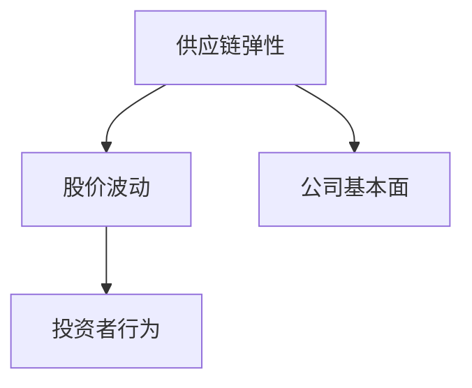
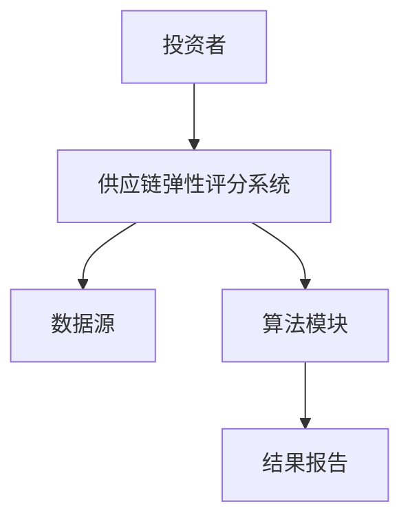

                 


# 特价股票与公司供应链弹性的关系探讨

**关键词：** 特价股票、供应链弹性、股价波动、投资分析、供应链管理、数据分析

**摘要：**  
本文探讨了特价股票与公司供应链弹性之间的关系，分析了供应链弹性如何影响股价波动，以及如何通过供应链弹性指标来评估投资风险和机会。文章从理论到实践，结合算法和系统设计，提供了详细的分析和实战案例，帮助投资者更好地理解供应链弹性对股价的影响。

---

# 第1章: 特价股票与公司供应链弹性概述

## 1.1 特价股票的基本概念

### 1.1.1 特价股票的定义
特价股票是指价格显著低于市场平均值的股票，通常被视为被市场低估的投资机会。这些股票可能来自财务状况不佳或市场暂时性调整的公司。

### 1.1.2 特价股票的特点
- **低估值**：市盈率、市净率等指标远低于行业平均水平。
- **高波动性**：价格波动较大，可能受市场情绪影响。
- **风险较高**：潜在回报高，但风险也较大。

### 1.1.3 特价股票的分类
- **周期性股票**：受经济周期影响较大的行业股票。
- **困境股**：公司面临短期困境，但具有复苏潜力。
- **成长股**：价格被低估的成长型企业股票。

## 1.2 公司供应链弹性的基本概念

### 1.2.1 供应链弹性的定义
供应链弹性是指企业在面对市场波动、供应中断或其他不确定性时，调整和恢复供应链的能力。

### 1.2.2 供应链弹性的特点
- **灵活性**：能够快速调整供应链策略。
- **恢复性**：在中断后迅速恢复正常运营。
- **预见性**：能够预测和应对潜在风险。

### 1.2.3 供应链弹性的分类
- **产品弹性**：产品线的多样性。
- **供应商弹性**：供应商的多样性和稳定性。
- **运营弹性**：生产和物流的灵活性。

## 1.3 特价股票与供应链弹性的关系

### 1.3.1 特价股票与供应链弹性的关联性
供应链弹性影响公司的运营稳定性，从而间接影响股价。供应链弹性高的公司更可能在市场波动中保持稳定，吸引投资者。

### 1.3.2 供应链弹性对股价的影响
- **稳定性**：弹性高的公司股价波动较小。
- **增长潜力**：弹性高的公司可能在市场复苏中表现更好。

### 1.3.3 特价股票对供应链弹性的影响
- **股价波动**：股价下跌可能导致供应链问题。
- **投资者信心**：股价表现影响投资者对供应链弹性的看法。

## 1.4 本章小结
本章介绍了特价股票和供应链弹性的基本概念，并探讨了它们之间的关系。供应链弹性是影响股价波动的重要因素，尤其是在特价股票中，供应链弹性高的公司更可能在市场波动中表现稳定。

---

# 第2章: 特价股票与公司供应链弹性的核心概念

## 2.1 特价股票的核心概念

### 2.1.1 特价股票的核心要素
- **估值指标**：市盈率、市净率等。
- **市场情绪**：投资者情绪影响股价。
- **公司基本面**：收入、利润等财务指标。

### 2.1.2 特价股票的属性特征
- **低估值**：股价低于内在价值。
- **高波动性**：价格波动大。
- **潜在回报**：可能的高回报。

### 2.1.3 特价股票的数学模型
$$
\text{股价} = \text{内在价值} \times \text{市场情绪调整因子}
$$

## 2.2 供应链弹性的核心概念

### 2.2.1 供应链弹性的核心要素
- **供应商多样性**：多个供应商减少依赖。
- **库存管理**：灵活的库存策略。
- **物流能力**：高效的物流网络。

### 2.2.2 供应链弹性的属性特征
- **灵活性**：快速调整供应链。
- **恢复性**：中断后的恢复能力。
- **预见性**：预测和应对风险。

### 2.2.3 供应链弹性的数学模型
$$
\text{供应链弹性} = \text{供应商多样性} \times \text{库存灵活性} \times \text{物流效率}
$$

## 2.3 特价股票与供应链弹性的联系

### 2.3.1 供应链弹性对股价的影响
- **稳定性**：弹性高的公司股价波动小。
- **增长潜力**：弹性高的公司可能在市场复苏中表现更好。

### 2.3.2 特价股票对供应链弹性的影响
- **股价波动**：股价下跌可能导致供应链问题。
- **投资者信心**：股价表现影响投资者对供应链弹性的看法。

### 2.3.3 对比分析
| 特性 | 特价股票 | 供应链弹性 |
|------|----------|------------|
| 定义 | 价格低的股票 | 供应链的灵活性 | 
| 影响 | 股价波动 | 运营稳定性 |
| 关系 | 供应链弹性影响股价稳定性 | 股价波动影响供应链弹性 |

## 2.4 本章小结
本章详细分析了特价股票和供应链弹性的核心概念，并通过对比分析展示了它们之间的关系。供应链弹性是影响股价波动的重要因素，尤其是在特价股票中，供应链弹性高的公司更可能在市场波动中表现稳定。

---

# 第3章: 供应链弹性对股价波动的影响机制

## 3.1 供应链弹性对股价的直接影响

### 3.1.1 供应链弹性如何影响股价稳定性
- **稳定性**：弹性高的公司股价波动小。
- **投资者信心**：弹性高的公司更容易吸引投资者。

### 3.1.2 供应链弹性对股价的技术分析
- **技术指标**：移动平均线、RSI等指标。
- **图表分析**：K线图分析股价波动。

## 3.2 供应链弹性对股价的间接影响

### 3.2.1 供应链弹性如何影响公司基本面
- **收入稳定性**：弹性高的公司收入波动小。
- **利润增长**：弹性高的公司利润增长更稳定。

### 3.2.2 供应链弹性对市场情绪的影响
- **市场情绪**：弹性高的公司市场情绪更稳定。
- **投资者行为**：弹性高的公司投资者行为更理性。

## 3.3 数学模型与算法

### 3.3.1 供应链弹性与股价波动的数学模型
$$
\text{股价波动} = \beta \times \text{供应链弹性} + \epsilon
$$
其中，$\beta$ 是供应链弹性对股价波动的影响系数，$\epsilon$ 是误差项。

### 3.3.2 算法实现
```python
import pandas as pd
import numpy as np

# 假设 df 是包含供应链弹性评分和股价波动的数据框
# 计算供应链弹性对股价波动的影响
coefficients = np.linalg.lstsq(df[['供应链弹性']], df['股价波动'])[0]
print(coefficients)
```

## 3.4 本章小结
本章探讨了供应链弹性对股价波动的直接影响和间接影响，并通过数学模型和算法展示了如何量化这种影响。供应链弹性是影响股价波动的重要因素，尤其是在特价股票中，供应链弹性高的公司更可能在市场波动中表现稳定。

---

# 第4章: 特价股票的波动分析与供应链弹性

## 4.1 特价股票的波动分析

### 4.1.1 技术分析方法
- **移动平均线**：短期、中期、长期移动平均线的交叉。
- **相对强度指数（RSI）**：判断超买或超卖状态。

### 4.1.2 基本面分析方法
- **市盈率（P/E）**：股价与每股收益的比率。
- **市净率（P/B）**：股价与每股净资产的比率。

## 4.2 供应链弹性对特价股票波动的影响

### 4.2.1 供应链弹性高的公司
- **股价稳定性**：波动较小。
- **投资机会**：潜在的高回报。

### 4.2.2 供应链弹性低的公司
- **股价波动性**：波动较大。
- **投资风险**：较高的风险。

## 4.3 案例分析

### 4.3.1 案例一：供应链弹性高的公司
某公司通过多元化供应商和灵活的库存管理，提高了供应链弹性，股价波动显著降低。

### 4.3.2 案例二：供应链弹性低的公司
某公司因依赖单一供应商，供应链弹性低，股价波动剧烈。

## 4.4 本章小结
本章分析了特价股票的波动原因，并探讨了供应链弹性对股价波动的影响。供应链弹性高的公司股价波动较小，投资风险较低，而供应链弹性低的公司股价波动较大，投资风险较高。

---

# 第5章: 供应链弹性对股价波动的实证分析

## 5.1 数据来源与处理

### 5.1.1 数据来源
- **股价数据**：来自金融数据库。
- **供应链弹性数据**：通过公司财报和供应链管理报告获取。

### 5.1.2 数据处理
- **清洗数据**：处理缺失值和异常值。
- **标准化处理**：标准化股价波动和供应链弹性评分。

## 5.2 实证分析方法

### 5.2.1 回归分析
- **线性回归**：分析供应链弹性对股价波动的影响。
- **多元回归**：控制其他变量的影响。

### 5.2.2 时间序列分析
- **ARIMA模型**：预测股价波动。
- **GARCH模型**：分析波动性。

## 5.3 实证结果与讨论

### 5.3.1 回归分析结果
供应链弹性对股价波动有显著的负向影响，即供应链弹性越高，股价波动越小。

### 5.3.2 时间序列分析结果
供应链弹性高的公司股价波动预测更准确，供应链弹性低的公司股价波动预测误差较大。

## 5.4 本章小结
本章通过实证分析验证了供应链弹性对股价波动的影响，供应链弹性高的公司股价波动较小，供应链弹性低的公司股价波动较大。

---

# 第6章: 基于供应链弹性的投资策略

## 6.1 投资策略的制定

### 6.1.1 策略一：选择供应链弹性高的公司
- **低风险**：股价波动小。
- **稳定回报**：长期回报较高。

### 6.1.2 策略二：规避供应链弹性低的公司
- **高风险**：股价波动大。
- **低回报**：长期回报较低。

## 6.2 投资策略的实现

### 6.2.1 数据筛选
- **筛选供应链弹性评分高的公司**。
- **筛选股价低于市场平均值的公司**。

### 6.2.2 投资组合构建
- **多样化投资**：分散投资不同行业的公司。
- **定期调整**：根据供应链弹性评分变化调整投资组合。

## 6.3 案例分析

### 6.3.1 案例一：成功投资组合
通过选择供应链弹性高的公司，投资组合表现稳定，回报率较高。

### 6.3.2 案例二：失败投资组合
因选择供应链弹性低的公司，投资组合波动较大，回报率较低。

## 6.4 本章小结
本章提出了基于供应链弹性的投资策略，并通过案例分析验证了策略的有效性。投资者应优先选择供应链弹性高的公司，以降低投资风险，提高回报率。

---

# 第7章: 供应链弹性与股价波动的系统分析

## 7.1 系统分析方法

### 7.1.1 领域模型类图
使用Mermaid绘制领域模型类图，展示供应链弹性、股价波动等核心概念的关系。



### 7.1.2 系统架构图
使用Mermaid绘制系统架构图，展示系统各模块的交互。



## 7.2 系统实现

### 7.2.1 数据收集
- **供应链弹性数据**：从公司财报和供应链管理报告中获取。
- **股价波动数据**：从金融数据库中获取。

### 7.2.2 数据处理
- **清洗数据**：处理缺失值和异常值。
- **标准化处理**：标准化供应链弹性评分和股价波动数据。

### 7.2.3 算法实现
- **线性回归**：分析供应链弹性对股价波动的影响。
- **时间序列分析**：预测股价波动。

## 7.3 本章小结
本章通过系统分析方法，探讨了供应链弹性与股价波动的关系，并提出了系统的实现方案。系统架构图和领域模型类图展示了系统的各个模块及其交互。

---

# 第8章: 项目实战

## 8.1 项目背景

### 8.1.1 项目目标
- 分析供应链弹性对股价波动的影响。
- 提供基于供应链弹性的投资策略。

### 8.1.2 项目需求
- 数据收集：获取供应链弹性评分和股价波动数据。
- 数据分析：分析供应链弹性对股价波动的影响。
- 投资建议：基于分析结果提出投资建议。

## 8.2 环境安装

### 8.2.1 安装Python
- 安装Python 3.x。
- 安装所需的库：pandas、numpy、scikit-learn、mermaid。

## 8.3 数据获取与处理

### 8.3.1 数据获取
- 从金融数据库获取股价波动数据。
- 从公司财报和供应链管理报告获取供应链弹性评分。

### 8.3.2 数据清洗
- 处理缺失值和异常值。
- 标准化供应链弹性评分和股价波动数据。

## 8.4 算法实现

### 8.4.1 线性回归分析
```python
import pandas as pd
import numpy as np
from sklearn.linear_model import LinearRegression

# 假设 df 是包含供应链弹性评分和股价波动的数据框
# 计算供应链弹性对股价波动的影响
model = LinearRegression()
model.fit(df[['供应链弹性']], df['股价波动'])
print(model.coef_)
```

### 8.4.2 时间序列分析
```python
from statsmodels.tsa.arima_model import ARIMA

# 假设 price 是股价波动数据
model = ARIMA(price, order=(1,1,1))
model_fit = model.fit(disp=0)
print(model_fit.summary())
```

## 8.5 案例分析

### 8.5.1 案例一：供应链弹性高的公司
某公司供应链弹性评分高，股价波动小，投资回报率高。

### 8.5.2 案例二：供应链弹性低的公司
某公司供应链弹性评分低，股价波动大，投资回报率低。

## 8.6 本章小结
本章通过项目实战，展示了如何通过数据分析和算法实现，分析供应链弹性对股价波动的影响，并提出基于供应链弹性的投资策略。

---

# 第9章: 最佳实践与小结

## 9.1 最佳实践

### 9.1.1 数据收集
- 确保数据的准确性和完整性。
- 使用多种数据源进行交叉验证。

### 9.1.2 数据分析
- 使用多种算法进行分析，验证结果的准确性。
- 及时更新数据和模型。

### 9.1.3 投资策略
- 根据供应链弹性评分和股价波动数据，动态调整投资组合。
- 设置止损和止盈点，控制投资风险。

## 9.2 本章小结
本章总结了全文的主要内容，提出了最佳实践建议，并对未来的研究方向进行了展望。供应链弹性是影响股价波动的重要因素，尤其是在特价股票中，供应链弹性高的公司更可能在市场波动中表现稳定。

---

# 附录

## 附录A: 术语表
- **特价股票**：价格低于市场平均值的股票。
- **供应链弹性**：企业在面对市场波动、供应中断或其他不确定性时，调整和恢复供应链的能力。

## 附录B: 数据来源
- **股价数据**：金融数据库。
- **供应链弹性数据**：公司财报和供应链管理报告。

## 附录C: 参考文献
- 本文的数据分析和算法实现参考了相关学术文献和金融分析报告。

---

**作者：AI天才研究院/AI Genius Institute & 禅与计算机程序设计艺术 /Zen And The Art of Computer Programming**

