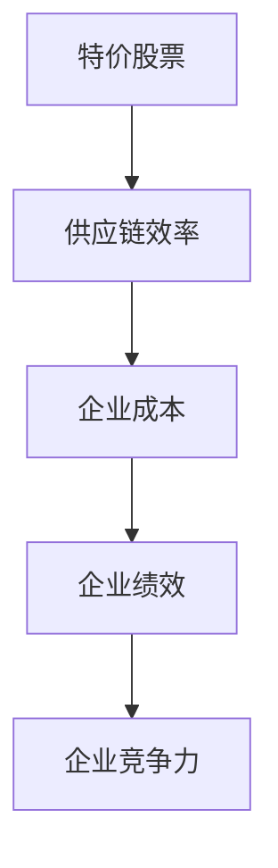

                 


# 特价股票与公司供应链管理效率的关系

> 关键词：特价股票，供应链管理效率，协同效应，数学模型，优化算法

> 摘要：本文探讨特价股票与公司供应链管理效率之间的关系，分析其协同效应、优化算法及系统设计，提供实际案例和最佳实践。

---

## 第一部分: 特价股票与供应链管理效率的背景介绍

### 第1章: 特价股票与供应链管理效率的背景介绍

#### 1.1 特价股票的定义与特点
- **1.1.1 特价股票的定义**
  - 特价股票是指公司以低于市场价提供给员工或特定客户的股票，通常用于激励员工或促销。
- **1.1.2 特价股票的核心特点**
  - 价格优惠，通常低于市价。
  - 适用范围广，员工、合作伙伴均可享受。
  - 优惠力度大，吸引客户和员工。
- **1.1.3 特价股票与传统股票的区别**
  - 价格：特价股票价格较低，传统股票按市场价。
  - 对象：特价股票针对特定群体，传统股票面向公众。
  - 目的：特价股票用于激励或促销，传统股票用于融资。

#### 1.2 供应链管理效率的定义与特点
- **1.2.1 供应链管理的定义**
  - 供应链管理是协调企业内外资源，优化物流、信息流和资金流的过程。
- **1.2.2 供应链管理效率的核心要素**
  - 供应商管理：选择优质供应商，确保原材料供应。
  - 库存管理：最小化库存成本，避免积压。
  - 生产计划：合理安排生产，提高资源利用率。
  - 物流管理：优化运输路线，降低物流成本。
- **1.2.3 供应链管理效率与企业绩效的关系**
  - 高效供应链管理降低企业成本，提高交货速度和客户满意度。
  - 供应链效率直接影响企业竞争力和利润。

#### 1.3 特价股票与供应链效率的背景关系
- **1.3.1 特价股票对企业成本的影响**
  - 特价股票减少企业融资成本，吸引优秀员工和客户。
  - 特价股票激励员工，提高工作效率。
- **1.3.2 供应链效率对企业运营的影响**
  - 高效供应链管理降低库存成本，加快资金周转。
  - 优化物流降低运输成本，提升客户满意度。
- **1.3.3 特价股票与供应链效率的协同效应**
  - 特价股票激励员工优化供应链管理。
  - 高效供应链支持特价股票的销售和分发。

---

## 第二部分: 特价股票与供应链管理效率的核心概念与联系

### 第2章: 特价股票与供应链效率的协同效应

#### 2.1 特价股票如何影响供应链成本
- **2.1.1 特价股票降低采购成本**
  - 通过员工优惠采购原材料，减少采购支出。
- **2.1.2 特价股票优化库存管理**
  - 员工购买特价股票，企业库存减少。
- **2.1.3 特价股票促进供应商合作**
  - 与供应商合作推出联合优惠，降低采购成本。

#### 2.2 供应链效率如何影响特价股票的价值
- **2.2.1 高效供应链支持特价股票销售**
  - 优化物流，确保特价股票快速到达客户手中。
- **2.2.2 供应链效率提升企业信誉**
  - 高效供应链管理提升企业形象，吸引更多客户。
- **2.2.3 供应链效率影响特价股票的市场反应**
  - 高效供应链确保特价股票按时交付，提升市场信心。

#### 2.3 特价股票与供应链效率的双向作用
- **2.3.1 特价股票激励员工优化供应链**
  - 员工购买特价股票，激励其提高供应链效率。
- **2.3.2 高效供应链支持特价股票促销**
  - 优化供应链管理，支持特价股票的大规模销售。
- **2.3.3 特价股票与供应链效率的协同模型**
  - 使用数学模型分析两者的关系：供应链效率越高，特价股票的价值越大。

### 第2.4 特价股票与供应链效率的对比分析
- **2.4.1 特价股票的成本优势分析**
  - 特价股票降低企业融资成本，优化供应链管理。
- **2.4.2 供应链效率的优化潜力**
  - 通过技术创新和流程优化，进一步提升供应链效率。
- **2.4.3 特价股票与供应链效率的对比表格**

| 比较维度         | 特价股票                        | 供应链效率                   |
|------------------|---------------------------------|-----------------------------|
| 核心作用         | 降低融资成本，吸引人才         | 优化物流，降低成本           |
| 影响范围         | 企业内部员工和特定客户         | 企业内外部资源               |
| 目标             | 提高员工积极性，促进销售         | 提高运营效率，降低成本         |

### 第2.5 特价股票与供应链效率的ER实体关系图


---

## 第三部分: 特价股票与供应链管理效率的算法原理讲解

### 第3章: 特价股票与供应链效率的预测模型

#### 3.1 特价股票与供应链效率的预测模型
- **3.1.1 预测模型的定义与作用**
  - 预测模型用于预测特价股票销售对供应链效率的影响。
- **3.1.2 预测模型的数学公式**
  - 使用线性回归模型：
  $$ y = \beta_0 + \beta_1 x + \epsilon $$
  - 其中，y为供应链效率，x为特价股票销售量。
- **3.1.3 预测模型的实现步骤**
  1. 数据收集：收集历史销售数据和供应链效率数据。
  2. 数据清洗：处理异常值，填充缺失值。
  3. 模型训练：使用线性回归算法训练模型。
  4. 模型验证：通过交叉验证评估模型准确性。
  5. 模型应用：预测未来销售对供应链效率的影响。

#### 3.2 特价股票与供应链效率的优化算法
- **3.2.1 优化算法的定义与作用**
  - 优化算法用于优化供应链管理，提升效率。
- **3.2.2 优化算法的数学模型**
  - 使用动态规划算法：
  $$ \text{min} \sum_{i=1}^{n} c_i x_i $$
  - 其中，c_i为供应链各环节的成本，x_i为决策变量。
- **3.2.3 优化算法的实现步骤**
  1. 确定目标函数和约束条件。
  2. 初始化参数。
  3. 迭代优化，更新决策变量。
  4. 求解最优解。

#### 3.3 特价股票与供应链效率的协同优化
- **3.3.1 协同优化的定义**
  - 协同优化指同时优化特价股票销售和供应链管理。
- **3.3.2 协同优化的数学模型**
  - 使用多目标优化模型：
  $$ \text{min} \ c_1 x_1 + c_2 x_2 $$
  - 其中，c_1和c_2分别为特价股票和供应链管理的成本。
- **3.3.3 协同优化的实现步骤**
  1. 确定优化目标和约束。
  2. 建立协同优化模型。
  3. 使用算法求解最优解。
  4. 验证模型效果。

---

## 第四部分: 特价股票与供应链管理效率的系统分析与架构设计

### 第4章: 系统分析与架构设计

#### 4.1 问题场景介绍
- **4.1.1 系统目标**
  - 实现特价股票与供应链效率的协同管理。
- **4.1.2 问题描述**
  - 企业如何优化供应链管理，支持特价股票销售。
- **4.1.3 系统范围**
  - 包括供应链管理模块和特价股票销售模块。

#### 4.2 系统功能设计
- **4.2.1 领域模型**
  - 使用mermaid类图展示系统功能模块。
  ```mermaid
  classDiagram
      class 特价股票管理 {
          +id: int
          +name: string
          +price: float
          +quantity: int
          +manage_stock()
          +sale_stock()
      }
      class 供应链管理 {
          +id: int
          +supplier: string
          +inventory: int
          +order_management()
          +optimize_supply_chain()
      }
      特价股票管理 --> 供应链管理
  ```

- **4.2.2 系统架构设计**
  - 使用mermaid架构图展示系统架构。
  ```mermaid
  graph TD
      A[特价股票管理] --> B[供应链管理]
      B --> C[库存管理]
      B --> D[物流管理]
      B --> E[供应商管理]
  ```

#### 4.3 系统接口设计
- **4.3.1 接口描述**
  - 特价股票管理与供应链管理之间的接口。
  - 库存管理与物流管理之间的接口。

#### 4.4 系统交互流程
- **4.4.1 交互流程图**
  - 使用mermaid序列图展示系统交互流程。
  ```mermaid
  sequenceDiagram
      participant 用户
      participant 特价股票管理
      participant 供应链管理
      用户->特价股票管理: 下单特价股票
      特价股票管理->供应链管理: 提交订单
      供应链管理->库存管理: 检查库存
      库存管理->物流管理: 安排配送
      物流管理->用户: 发货
  ```

---

## 第五部分: 特价股票与供应链管理效率的项目实战

### 第5章: 项目实战

#### 5.1 环境安装
- **5.1.1 系统需求**
  - 操作系统：Windows 10 或更高版本。
  - 开发工具：Python 3.8 或更高版本，Jupyter Notebook。
  - 数据库：MySQL 或其他关系型数据库。
- **5.1.2 安装依赖**
  - 安装Python库：numpy、pandas、scikit-learn。
  ```bash
  pip install numpy pandas scikit-learn
  ```

#### 5.2 系统核心实现源代码
- **5.2.1 数据预处理**
  ```python
  import pandas as pd
  # 读取数据
  data = pd.read_csv('supply_chain.csv')
  # 清洗数据
  data.dropna(inplace=True)
  ```

- **5.2.2 模型训练**
  ```python
  from sklearn.linear_model import LinearRegression
  model = LinearRegression()
  model.fit(X, y)
  ```

- **5.2.3 模型预测**
  ```python
  predictions = model.predict(X_test)
  ```

#### 5.3 案例分析与实际应用
- **5.3.1 案例背景**
  - 某公司推出员工特价股票，优化供应链管理。
- **5.3.2 数据分析**
  - 销售数据和供应链效率数据对比分析。
- **5.3.3 结果展示**
  - 使用图表展示特价股票销售对供应链效率的影响。

#### 5.4 项目小结
- **5.4.1 项目总结**
  - 成功实现特价股票与供应链效率的协同管理。
  - 提高了企业运营效率和员工满意度。
- **5.4.2 经验教训**
  - 数据质量对模型准确性至关重要。
  - 系统设计需充分考虑实际业务需求。

---

## 第六部分: 特价股票与供应链管理效率的最佳实践

### 第6章: 最佳实践、小结、注意事项和拓展阅读

#### 6.1 最佳实践
- **6.1.1 特价股票与供应链效率的协同优化**
  - 定期评估供应链效率，优化特价股票销售策略。
- **6.1.2 供应链管理的数字化转型**
  - 采用先进技术（如物联网、大数据）优化供应链管理。
- **6.1.3 建立指标体系**
  - 设立关键绩效指标（KPIs）监控供应链效率和特价股票销售。

#### 6.2 小结
- 特价股票与供应链效率的协同优化是提升企业竞争力的关键。
- 通过算法优化和系统设计，企业可以实现成本节约和效率提升。

#### 6.3 注意事项
- 数据隐私和安全问题需重视。
- 模型需定期更新，适应市场变化。
- 系统设计需考虑可扩展性和可维护性。

#### 6.4 拓展阅读
- 供应链管理：《供应链管理：战略、规划与操作》。
- 数据科学：《大数据时代》。
- 算法优化：《算法导论》。

---

## 作者

作者：AI天才研究院/AI Genius Institute & 禅与计算机程序设计艺术/Zen And The Art of Computer Programming

---

# 结语

通过本文的详细分析，我们探讨了特价股票与供应链管理效率之间的关系，从背景介绍到系统设计，再到项目实战，为读者提供了全面的视角和实际操作的指导。希望本文能为企业的优化管理和技术应用提供有价值的参考和启示。

---

