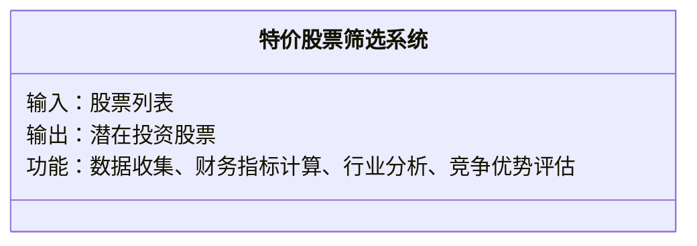

                 


# 特价股票与公司基本面分析的结合

## 关键词：特价股票，基本面分析，财务指标，投资策略，股票筛选

## 摘要：本文将探讨如何将特价股票与公司基本面分析相结合，以帮助投资者更好地识别潜在投资机会。通过分析常见的财务指标和行业趋势，本文提供了一套系统的投资策略，帮助投资者在低价股票中找到具有成长潜力的公司。

---

## 第1章: 特价股票与基本面分析的背景与意义

### 1.1 特价股票的基本概念

#### 1.1.1 什么是特价股票
特价股票通常指价格低于市场平均水平的股票，具有较高的上涨潜力。这类股票可能因市场低估或公司暂时困境而被忽视，但其潜在价值使其成为投资者关注的焦点。

#### 1.1.2 特价股票的特点与分类
- **特点**：
  - 价格低廉，通常低于行业平均水平。
  - 市盈率（P/E）和市净率（P/B）等指标可能低于行业平均水平。
  - 可能存在市场忽视或低估的情况。
- **分类**：
  - 周期性股票：受经济周期影响较大的行业股票。
  - 小盘股：市值较小的公司股票，具有更高的增长潜力。
  - 价值股：被市场低估的股票，通常具有较高的股息率。

#### 1.1.3 特价股票的投资价值
- 低价股票具有较高的上涨潜力，尤其是在市场回暖或公司基本面改善时。
- 投资者可以通过低价股票在市场波动中获得超额收益。

### 1.2 公司基本面分析的核心要素

#### 1.2.1 什么是公司基本面分析
基本面分析是通过对公司的财务报表、行业地位和经营状况等多方面因素的分析，评估公司内在价值的一种方法。

#### 1.2.2 财务报表分析的关键指标
- **资产负债表**：
  - 资产总额：公司拥有的资产总和。
  - 负债总额：公司欠款的总和。
  - 所有者权益：公司净资产的价值。
- **利润表**：
  - 收入：公司营业收入。
  - 利润：净利润、息税前利润（EBIT）。
- **现金流量表**：
  - 经营活动现金流：公司日常经营活动产生的现金流。
  - 投资活动现金流：公司投资活动产生的现金流。

#### 1.2.3 行业分析与竞争优势
- **行业分析**：
  - 行业周期：行业的兴衰周期。
  - 市场容量：行业的市场规模和发展潜力。
- **竞争优势**：
  - 技术优势：公司在技术上的领先地位。
  - 成本优势：公司在生产成本上的优势。
  - 市场占有率：公司在市场中的份额。

### 1.3 特价股票与基本面分析的结合意义

#### 1.3.1 特价股票的潜在机会
- 低价股票可能因市场低估而具有较高的上涨潜力。
- 市场波动可能导致低价股票的价格回归其真实价值。

#### 1.3.2 基本面分析在低价股投资中的作用
- 帮助投资者识别具有潜在成长性的低价股票。
- 通过分析公司财务状况，避免投资于财务状况不佳的公司。

#### 1.3.3 结合两者的投资策略
- 通过基本面分析筛选出具有成长潜力的低价股票。
- 结合市场周期和行业趋势，制定投资策略。

### 1.4 本章小结
本章介绍了特价股票的基本概念和基本面分析的核心要素，强调了将两者结合的重要性，为后续分析奠定了基础。

---

## 第2章: 特价股票筛选的指标与方法

### 2.1 常用财务指标分析

#### 2.1.1 市盈率（P/E）的计算与应用
- **公式**：
  $$ P/E = \frac{Price}{Earnings} $$
- **应用**：
  - 低市盈率可能意味着股票被低估。
  - 高市盈率可能意味着市场对公司未来盈利的预期较高。

#### 2.1.2 市净率（P/B）的计算与应用
- **公式**：
  $$ P/B = \frac{Price}{Book\ Value} $$
- **应用**：
  - 低市净率可能意味着股票价值被低估。
  - 高市净率可能意味着公司资产质量较低。

#### 2.1.3 股息率的计算与应用
- **公式**：
  $$ Dividend\ Yield = \frac{Dividend}{Price} $$
- **应用**：
  - 高股息率可能意味着公司具有较高的分红能力。
  - 低股息率可能意味着公司处于成长期，倾向于将利润再投资。

#### 2.1.4 净资产收益率（ROE）的计算与应用
- **公式**：
  $$ ROE = \frac{Net\ Profit}{Total\ Equity} $$
- **应用**：
  - 高ROE可能意味着公司盈利能力强。
  - 低ROE可能意味着公司盈利能力弱。

### 2.2 特价股票筛选的逻辑框架

#### 2.2.1 低估值股票的筛选标准
- 市盈率低于行业平均水平。
- 市净率低于行业平均水平。

#### 2.2.2 财务健康状况的评估
- 负债率合理，偿债能力较强。
- 资产周转率较高，运营效率较高。

#### 2.2.3 行业地位与竞争优势分析
- 公司在行业内具有一定的市场份额。
- 公司具有技术或成本优势。

### 2.3 特价股票筛选的实战案例

#### 2.3.1 案例一：如何筛选出一只潜在的特价股票
- **公司简介**：假设某公司是一家制造业企业，当前股价较低，市盈率和市净率均低于行业平均水平。
- **财务指标分析**：
  - 市盈率：10，行业平均市盈率：15。
  - 市净率：1.5，行业平均市净率：2。
  - ROE：12%，行业平均ROE：8%。
- **结论**：该股票具有较高的投资价值，可能被市场低估。

#### 2.3.2 案例二：如何避免价值陷阱
- **公司简介**：某公司是一家亏损多年的公司，当前股价较低，市盈率为负。
- **财务指标分析**：
  - 负债率：80%，远高于行业平均水平。
  - 净资产收益率：-5%，连续三年亏损。
- **结论**：该股票属于价值陷阱，应避免投资。

### 2.4 本章小结
本章详细介绍了特价股票筛选的指标与方法，并通过实际案例展示了如何通过基本面分析筛选出具有投资价值的特价股票。

---

## 第3章: 公司基本面分析的深度解读

### 3.1 财务报表分析的核心内容

#### 3.1.1 资产负债表的关键指标
- **资产总额**：公司拥有的资产总和。
- **负债总额**：公司欠款的总和。
- **所有者权益**：公司净资产的价值。

#### 3.1.2 利润表的关键指标
- **收入**：公司营业收入。
- **净利润**：公司净利润。

#### 3.1.3 现金流量表的关键指标
- **经营活动现金流**：公司日常经营活动产生的现金流。
- **投资活动现金流**：公司投资活动产生的现金流。

### 3.2 财务健康状况的评估方法

#### 3.2.1 负债率与偿债能力分析
- **负债率**：
  $$ Debt\ Ratio = \frac{Total\ Liabilities}{Total\ Assets} $$
- **偿债能力**：
  - 流动比率：$$ Current\ Ratio = \frac{Current\ Assets}{Current\ Liabilities} $$
  - 速动比率：$$ Quick\ Ratio = \frac{Current\ Assets - Inventory}{Current\ Liabilities} $$

#### 3.2.2 资产周转率与运营效率分析
- **资产周转率**：
  $$ Asset\ Turnover = \frac{Revenue}{Total\ Assets} $$
- **运营效率**：
  - 存货周转率：$$ Inventory\ Turnover = \frac{Cost\ of\ Goods\ Sold}{Average\ Inventory} $$

#### 3.2.3 盈利能力分析
- **净利润率**：
  $$ Net\ Profit\ Margin = \frac{Net\ Profit}{Revenue} $$
- **毛利率**：
  $$ Gross\ Margin = \frac{Revenue - Cost\ of\ Goods\ Sold}{Revenue} $$

### 3.3 行业分析与竞争优势评估

#### 3.3.1 行业周期与市场地位
- **行业周期**：行业的兴衰周期。
- **市场地位**：公司在市场中的份额和地位。

#### 3.3.2 行业政策与竞争格局
- **行业政策**：政府对行业的政策和法规。
- **竞争格局**：行业内主要竞争对手的情况。

#### 3.3.3 公司核心竞争力分析
- **技术优势**：公司在技术上的领先地位。
- **成本优势**：公司在生产成本上的优势。
- **品牌优势**：公司在品牌影响力上的优势。

### 3.4 本章小结
本章详细解读了公司基本面分析的核心内容，包括财务报表分析、财务健康状况评估和行业分析，为投资者提供了全面的分析框架。

---

## 第4章: 特价股票与基本面分析的结合策略

### 4.1 特价股票投资的逻辑框架

#### 4.1.1 低估值与高增长的平衡点
- **低估值**：市盈率和市净率低于行业平均水平。
- **高增长**：净利润增长率高于行业平均水平。

#### 4.1.2 行业周期与个股选择的结合
- **行业周期**：选择处于上升周期的行业。
- **个股选择**：选择行业内具有竞争优势的公司。

#### 4.1.3 风险与收益的权衡
- **风险**：市场波动、公司基本面变化。
- **收益**：股价上涨带来的收益。

### 4.2 基本面分析在特价股票投资中的应用

#### 4.2.1 低估值股票的筛选
- 通过市盈率和市净率等指标筛选出低估值股票。
- 结合行业分析和公司基本面分析，选择具有竞争优势的公司。

#### 4.2.2 行业趋势与投资机会
- 选择处于上升周期的行业。
- 选择行业内具有竞争优势的公司。

#### 4.2.3 投资组合的构建
- **分散投资**：避免过度集中于某一只股票。
- **动态调整**：根据市场变化和公司基本面变化，动态调整投资组合。

### 4.3 本章小结
本章详细介绍了特价股票与基本面分析的结合策略，包括低估值与高增长的平衡点、行业周期与个股选择的结合以及风险与收益的权衡。

---

## 第5章: 系统分析与架构设计方案

### 5.1 问题场景介绍
- 投资者希望通过基本面分析筛选出具有投资价值的特价股票。
- 需要一个系统化的解决方案来帮助投资者进行分析和决策。

### 5.2 系统功能设计（领域模型）



### 5.3 系统架构设计

```mermaid
container 投资者 {
    actor 投资者
}

container 系统 {
    component 数据收集模块 {
        [从数据库中获取股票数据]
    }
    component 财务指标计算模块 {
        [计算市盈率、市净率、股息率等指标]
    }
    component 行业分析模块 {
        [分析行业周期和竞争格局]
    }
    component 竞争优势评估模块 {
        [评估公司竞争优势]
    }
    component 投资决策模块 {
        [根据分析结果生成投资建议]
    }
}

investor --> 数据收集模块
数据收集模块 --> 财务指标计算模块
财务指标计算模块 --> 行业分析模块
行业分析模块 --> 竞争优势评估模块
竞争优势评估模块 --> 投资决策模块
投资决策模块 --> 投资者
```

### 5.4 系统接口设计
- **输入接口**：接受投资者输入的股票列表和相关数据。
- **输出接口**：输出潜在投资股票列表和投资建议。

### 5.5 系统交互设计

```mermaid
sequenceDiagram
    actor 投资者
    component 系统
    投资者 -> 系统: 提交股票列表
    系统 -> 投资者: 返回潜在投资股票列表
    投资者 -> 系统: 请求投资建议
    系统 -> 投资者: 提供投资建议
```

### 5.6 本章小结
本章通过系统化的架构设计，展示了如何通过技术手段帮助投资者进行特价股票与基本面分析的结合，为投资者提供了便捷的工具和方法。

---

## 第6章: 项目实战——基于基本面分析的特价股票筛选系统

### 6.1 环境安装
- **工具选择**：
  - 数据库：MySQL 或 PostgreSQL。
  - 数据分析工具：Python（Pandas、NumPy）。
  - 可视化工具：Matplotlib 或 Seaborn。

### 6.2 系统核心实现源代码

#### 6.2.1 数据收集模块

```python
import pandas as pd
import numpy as np

# 从数据库中获取股票数据
def get_stock_data():
    # 数据库连接代码
    pass
```

#### 6.2.2 财务指标计算模块

```python
def calculate_financial_ratios(stock_data):
    stock_data['P/E'] = stock_data['Price'] / stock_data['Earnings']
    stock_data['P/B'] = stock_data['Price'] / stock_data['Book Value']
    stock_data['ROE'] = stock_data['Net Profit'] / stock_data['Total Equity']
    return stock_data
```

#### 6.2.3 行业分析模块

```python
def industry_analysis(stock_data, industry):
    industry_data = stock_data[stock_data['Industry'] == industry]
    return industry_data
```

#### 6.2.4 竞争优势评估模块

```python
def evaluate_competitive_advantages(stock_data):
    stock_data['Competitive Advantage'] = stock_data.apply(lambda x: 'Strong' if (x['ROE'] > industry_average_ROE) else 'Weak', axis=1)
    return stock_data
```

#### 6.2.5 投资决策模块

```python
def investment_decision(stock_data):
    # 筛选低估值股票
    undervalued_stocks = stock_data[(stock_data['P/E'] < stock_data['P/E'].mean()) & (stock_data['P/B'] < stock_data['P/B'].mean())]
    # 选择具有竞争优势的公司
    undervalued_stocks = undervalued_stocks[undervalued_stocks['Competitive Advantage'] == 'Strong']
    return undervalued_stocks
```

### 6.3 代码应用解读与分析
- **数据收集模块**：从数据库中获取股票数据，并进行清洗和预处理。
- **财务指标计算模块**：计算市盈率、市净率和ROE等财务指标。
- **行业分析模块**：根据行业进行数据筛选，分析行业周期和竞争格局。
- **竞争优势评估模块**：评估公司竞争优势，筛选出具有竞争优势的公司。
- **投资决策模块**：根据分析结果，筛选出具有投资价值的特价股票。

### 6.4 实际案例分析
- **案例分析**：
  - 数据收集：从数据库中获取某行业的股票数据。
  - 财务指标计算：计算市盈率、市净率和ROE等指标。
  - 行业分析：分析行业周期和竞争格局。
  - 竞争优势评估：评估公司竞争优势。
  - 投资决策：筛选出具有投资价值的特价股票。

### 6.5 本章小结
本章通过实际案例展示了如何通过基本面分析筛选出具有投资价值的特价股票，并提供了相关的源代码和分析。

---

## 第7章: 总结与展望

### 7.1 本章总结
本文详细探讨了特价股票与公司基本面分析的结合，通过分析财务指标和行业趋势，提供了一套系统的投资策略，帮助投资者在低价股票中找到具有成长潜力的公司。

### 7.2 未来展望
- **技术发展**：随着人工智能和大数据技术的发展，未来可以通过更多的数据和技术手段来优化投资策略。
- **市场变化**：投资者需要根据市场变化和公司基本面变化，动态调整投资策略。

### 7.3 最佳实践 tips
- **分散投资**：避免过度集中于某一只股票。
- **长期投资**：选择具有长期成长潜力的公司。
- **持续学习**：关注市场动态和公司基本面变化。

### 7.4 小结
特价股票与公司基本面分析的结合是投资者在股票投资中的一种重要策略，通过本文提供的方法和工具，投资者可以更好地识别潜在投资机会，实现投资目标。

---

## 作者：AI天才研究院/AI Genius Institute & 禅与计算机程序设计艺术 /Zen And The Art of Computer Programming

---

**本文通过详细分析特价股票与公司基本面分析的结合，为投资者提供了一套系统的投资策略，帮助他们在低价股票中找到具有成长潜力的公司。**

