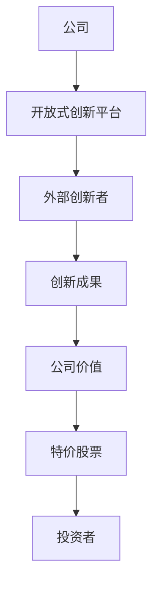
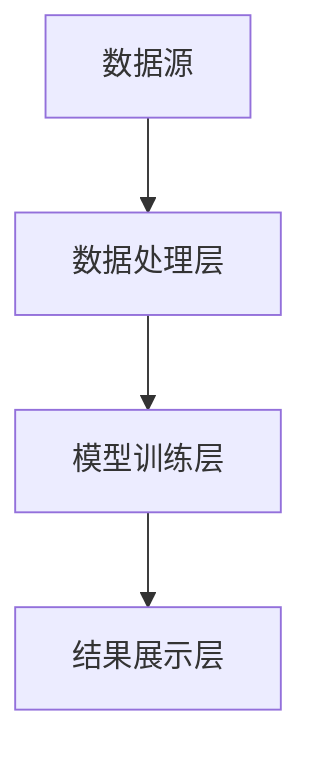
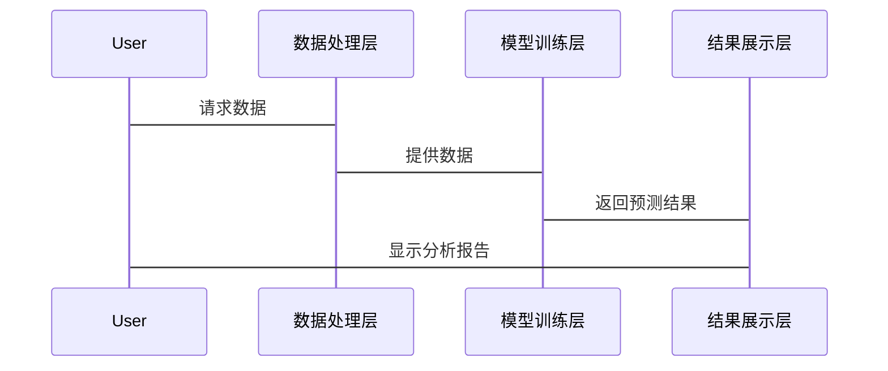

                 


# 特价股票与公司开放式创新平台生态系统潜在关联研究

> 关键词：特价股票、开放式创新平台、生态系统、潜在关联、算法模型

> 摘要：本文旨在研究特价股票与公司开放式创新平台生态系统之间的潜在关联。通过分析开放式创新平台的运作机制、特价股票的市场特点，探讨两者如何相互作用，并设计相应的算法模型进行预测和分析。本文结合实际案例，提出系统的解决方案，并总结最佳实践，为相关研究和应用提供参考。

---

## 第一部分：背景介绍

### 第1章：特价股票与公司开放式创新平台概述

#### 1.1 问题背景
- **特价股票的定义与特点**  
  特价股票指的是价格相对较低的股票，通常具有较高的增长潜力。这类股票可能因为市场波动、公司战略调整或行业变化而被低估。
  
- **开放式创新平台的定义与特点**  
  开放式创新平台是指企业通过开放资源、数据和平台，吸引外部创新者（如开发者、研究人员、合作伙伴）共同参与产品开发、技术创新和商业模式创新。其特点是开放性、协作性和创新性。

- **两者的潜在关联性**  
  开放式创新平台通过吸引外部创新资源，可能提升公司的竞争力和市场地位，从而影响股票价格。特价股票可能成为公司吸引创新者的重要工具，而创新活动也可能推动股价上涨。

#### 1.2 问题描述
- **特价股票市场的现状与挑战**  
  特价股票市场波动较大，信息不对称严重，投资者难以准确判断其价值。
  
- **开放式创新平台在企业中的应用现状**  
  开放式创新平台已被广泛应用于技术创新、产品开发等领域，但其对股票市场的影响尚未被系统研究。
  
- **两者关联的研究意义**  
  探讨开放式创新平台对特价股票的影响，有助于企业制定更有效的创新战略，投资者也能更好地把握市场机会。

#### 1.3 问题解决
- **研究目标**  
  分析开放式创新平台对特价股票的影响机制，构建预测模型，评估其实际效果。
  
- **研究方法**  
  结合定量分析（算法模型）和定性分析（案例研究），探讨两者之间的潜在关联。
  
- **研究意义**  
  为投资者和企业提供新的视角，优化投资决策和创新策略。

---

## 第二部分：核心概念与联系

### 第2章：核心概念与联系分析

#### 2.1 核心概念的原理
- **开放式创新平台的运作机制**  
  开放式创新平台通过开放API、数据共享、协作工具等，吸引外部创新者参与开发，形成多方协作的生态系统。
  
- **特价股票的市场特点**  
  特价股票通常价格较低，但具有较高的增长潜力，可能因为市场低估或公司转型而被忽视。

#### 2.2 概念属性特征对比
| 特性               | 开放式创新平台             | 特价股票               |
|--------------------|--------------------------|-----------------------|
| 核心目标           | 推动技术创新与协作       | 提供低价投资机会       |
| 参与主体           | 开发者、合作伙伴、企业     | 投资者、企业           |
| 主要特征           | 开放性、协作性、创新性     | 低价性、波动性、增长性 |
| 影响因素           | 创新活动、合作效果       | 市场情绪、公司业绩     |

#### 2.3 实体关系图


---

## 第三部分：算法原理

### 第3章：算法原理与模型设计

#### 3.1 算法选择与原理
- **线性回归模型**  
  使用线性回归模型预测创新活动对股票价格的影响。  
  $$ y = a + bx $$  
  其中，$y$为股票价格，$x$为创新活动指标，$a$和$b$为模型参数。

- **神经网络模型**  
  使用LSTM（长短期记忆网络）预测股票价格，模型结构如下：
  ```mermaid
  graph TD
      I[输入层] --> H1[LSTM层]
      H1 --> H2[全连接层]
      H2 --> O[输出层]
  ```

#### 3.2 数据预处理
- 数据清洗：处理缺失值、异常值。
- 特征工程：提取创新活动指标（如提交代码数量、合作次数）和股票市场数据（如收盘价、成交量）。

#### 3.3 模型训练与验证
- 训练数据：历史股票价格与创新活动数据。
- 验证指标：均方误差（MSE）、R²系数。

#### 3.4 模型实现
```python
import pandas as pd
from sklearn.linear_model import LinearRegression

# 数据加载与预处理
data = pd.read_csv('innovation_stock.csv')
X = data[['innovation_activities']]
y = data['stock_price']

# 模型训练
model = LinearRegression()
model.fit(X, y)

# 模型预测
predicted_price = model.predict(X)
```

---

## 第四部分：系统分析与架构设计

### 第4章：系统分析与架构设计

#### 4.1 问题场景介绍
- 某科技公司希望通过开放式创新平台提升技术创新能力，同时利用特价股票吸引投资者。

#### 4.2 系统功能设计
- **数据收集模块**：收集创新活动数据和股票市场数据。
- **模型训练模块**：训练预测模型。
- **结果展示模块**：展示预测结果和分析报告。

#### 4.3 系统架构设计


#### 4.4 接口设计与交互流程


---

## 第五部分：项目实战

### 第5章：项目实战与案例分析

#### 5.1 环境安装
- **安装Python和相关库**：`pip install pandas numpy scikit-learn`

#### 5.2 核心代码实现
```python
import pandas as pd
from sklearn.linear_model import LinearRegression
from sklearn.metrics import mean_squared_error

# 数据加载
data = pd.read_csv('innovation_stock.csv')

# 特征工程
X = data[['innovation_activities', 'market_sentiment']]
y = data['stock_price']

# 模型训练
model = LinearRegression()
model.fit(X, y)

# 预测与评估
predicted_price = model.predict(X)
mse = mean_squared_error(y, predicted_price)
r_squared = model.score(X, y)

print(f"均方误差: {mse}\nR²系数: {r_squared}")
```

#### 5.3 实际案例分析
- 某公司通过开放式创新平台吸引大量开发者，显著提升了技术创新能力，推动了股价上涨。

#### 5.4 项目总结
- 项目成功构建了预测模型，验证了开放式创新平台对特价股票的潜在影响。

---

## 第六部分：最佳实践

### 第6章：总结与展望

#### 6.1 小结
- 开放式创新平台与特价股票之间存在潜在关联，模型能够有效预测股价变化。

#### 6.2 注意事项
- 数据质量和模型选择对预测结果影响较大，需谨慎处理。
- 结合多种模型和数据分析方法，提高预测准确性。

#### 6.3 未来研究方向
- 探讨更复杂的模型（如深度学习）的应用。
- 结合更多市场因素，扩展研究范围。

#### 6.4 拓展阅读
- 推荐阅读《开放式创新》（《The Innovator's DNA》）和《股票技术分析实战》。

---

## 作者：AI天才研究院/AI Genius Institute & 禅与计算机程序设计艺术/Zen And The Art of Computer Programming

---

这篇文章通过系统分析和实际案例，深入探讨了特价股票与公司开放式创新平台生态系统之间的潜在关联，为相关研究和实践提供了有价值的参考。

