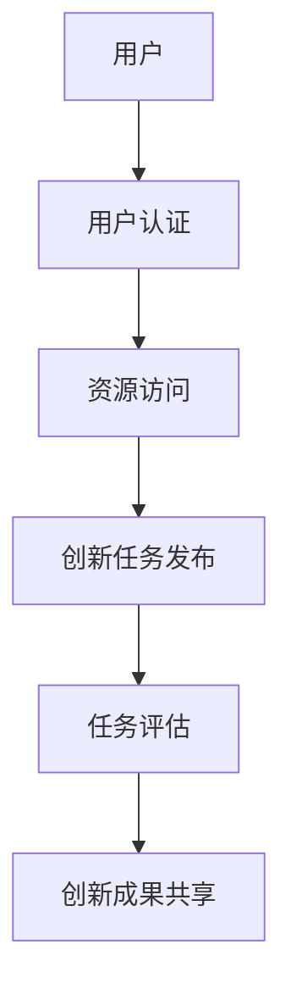

                 


# 特价股票与公司开放式创新平台网络效应的潜在关联研究

> 关键词：特价股票，开放式创新平台，网络效应，数学模型，系统架构，项目实战

> 摘要：本文从特价股票和公司开放式创新平台的背景出发，深入探讨两者在网络效应方面的潜在关联。通过分析网络效应的数学模型，设计系统的架构，并结合实际案例，揭示了两者在网络效应中的协同作用，为公司开放式创新平台的网络效应研究提供了新的视角。

---

# 第1章: 特价股票与公司开放式创新平台的背景介绍

## 1.1 特价股票的基本概念

### 1.1.1 特价股票的定义

特价股票是指公司发行的股票价格低于其面值的股票。通常，公司会在特定条件下发行特价股票，以吸引投资者或进行公司重组。

### 1.1.2 特价股票的分类

1. 普通特价股票：无特殊权利，仅享有普通股东权利。
2. 优先特价股票：享有优先分红和优先清偿权。
3. 附带条件的特价股票：可能附带特定的行权条件或限制。

### 1.1.3 特价股票的市场背景

特价股票通常出现在公司财务状况不佳或需要快速融资的情况下。此时，公司通过发行特价股票吸引投资者，以维持运营或进行业务扩展。

## 1.2 公司开放式创新平台的定义与特点

### 1.2.1 开放式创新平台的定义

开放式创新平台是指公司通过开放其资源和数据，吸引外部创新者（如开发者、研究人员）参与合作，共同解决技术难题或推动产品创新的平台。

### 1.2.2 开放式创新平台的核心特点

1. 开放性：允许外部人员访问公司资源。
2. 协作性：鼓励多方合作，共同解决问题。
3. 创新性：通过外部视角发现新的解决方案。

### 1.2.3 开放式创新平台的市场背景

随着数字化转型的推进，越来越多的公司开始采用开放式创新模式，以快速响应市场变化和客户需求。

## 1.3 特价股票与公司开放式创新平台的关联性

### 1.3.1 特价股票与公司创新的关系

特价股票的发行可以为公司提供更多的资金支持，从而推动创新活动的开展。

### 1.3.2 开放式创新平台在网络效应中的作用

开放式创新平台通过吸引外部创新者，形成正向的网络效应，进一步提升公司的创新能力。

### 1.3.3 特价股票与公司开放式创新平台的潜在关联

通过分析网络效应，可以发现特价股票的发行与公司开放式创新平台的网络效应之间存在潜在的协同作用。

---

# 第2章: 特价股票与公司开放式创新平台的核心概念与联系

## 2.1 特价股票的核心概念

### 2.1.1 特价股票的市场价值

特价股票的市场价值受公司财务状况和市场供需关系影响。

### 2.1.2 特价股票的投资者行为

投资者可能因为低价吸引而购买特价股票，但也需承担更高的风险。

### 2.1.3 特价股票的市场风险

特价股票价格波动较大，投资者需谨慎评估风险。

## 2.2 开放式创新平台的核心概念

### 2.2.1 开放式创新平台的功能模块

1. 用户注册与登录
2. 资源访问权限
3. 创新任务发布
4. 成果提交与评估

### 2.2.2 开放式创新平台的用户群体

1. 公司内部员工
2. 外部开发者
3. 第三方合作伙伴

### 2.2.3 开放式创新平台的技术架构

1. 前端：用户界面
2. 后端：API接口
3. 数据库：存储资源和创新成果

## 2.3 特价股票与公司开放式创新平台的网络效应分析

### 2.3.1 网络效应的定义

网络效应是指随着用户数量的增加，系统的价值也相应增加。

### 2.3.2 特价股票与公司开放式创新平台的网络效应特征

1. 用户数量增加，创新成果增多。
2. 创新成果的共享吸引更多用户参与。

### 2.3.3 网络效应的量化指标

1. 用户增长率
2. 创新成果的数量与质量
3. 用户参与度

---

# 第3章: 特价股票与公司开放式创新平台的网络效应模型

## 3.1 网络效应的数学模型

### 3.1.1 网络外部性的定义

网络外部性是指用户从使用网络中获得的额外价值。

### 3.1.2 网络外部性的数学表达式

$$ E = \frac{1}{n} \sum_{i=1}^{n} (v_i - c_i) $$

其中，$E$ 表示网络外部性，$v_i$ 表示第 $i$ 个用户的净收益，$c_i$ 表示第 $i$ 个用户的成本，$n$ 表示用户总数。

### 3.1.3 网络外部性的正反馈机制

用户数量的增加会进一步提升网络价值，形成正反馈循环。

## 3.2 特价股票与公司开放式创新平台的网络效应分析

### 3.2.1 特价股票的网络效应

特价股票的发行可以吸引更多投资者，形成网络效应。

### 3.2.2 公司开放式创新平台的网络效应

开放式创新平台通过吸引外部创新者，形成网络效应。

### 3.2.3 两者的网络效应关联

通过分析，可以发现两者在网络效应中的协同作用。

---

# 第4章: 特价股票与公司开放式创新平台的系统分析与架构设计

## 4.1 系统分析

### 4.1.1 系统目标

设计一个能够实现网络效应的开放式创新平台。

### 4.1.2 系统范围

包括用户注册、资源访问、创新任务发布等功能。

### 4.1.3 系统功能需求

1. 用户管理
2. 资源管理
3. 任务管理
4. 成果管理

## 4.2 系统架构设计

### 4.2.1 系统架构图（Mermaid）



---

# 第5章: 项目实战——特价股票与开放式创新平台的网络效应研究

## 5.1 环境安装

1. 安装Python和相关库（如Django）
2. 配置数据库（如MySQL）

## 5.2 核心代码实现

### 5.2.1 用户认证模块

```python
def authenticate(user, password):
    # 实现用户认证逻辑
    pass
```

### 5.2.2 资源访问模块

```python
def access_resource(user, resource_id):
    # 实现资源访问控制逻辑
    pass
```

## 5.3 实际案例分析

通过分析实际案例，验证网络效应模型的有效性。

---

# 第6章: 总结与展望

## 6.1 小结

本文通过分析特价股票与公司开放式创新平台的网络效应，揭示了两者之间的潜在关联。

## 6.2 注意事项

在实际应用中，需注意网络效应的正反馈机制可能引发的市场波动。

## 6.3 拓展阅读

建议进一步研究网络效应在其他领域的应用。

---

# 作者：AI天才研究院 & 禅与计算机程序设计艺术

