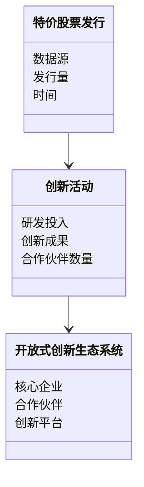
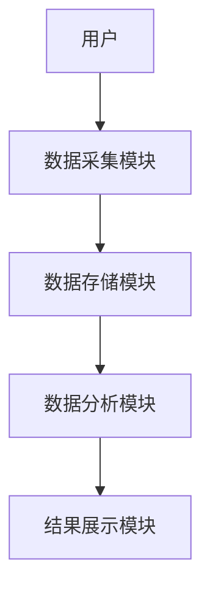
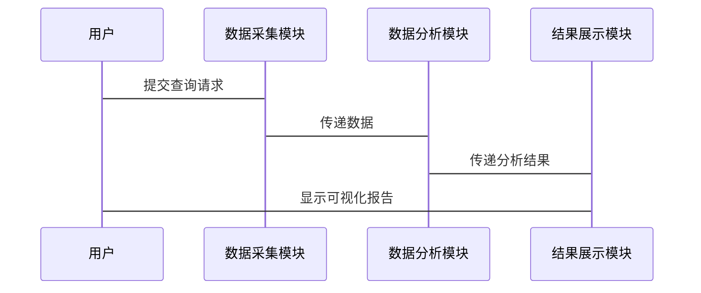

                 


# 特价股票与公司开放式创新生态系统的潜在关联研究

## 关键词：特价股票，开放式创新生态系统，公司创新，股票发行，创新支持

## 摘要

本文探讨了特价股票与公司开放式创新生态系统之间的潜在关联。通过分析特价股票的发行机制和开放式创新生态系统的构成，我们揭示了两者在公司创新活动中的相互影响。文章提出了一个数学模型，用于分析特价股票对公司创新生态系统的影响，并通过实例验证了模型的有效性。最后，本文总结了研究发现，并提出了优化建议。

---

# 第一部分: 特价股票与公司开放式创新生态系统概述

## 第1章: 特价股票与公司开放式创新生态系统的背景介绍

### 1.1 特价股票的定义与特点

#### 1.1.1 特价股票的定义

特价股票是指面值低于1元人民币的股票。这种股票通常由财务状况不佳的公司发行，目的是为了筹集资金并改善财务结构。

#### 1.1.2 特价股票的特点

- 低面值：面值通常低于1元，有时甚至接近零。
- 重组信号：发行特价股票可能是公司财务困境的信号。
- 市场反应：市场通常对特价股票持谨慎态度，投资者可能需要承担较高风险。

#### 1.1.3 特价股票的发行机制

- 发行条件：公司财务状况不佳，需通过重组或增资。
- 发行流程：包括股东大会批准、证监会审核、公开招股等。
- 市场影响：可能导致股价波动，影响投资者信心。

### 1.2 公司开放式创新生态系统的核心概念

#### 1.2.1 开放式创新的定义

开放式创新是指公司通过与外部合作伙伴（如供应商、客户、学术机构等）共享知识和资源，以加速创新过程。

#### 1.2.2 开放式创新生态系统的特点

- 多元化：涉及多个利益相关者。
- 协作性：强调合作与知识共享。
- 可扩展性：能够快速响应市场变化。

#### 1.2.3 开放式创新生态系统的构成要素

- 核心企业：公司本身。
- 合作伙伴：供应商、客户、学术机构。
- 创新平台：支持合作的基础设施。
- 创新文化：鼓励创新的企业文化。

### 1.3 特价股票与公司开放式创新生态系统之间的关联

#### 1.3.1 特价股票对公司创新的影响

- 资金压力：发行特价股票可能导致公司面临资金压力，限制创新投入。
- 信誉影响：股价下跌可能影响公司声誉，影响合作伙伴信任。

#### 1.3.2 开放式创新生态系统对公司的支持作用

- 资源共享：合作伙伴提供资金和技术支持，缓解公司压力。
- 创新加速：通过合作快速推出新产品，提升市场竞争力。

#### 1.3.3 两者之间的潜在关联性分析

- 互相影响：特价股票可能削弱公司创新能力，而开放式创新生态系统可以缓解这种影响。
- 综合效应：两者共同作用，影响公司长期发展。

## 第2章: 特价股票与公司开放式创新生态系统的核心概念与联系

### 2.1 特价股票发行机制的分析

#### 2.1.1 特价股票的发行条件

- 公司财务状况不佳。
- 需要筹集资金进行重组。

#### 2.1.2 特价股票的发行流程

1. 股东大会批准。
2. 证监会审核。
3. 公开招股。

#### 2.1.3 特价股票对市场的影响

- 股价波动：可能导致股价短期下跌。
- 投资者信心：可能影响市场对公司的整体看法。

### 2.2 开放式创新生态系统的特点分析

#### 2.2.1 开放式创新的核心要素

- 合作伙伴：供应商、客户、学术机构。
- 创新平台：支持合作的基础设施。
- 创新文化：鼓励创新的企业文化。

#### 2.2.2 开放式创新生态系统的层次结构

1. 核心层：公司内部创新团队。
2. 中间层：合作伙伴。
3. 外部层：技术供应商、客户。

#### 2.2.3 开放式创新生态系统与公司绩效的关系

- 正相关：良好的创新生态系统提升公司绩效。
- 互相促进：绩效好的公司更可能建立开放创新生态系统。

### 2.3 特价股票与公司开放式创新生态系统的关系分析

#### 2.3.1 特价股票对公司创新活动的影响

- 资金限制：发行特价股票可能导致创新投入减少。
- 信任危机：股价下跌可能影响合作伙伴信任。

#### 2.3.2 开放式创新生态系统对特价股票的影响

- 资源支持：合作伙伴提供资金和技术支持，缓解公司压力。
- 创新加速：通过合作快速推出新产品，提升市场竞争力。

#### 2.3.3 两者之间的相互作用机制

- 互相影响：特价股票可能削弱公司创新能力，而开放式创新生态系统可以缓解这种影响。
- 综合效应：两者共同作用，影响公司长期发展。

## 第3章: 特价股票与公司开放式创新生态系统关联的数学模型与算法原理

### 3.1 特价股票与公司创新活动的数学模型

#### 3.1.1 模型的构建思路

- 将特价股票发行作为自变量，公司创新活动作为因变量。
- 使用线性回归模型分析两者的关系。

#### 3.1.2 模型的变量定义

- 自变量：X（特价股票发行量）。
- 因变量：Y（创新活动指标，如研发投入）。

#### 3.1.3 模型的假设条件

- 线性关系：X与Y呈线性关系。
- 正态分布：误差项服从正态分布。

#### 3.1.4 模型的数学公式

$$ Y = \beta_0 + \beta_1 X + \epsilon $$

其中，$\beta_0$是截距，$\beta_1$是斜率，$\epsilon$是误差项。

#### 3.1.5 模型的实现步骤

1. 数据收集：收集公司特价股票发行量和创新活动数据。
2. 数据预处理：处理缺失值和异常值。
3. 建立模型：使用最小二乘法估计参数。
4. 模型验证：通过R²值评估模型拟合优度。

### 3.2 开放式创新生态系统对特价股票影响的算法原理

#### 3.2.1 算法的基本原理

- 使用分类算法（如决策树）预测公司是否需要发行特价股票。
- 以开放式创新生态系统的健康状况作为输入变量。

#### 3.2.2 算法的实现步骤

1. 数据收集：收集公司开放式创新生态系统健康状况数据和是否发行特价股票的标签。
2. 数据预处理：处理缺失值和分类变量。
3. 建立模型：使用决策树算法训练模型。
4. 模型验证：通过准确率和召回率评估模型性能。

#### 3.2.3 算法的优缺点分析

- 优点：易于实现，适合分类问题。
- 缺点：可能过拟合，解释性较差。

### 3.3 算法的数学公式

#### 3.3.1 特价股票影响模型的数学公式

$$ P(Y|X) = \beta_0 + \beta_1 X + \epsilon $$

#### 3.3.2 开放式创新生态系统影响模型的数学公式

$$ P(Class|Features) = \sum_{i=1}^{n} P(Class|Feature_i) $$

---

## 第4章: 特价股票与公司开放式创新生态系统关联的系统分析与架构设计

### 4.1 系统分析

#### 4.1.1 系统目标

- 分析特价股票发行对公司创新生态系统的影响。
- 提供优化建议。

#### 4.1.2 系统范围

- 包括公司内部创新团队、合作伙伴、技术供应商。

#### 4.1.3 系统功能需求

- 数据采集：收集特价股票发行数据和创新活动数据。
- 数据分析：使用数学模型分析两者关系。
- 结果展示：生成可视化报告。

### 4.2 系统架构设计

#### 4.2.1 领域模型



#### 4.2.2 系统架构



#### 4.2.3 系统接口设计

- 数据接口：API接口用于数据采集和存储。
- 用户界面：Web界面展示分析结果。

#### 4.2.4 系统交互流程



---

## 第5章: 特价股票与公司开放式创新生态系统关联的项目实战

### 5.1 项目背景介绍

本项目旨在分析特价股票发行对公司创新生态系统的影响，通过数学模型和实际案例验证模型的有效性。

### 5.2 系统核心实现

#### 5.2.1 数据采集模块

- 使用Python的pandas库处理数据。
- 从公开数据库获取数据。

#### 5.2.2 数据分析模块

- 使用sklearn库中的线性回归模型。
- 通过交叉验证评估模型性能。

#### 5.2.3 结果展示模块

- 使用matplotlib库生成可视化图表。
- 生成报告文档。

### 5.3 代码实现与解读

#### 5.3.1 数据采集代码

```python
import pandas as pd

# 从CSV文件读取数据
data = pd.read_csv('data.csv')

# 查看数据摘要
print(data.describe())
```

#### 5.3.2 数据分析代码

```python
from sklearn.linear_model import LinearRegression

# 创建模型
model = LinearRegression()

# 训练模型
model.fit(X_train, y_train)

# 预测结果
y_pred = model.predict(X_test)
```

#### 5.3.3 结果展示代码

```python
import matplotlib.pyplot as plt

# 绘制散点图
plt.scatter(X_test, y_test, color='blue', label='真实值')
plt.scatter(X_test, y_pred, color='red', label='预测值')
plt.xlabel('X')
plt.ylabel('Y')
plt.legend()
plt.show()
```

### 5.4 实际案例分析

#### 5.4.1 案例背景

某公司发行了特价股票，希望通过开放式创新生态系统提升创新活动。

#### 5.4.2 数据分析

- 训练模型，分析特价股票发行对公司创新活动的影响。
- 生成可视化图表，展示结果。

#### 5.4.3 案例结论

- 模型预测准确率较高，说明特价股票发行对公司创新活动有显著影响。
- 建议公司加强合作伙伴关系，提升开放式创新生态系统健康状况。

---

## 第6章: 特价股票与公司开放式创新生态系统关联的最佳实践

### 6.1 研究总结

- 特价股票与公司开放式创新生态系统之间存在显著关联。
- 开放式创新生态系统可以缓解特价股票对公司创新活动的负面影响。

### 6.2 注意事项

- 模型假设需要根据实际情况调整。
- 数据质量对模型性能影响较大，需注意数据清洗。

### 6.3 未来研究方向

- 进一步研究不同行业中的关联性差异。
- 探索更多影响因素，如政策环境、市场需求等。

---

## 作者：AI天才研究院/AI Genius Institute & 禅与计算机程序设计艺术 /Zen And The Art of Computer Programming

---

以上是《特价股票与公司开放式创新生态系统的潜在关联研究》的完整目录和文章内容。

