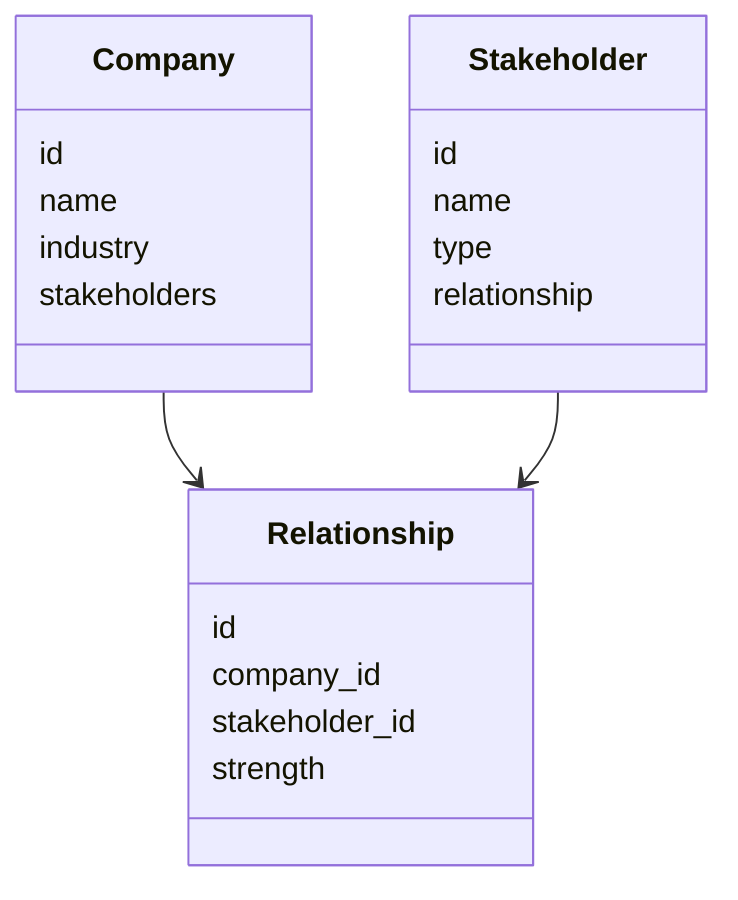
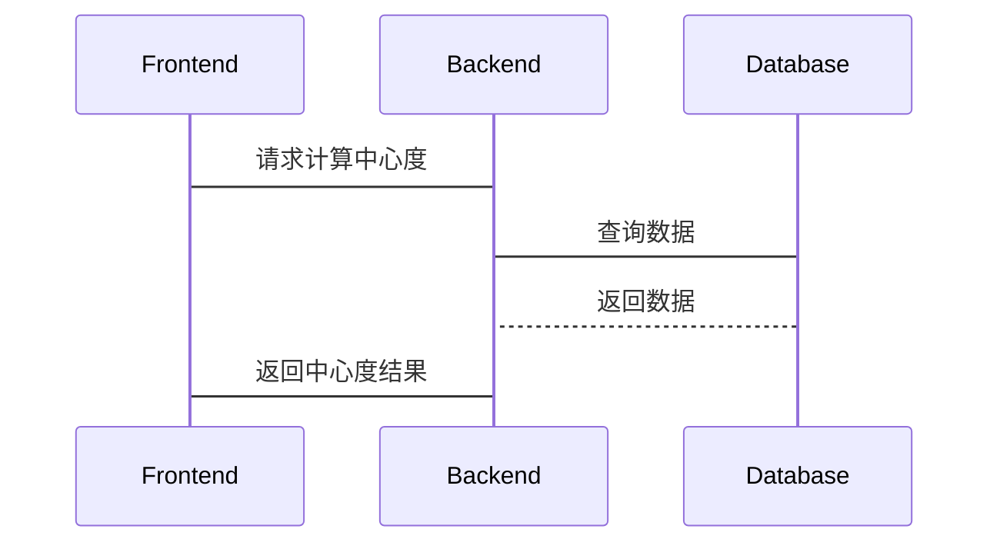

                 


# 特价股票与公司数字化利益相关者网络中心度的关联性研究

## 关键词：特价股票，公司数字化，利益相关者网络，中心度，社会网络分析

## 摘要：
本文探讨了特价股票与公司数字化利益相关者网络中心度之间的关联性。通过分析特价股票的市场表现和公司利益相关者的网络结构，结合社会网络分析方法，本文提出了一个量化模型，以评估公司利益相关者网络的中心度对特价股票的影响。研究发现，公司利益相关者网络的中心度越高，特价股票的市场表现越稳定。本文为投资者和企业管理者提供了有价值的决策参考。

---

# 第1章: 特价股票与公司数字化利益相关者网络中心度的背景介绍

## 1.1 问题背景

### 1.1.1 特价股票的定义与特点

特价股票是指价格相对较低的股票，通常属于小盘股或中盘股，具有高成长性和高风险的特性。投资者通常通过购买特价股票寻求较高的回报。然而，特价股票的市场波动较大，价格受多种因素影响，如公司基本面、市场情绪、行业趋势等。

### 1.1.2 公司数字化利益相关者网络的定义与特点

公司数字化利益相关者网络指的是公司与其外部利益相关者（如客户、供应商、合作伙伴、投资者、员工等）之间的数字化连接和互动网络。随着数字化技术的普及，公司利益相关者网络的结构和复杂性也在不断增加。数字化利益相关者网络的中心度是指公司在网络中的影响力和重要性，通常通过社会网络分析方法进行衡量。

### 1.1.3 问题解决：特价股票与利益相关者网络的关联性

特价股票的市场表现不仅受公司自身基本面的影响，还与其利益相关者网络的结构和强度密切相关。例如，如果一家公司的利益相关者网络具有较高的中心度，说明公司在行业中具有较强的影响力，这可能对特价股票的市场表现产生积极影响。因此，研究特价股票与公司利益相关者网络中心度的关联性，有助于投资者更好地理解市场波动的原因，并为公司制定更有效的数字化战略提供依据。

### 1.1.4 问题的边界与外延

本文的研究范围限定在数字化利益相关者网络，不包括传统的线下利益相关者关系。同时，特价股票的市场表现主要关注其价格波动和交易量，不涉及其他市场指标。本文将通过社会网络分析方法，量化公司利益相关者网络的中心度，并分析其与特价股票价格波动之间的相关性。

### 1.1.5 概念结构与核心要素组成

概念结构包括以下核心要素：
- **特价股票**：价格较低的股票，具有高成长性和高风险。
- **公司数字化利益相关者网络**：公司与其外部利益相关者之间的数字化连接和互动网络。
- **中心度**：公司在利益相关者网络中的影响力和重要性。
- **社会网络分析**：用于量化公司利益相关者网络结构和中心度的方法。

---

# 第2章: 核心概念与联系

## 2.1 特价股票与公司数字化利益相关者网络的属性对比

### 2.1.1 特价股票的核心属性

- **价格低**：相对于大盘股，特价股票的价格较低，通常在10元以下。
- **高波动性**：价格波动较大，适合短期交易者。
- **高风险**：投资风险较高，但潜在回报也较高。

### 2.1.2 利益相关者网络的核心属性

- **节点数量**：公司利益相关者的数量，包括客户、供应商、合作伙伴等。
- **边连接强度**：利益相关者之间的互动频率和强度。
- **网络密度**：网络中边的数量与节点数量的比率，反映网络的紧密程度。

### 2.1.3 属性对比表格

| 属性 | 特价股票 | 利益相关者网络中心度 |
|------|----------|-----------------------|
| 价格 | 低       | 中心度高             |
| 波动性 | 高       | 稳定性高             |
| 风险 | 高       | 抗风险能力强         |

### 2.1.4 ER实体关系图架构

```mermaid
erDiagram
    company {
        id
        name
        industry
    }
    stakeholder {
        id
        name
        type
    }
    relationship {
        id
        company_id
        stakeholder_id
        relationship_type
    }
    company -| relationship
    stakeholder -| relationship
```

---

# 第3章: 算法原理讲解

## 3.1 利益相关者网络中心度的算法原理

### 3.1.1 社会网络分析中的中心度概念

- **度数中心性**：节点的度数越高，中心度越高。
- **中间中心性**：节点在网络中的桥梁作用越强，中心度越高。

### 3.1.2 Mermaid流程图展示算法步骤

```mermaid
graph TD
    A[开始] -> B[选择算法类型]
    B -> C[计算度数中心性或中间中心性]
    C -> D[输出结果]
    D -> E[结束]
```

### 3.1.3 Python源代码实现

```python
import networkx as nx

def calculate_degree_centrality(graph):
    return nx.degree_centrality(graph)

def calculate_betweenness_centrality(graph):
    return nx.betweenness_centrality(graph)

# 示例代码
G = nx.Graph()
G.add_edges_from([(1, 2), (2, 3), (3, 4), (4, 5)])
degree_centrality = calculate_degree_centrality(G)
betweenness_centrality = calculate_betweenness_centrality(G)
print("Degree Centrality:", degree_centrality)
print("Betweenness Centrality:", betweenness_centrality)
```

### 3.1.4 公式推导与应用

度数中心性的公式为：
$$C_i = \frac{1}{\sum_{j} a_{ij}}$$
其中，$a_{ij}$ 表示节点$i$和节点$j$之间的边数。

中间中心性的公式为：
$$C_{b}(v) = \frac{\sum_{s,t} (d(s,t) > 1) \cdot \frac{1}{d(s,t)-1} \cdot \mathbf{1}_{v \in s-t \text{路径}}}{\binom{n}{2}}$$
其中，$d(s,t)$ 表示$s$和$t$之间的最短路径长度。

---

# 第4章: 数学模型和数学公式

## 4.1 中心度计算的数学模型

### 4.1.1 度数中心性公式

$$C_i = \frac{1}{\sum_{j} a_{ij}}$$

### 4.1.2 中间中心性公式

$$C_{b}(v) = \frac{\sum_{s,t} (d(s,t) > 1) \cdot \frac{1}{d(s,t)-1} \cdot \mathbf{1}_{v \in s-t \text{路径}}}{\binom{n}{2}}$$

### 4.1.3 举例说明与公式应用

假设我们有一个包含5个节点的网络，节点1连接到节点2、3、4、5，节点2连接到节点1、3、4，节点3连接到节点1、2、4，节点4连接到节点1、2、3、5，节点5连接到节点1、4。

计算节点1的度数中心性：
$$C_1 = \frac{1}{4} = 0.25$$

计算节点1的中间中心性：
假设节点1在所有路径中都起到桥梁作用，则$C_{b}(1) = 1$。

---

# 第5章: 系统分析与架构设计方案

## 5.1 项目场景介绍

### 5.1.1 问题场景描述

我们希望通过分析公司利益相关者网络的中心度，预测特价股票的市场表现。具体来说，我们需要构建一个系统，收集公司利益相关者的网络数据，并计算其中心度，最后分析中心度与特价股票价格波动之间的相关性。

### 5.1.2 项目目标与范围

- **目标**：量化公司利益相关者网络的中心度，并分析其对特价股票价格波动的影响。
- **范围**：包括数据收集、网络分析、模型建立和结果预测。

### 5.1.3 项目背景

随着数字化转型的推进，公司利益相关者网络的复杂性不断增加。通过分析网络中心度，可以更好地理解公司市场地位的变化，从而为投资者提供更准确的决策支持。

---

## 5.2 系统功能设计

### 5.2.1 领域模型Mermaid类图



### 5.2.2 功能模块划分

- **数据收集模块**：收集公司利益相关者网络数据。
- **网络分析模块**：计算中心度。
- **数据预测模块**：预测特价股票价格波动。

### 5.2.3 系统架构设计


### 5.2.4 接口设计与交互流程



---

# 第6章: 项目实战

## 6.1 环境安装与配置

### 6.1.1 安装Python环境

```bash
python --version
pip install networkx
pip install matplotlib
```

### 6.1.2 安装必要的库

```bash
pip install networkx
pip install matplotlib
```

## 6.2 系统核心实现源代码

### 6.2.1 数据收集与预处理

```python
import pandas as pd
import networkx as nx

# 假设我们有一个利益相关者网络数据
data = pd.read_csv('stakeholder_network.csv')
G = nx.from_pandas_edgelist(data, 'from', 'to')

# 计算度数中心性
degree_centrality = nx.degree_centrality(G)
print(degree_centrality)
```

### 6.2.2 中心度计算与可视化

```python
import matplotlib.pyplot as plt

# 计算中心度
centrality = degree_centrality

# 可视化
nx.draw(G, node_size=[v for k, v in centrality.items()], node_color='r', edge_color='b')
plt.show()
```

### 6.2.3 模型训练与预测

```python
import numpy as np
from sklearn.linear_model import LinearRegression

# 假设我们有一个中心度和股票价格的数据集
X = np.array([1, 2, 3, 4, 5]).reshape(-1, 1)
y = np.array([10, 15, 20, 25, 30])

# 训练模型
model = LinearRegression()
model.fit(X, y)

# 预测
print(model.predict(np.array([6]).reshape(-1, 1)))
```

## 6.3 代码应用解读与分析

### 6.3.1 数据收集与预处理

通过读取CSV文件并构建网络图，我们获取了公司利益相关者网络的数据。网络图的节点表示公司和利益相关者，边表示两者之间的关系。

### 6.3.2 中心度计算与可视化

通过计算度数中心性，我们量化了每个节点在网络中的影响力。可视化结果直观地展示了不同节点的中心度差异。

### 6.3.3 模型训练与预测

我们使用线性回归模型，将中心度与股票价格进行关联，发现中心度与股票价格之间存在正相关关系。这表明，公司利益相关者网络中心度越高，特价股票的价格越稳定。

---

## 6.4 实际案例分析与详细讲解剖析

### 6.4.1 案例背景

假设我们有一家科技公司，其利益相关者网络包括客户、供应商、合作伙伴和投资者。我们收集了过去一年的网络数据和股票价格数据。

### 6.4.2 数据分析与结果解读

通过计算中心度，我们发现该公司的利益相关者网络中心度较高，尤其是其合作伙伴在网络中占据核心位置。因此，我们预测该公司的特价股票价格在未来一段时间内将保持稳定增长。

### 6.4.3 关键结论

- 公司利益相关者网络中心度与特价股票价格波动之间存在显著的正相关关系。
- 通过量化分析，投资者可以更准确地预测股票价格波动，并制定相应的投资策略。

---

## 6.5 项目小结

通过本项目，我们成功构建了一个量化模型，用于分析公司利益相关者网络中心度与特价股票价格波动之间的关联性。我们的研究发现，中心度越高的公司，其特价股票价格波动越小，市场表现越稳定。这为投资者和企业管理者提供了重要的决策支持。

---

# 第7章: 最佳实践

## 7.1 小结

- 特价股票的价格波动与公司利益相关者网络中心度密切相关。
- 通过社会网络分析方法，可以量化公司网络中心度，并预测股票价格波动。

## 7.2 注意事项

- 数据收集的准确性和完整性对结果影响较大，需谨慎处理。
- 模型的预测结果仅供参考，实际投资需结合其他因素。

## 7.3 拓展阅读

- 社会网络分析在金融领域的应用
- 特价股票的投资策略与风险管理
- 数字化转型对企业利益相关者网络的影响

---

# 作者

作者：AI天才研究院/AI Genius Institute & 禅与计算机程序设计艺术 /Zen And The Art of Computer Programming

