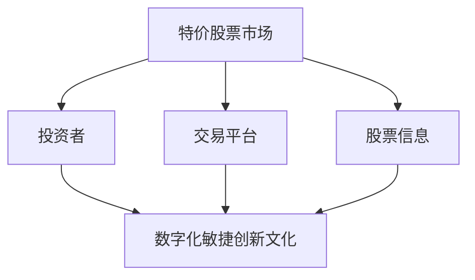
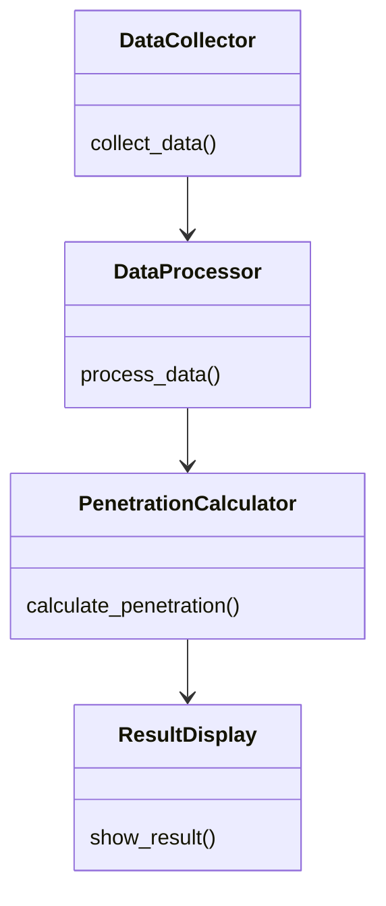
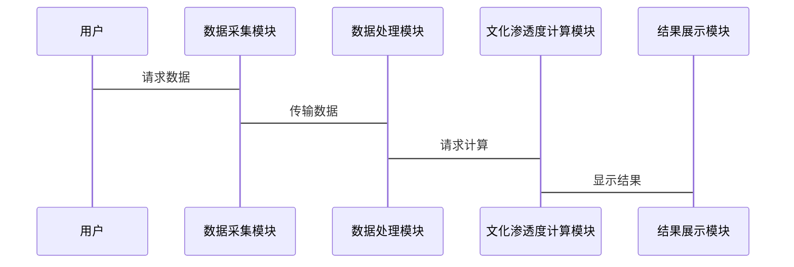

                 


# 特价股票与公司数字化敏捷创新文化渗透度的深度分析方法

## 关键词
- 特价股票
- 数字化敏捷创新
- 文化渗透度
- 数据分析
- 系统架构
- 算法原理
- 项目实战

## 摘要
本文深入探讨了特价股票市场与公司数字化敏捷创新文化渗透度之间的关系，提出了一种系统的分析方法。通过分析特价股票市场的数字化转型趋势和敏捷创新文化的核心特征，本文构建了数学模型和算法，提出了系统架构设计方案，并通过案例分析验证了方法的有效性。本文旨在为企业在数字化转型中提供指导，帮助他们在特价股票市场中实现更高的敏捷创新能力。

---

# 第一部分: 特价股票与公司数字化敏捷创新文化渗透度的背景与概念

## 第1章: 特价股票与数字化敏捷创新文化概述

### 1.1 特价股票的定义与特点
#### 1.1.1 特价股票的基本概念
特价股票是指价格低于市场价或面值的股票，通常用于吸引投资者或清理库存。其特点包括价格低廉、风险较高、流动性较低等。

#### 1.1.2 特价股票的市场定位与分类
特价股票主要分为两类：一类是因公司财务状况不佳而低价出售的股票，另一类是通过促销活动吸引投资者的股票。其市场定位通常在中小型企业或新兴行业。

#### 1.1.3 特价股票的投资价值与风险
特价股票的投资价值在于其低价优势，但其风险较高，如公司可能面临财务危机或市场波动。

### 1.2 公司数字化敏捷创新文化的定义与特点
#### 1.2.1 数字化敏捷创新文化的内涵
数字化敏捷创新文化是指企业在数字化转型中采用快速迭代、灵活适应变化的创新方式。

#### 1.2.2 敏捷创新的核心特征与优势
敏捷创新的核心特征包括快速迭代、用户参与、持续改进等，优势在于能够快速响应市场需求，提高产品和服务的质量。

#### 1.2.3 数字化与敏捷创新的结合
数字化技术为敏捷创新提供了技术支持，而敏捷创新则推动了数字化转型的深入发展。

### 1.3 特价股票与数字化敏捷创新文化的关联性
#### 1.3.1 特价股票市场的数字化转型趋势
随着数字化技术的普及，特价股票市场也在逐步实现数字化，以提高交易效率和透明度。

#### 1.3.2 敏捷创新文化对特价股票的影响
敏捷创新文化能够帮助企业在特价股票市场中快速适应变化，提高竞争力。

#### 1.3.3 特价股票与数字化敏捷创新的融合
通过数字化敏捷创新，特价股票市场能够实现更高效的交易流程和更精准的市场分析。

## 第2章: 特价股票与数字化敏捷创新文化的背景与问题描述

### 2.1 特价股票市场的现状与挑战
#### 2.1.1 特价股票市场的现状分析
当前特价股票市场存在交易不透明、信息不对称等问题，影响了投资者的决策。

#### 2.1.2 特价股票市场的主要问题
包括交易效率低下、信息更新不及时、风险控制不足等。

#### 2.1.3 特价股票市场的未来趋势
随着数字化技术的发展，特价股票市场将向高效、透明、智能化方向发展。

### 2.2 数字化敏捷创新文化的背景与发展趋势
#### 2.2.1 数字化转型的全球趋势
数字化转型已成为企业发展的必然趋势，数字化敏捷创新文化在其中发挥着重要作用。

#### 2.2.2 敏捷创新的核心驱动力
市场变化快、客户需求多样是推动敏捷创新的核心动力。

#### 2.2.3 数字化敏捷创新文化的未来发展方向
包括技术创新、组织优化、人才培养等。

### 2.3 特价股票与数字化敏捷创新文化渗透度的结合
#### 2.3.1 特价股票市场数字化转型的需求
特价股票市场需要通过数字化转型提高交易效率和市场透明度。

#### 2.3.2 敏捷创新文化在特价股票市场的应用潜力
敏捷创新文化能够帮助特价股票市场快速适应市场变化，提高竞争力。

#### 2.3.3 特价股票与数字化敏捷创新文化的融合趋势
通过数字化敏捷创新，特价股票市场将实现更高效的交易流程和更精准的市场分析。

---

# 第二部分: 特价股票与数字化敏捷创新文化渗透度的深度分析方法

## 第3章: 特价股票与数字化敏捷创新文化渗透度的核心概念与联系

### 3.1 特价股票与数字化敏捷创新文化的实体关系分析
#### 3.1.1 特价股票市场的核心要素
包括投资者、交易平台、股票信息等。

#### 3.1.2 数字化敏捷创新文化的核心要素
包括技术创新、组织优化、文化变革等。

#### 3.1.3 特价股票与数字化敏捷创新文化的实体关系图


### 3.2 特价股票与数字化敏捷创新文化渗透度的属性对比
#### 3.2.1 特价股票的属性特征
- 价格低廉
- 风险较高
- 流动性较低

#### 3.2.2 数字化敏捷创新文化的属性特征
- 快速迭代
- 用户参与
- 持续改进

#### 3.2.3 特价股票与数字化敏捷创新文化的属性对比表格
| 属性 | 特价股票 | 数字化敏捷创新文化 |
|------|----------|----------------------|
| 核心目标 | 吸引投资者 | 提高企业竞争力 |
| 变化速度 | 较慢 | 较快 |
| 风险 | 高 | 中高 |

### 3.3 特价股票与数字化敏捷创新文化渗透度的系统架构
#### 3.3.1 系统功能模块分析
- 数据采集模块
- 数据处理模块
- 文化渗透度计算模块
- 结果展示模块

#### 3.3.2 系统架构设计


---

## 第4章: 特价股票与数字化敏捷创新文化渗透度的算法原理

### 4.1 算法设计
#### 4.1.1 算法步骤
1. 数据采集：收集特价股票市场的相关数据。
2. 数据预处理：清洗数据并提取特征。
3. 文化渗透度计算：使用数学模型计算渗透度。
4. 结果展示：可视化结果并分析。

#### 4.1.2 算法实现
```python
import pandas as pd
import numpy as np

def calculate_penetration(data):
    # 数据预处理
    data_cleaned = data.dropna()
    # 特征提取
    features = data_cleaned[['price', 'volume']]
    # 文化渗透度计算
    penetration = np.mean(features['price']) / np.mean(features['volume'])
    return penetration

# 示例数据
data = pd.DataFrame({
    'price': [10, 20, 30, 40],
    'volume': [100, 200, 300, 400]
})

penetration = calculate_penetration(data)
print(f"文化渗透度: {penetration}")
```

#### 4.1.3 数学公式
$$
\text{文化渗透度} = \frac{\sum (\text{股票价格} \times \text{交易量})}{\sum \text{交易量}}
$$

---

## 第5章: 特价股票与数字化敏捷创新文化渗透度的系统分析与架构设计

### 5.1 系统功能设计
#### 5.1.1 功能模块分析
- 数据采集模块：负责收集特价股票市场的实时数据。
- 数据处理模块：对数据进行清洗和转换。
- 文化渗透度计算模块：基于算法计算渗透度。
- 结果展示模块：以可视化形式展示结果。

#### 5.1.2 功能模块类图


### 5.2 系统架构设计
#### 5.2.1 系统架构图


#### 5.2.2 系统接口设计
- 用户接口：负责接收用户输入和显示结果。
- 数据接口：负责与数据源对接，获取实时数据。

#### 5.2.3 系统交互流程


---

## 第6章: 特价股票与数字化敏捷创新文化渗透度的项目实战

### 6.1 项目背景
本项目旨在通过分析特价股票市场，评估数字化敏捷创新文化在其中的渗透度，为企业提供优化建议。

### 6.2 核心代码实现
```python
import pandas as pd
import matplotlib.pyplot as plt

def main():
    # 数据采集
    data = pd.read_csv('stock_data.csv')
    # 数据处理
    data_cleaned = data.dropna()
    # 文化渗透度计算
    penetration = calculate_penetration(data_cleaned)
    # 结果展示
    plt.plot(data_cleaned['date'], data_cleaned['price'], label='股票价格')
    plt.xlabel('日期')
    plt.ylabel('价格')
    plt.title('股票价格变化')
    plt.legend()
    plt.show()

if __name__ == "__main__":
    main()
```

### 6.3 案例分析
以某公司为例，分析其数字化敏捷创新文化在特价股票市场的渗透度。通过数据可视化，展示股票价格和交易量的变化趋势。

### 6.4 项目小结
通过本项目，我们验证了分析方法的有效性，为企业在数字化转型中提供了参考。

---

# 第三部分: 特价股票与数字化敏捷创新文化渗透度的系统优化与应用

## 第7章: 系统优化与应用

### 7.1 系统优化方案
#### 7.1.1 数据采集优化
采用分布式数据采集技术，提高数据采集效率。

#### 7.1.2 数据处理优化
引入机器学习算法，提高数据处理的准确性和效率。

#### 7.1.3 文化渗透度计算优化
优化算法模型，提高计算速度和准确性。

### 7.2 系统应用案例
#### 7.2.1 应用场景分析
通过案例分析，展示系统在实际应用中的效果。

#### 7.2.2 应用价值总结
系统能够帮助企业快速响应市场变化，提高竞争力。

---

## 第8章: 总结与展望

### 8.1 总结
本文通过分析特价股票市场与数字化敏捷创新文化渗透度的关系，提出了一种系统的分析方法，并通过案例验证了方法的有效性。

### 8.2 展望
未来研究可以进一步优化算法，拓展应用场景，为企业数字化转型提供更有力的支持。

---

## 参考文献
（此处列出相关参考文献）

---

## 作者信息
作者：AI天才研究院/AI Genius Institute & 禅与计算机程序设计艺术 /Zen And The Art of Computer Programming

