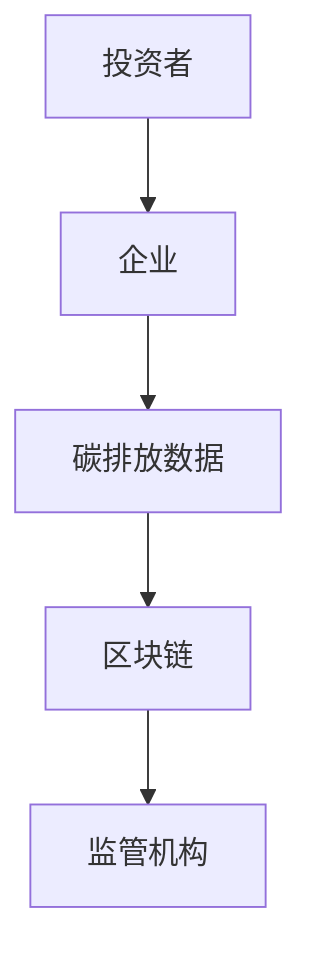

                 


# 特价股票与公司数字化碳中和实践的关联性研究

> **关键词**：特价股票、碳中和、数字化转型、企业责任、技术创新、数据驱动、可持续发展  
> **摘要**：本文研究了特价股票与公司数字化碳中和之间的关联性，探讨了如何通过数字化手段实现碳中和目标，分析了特价股票在其中的作用及影响。

---

## 第1章 背景介绍

### 1.1 问题背景与问题描述
#### 1.1.1 特价股票的定义与特点
特价股票是指在特定市场条件下，价格低于正常市场价的股票。这类股票通常在市场波动、公司重组或财务困境时出现，具有高波动性和高风险的特点。投资者通过购买特价股票，可以在市场恢复时获得超额收益。

#### 1.1.2 碳中和的目标与意义
碳中和是指通过减少温室气体排放或增加碳汇，使二氧化碳净排放量为零。实现碳中和是全球应对气候变化的重要目标，要求企业在生产和运营过程中减少碳足迹，采用清洁能源和可持续发展策略。

#### 1.1.3 特价股票与碳中和的关联性问题
随着全球对碳中和的重视，企业在实现碳中和的过程中，可能面临成本增加、利润下降等问题，这可能导致股价波动，出现特价股票的机会。研究特价股票与碳中和的关联性，有助于投资者理解市场动态，企业制定可持续发展战略。

### 1.2 问题解决与边界
#### 1.2.1 通过数字化手段解决碳中和问题的方法
数字化技术（如区块链、大数据分析）可以提高碳排放监测和管理效率，帮助企业制定减排策略。

#### 1.2.2 特价股票在碳中和实践中的潜在作用
企业在实现碳中和过程中可能面临财务压力，导致股价波动，从而产生特价股票。投资者需关注这些波动，寻找投资机会。

#### 1.2.3 研究的边界与外延
本文研究特价股票与碳中和的关联性，重点关注企业在数字化转型中的碳中和实践，不涉及股票市场的宏观调控和政策影响。

### 1.3 核心概念与结构
#### 1.3.1 特价股票与碳中和的核心要素
- **特价股票**：价格波动、市场机会、投资风险。
- **碳中和**：减排目标、技术应用、政策支持。

#### 1.3.2 两者关联性的概念结构
特价股票的价格波动可能与企业在碳中和实践中的表现相关，例如，企业减排进展可能影响投资者对其股票的估值。

#### 1.3.3 关键属性与核心要素对比
| 属性 | 特价股票 | 碳中和 |
|------|----------|--------|
| 核心目标 | 获取超额收益 | 减少碳排放 |
| 实现手段 | 投资策略 | 数字化技术 |
| 影响因素 | 市场波动 | 政策、技术 |

---

## 第2章 核心概念与联系

### 2.1 核心概念原理
#### 2.1.1 特价股票的市场机制
市场机制包括供求关系、价格波动、投资者行为等因素。特价股票的出现通常与市场供需失衡或企业基本面变化有关。

#### 2.1.2 碳中和的数字化实现方式
通过区块链技术实现碳排放的透明记录，利用大数据分析优化减排策略，使用云计算进行碳足迹追踪。

### 2.2 属性对比分析
#### 2.2.1 特价股票与碳中和的属性对比表格
| 属性 | 特价股票 | 碳中和 |
|------|----------|--------|
| 定义 | 价格低于市场价的股票 | 净零碳排放目标 |
| 目标 | 投资收益最大化 | 减少温室气体排放 |
| 影响 | 投资者财富变化 | 全球气候变化 |

#### 2.3 ER实体关系图
```mermaid
erDiagram
    actor 投资者 {
        <so> id : integer
        <s> 名称 : string
    }
    actor 企业 {
        <so> id : integer
        <s> 名称 : string
    }
    entity 碳排放数据 {
        <so> id : integer
        <s> 排放量 : float
        <s> 时间 : date
    }
    entity 特价股票 {
        <so> id : integer
        <s> 股票代码 : string
        <s> 价格 : float
        <s> 时间 : date
    }
    investors 决定购买 <|创建| 特价股票
   企业 与 碳排放数据 关联
```

---

## 第3章 碳中和的数字化实现

### 3.1 数字化技术在碳中和中的应用
#### 3.1.1 区块链技术
区块链用于记录碳排放数据，确保数据的透明性和不可篡改性。

#### 3.1.2 大数据与云计算
利用大数据分析优化碳排放监测和管理，云计算提供强大的计算能力支持。

### 3.2 数字化碳中和的实现机制
#### 3.2.1 系统架构


#### 3.2.2 实现流程
1. 企业收集碳排放数据。
2. 数据通过区块链技术记录。
3. 监管机构验证数据。
4. 投资者根据数据做出投资决策。

### 3.3 数学模型与公式
#### 3.3.1 碳排放计算模型
$$ \text{总排放量} = \sum_{i=1}^{n} \text{活动}_i \times \text{排放强度}_i $$

#### 3.3.2 数字化优化模型
$$ \min \sum_{i=1}^{n} c_i x_i \text{（最小化成本）} $$
$$ \text{subject to} \sum_{i=1}^{n} e_i x_i \leq 0 \text{（碳中和约束）} $$

---

## 第4章 特价股票与碳中和的关联机制

### 4.1 关联性分析方法
#### 4.1.1 特价股票与碳中和的关联性指标
- 股价波动与碳排放数据的相关性。
- 碳中和进展对股价的影响。

#### 4.1.2 关联性分析的数学模型
$$ \text{相关系数} = \frac{\sum (x_i - \bar{x})(y_i - \bar{y})}{\sqrt{\sum (x_i - \bar{x})^2} \sqrt{\sum (y_i - \bar{y})^2}} $$

### 4.2 关联机制分析
#### 4.2.1 市场机制对关联性的影响
市场对碳中和政策的反应可能影响股价。

#### 4.2.2 政策引导对关联性的影响
政府政策推动碳中和，可能影响企业盈利和股价。

#### 4.2.3 企业行为对关联性的影响
企业减排措施可能影响生产成本和股价。

---

## 第5章 关联性分析方法

### 5.1 数据收集与分析方法
使用统计学方法（如回归分析）和机器学习模型（如随机森林）进行关联性分析。

### 5.2 案例分析
以某企业为例，分析其碳中和实践对其股价的影响。

---

## 第6章 系统设计与实现

### 6.1 系统架构设计


### 6.2 系统功能设计
- 数据采集：收集碳排放数据。
- 数据分析：分析数据，生成报告。
- 投资决策：基于数据分析结果，投资者做出决策。

---

## 第7章 项目实战

### 7.1 环境配置
安装Python、Pandas、Scikit-learn等工具。

### 7.2 核心代码实现
```python
import pandas as pd
from sklearn.linear_model import LinearRegression

# 数据加载
data = pd.read_csv('carbon_emissions.csv')

# 模型训练
model = LinearRegression()
model.fit(data[['emissions']], data['stock_price'])

# 预测
predictions = model.predict(data[['emissions']])
```

### 7.3 案例分析
分析某企业的碳中和实践对其股价的影响，验证模型的有效性。

---

## 第8章 结论与展望

### 8.1 研究结论
特价股票与碳中和的关联性显著，数字化技术在其中起关键作用。

### 8.2 未来研究方向
进一步研究其他因素（如政策变化）对关联性的影响。

### 8.3 实践建议
投资者应关注企业的碳中和实践，企业应积极采用数字化技术实现减排目标。

### 最佳实践 Tips
- 定期监测碳排放数据。
- 利用数字化工具优化碳中和策略。
- 关注政策变化对股价的影响。

---

**作者：AI天才研究院 & 禅与计算机程序设计艺术**

