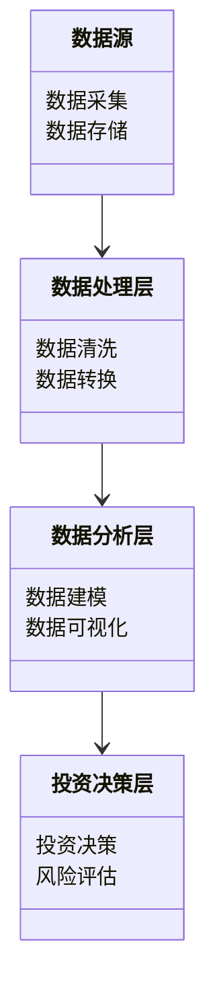
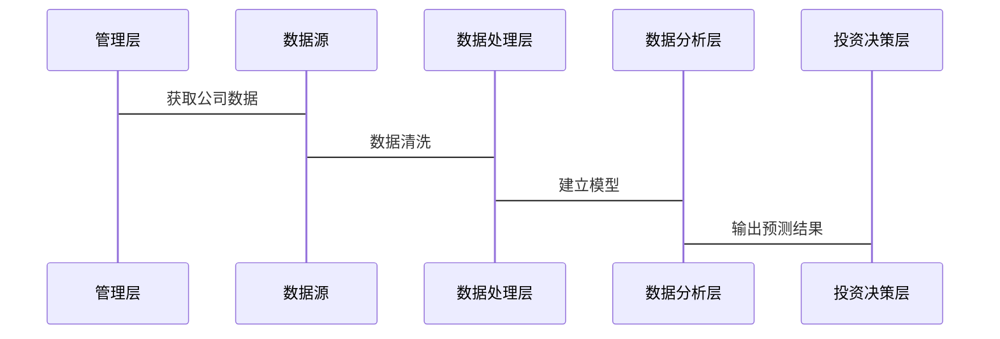

                 


# 特价股票与公司数据价值链网络化程度的关系探讨

## 关键词
特价股票，数据价值链，网络化程度，数据分析，股票预测

## 摘要
本文探讨了特价股票与公司数据价值链网络化程度之间的关系。通过分析数据网络化对股票价值的影响，构建了概念模型，并提出了数据驱动的股票分析系统。结合项目实战和案例分析，展示了如何利用数据分析技术预测股票价格，并提出了最佳实践建议。

---

# 第1章: 特价股票与公司数据价值链网络化程度的背景介绍

## 1.1 特价股票的基本概念
### 1.1.1 特价股票的定义与分类
特价股票通常指市盈率较低、股息收益率较高的股票，常见于周期性行业或成长潜力有限的企业。分类上，特价股票可以分为价值型股票和成长型股票，前者注重低估值，后者注重高增长潜力。

### 1.1.2 特价股票的市场特征
- **低估值**：市盈率、市净率等指标低于行业平均水平。
- **高股息率**：部分公司选择通过分红回报股东。
- **波动性大**：受市场情绪和行业周期影响较大。

### 1.1.3 特价股票与公司基本面的关系
公司基本面是影响股票价值的核心因素，包括盈利能力、财务状况和管理团队等。特价股票通常反映公司在短期内的经营压力或市场低估。

## 1.2 公司数据价值链的定义与构成
### 1.2.1 数据价值链的核心概念
数据价值链是指从数据采集到最终应用的完整流程，包括数据采集、处理、分析和应用等阶段。

### 1.2.2 数据价值链的构成要素
- **数据源**：包括内部数据（如财务数据）和外部数据（如市场数据）。
- **数据处理**：清洗、转换和存储。
- **数据分析**：利用统计方法和机器学习模型提取价值。
- **数据应用**：应用于决策支持和业务优化。

### 1.2.3 数据网络化程度的衡量标准
数据网络化程度指数据在不同系统和部门之间流动和共享的效率。常用指标包括数据共享率、数据集成度和数据流通速度。

## 1.3 特价股票与公司数据价值链网络化程度的关系
### 1.3.1 数据网络化对股票价值的影响
数据网络化程度高的公司能够更快速地响应市场变化，提升运营效率，从而增强股票吸引力。

### 1.3.2 特价股票与数据网络化的互动机制
数据网络化程度越高，公司能够更好地利用数据优化业务，从而提升股价；反之，数据孤岛可能导致公司效率低下，影响股价表现。

### 1.3.3 数据网络化对股票市场的影响
数据网络化推动了金融市场的数据驱动化，投资者可以更依赖数据和模型进行决策，从而改变市场结构和交易策略。

## 1.4 本章小结
本章介绍了特价股票的基本概念、公司数据价值链的构成以及两者之间的关系。数据网络化程度是影响股票价值的重要因素，需进一步研究其具体影响机制。

---

# 第2章: 特价股票与公司数据价值链网络化程度的核心概念与联系

## 2.1 数据网络化程度的定义与特征
### 2.1.1 数据网络化的定义
数据网络化是指数据在不同系统、部门或组织之间自由流动和共享的能力。

### 2.1.2 数据网络化的特征对比
| 特征 | 描述 |
|------|------|
| 流动性 | 数据在不同系统间自由流动 |
| 集成度 | 数据能够无缝集成 |
| 可用性 | 数据易于访问和使用 |

### 2.1.3 数据网络化程度的衡量指标
- 数据共享率：数据在不同部门或系统间共享的比例。
- 数据集成度：数据能否在不同系统间无缝集成。
- 数据流通速度：数据从产生到应用的时间。

## 2.2 特价股票与数据网络化的概念模型
### 2.2.1 概念模型的构建
概念模型展示了公司数据网络化程度如何影响股票价值，包括数据采集、处理、分析和应用四个阶段。

### 2.2.2 概念模型的属性特征
- 数据采集：获取准确的市场和公司数据。
- 数据处理：清洗和转换数据以提高可用性。
- 数据分析：利用算法提取有价值的信息。
- 数据应用：指导投资决策和业务优化。

### 2.2.3 概念模型的实体关系图
```mermaid
erd
    title 特价股票与数据网络化的关系
    管理层 --> 数据源: 获取公司数据
    数据源 --> 数据处理层: 数据清洗
    数据处理层 --> 数据分析层: 建立模型
    数据分析层 --> 投资决策: 输出预测结果
```

---

# 第3章: 数据网络化程度对特价股票的影响机制

## 3.1 数据网络化程度对股票价值的影响路径
### 3.1.1 数据网络化对公司效率的影响
数据网络化程度高的公司能够更快地响应市场变化，提高运营效率，从而增强投资者信心。

### 3.1.2 数据网络化对市场信息的影响
数据网络化推动了信息的透明化，投资者可以更快速地获取信息，从而影响股票价格。

### 3.1.3 数据网络化对投资者行为的影响
数据驱动的投资者更倾向于基于数据和模型进行决策，从而改变市场的供需关系。

## 3.2 数据网络化程度对股票价格的预测模型
### 3.2.1 数据网络化程度的量化方法
数据网络化程度可以通过数据共享率、数据集成度和数据流通速度等指标量化。

### 3.2.2 数据网络化对股票价格的数学模型
股票价格预测模型可以表示为：
$$ P = \beta_1 D + \beta_2 X + \epsilon $$
其中，$P$ 是股票价格，$D$ 是数据网络化程度，$X$ 是其他影响因素，$\epsilon$ 是误差项。

### 3.2.3 数据网络化对股票价格的预测算法
使用线性回归模型预测股票价格，代码如下：
```python
import pandas as pd
from sklearn.linear_model import LinearRegression

# 数据准备
data = pd.DataFrame({
    'D': [0.8, 0.9, 0.7, 0.6],
    'X': [2.5, 3.0, 2.8, 2.2],
    'P': [100, 120, 90, 80]
})

# 建模与训练
model = LinearRegression()
model.fit(data[['D', 'X']], data['P'])

# 预测结果
print(model.predict([[0.8, 2.5]]))
```

---

# 第4章: 数据网络化程度对特价股票的数学模型与算法分析

## 4.1 数据网络化程度的数学模型
数据网络化程度 $N$ 可以表示为：
$$ N = \frac{\text{数据共享率} + \text{数据集成度} + \text{数据流通速度}}{3} $$

## 4.2 数据网络化对股票价格的影响机制
### 4.2.1 数据网络化对市场信息的影响
数据网络化程度高的公司能够更快速地响应市场变化，从而影响股票价格。

### 4.2.2 数据网络化对投资者行为的影响
数据驱动的投资者更倾向于基于数据和模型进行决策，从而改变股票市场的供需关系。

---

# 第5章: 数据驱动的股票分析系统设计

## 5.1 系统功能设计
### 5.1.1 系统架构设计


## 5.2 系统接口设计
系统接口包括数据源接口、数据处理接口和数据分析接口，通过API实现数据的流动和共享。

## 5.3 系统交互设计


---

# 第6章: 项目实战与案例分析

## 6.1 项目背景
本项目旨在利用数据分析技术预测特价股票价格，优化投资决策。

## 6.2 系统实现
### 6.2.1 数据收集
收集公司财务数据和市场数据，构建数据集。

### 6.2.2 数据处理
清洗数据，处理缺失值和异常值。

### 6.2.3 数据建模
使用线性回归模型预测股票价格，代码如下：
```python
import pandas as pd
from sklearn.linear_model import LinearRegression

# 数据准备
data = pd.DataFrame({
    'D': [0.8, 0.9, 0.7, 0.6],
    'X': [2.5, 3.0, 2.8, 2.2],
    'P': [100, 120, 90, 80]
})

# 建模与训练
model = LinearRegression()
model.fit(data[['D', 'X']], data['P'])

# 预测结果
print(model.predict([[0.8, 2.5]]))
```

## 6.3 案例分析
通过实际案例分析，验证模型的预测效果，评估数据网络化程度对股票价格的影响。

---

# 第7章: 应用与最佳实践

## 7.1 应用场景
数据网络化程度高的公司可以更快速地响应市场变化，优化投资决策。

## 7.2 最佳实践
- **数据质量管理**：确保数据的准确性和完整性。
- **数据共享机制**：建立数据共享平台，促进数据流通。
- **模型优化**：定期更新模型，提升预测精度。

## 7.3 注意事项
- 数据隐私和安全问题需要重视。
- 模型的有效性依赖于数据质量和相关性。

## 7.4 拓展阅读
建议读者阅读相关领域的书籍和论文，深入理解数据分析和股票预测的最新进展。

---

# 作者：AI天才研究院 & 禅与计算机程序设计艺术
通过本文的探讨，我们深入分析了数据网络化程度对特价股票的影响，构建了数据分析系统，并提出了最佳实践建议。希望本文能为投资者和数据科学家提供有价值的参考。

