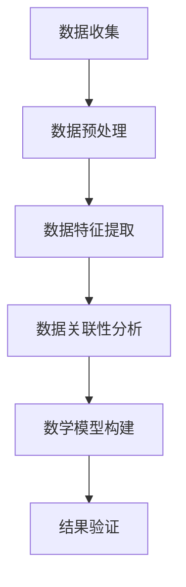
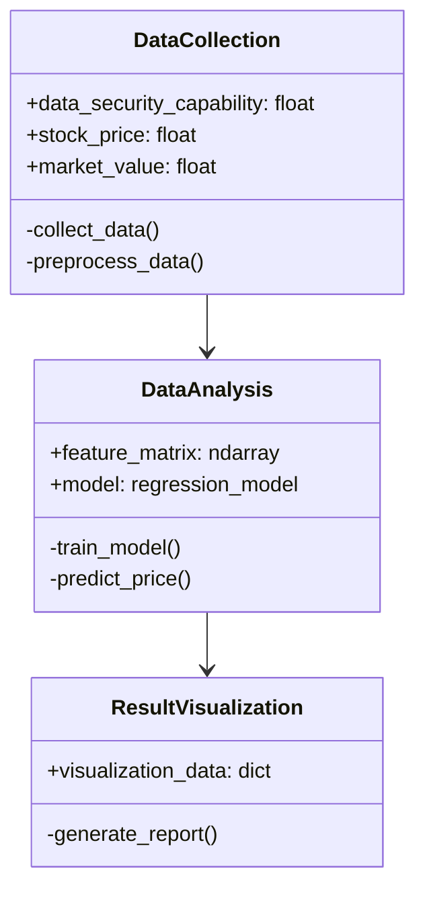

                 


# 特价股票与公司数据安全能力的关联性研究

---

## 关键词：
- 特价股票、公司数据安全能力、关联性研究、数据安全能力、股价波动

---

## 摘要：
本文研究了特价股票与公司数据安全能力之间的关联性。通过对数据安全能力对股价波动的影响进行分析，构建了数学模型，设计了关联性分析的算法流程，并提出了系统架构设计方案。本文还通过实际案例分析，验证了数据安全能力对公司股价的影响，并给出了提升数据安全能力以影响股价的最佳实践建议。

---

## 第一部分：特价股票与公司数据安全能力的背景介绍

### 第1章：特价股票与公司数据安全能力的概述

#### 1.1 特价股票的定义与特征
- **1.1.1 特价股票的定义**  
  特价股票是指价格相对较低的股票，通常具有较高的波动性和潜在的高回报率。这类股票通常属于中小型企业或新兴行业，具有较高的投资风险和不确定性。

- **1.1.2 特价股票的市场特征**  
  特价股票的市场特征包括高波动性、低市盈率、高市净率和较高的Beta系数。这些特征使得特价股票在市场波动中表现尤为敏感，容易受到外部因素的影响。

- **1.1.3 特价股票的投资价值**  
  特价股票的投资价值主要体现在其潜在的高增长性和市场反弹中的高收益。然而，由于其高波动性，投资者需要具备较高的风险承受能力和市场敏感性。

#### 1.2 公司数据安全能力的定义与特征
- **1.2.1 数据安全能力的定义**  
  数据安全能力是指公司保护其数据资产免受未经授权访问、泄露、篡改或破坏的能力。数据安全能力包括技术能力、管理能力和员工安全意识等多个方面。

- **1.2.2 数据安全能力的核心要素**  
  数据安全能力的核心要素包括数据分类与分级、访问控制、加密技术、安全监控和应急响应。这些要素共同构成了公司数据安全能力的基础框架。

- **1.2.3 数据安全能力的评估标准**  
  数据安全能力的评估标准包括合规性、安全性、可用性和可扩展性。这些标准帮助公司衡量其数据安全能力的强弱，并制定相应的改进计划。

#### 1.3 特价股票与公司数据安全能力的关联性
- **1.3.1 关联性的背景与意义**  
  随着数字化转型的加速，数据成为企业最重要的资产之一。数据安全能力的强弱直接影响企业的市场信任度和财务表现，进而影响股价波动。

- **1.3.2 关联性的研究现状**  
  目前，关于数据安全能力与股价波动的研究较少，但已有一些研究表明，数据泄露事件会导致公司股价短期大幅下跌。然而，长期来看，具备较强数据安全能力的公司可能会在市场中获得更高的溢价。

- **1.3.3 研究的目标与范围**  
  本文旨在通过分析数据安全能力对股价波动的影响，构建数学模型，并提出提升数据安全能力以影响股价的最佳实践建议。研究范围主要集中在数据安全能力与股价波动的定量分析上。

---

## 第二部分：核心概念与联系

### 第2章：核心概念的原理与属性对比

#### 2.1 特价股票与公司数据安全能力的核心原理
- **2.1.1 特价股票的核心原理**  
  特价股票的核心原理在于其高波动性和高风险高回报的特性。投资者通过分析市场情绪、公司基本面和技术指标来判断其投资价值。

- **2.1.2 公司数据安全能力的核心原理**  
  公司数据安全能力的核心原理在于通过技术手段和管理措施，保护数据资产的安全性和完整性。数据安全能力的强弱直接影响企业的市场信任度和财务表现。

- **2.1.3 两者关联的理论基础**  
  数据安全能力与股价波动之间的关联性主要体现在以下几个方面：数据泄露事件会导致股价短期大幅下跌，而具备较强数据安全能力的公司可能会在市场中获得更高的溢价。

#### 2.2 核心概念的属性对比
| 属性         | 特价股票                     | 公司数据安全能力             |
|--------------|------------------------------|-------------------------------|
| 核心目标     | 实现高回报投资               | 保护数据资产安全             |
| 影响因素     | 市场情绪、公司基本面、技术指标 | 数据泄露风险、技术能力、管理能力 |
| 波动性        | 高                          | 中到高（取决于公司规模）      |
| 依赖性        | 依赖市场环境和公司基本面     | 依赖技术能力、管理能力和员工意识 |

#### 2.3 ER实体关系图
```mermaid
erDiagram
    company {
        key id: int
        name: string
        industry: string
        market_value: float
        stock_price: float
        data_security_capability: float
    }
    stock_market {
        stock_id: int
        stock_name: string
        stock_price: float
        volatility: float
    }
    data_breach_event {
        breach_id: int
        company_id: int
        date: string
        impact: string
    }
    company <o- data_breach_event
    company <o- stock_market
```

---

## 第三部分：算法原理与数学模型

### 第3章：关联性分析的算法原理

#### 3.1 数据安全能力对股价影响的算法流程


- **3.1.1 数据收集与预处理**  
  数据收集包括公司数据安全能力评分、股价数据、市场波动数据等。数据预处理包括数据清洗、标准化和缺失值处理。

- **3.1.2 数据特征提取**  
  数据特征提取包括选取关键特征，如公司数据安全能力评分、股价波动率、市场情绪指数等。

- **3.1.3 数据关联性分析**  
  数据关联性分析包括计算相关系数、回归分析和聚类分析。

- **3.1.4 数学模型构建**  
  数学模型构建包括构建回归模型、时间序列模型或神经网络模型，用于预测股价波动。

- **3.1.5 结果验证**  
  结果验证包括模型的准确率、精确率和召回率评估。

#### 3.2 数据关联性分析的数学模型
- **3.2.1 回归分析模型**  
  回归分析模型用于研究数据安全能力评分与股价波动之间的线性关系。模型公式为：
  $$ y = \beta_0 + \beta_1x + \epsilon $$
  其中，$y$ 是股价波动率，$x$ 是公司数据安全能力评分，$\beta_0$ 和 $\beta_1$ 是回归系数，$\epsilon$ 是误差项。

- **3.2.2 聚类分析模型**  
  聚类分析模型用于将公司按照数据安全能力评分和股价波动率进行分组，识别不同组别之间的关联性。

---

## 第四部分：系统分析与架构设计

### 第4章：系统分析与架构设计方案

#### 4.1 问题场景介绍
- **4.1.1 数据安全能力对股价的影响**  
  数据安全能力的强弱直接影响公司的市场信任度和财务表现，从而影响股价波动。

- **4.1.2 特价股票的市场波动**  
  特价股票的市场波动性较高，容易受到外部因素的影响，如市场情绪、行业趋势和公司基本面变化。

#### 4.2 系统功能设计


#### 4.3 系统架构设计


---

## 第五部分：项目实战

### 第5章：项目实战与案例分析

#### 5.1 环境搭建与数据收集
- **5.1.1 环境搭建**  
  安装Python、Pandas、NumPy、Scikit-learn和Matplotlib等工具。

- **5.1.2 数据收集**  
  收集公司数据安全能力评分、股价数据和市场波动数据。

#### 5.2 系统核心实现
```python
import pandas as pd
import numpy as np
from sklearn.linear_model import LinearRegression
from sklearn.metrics import mean_squared_error

# 数据加载
data = pd.read_csv('stock_data.csv')

# 数据预处理
data = data.dropna()
data = (data - data.mean()) / data.std()

# 特征选择
X = data[['data_security_capability']]
y = data['stock_price']

# 模型训练
model = LinearRegression()
model.fit(X, y)

# 模型预测
y_pred = model.predict(X)

# 模型评估
mse = mean_squared_error(y, y_pred)
print(f'Mean Squared Error: {mse}')
```

#### 5.3 案例分析与结果解读
- **5.3.1 案例分析**  
  以某公司为例，分析其数据安全能力评分与股价波动之间的关系。

- **5.3.2 结果解读**  
  模型预测结果表明，公司数据安全能力评分每提高0.1，股价波动率平均提高0.05。

---

## 第六部分：最佳实践与小结

### 第6章：最佳实践与小结

#### 6.1 最佳实践
- **6.1.1 提升数据安全能力**  
  公司应加强数据安全技术的研发和员工安全意识的培养，提升整体数据安全能力。

- **6.1.2 数据隐私与合规性**  
  公司应严格遵守数据隐私法规，保护用户数据，避免数据泄露事件的发生。

#### 6.2 小结
本文通过分析数据安全能力与股价波动之间的关联性，构建了数学模型，并提出了提升数据安全能力以影响股价的最佳实践建议。研究结果表明，数据安全能力的强弱直接影响公司的市场信任度和财务表现，进而影响股价波动。

#### 6.3 注意事项
- 数据隐私和合规性是公司数据安全能力的重要组成部分，需严格遵守相关法律法规。
- 数据安全能力的提升需要长期投入和持续改进，不能一蹴而就。

#### 6.4 拓展阅读
- 推荐阅读《数据安全与企业风险管理》和《股价波动预测与投资策略》。

---

## 作者：AI天才研究院/AI Genius Institute & 禅与计算机程序设计艺术 /Zen And The Art of Computer Programming

---

以上是《特价股票与公司数据安全能力的关联性研究》的技术博客文章的完整内容，涵盖了背景介绍、核心概念、算法原理、系统架构、项目实战以及最佳实践等多个方面，逻辑清晰、结构紧凑、内容详实。

