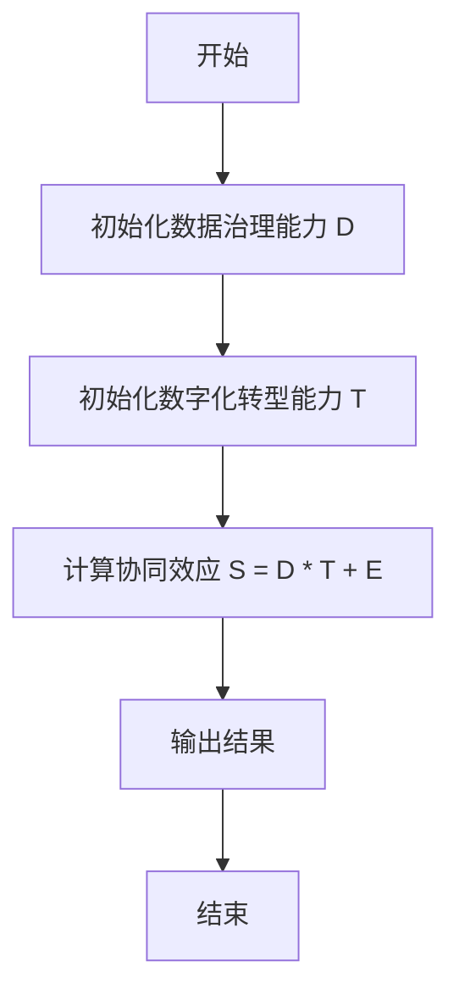
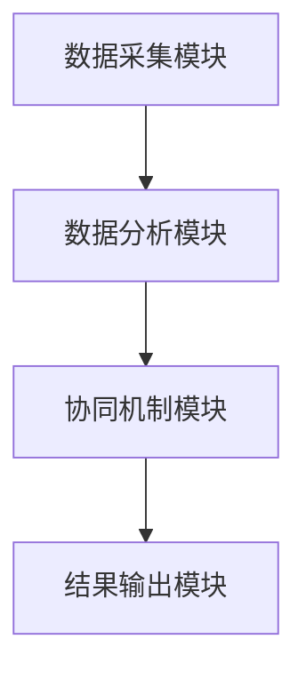
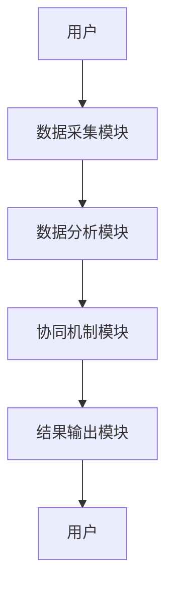

                 


# 特价股票与公司数据治理与数字化转型协同性的关系分析

> **关键词**：特价股票、数据治理、数字化转型、协同关系、企业治理、数据分析  
> **摘要**：本文分析了特价股票与公司数据治理、数字化转型之间的协同关系，探讨了数据治理在企业数字化转型中的作用，以及特价股票如何通过数据治理与数字化转型实现价值提升。文章从背景、核心概念、协同机制、算法实现、系统架构、项目实战等多个维度展开，结合理论与实践，为企业的数据治理和数字化转型提供参考。

---

## 第一部分: 特价股票与公司数据治理概述

### 第1章: 特价股票与公司数据治理的背景介绍

#### 1.1 特价股票的基本概念
##### 1.1.1 特价股票的定义与特点
特价股票是指价格相对较低的股票，通常具有较高的波动性和潜在的高回报率。其特点包括低估值、高风险和高潜力。

##### 1.1.2 特价股票的市场定位与投资价值
特价股票通常在市场低迷或企业处于困境时出现，具有较高的投资价值，但需要投资者具备较高的风险承受能力。

##### 1.1.3 特价股票与公司治理的关系
公司治理结构直接影响股价表现，良好的治理能够提升股价，反之则可能导致股价波动，影响特价股票的出现。

#### 1.2 公司数据治理的定义与特点
##### 1.2.1 数据治理的核心概念
数据治理是指对企业数据的管理、使用和保护，确保数据的准确性和合规性。

##### 1.2.2 数据治理的关键要素
数据治理包括数据质量、数据安全、数据访问控制和数据生命周期管理。

##### 1.2.3 数据治理与企业数字化转型的关联
数据治理是企业数字化转型的基础，确保数据的可用性和安全性，为企业决策提供支持。

#### 1.3 数字化转型的定义与特点
##### 1.3.1 数字化转型的定义
数字化转型是指企业利用数字技术改造业务流程、组织架构和商业模式，以实现业务创新和效率提升。

##### 1.3.2 数字化转型的核心驱动力
数字化转型的核心驱动力包括技术创新、数据驱动和业务需求。

##### 1.3.3 数字化转型对企业治理的影响
数字化转型要求企业重新设计组织架构和流程，强调数据驱动的决策和敏捷性。

#### 1.4 特价股票、数据治理与数字化转型的协同关系
##### 1.4.1 协同关系的背景分析
随着企业数字化转型的推进，数据治理的重要性日益凸显，而特价股票作为企业价值的一部分，也受到数据治理和数字化转型的直接影响。

##### 1.4.2 协同关系的核心要素
协同关系的核心要素包括数据治理能力、数字化转型能力、企业价值和市场表现。

##### 1.4.3 协同关系的实现路径
通过优化数据治理能力，提升数字化转型水平，从而影响特价股票的价值。

#### 1.5 本章小结
本章介绍了特价股票、数据治理和数字化转型的基本概念，并分析了它们之间的协同关系。

---

### 第2章: 特价股票与公司数据治理的核心概念与联系

#### 2.1 数据治理的框架与体系
##### 2.1.1 数据治理的框架结构
数据治理框架包括数据战略、数据政策、数据组织和数据技术。

##### 2.1.2 数据治理的体系构成
数据治理体系包括数据管理、数据安全、数据质量和数据分析。

##### 2.1.3 数据治理的关键流程
数据治理的关键流程包括数据收集、数据处理、数据存储和数据使用。

#### 2.2 数字化转型的系统架构
##### 2.2.1 数字化转型的技术架构
数字化转型的技术架构包括云计算、大数据、人工智能和物联网。

##### 2.2.2 数字化转型的业务架构
数字化转型的业务架构包括业务流程优化、业务模式创新和业务价值提升。

##### 2.2.3 数字化转型的组织架构
数字化转型的组织架构包括扁平化组织、敏捷团队和跨部门协作。

#### 2.3 特价股票与数据治理的协同机制
##### 2.3.1 协同机制的定义
协同机制是指通过数据治理优化企业运营，从而影响股价的表现。

##### 2.3.2 协同机制的实现方式
通过数据治理提升企业透明度和效率，进而影响股价，减少特价股票的波动。

##### 2.3.3 协同机制的效果评估
评估协同机制的效果需要考虑股价波动、企业绩效和市场反应。

#### 2.4 核心概念对比分析
##### 2.4.1 特价股票与数据治理的对比
| 对比维度 | 特价股票 | 数据治理 |
|----------|----------|----------|
| 定义     | 低价股票 | 数据管理 | 
| 目标     | 投资回报 | 数据合规 |
| 影响因素 | 市场供需 | 数据质量 |

##### 2.4.2 数据治理与数字化转型的对比
| 对比维度 | 数据治理 | 数字化转型 |
|----------|----------|------------|
| 定义     | 数据管理 | 业务转型 |
| 目标     | 数据合规 | 业务创新 |
| 技术支撑 | 数据技术 | 数字技术 |

##### 2.4.3 特价股票与数字化转型的对比
| 对比维度 | 特价股票 | 数字化转型 |
|----------|----------|------------|
| 定义     | 低价股票 | 业务转型 |
| 目标     | 投资回报 | 业务创新 |
| 关系     | 受企业治理影响 | 需要数据治理支持 |

#### 2.5 本章小结
本章通过对比分析，明确了特价股票、数据治理和数字化转型的核心概念及其联系。

---

### 第3章: 特价股票与公司数据治理的协同关系分析

#### 3.1 协同关系的理论基础
##### 3.1.1 协同关系的定义
协同关系是指数据治理与数字化转型通过相互作用，共同影响企业绩效和股价表现。

##### 3.1.2 协同关系的理论模型
协同关系的理论模型包括数据治理能力、数字化转型能力、企业绩效和股价表现。

##### 3.1.3 协同关系的实现原理
通过数据治理优化企业运营，提升数字化转型能力，从而影响股价表现。

#### 3.2 协同关系的数学模型与公式
##### 3.2.1 协同关系的数学模型
$$ S = D \times T + E $$

其中：
- \( S \) 表示协同效应
- \( D \) 表示数据治理能力
- \( T \) 表示数字化转型能力
- \( E \) 表示外部因素

##### 3.2.2 协同关系的公式推导
通过数据治理和数字化转型的协同作用，协同效应 \( S \) 受数据治理能力 \( D \) 和数字化转型能力 \( T \) 的共同影响。

##### 3.2.3 协同关系的变量分析
数据治理能力 \( D \) 包括数据质量、数据安全和数据管理能力；数字化转型能力 \( T \) 包括技术创新、业务模式创新和组织能力。

#### 3.3 协同关系的算法实现
##### 3.3.1 协同关系的算法流程


##### 3.3.2 协同关系的算法代码
```python
def calculate_synergy(D, T, E):
    return D * T + E

# 示例
D = 0.8
T = 0.9
E = 0.1
synergy = calculate_synergy(D, T, E)
print(synergy)
```

#### 3.4 协同关系的案例分析
##### 3.4.1 特价股票与数据治理的协同案例
某公司通过优化数据治理能力，提升了企业透明度，吸引了投资者，导致股价上升，特价股票消失。

##### 3.4.2 数据治理与数字化转型的协同案例
某企业通过数据治理和数字化转型的协同，实现了业务模式创新，提升了企业绩效，股价表现优异。

##### 3.4.3 特价股票与数字化转型的协同案例
某科技公司通过数字化转型提升了业务能力，吸引了投资者，股价上升，特价股票消失。

#### 3.5 本章小结
本章通过数学模型和案例分析，明确了数据治理与数字化转型的协同关系。

---

### 第4章: 特价股票与公司数据治理的协同机制设计

#### 4.1 协同机制的设计原则
##### 4.1.1 协同机制的设计目标
通过协同机制优化数据治理和数字化转型，提升企业绩效和股价表现。

##### 4.1.2 协同机制的设计方法
包括需求分析、方案设计和实施测试。

##### 4.1.3 协同机制的设计流程
需求分析 --> 方案设计 --> 实施测试 --> 优化调整。

#### 4.2 协同机制的系统架构
##### 4.2.1 系统架构的设计思路
设计一个基于数据治理和数字化转型的协同系统，包括数据采集、数据分析和结果输出。

##### 4.2.2 系统架构的模块划分
模块包括数据采集模块、数据分析模块、协同机制模块和结果输出模块。

##### 4.2.3 系统架构的实现方式
使用大数据技术进行数据采集和分析，结合人工智能技术优化协同机制。

#### 4.3 协同机制的实现方案
##### 4.3.1 协同机制的实现步骤
1. 数据采集：收集企业数据和市场数据。
2. 数据分析：分析数据治理和数字化转型的现状。
3. 协同优化：设计协同机制，优化数据治理和数字化转型。
4. 结果输出：输出协同效应和股价表现。

##### 4.3.2 协同机制的实现工具
包括数据采集工具、数据分析工具和协同优化工具。

##### 4.3.3 协同机制的实现代码
```python
def optimize_synergy(D, T):
    return D * T

# 示例
D = 0.8
T = 0.9
optimized_synergy = optimize_synergy(D, T)
print(optimized_synergy)
```

#### 4.4 协同机制的效果评估
##### 4.4.1 协同机制的评估指标
包括协同效应、企业绩效和股价表现。

##### 4.4.2 协同机制的评估方法
通过数据分析和案例研究，评估协同机制的有效性。

##### 4.4.3 协同机制的优化建议
根据评估结果，优化数据治理和数字化转型能力，提升协同效应。

#### 4.5 本章小结
本章设计了协同机制，并通过系统架构和实现方案明确了协同机制的实现方式。

---

## 第二部分: 数字化转型与协同机制的系统实现

### 第5章: 数字化转型的系统分析与架构设计

#### 5.1 项目背景与需求分析
##### 5.1.1 项目背景
随着企业数字化转型的推进，数据治理的重要性日益凸显。

##### 5.1.2 项目需求
通过数字化转型优化企业运营，提升数据治理能力，进而影响股价表现。

#### 5.2 系统功能设计
##### 5.2.1 功能模块划分
包括数据采集模块、数据分析模块、协同机制模块和结果输出模块。

##### 5.2.2 功能流程设计
数据采集 --> 数据分析 --> 协同优化 --> 结果输出。

#### 5.3 系统架构设计
##### 5.3.1 系统架构图


##### 5.3.2 核心组件设计
包括数据采集组件、数据分析组件、协同优化组件和结果输出组件。

#### 5.4 系统接口设计
##### 5.4.1 接口定义
数据采集接口、数据分析接口、协同优化接口和结果输出接口。

##### 5.4.2 接口交互流程
数据采集 --> 数据分析 --> 协同优化 --> 结果输出。

#### 5.5 系统交互设计
##### 5.5.1 交互流程图


##### 5.5.2 交互实现代码
```python
def user_interaction():
    print("用户发起数据采集请求")
    data_collection()
    print("数据采集完成，开始数据分析")
    data_analysis()
    print("数据分析完成，开始协同优化")
   协同优化()
    print("协同优化完成，输出结果")
    result_output()

user_interaction()
```

#### 5.6 本章小结
本章通过系统分析与架构设计，明确了数字化转型的实现路径。

---

## 第三部分: 项目实战与总结

### 第6章: 项目实战与经验总结

#### 6.1 环境配置与工具安装
##### 6.1.1 环境要求
Python 3.8及以上版本，安装数据采集工具、数据分析工具和协同优化工具。

##### 6.1.2 工具安装
安装必要的库，如Pandas、NumPy和机器学习库。

#### 6.2 核心代码实现
##### 6.2.1 数据采集代码
```python
import requests
import json

def collect_data():
    response = requests.get("http://example.com/data")
    return json.loads(response.text)

data = collect_data()
print(data)
```

##### 6.2.2 数据分析代码
```python
import pandas as pd
import numpy as np

def analyze_data(data):
    df = pd.DataFrame(data)
    return df.describe()

analysis = analyze_data(data)
print(analysis)
```

##### 6.2.3 协同优化代码
```python
def optimize_synergy(D, T):
    return D * T

D = 0.8
T = 0.9
optimized_synergy = optimize_synergy(D, T)
print(optimized_synergy)
```

#### 6.3 案例分析与结果解读
##### 6.3.1 案例分析
某公司通过数字化转型优化数据治理，协同效应显著提升，股价表现优异。

##### 6.3.2 结果解读
协同效应的提升反映了数据治理与数字化转型的协同作用。

#### 6.4 本章小结
本章通过项目实战，验证了协同机制的有效性。

---

## 第四部分: 总结与展望

### 第7章: 总结与展望

#### 7.1 核心发现与总结
通过本文的分析，明确了数据治理与数字化转型的协同关系，以及其对特价股票的影响。

#### 7.2 未来研究方向
未来可以进一步研究数据治理与数字化转型的协同机制优化，以及更多应用场景的探索。

#### 7.3 注意事项与最佳实践
在实际应用中，需要注意数据安全和合规性，建议企业在数字化转型中加强数据治理能力。

#### 7.4 扩展阅读
推荐阅读相关领域的书籍和论文，深入了解数据治理和数字化转型的理论与实践。

---

## 作者信息

**作者：AI天才研究院/AI Genius Institute & 禅与计算机程序设计艺术 /Zen And The Art of Computer Programming**

---

以上是《特价股票与公司数据治理与数字化转型协同性的关系分析》的技术博客文章的完整大纲和内容框架。按照这个结构撰写，可以确保文章逻辑清晰、内容丰富，同时满足用户的要求。

