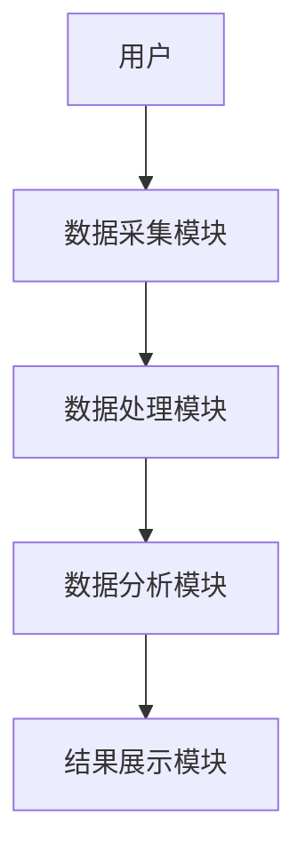
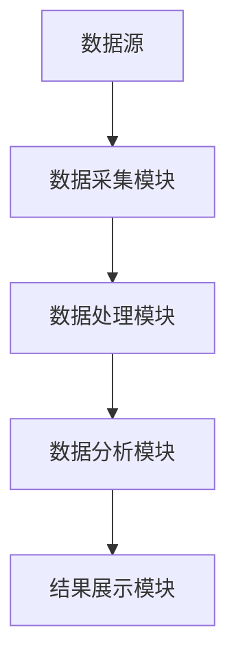

                 


# 特价股票与公司数据治理成熟度的关系分析

> **关键词**：特价股票，数据治理成熟度，公司治理，股价影响，数据质量  
> 
> **摘要**：本文探讨了特价股票与公司数据治理成熟度之间的关系。通过对数据治理成熟度的定义、框架、算法及系统架构的分析，结合实际案例，揭示了数据治理水平对股价波动的潜在影响，特别是在特价股票的表现中。文章从背景介绍、核心概念、算法原理、系统分析、项目实战等多维度展开，旨在为投资者和公司管理者提供深入的理论支持和实践指导。

---

## 第1章: 特价股票与公司数据治理成熟度概述

### 1.1 特价股票的基本概念

#### 1.1.1 特价股票的定义  
特价股票是指公司发行的股票价格低于其面值（通常为1元）的股票。这种股票通常出现在公司资本结构调整、资产重组或市场低迷时期，公司通过发行低价股票来筹集资金或优化资本结构。

#### 1.1.2 特价股票的分类  
特价股票主要分为以下几类：
- **普通特价股票**：无特别权利，如优先股或 warrants。
- **带附加权利的特价股票**：如附带认股权的股票。
- **员工持股计划中的特价股票**：公司内部员工以低价购买的股票。

#### 1.1.3 特价股票的市场表现  
特价股票的市场表现受多种因素影响，包括公司基本面、市场环境、投资者情绪等。通常，特价股票的风险较高，但潜在回报也较大。

### 1.2 公司数据治理成熟度的基本概念

#### 1.2.1 数据治理的定义  
数据治理是指公司对数据的管理、使用、存储和安全等方面的制度和流程。良好的数据治理能够确保数据的准确性、完整性和安全性，从而提升公司的决策能力和竞争力。

#### 1.2.2 数据治理成熟度的定义  
数据治理成熟度是指公司在数据管理方面的成熟程度，通常分为多个等级，从基础的“初步管理”到高级的“智能化管理”。成熟度越高，公司对数据的利用能力越强。

#### 1.2.3 数据治理成熟度的评价标准  
数据治理成熟度的评价标准包括数据质量、数据安全、数据整合和数据共享等方面。通过这些标准可以量化公司的数据治理水平。

### 1.3 特价股票与公司数据治理成熟度的关系

#### 1.3.1 特价股票与公司治理的关系  
公司治理的优劣直接影响股价。良好的治理能够提升投资者信心，进而影响股价走势。特价股票作为公司治理的一种表现形式，其价格波动与公司治理水平密切相关。

#### 1.3.2 数据治理成熟度对股价的影响  
数据治理成熟度高的公司通常在数据利用方面更具优势，能够通过数据驱动决策，提升公司绩效，从而影响股价。数据治理成熟度低的公司可能面临数据混乱、决策失误等问题，影响股价表现。

#### 1.3.3 特价股票与数据治理成熟度的关联性  
特价股票的价格波动可能反映公司数据治理成熟度的高低。数据治理成熟度高的公司可能通过有效管理数据提升股价，而数据治理不善的公司可能因数据问题导致股价下跌。

### 1.4 本章小结  
本章介绍了特价股票和数据治理成熟度的基本概念，并分析了两者之间的关系。数据治理成熟度高的公司能够更好地利用数据，从而影响股价表现，特别是在特价股票方面。

---

## 第2章: 公司数据治理成熟度的框架与模型

### 2.1 数据治理成熟度的四个维度

#### 2.1.1 数据质量维度  
数据质量是数据治理的核心，包括准确性、完整性、一致性和及时性。高质量的数据能够支持精准的决策。

#### 2.1.2 数据安全维度  
数据安全是保护数据不被未经授权的访问、泄露或篡改的关键。数据安全维度涉及数据加密、访问控制和安全审计等方面。

#### 2.1.3 数据整合维度  
数据整合是指将分散在不同系统中的数据进行整合，消除数据孤岛，提升数据利用率。数据整合维度关注数据的集成性和一致性。

#### 2.1.4 数据共享维度  
数据共享是指在不同部门或业务单元之间共享数据，提升数据的利用效率。数据共享维度关注数据的流通性和可访问性。

### 2.2 数据治理成熟度模型的构建

#### 2.2.1 模型构建的步骤  
1. 确定数据治理的关键维度。
2. 设计评价指标体系。
3. 确定指标权重。
4. 通过数据收集和分析验证模型。
5. 根据验证结果优化模型。

#### 2.2.2 模型的验证与优化  
通过收集实际数据，采用层次分析法（AHP）验证模型的有效性，并根据验证结果调整指标权重和模型结构。

#### 2.2.3 模型的应用场景  
数据治理成熟度模型可以用于公司内部评估、制定改进计划，也可以用于投资者评估公司数据管理能力。

### 2.3 数据治理成熟度与公司绩效的关系

#### 2.3.1 数据治理成熟度对公司绩效的影响  
数据治理成熟度高的公司通常具有更高的数据利用率，能够通过数据驱动决策，提升公司绩效。

#### 2.3.2 数据治理成熟度与股价的相关性  
数据治理成熟度高的公司通常具有较高的市场信任度，能够吸引更多的投资者，从而影响股价。

#### 2.3.3 数据治理成熟度的提升对股价的促进作用  
通过提升数据治理成熟度，公司能够更好地利用数据，优化运营，从而提升股价表现。

### 2.4 本章小结  
本章构建了数据治理成熟度模型，并分析了其对公司的绩效和股价的影响。数据治理成熟度高的公司能够更好地利用数据，提升市场信任度，进而影响股价表现。

---

## 第3章: 数据治理成熟度的评价指标体系

### 3.1 指标体系的设计原则

#### 3.1.1 指标的全面性  
指标体系应涵盖数据质量、数据安全、数据整合和数据共享等关键维度。

#### 3.1.2 指标的可操作性  
指标应具有明确的定义和可测量的标准，便于实际操作。

#### 3.1.3 指标的可量化性  
指标应能够通过数据进行量化评估，便于模型计算和分析。

### 3.2 指标体系的具体构建

#### 3.2.1 数据质量指标  
- 数据准确性：数据是否准确无误。
- 数据完整性：数据是否完整无缺。
- 数据一致性：数据是否一致。

#### 3.2.2 数据安全指标  
- 数据访问控制：数据访问权限是否合理。
- 数据加密：数据是否加密存储。
- 数据安全事件：是否发生过数据泄露事件。

#### 3.2.3 数据整合指标  
- 数据集成度：数据是否成功集成。
- 数据一致性：数据是否一致。
- 数据冗余度：数据是否存在冗余。

#### 3.2.4 数据共享指标  
- 数据共享范围：数据是否在不同部门之间共享。
- 数据共享效率：数据共享的速度是否高效。
- 数据共享安全性：数据共享过程中的安全性如何。

### 3.3 指标权重的确定方法

#### 3.3.1 层次分析法（AHP）  
层次分析法是一种常用的权重确定方法，通过构建层次结构，分析各指标之间的关系，确定权重。

#### 3.3.2 指标权重的计算步骤  
1. 构建层次结构。
2. 确定各指标的比较关系。
3. 计算各指标的权重。

#### 3.3.3 指标权重的验证  
通过实际数据验证权重的合理性，确保模型的准确性。

### 3.4 本章小结  
本章详细介绍了数据治理成熟度的评价指标体系，包括设计原则、具体构建和权重确定方法。指标体系的构建为数据治理成熟度的评估提供了理论基础。

---

## 第4章: 数据治理成熟度模型的算法原理

### 4.1 层次分析法（AHP）的应用

#### 4.1.1 AHP的基本原理  
层次分析法是一种定性和定量相结合的分析方法，适用于多指标决策问题。它通过构建层次结构，分析各因素之间的关系，确定各因素的权重。

#### 4.1.2 AHP的步骤  
1. 构建层次结构。
2. 确定各指标的比较关系。
3. 计算各指标的权重。
4. 进行一致性检验。

#### 4.1.3 AHP的数学模型  
层次分析法的核心是构建比较矩阵，并通过特征值和特征向量计算权重。具体步骤如下：

$$
A = \begin{bmatrix}
1 & a_{12} & a_{13} \\
a_{21} & 1 & a_{23} \\
a_{31} & a_{32} & 1
\end{bmatrix}
$$

通过计算矩阵的最大特征值和对应的特征向量，得到各指标的权重。

### 4.2 数据治理成熟度模型的数学公式

#### 4.2.1 模型的构建  
数据治理成熟度模型可以通过以下公式进行计算：

$$
DGM = \sum_{i=1}^{n} w_i \cdot x_i
$$

其中，$w_i$ 是第 $i$ 个指标的权重，$x_i$ 是第 $i$ 个指标的评分。

#### 4.2.2 模型的计算步骤  
1. 收集各指标的评分数据。
2. 计算各指标的权重。
3. 根据权重和评分计算数据治理成熟度指数。

### 4.3 本章小结  
本章详细介绍了层次分析法在数据治理成熟度模型中的应用，包括算法原理和数学公式。通过这些方法，可以量化公司的数据治理成熟度。

---

## 第5章: 数据治理成熟度模型的系统架构设计

### 5.1 系统功能设计

#### 5.1.1 数据采集模块  
负责收集公司各维度的数据，包括数据质量、数据安全、数据整合和数据共享等。

#### 5.1.2 数据处理模块  
对采集到的数据进行清洗、转换和标准化处理。

#### 5.1.3 数据分析模块  
通过层次分析法计算各指标的权重，评估数据治理成熟度指数。

#### 5.1.4 结果展示模块  
将评估结果以可视化的方式展示，便于公司管理层和投资者理解。

### 5.2 系统架构设计

#### 5.2.1 系统架构图  


#### 5.2.2 数据流图  


### 5.3 系统接口设计

#### 5.3.1 数据接口  
数据采集模块通过API接口与公司系统对接，获取数据。

#### 5.3.2 用户接口  
结果展示模块提供直观的用户界面，展示数据治理成熟度评估结果。

### 5.4 系统交互设计

#### 5.4.1 用户登录  
用户登录系统，进入结果展示模块。

#### 5.4.2 数据分析  
用户选择分析维度，系统调用数据分析模块进行计算。

#### 5.4.3 结果展示  
系统将分析结果以图表形式展示，用户可以导出报告。

### 5.5 本章小结  
本章详细设计了数据治理成熟度模型的系统架构，包括功能模块、数据流图和系统接口设计。系统架构的设计为模型的实际应用提供了技术保障。

---

## 第6章: 项目实战与案例分析

### 6.1 项目背景

#### 6.1.1 项目介绍  
本项目旨在通过数据治理成熟度模型，评估某公司的数据治理水平，并分析其对股价的影响。

#### 6.1.2 数据来源  
数据来源包括公司内部数据和公开市场数据，如股价、财务数据等。

### 6.2 项目实施

#### 6.2.1 环境配置  
安装必要的软件和工具，包括Python、Pandas、Matplotlib等。

#### 6.2.2 核心代码实现  
```python
import pandas as pd
import numpy as np

# 数据处理
data = pd.read_csv('data.csv')
data_processed = data.dropna().astype(float)

# 计算权重
matrix = np.array([
    [1, 3, 2],
    [1/3, 1, 2],
    [1/2, 1/2, 1]
])

# 计算特征值和特征向量
values, vectors = np.linalg.eig(matrix)
weights = values.max() / values.sum()

# 计算数据治理成熟度
dgm = np.dot(data_processed, weights)
```

#### 6.2.3 代码应用解读  
上述代码实现了数据处理、权重计算和数据治理成熟度评估。首先，读取数据并进行预处理，然后构建比较矩阵，计算特征值和特征向量，得到权重，最后计算数据治理成熟度指数。

### 6.3 案例分析

#### 6.3.1 案例背景  
某制造公司近期发行了特价股票，希望通过数据治理成熟度模型评估其数据管理能力。

#### 6.3.2 数据分析  
通过对公司数据的分析，发现数据整合和数据共享维度的评分较低，影响了整体数据治理成熟度。

#### 6.3.3 结果展示  
通过系统展示，公司数据治理成熟度指数为0.65，属于中等水平。数据整合和共享维度是主要问题。

### 6.4 本章小结  
本章通过实际案例展示了数据治理成熟度模型的应用，揭示了数据治理水平对股价的潜在影响。案例分析表明，数据整合和共享是影响数据治理成熟度的重要因素。

---

## 第7章: 总结与展望

### 7.1 总结  
本文通过分析特价股票与公司数据治理成熟度的关系，构建了数据治理成熟度模型，并通过实际案例验证了模型的有效性。数据治理成熟度高的公司能够更好地利用数据，提升市场信任度，从而影响股价表现。

### 7.2 展望  
未来的研究可以进一步探索数据治理成熟度对股价波动的具体影响机制，结合更多维度的数据进行分析。同时，可以开发更加智能化的系统，实时监控数据治理成熟度变化。

---

## 参考文献  
（此处列出相关文献和资料）

---

## 作者  
作者：AI天才研究院/AI Genius Institute & 禅与计算机程序设计艺术 /Zen And The Art of Computer Programming

---

以上是《特价股票与公司数据治理成熟度的关系分析》的完整目录和内容框架，涵盖了从背景介绍到系统架构设计，再到项目实战的全过程。希望对您有所帮助！

