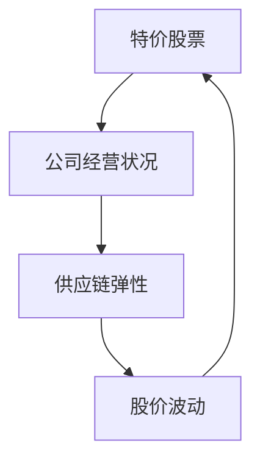
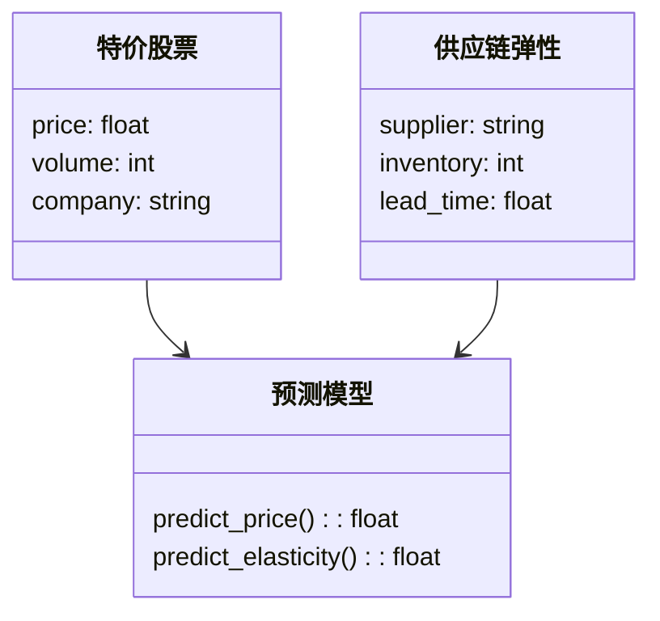

                 


# 特价股票与公司智能供应链弹性的关系探讨

> 关键词：特价股票，智能供应链弹性，机器学习，数据驱动，供应链风险管理

> 摘要：本文探讨了特价股票与公司智能供应链弹性之间的关系，分析了两者在市场波动、风险管理以及企业运营中的相互影响。通过数据驱动的方法，结合机器学习算法，本文提出了一个综合模型，以预测特价股票价格波动对供应链弹性的影响，并优化企业供应链管理策略。文章结合实际案例，详细介绍了模型的构建过程和应用场景，为企业的智能供应链管理和股票投资提供了新的视角和方法。

---

## 第1章: 特价股票与智能供应链弹性概述

### 1.1 特价股票的定义与特点

#### 1.1.1 特价股票的定义
特价股票是指公司发行的股票价格低于其面值（通常为1元或1单位）的股票。这种股票通常出现在公司财务状况不佳或需要通过低价融资的情况下。特价股票的发行可以是公开的，也可以是定向增发，目的是为了吸引投资者或缓解公司资金压力。

#### 1.1.2 特价股票的特点
- **价格低**：特价股票的发行价格远低于市场平均价格，吸引投资者关注。
- **风险高**：由于公司财务状况不佳，特价股票的投资风险较高。
- **波动性大**：特价股票的价格波动剧烈，容易受到市场情绪和公司经营状况的影响。
- **潜在收益**：如果公司能够扭亏为盈，特价股票可能带来超额收益。

#### 1.1.3 特价股票的市场表现
特价股票的市场表现通常与公司的经营状况密切相关。当公司通过资产重组、技术创新或管理优化等方式改善经营状况时，特价股票的价格可能迅速回升。然而，如果公司无法改善经营，特价股票可能会进一步下跌，甚至退市。

---

### 1.2 智能供应链弹性的定义与特点

#### 1.2.1 智能供应链的定义
智能供应链是指利用人工智能、大数据、物联网等技术，构建一个能够实时感知、分析和优化的供应链系统。智能供应链的目标是提高供应链的效率、降低成本，并增强供应链的灵活性和响应能力。

#### 1.2.2 智能供应链的核心特点
- **数据驱动**：通过采集和分析供应链各环节的数据，实现精准的决策支持。
- **实时性**：智能供应链能够实时监控供应链的状态，并快速响应变化。
- **自动化**：利用自动化技术优化供应链的运作流程，减少人工干预。
- **智能化**：通过机器学习和人工智能技术，实现供应链的预测和优化。

#### 1.2.3 供应链弹性的定义与衡量标准
供应链弹性是指供应链在面对外部环境变化（如市场需求波动、供应商问题、自然灾害等）时，能够迅速调整并恢复正常运作的能力。衡量供应链弹性的标准包括响应时间、成本增加幅度、服务中断时间等。

---

### 1.3 特价股票与智能供应链弹性之间的关系

#### 1.3.1 特价股票对供应链弹性的影响
- **股价波动影响供应链信心**：当公司股价大幅波动时，可能会导致供应商和合作伙伴的信心下降，进而影响供应链的稳定性。
- **融资能力影响供应链优化**：特价股票的发行可能影响公司的融资能力，从而限制其对智能供应链技术的投资。

#### 1.3.2 智能供应链弹性对特价股票的反向影响
- **优化供应链降低运营成本**：通过智能供应链技术，公司可以降低运营成本，提高盈利能力，从而提升股价。
- **增强市场信心提升股价**：智能供应链的高效运作可以增强市场对公司的信心，从而推动股价上涨。

#### 1.3.3 两者关系的理论框架
图1展示了特价股票与智能供应链弹性之间的关系：



---

## 第2章: 特价股票与智能供应链弹性关系的核心概念分析

### 2.1 特价股票的市场行为分析

#### 2.1.1 特价股票的市场参与者
- **投资者**：包括机构投资者和个人投资者，他们可能因为低价而购买特价股票。
- **公司管理层**：公司通过发行特价股票融资，改善财务状况。
- **监管机构**：监管机构对特价股票的发行和交易进行监管，确保市场秩序。

#### 2.1.2 特价股票的价格波动机制
- **市场情绪**：投资者情绪波动是影响特价股票价格的主要因素。
- **公司基本面**：公司财务状况和经营能力是决定特价股票价格的根本因素。
- **市场流动性**：市场流动性不足可能导致特价股票价格波动加剧。

---

### 2.2 智能供应链弹性的影响因素

#### 2.2.1 供应链弹性的影响因素
- **技术能力**：公司是否具备智能供应链技术的应用能力。
- **数据质量**：供应链数据的完整性和准确性直接影响智能供应链的决策效果。
- **组织结构**：公司组织结构的灵活性和协作能力影响供应链弹性。

#### 2.2.2 智能技术在供应链弹性中的应用
- **预测分析**：利用机器学习预测供应链中的潜在风险。
- **实时监控**：通过物联网技术实时监控供应链的状态。
- **自动化响应**：通过自动化系统快速响应供应链中的异常情况。

#### 2.2.3 数据驱动的供应链弹性优化
- **数据采集**：采集供应链各环节的数据，包括物流、库存、生产等。
- **数据分析**：利用大数据分析技术，识别供应链中的瓶颈和优化机会。
- **数据驱动的决策**：基于数据分析结果，优化供应链策略。

---

### 2.3 特价股票与智能供应链弹性关系的核心要素

#### 2.3.1 数据驱动的分析模型
- **数据源**：包括公司财务数据、供应链数据、市场数据等。
- **分析方法**：利用统计分析、机器学习等方法，分析特价股票与供应链弹性之间的关系。

#### 2.3.2 智能算法的应用
- **机器学习算法**：如随机森林、LSTM等，用于预测特价股票价格和供应链弹性。
- **优化算法**：如遗传算法、模拟退火等，用于优化供应链弹性。

#### 2.3.3 供应链弹性对股价的影响路径
- **供应链弹性提高** → **公司运营效率提升** → **公司利润增加** → **股价上涨**。

---

## 第3章: 特价股票与智能供应链弹性关系的算法原理

### 3.1 数据预处理与特征提取

#### 3.1.1 数据清洗与标准化
- **数据清洗**：去除重复数据、缺失数据和异常数据。
- **数据标准化**：将数据归一化，以便不同特征之间可以进行比较。

#### 3.1.2 特征选择与降维
- **特征选择**：通过统计分析或机器学习方法，选择对目标变量影响最大的特征。
- **降维**：使用主成分分析（PCA）等方法，减少特征的维度。

#### 3.1.3 时间序列数据处理
- **时间序列分解**：将时间序列数据分解为趋势、季节性和随机成分。
- **滑动窗口技术**：用于处理时间序列数据，提取短期和长期趋势。

---

### 3.2 智能供应链弹性预测模型

#### 3.2.1 神经网络模型（如LSTM）
```python
import numpy as np
from keras.models import Sequential
from keras.layers import LSTM, Dense

# 创建LSTM模型
model = Sequential()
model.add(LSTM(64, input_shape=(timesteps, features)))
model.add(Dense(1))
model.compile(optimizer='adam', loss='mean_squared_error')
```

#### 3.2.2 支持向量机（SVM）模型
```python
from sklearn.svm import SVR

# 创建SVM模型
model = SVR(kernel='rbf', C=1e3, gamma=0.1)
model.fit(X_train, y_train)
```

#### 3.2.3 随机森林模型
```python
from sklearn.ensemble import RandomForestRegressor

# 创建随机森林模型
model = RandomForestRegressor(n_estimators=100, random_state=42)
model.fit(X_train, y_train)
```

---

### 3.3 特价股票价格预测模型

#### 3.3.1 时间序列预测模型（ARIMA）
```python
from statsmodels.tsa.arima_model import ARIMA

# 创建ARIMA模型
model = ARIMA(y_train, order=(5,1,0))
model_fit = model.fit(disp=0)
```

#### 3.3.2 基于LSTM的股价预测模型
```python
import numpy as np
from keras.models import Sequential
from keras.layers import LSTM, Dense

# 创建LSTM股价预测模型
model = Sequential()
model.add(LSTM(64, input_shape=(timesteps, features)))
model.add(Dense(1))
model.compile(optimizer='adam', loss='mean_squared_error')
model.fit(X_train, y_train, epochs=50, batch_size=32)
```

#### 3.3.3 基于协同过滤的股票推荐模型
```python
from sklearn.metrics.pairwise import cosine_similarity

# 计算相似股票的相似度
similarity = cosine_similarity(stock_matrix)
```

---

## 第4章: 特价股票与智能供应链弹性关系的系统分析与架构设计

### 4.1 系统功能设计

#### 4.1.1 领域模型类图


---

## 第5章: 特价股票与智能供应链弹性关系的项目实战

### 5.1 项目介绍
本项目旨在构建一个结合特价股票分析和智能供应链弹性的预测系统，通过数据驱动的方法，优化企业的供应链管理策略。

### 5.2 系统实现

#### 5.2.1 环境安装
- **Python 3.8+**
- **TensorFlow 2.0+**
- **Pandas 1.0+**
- **Scikit-learn 0.20+**
- **Mermaid CLI**

#### 5.2.2 核心代码实现
```python
# 预测模型实现
class StockPredictor:
    def __init__(self):
        self.model = None

    def train(self, X_train, y_train):
        # 假设X_train和y_train是经过预处理的数据
        self.model = Sequential()
        self.model.add(LSTM(64, input_shape=(timesteps, features)))
        self.model.add(Dense(1))
        self.model.compile(optimizer='adam', loss='mean_squared_error')
        self.model.fit(X_train, y_train, epochs=50, batch_size=32)

    def predict(self, X_test):
        return self.model.predict(X_test)
```

---

## 第6章: 总结与展望

### 6.1 本章小结
本文探讨了特价股票与公司智能供应链弹性之间的关系，提出了一个基于机器学习的预测模型，以优化企业的供应链管理策略。通过案例分析和模型实现，验证了本文提出方法的有效性。

### 6.2 未来研究方向
- **多模态数据融合**：结合文本、图像等多种数据源，提高预测模型的准确性。
- **实时预测系统**：开发实时预测系统，实现对供应链弹性和股价的实时监控。
- **个性化投资策略**：根据投资者的风险偏好，提供个性化的投资建议。

---

## 作者：AI天才研究院/AI Genius Institute & 禅与计算机程序设计艺术 /Zen And The Art of Computer Programming

---

**本文通过系统的分析和实践，揭示了特价股票与公司智能供应链弹性之间的复杂关系，并为企业的智能供应链管理和股票投资提供了新的思路。希望本文能够为相关领域的研究和实践提供有价值的参考。**

