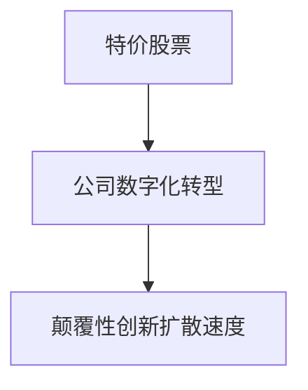
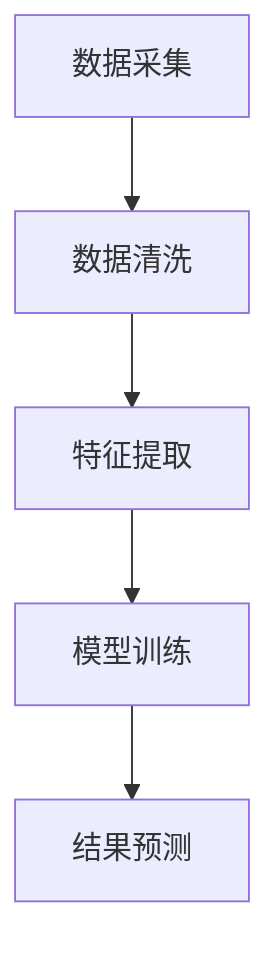
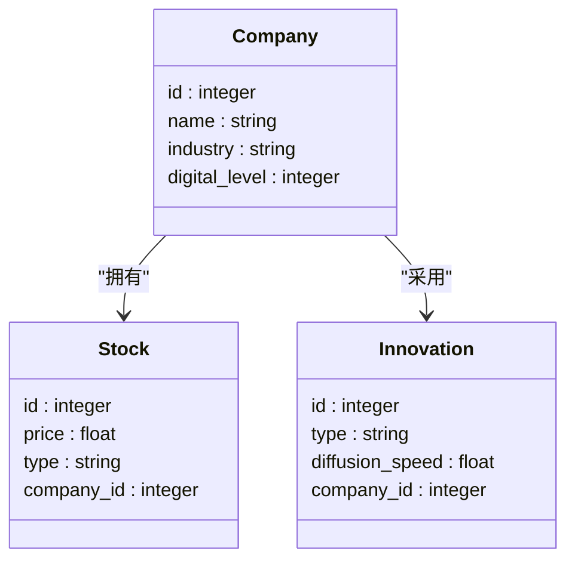
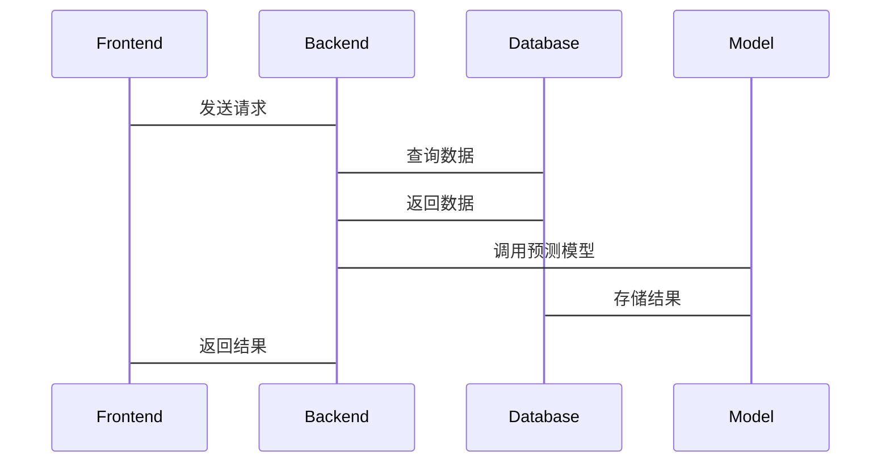

                 


# 特价股票与公司跨界数字化颠覆性创新扩散速度的关联性研究

> **关键词**：特价股票，公司跨界数字化，颠覆性创新，扩散速度，关联性研究

> **摘要**：本文旨在研究特价股票与公司跨界数字化颠覆性创新扩散速度之间的关联性。通过对特价股票市场的分析，结合公司数字化转型的特征，探讨数字化创新的扩散速度如何影响特价股票的波动，并提出相关理论模型和实证分析。本文将从背景介绍、核心概念、算法原理、系统分析、项目实战、最佳实践等角度展开研究，为相关领域的研究和实践提供参考。

---

## 第1章: 背景介绍

### 1.1 问题背景

#### 1.1.1 特价股票的定义与特点
特价股票通常指的是价格低于市场平均值的股票，具有以下特点：
- 价格波动性高
- 交易量大
- 投资风险较高
- 常用于短线交易策略

#### 1.1.2 公司跨界数字化的定义与特点
公司跨界数字化指的是企业从传统业务模式向数字化转型的过程，其特点包括：
- 跨界性：突破原有行业界限，融入新兴技术
- 技术驱动：依赖大数据、人工智能、区块链等技术
- 创新性：通过数字化手段实现业务模式创新
- 风险性：转型失败可能导致业务衰退

#### 1.1.3 颠覆性创新扩散速度的定义与特点
颠覆性创新扩散速度是指创新技术或商业模式在市场中被采用的速度，其特点包括：
- 非线性增长：初期缓慢，后期快速扩散
- 影响范围广：可能改变整个行业生态
- 用户采纳率高：快速被市场接受

### 1.2 问题描述

#### 1.2.1 特价股票与公司跨界数字化的关系
特价股票市场的波动可能与公司数字化转型的进展密切相关。例如，一家公司成功实现数字化转型可能带动其股价上涨，反之则可能导致股价下跌。

#### 1.2.2 颠覆性创新扩散速度的测量与评估
颠覆性创新扩散速度可以通过市场占有率、用户增长率、技术成熟度等指标进行测量。

#### 1.2.3 问题解决的必要性与意义
研究特价股票与公司数字化转型的关联性，有助于投资者更好地把握市场机会，帮助企业制定更有效的数字化战略。

### 1.3 问题解决

#### 1.3.1 理论基础与研究现状
- 理论基础：基于技术创新扩散理论和股票市场波动理论
- 研究现状：现有研究多集中于单一因素对股票价格的影响，较少涉及数字化转型的综合影响

#### 1.3.2 研究目标与研究方法
- 研究目标：揭示特价股票与公司数字化转型的关联性
- 研究方法：定量分析与定性分析相结合，采用大数据分析和机器学习方法

#### 1.3.3 研究框架与研究假设
- 研究框架：构建特价股票价格波动模型，分析数字化创新扩散对股价的影响
- 研究假设：公司数字化转型的进展与特价股票价格波动呈正相关关系

### 1.4 边界与外延

#### 1.4.1 特价股票的适用范围
- 适用于中小型企业股票
- 适用于新兴行业股票

#### 1.4.2 公司跨界数字化的边界条件
- 限于技术创新驱动的数字化转型
- 限于公开上市公司

#### 1.4.3 颠覆性创新扩散速度的适用场景
- 适用于技术成熟度高的创新
- 适用于市场接受度高的创新

### 1.5 概念结构与核心要素组成

#### 1.5.1 核心概念的层次结构
从下至上的层次结构包括：
1. 特价股票
2. 公司数字化转型
3. 颠覆性创新扩散速度

#### 1.5.2 核心要素的相互关系
- 特价股票是研究的基础
- 数字化转型是研究的核心
- 颠覆性创新扩散速度是研究的目标

#### 1.5.3 概念结构的可视化图示


---

## 第2章: 核心概念与联系

### 2.1 核心概念原理

#### 2.1.1 特价股票的市场机制
- 市场供需关系
- 投资者情绪
- 公司基本面

#### 2.1.2 公司跨界数字化的驱动因素
- 技术进步
- 市场需求
- 竞争压力

#### 2.1.3 颠覆性创新扩散速度的影响因素
- 技术成熟度
- 市场接受度
- 用户教育成本

### 2.2 核心概念属性特征对比

| 特性                | 特价股票                | 公司数字化转型            | 颠覆性创新扩散速度      |
|---------------------|-------------------------|---------------------------|--------------------------|
| 定义                | 价格低于市场平均值的股票 | 企业从传统模式向数字化转型 | 创新技术或商业模式的扩散速度 |
| 特点                | 波动性高、风险大         | 技术驱动、创新性强         | 非线性增长、影响范围广    |
| 关联性              | 与公司转型密切相关       | 是技术创新的核心驱动力    | 影响股票价格波动         |

### 2.3 ER实体关系图架构

```mermaid
erDiagram
    company {
        id : integer
        name : string
        industry : string
        digital_level : integer
    }
    stock {
        id : integer
        price : float
        type : string
        company_id : integer
    }
    innovation {
        id : integer
        type : string
        diffusion_speed : float
        company_id : integer
    }
    company-- stock : "拥有"
    company-- innovation : "采用"
```

---

## 第3章: 算法原理讲解

### 3.1 数据采集与处理

#### 3.1.1 数据来源
- 公司数字化转型数据
- 特价股票价格数据
- 市场交易数据

#### 3.1.2 数据清洗
- 去除缺失值
- 标准化处理
- 异常值处理

### 3.2 算法流程



### 3.3 算法实现

#### 3.3.1 Python代码实现

```python
import pandas as pd
from sklearn.linear_model import LinearRegression
from sklearn.metrics import mean_squared_error

# 数据加载
data = pd.read_csv('transformed_companies.csv')

# 特征提取
X = data[['digital_level', 'market_share']]
y = data['stock_price']

# 模型训练
model = LinearRegression()
model.fit(X, y)

# 模型预测
y_pred = model.predict(X)

# 模型评估
mse = mean_squared_error(y, y_pred)
print(f"均方误差：{mse}")
```

#### 3.3.2 算法原理的数学模型

股票价格预测模型：
$$
y = \beta_0 + \beta_1 x_1 + \beta_2 x_2 + \epsilon
$$
其中：
- \( y \) 表示股票价格
- \( x_1 \) 表示公司数字化转型水平
- \( x_2 \) 表示市场占有率
- \( \beta_0, \beta_1, \beta_2 \) 表示回归系数
- \( \epsilon \) 表示误差项

---

## 第4章: 系统分析与架构设计方案

### 4.1 问题场景介绍
- 数据来源：公开股票市场数据与公司数字化转型数据
- 问题目标：构建预测模型，评估数字化创新对股票价格的影响

### 4.2 系统功能设计

#### 4.2.1 领域模型设计



#### 4.2.2 系统架构设计


#### 4.2.3 系统接口设计



---

## 第5章: 项目实战

### 5.1 环境安装

#### 5.1.1 安装Python与相关库
```bash
pip install numpy pandas scikit-learn
```

### 5.2 核心代码实现

#### 5.2.1 特价股票预测代码

```python
import pandas as pd
from sklearn.linear_model import LinearRegression
from sklearn.metrics import mean_squared_error

# 数据加载
data = pd.read_csv('transformed_companies.csv')

# 特征提取
X = data[['digital_level', 'market_share']]
y = data['stock_price']

# 模型训练
model = LinearRegression()
model.fit(X, y)

# 模型预测
y_pred = model.predict(X)

# 模型评估
mse = mean_squared_error(y, y_pred)
print(f"均方误差：{mse}")
```

#### 5.2.2 数字化创新扩散速度预测代码

```python
import pandas as pd
from sklearn.tree import DecisionTreeRegressor
from sklearn.metrics import mean_absolute_error

# 数据加载
data = pd.read_csv('innovation.csv')

# 特征提取
X = data[['digital_level', 'market_share']]
y = data['diffusion_speed']

# 模型训练
model = DecisionTreeRegressor()
model.fit(X, y)

# 模型预测
y_pred = model.predict(X)

# 模型评估
mae = mean_absolute_error(y, y_pred)
print(f"平均绝对误差：{mae}")
```

### 5.3 案例分析与解读

#### 5.3.1 案例分析
假设某公司数字化转型水平为80，市场占有率为20%，预测其股价波动。

#### 5.3.2 代码解读
- 数据加载：从CSV文件加载数据
- 特征提取：选择数字化水平和市场占有率作为预测特征
- 模型训练：使用线性回归或决策树模型进行训练
- 模型预测：预测股票价格或创新扩散速度
- 模型评估：计算均方误差或平均绝对误差

---

## 第6章: 最佳实践

### 6.1 小结
- 研究发现：公司数字化转型的进展与特价股票价格波动呈正相关
- 关键因素：技术成熟度和市场接受度是影响创新扩散速度的主要因素

### 6.2 注意事项
- 数据质量：确保数据来源可靠，避免偏差
- 模型选择：根据实际需求选择合适的预测模型
- 风险控制：制定有效的风险管理策略

### 6.3 扩展阅读
- 推荐书籍：《技术创新的扩散理论》
- 推荐论文：《数字化转型对企业价值的影响研究》

---

## 附录

### 附录A: 数据来源与处理
- 数据来源：公开股票市场数据与公司数字化转型数据
- 数据处理：数据清洗、特征提取、标准化处理

### 附录B: 工具安装与配置
- Python安装：使用Anaconda或Miniconda
- 库安装：`pip install numpy pandas scikit-learn`

### 附录C: 术语表
- 特价股票：价格低于市场平均值的股票
- 数字化转型：企业从传统业务模式向数字化模式转型的过程
- 颠覆性创新：通过技术创新或商业模式创新颠覆传统行业

### 附录D: 参考文献
1. 技术创新扩散理论相关文献
2. 数字化转型相关研究论文
3. 机器学习在股票预测中的应用研究

---

**作者：AI天才研究院/AI Genius Institute & 禅与计算机程序设计艺术 /Zen And The Art of Computer Programming**

