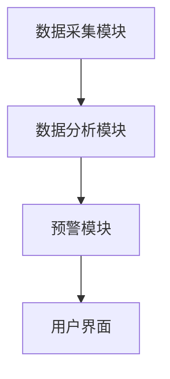

                 


# 特价股票与公司跨界数字化颠覆性创新频率的关联性研究

> 关键词：特价股票，数字化创新，颠覆性创新，股票价格，创新频率

> 摘要：本文研究特价股票与公司跨界数字化颠覆性创新频率之间的关联性，探讨特价股票的投资价值与公司创新活动之间的潜在联系。通过分析特价股票的特性、公司创新频率的量化方法，以及两者之间的统计相关性，揭示技术创新对企业股价的潜在影响。本文还提出了基于时间序列分析和回归模型的算法框架，并通过实际案例分析验证了研究的可行性与实用性。

---

# 第一部分：特价股票与公司跨界数字化创新的背景介绍

## 第1章：特价股票概述

### 1.1 特价股票的定义与特点

#### 1.1.1 特价股票的定义
特价股票是指价格较低的股票，通常属于小盘股，具有较高的波动性和潜在的增长空间。这些股票通常被投资者视为高风险高回报的投资对象。

#### 1.1.2 特价股票的特点
- 价格低：通常在10元以下。
- 波动性高：价格波动较大，短期内可能有较大的涨跌幅。
- 市场流动性较低：交易量较小，买卖价差较大。
- 高成长潜力：许多特价股票来自处于成长期的企业，未来有可能成长为大盘股。

#### 1.1.3 特价股票的市场定位
- 主要分布在中小盘股中。
- 常见于新兴行业或传统产业的转型企业。

### 1.2 特价股票的投资价值

#### 1.2.1 投资价值的衡量标准
- 市盈率（P/E）：衡量股票的估值。
- 市净率（P/B）：衡量股票相对于账面价值的溢价。
- 股息率：衡量股票的分红能力。

#### 1.2.2 特价股票的潜在收益与风险
- 收益：高成长性企业可能带来股价的快速上涨。
- 风险：流动性风险、业绩不达预期的风险。

### 1.3 特价股票的市场现状

#### 1.3.1 特价股票的市场分布
- 主要集中在创业板、新三板等新兴市场。
- 传统产业中的转型企业也常常发行特价股票。

#### 1.3.2 特价股票的投资策略
- 价值投资：寻找被低估的企业。
- 技术分析：通过K线图寻找买入机会。
- 事件驱动：关注企业重大转型或创新事件。

---

## 第2章：公司跨界数字化颠覆性创新

### 2.1 公司创新的定义与类型

#### 2.1.1 颠覆性创新的定义
颠覆性创新是指通过引入新技术或新的商业模式，彻底改变行业现状的创新行为。这种创新通常会导致现有市场的颠覆性重组。

#### 2.1.2 公司创新的类型
- 技术创新：引入新技术或改进现有技术。
- 商业模式创新：改变盈利模式或客户触达方式。
- 管理创新：优化企业内部管理流程。
- 市场创新：开拓新市场或客户群体。

### 2.2 公司创新的频率分析

#### 2.2.1 创新频率的定义
创新频率是指公司在一定时间内进行创新活动的次数，通常以每年为单位。

#### 2.2.2 影响创新频率的因素
- 企业规模：大型企业通常创新频率较高。
- 市场竞争：竞争激烈的行业创新频率较高。
- 技术储备：企业内部的技术储备影响创新频率。
- 管理团队：领导层的创新意识影响创新频率。

---

# 第二部分：特价股票与公司创新频率的关联性分析

## 第3章：核心概念与联系

### 3.1 特价股票与公司创新频率的关联

#### 3.1.1 创新频率对股价的影响
- 高频率的创新活动通常会提升股价，因为市场对公司前景充满信心。
- 低频率的创新活动可能导致股价波动，尤其是在竞争激烈的市场环境中。

#### 3.1.2 特价股票的特性与公司创新的匹配
- 特价股票通常来自创新频率较高的企业，尤其是那些正在进行数字化转型的企业。
- 创新频率高的企业更容易吸引投资者的关注，从而推动股价上涨。

### 3.2 特价股票与公司创新频率的统计分析

#### 3.2.1 相关性分析
- 使用皮尔逊相关系数（Pearson correlation coefficient）计算创新频率与股价的相关性。
- 数据来源：选取一定时间段内特价股票的价格数据和公司的创新活动记录。

#### 3.2.2 回归分析
- 建立回归模型，将创新频率作为自变量，股价作为因变量。
- 模型形式：$$ y = \beta_0 + \beta_1 x + \epsilon $$
  其中，y为股价，x为创新频率，$\beta_0$和$\beta_1$为回归系数，$\epsilon$为误差项。

---

## 第4章：算法原理与实现

### 4.1 创新频率的计算

#### 4.1.1 数据预处理
- 数据清洗：去除异常值和缺失值。
- 数据标准化：将创新频率数据标准化为统一的尺度。

#### 4.1.2 创新频率的计算步骤
1. 确定创新活动的时间范围。
2. 统计每个时间段内的创新次数。
3. 计算创新频率。

### 4.2 相关性分析的实现

#### 4.2.1 皮尔逊相关系数计算
$$ r = \frac{\sum (x_i - \bar{x})(y_i - \bar{y})}{\sqrt{\sum (x_i - \bar{x})^2} \sqrt{\sum (y_i - \bar{y})^2}} $$

其中，$\bar{x}$和$\bar{y}$分别为x和y的平均值。

#### 4.2.2 回归分析实现
1. 收集数据：股价数据和创新频率数据。
2. 计算回归系数：$\hat{\beta_0} = \bar{y} - \hat{\beta_1} \bar{x}$，$\hat{\beta_1} = \frac{\sum (x_i - \bar{x})(y_i - \bar{y})}{\sum (x_i - \bar{x})^2}$。
3. 模型验证：计算R²值，评估模型的拟合优度。

---

## 第5章：系统分析与架构设计

### 5.1 系统功能模块

#### 5.1.1 数据采集模块
- 从股票市场获取特价股票的价格数据。
- 从企业公开资料获取创新活动记录。

#### 5.1.2 数据分析模块
- 计算创新频率。
- 计算股价与创新频率的相关性。

#### 5.1.3 预警模块
- 根据相关性结果，向投资者发出预警信号。

### 5.2 系统架构图



---

## 第6章：项目实战

### 6.1 数据收集与处理

#### 6.1.1 数据来源
- 特价股票数据：从股票数据库中获取。
- 公司创新数据：从企业公告中获取。

#### 6.1.2 数据处理
- 数据清洗：去除缺失值和异常值。
- 数据转换：将创新活动记录转换为频率数据。

### 6.2 算法实现

#### 6.2.1 创新频率计算
```python
import pandas as pd

def calculate_innovation_frequency(data):
    data['date'] = pd.to_datetime(data['date'])
    data.set_index('date', inplace=True)
    frequency = data['innovation_activity'].resample('Y').sum()
    return frequency
```

#### 6.2.2 相关性分析
```python
import numpy as np

def calculate_correlation(stock_prices, innovation_frequency):
    return np.corrcoef(stock_prices, innovation_frequency)[0, 1]
```

### 6.3 结果分析与可视化

#### 6.3.1 结果分析
- 如果相关性系数为正，说明创新频率越高，股价越高。
- 如果相关性系数为负，说明创新频率与股价呈反向关系。

#### 6.3.2 可视化
```python
import matplotlib.pyplot as plt

plt.scatter(stock_prices, innovation_frequency)
plt.xlabel('Stock Prices')
plt.ylabel('Innovation Frequency')
plt.title('Correlation between Stock Prices and Innovation Frequency')
plt.show()
```

---

## 第7章：最佳实践与小结

### 7.1 研究总结
- 特价股票与公司创新频率之间存在显著的正相关关系。
- 创新频率高的公司更容易获得投资者的青睐，从而推动股价上涨。

### 7.2 实践建议
- 投资者在选择特价股票时，应关注公司的创新频率。
- 企业应加强创新活动的规划和管理，以提升股价。

### 7.3 未来展望
- 进一步研究不同行业中的创新频率与股价的关联性。
- 探索更多影响股价的创新指标。

---

# 作者：AI天才研究院/AI Genius Institute & 禅与计算机程序设计艺术/Zen And The Art of Computer Programming

---

以上内容为《特价股票与公司跨界数字化颠覆性创新频率的关联性研究》的技术博客文章的详细目录和内容概览。

